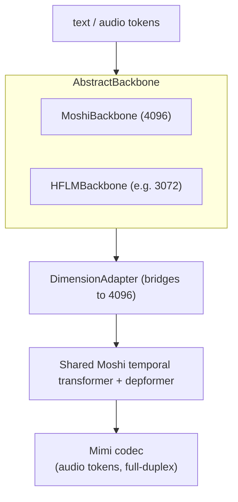
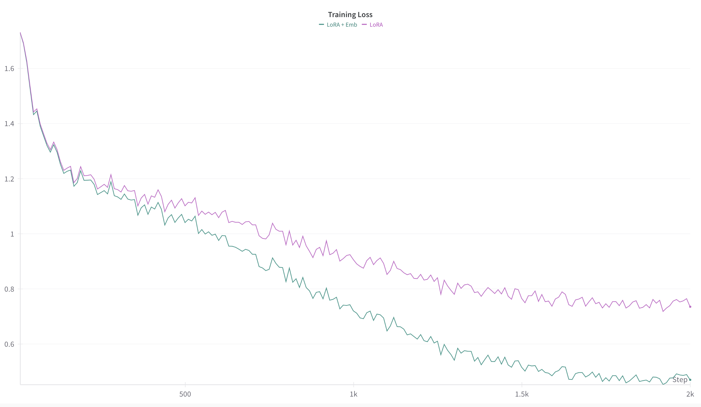

# moshi-korean-finetune

Korean full-duplex spoken-dialogue fine-tuning on [Kyutai Moshi](https://github.com/kyutai-labs/moshi). This is a research recipe that adapts Moshi's real-time, full-duplex architecture to Korean, with a pluggable LM backbone, zero-shot speaker conditioning, Korean tokenizer tooling, a two-stage data pipeline, and a monitoring/evaluation suite. A companion [`serving/`](serving/) overlay takes a trained model to a live browser demo.

  

> Personal research / proof-of-concept. Built on [kyutai-labs/moshi-finetune](https://github.com/kyutai-labs/moshi-finetune); inspired by [J-Moshi](https://arxiv.org/abs/2506.02979). All base models and datasets are public (Kyutai Moshi/Mimi on Hugging Face; AI-Hub / NIKL Korean corpora). Config paths are `/path/to/...` placeholders. No proprietary models or data are included.

## Overview

Moshi represents a conversation as two parallel audio streams plus an inner "monologue" text stream, which is what enables natural full-duplex turn-taking (overlap, backchannel, interruption). This repository explores bringing that architecture to Korean: tokenization, Korean dialogue data (real and synthetic), speaker conditioning for voice control, and training recipes that run on a single node or scale out with FSDP/DDP.

## Key features

- Pluggable LM backbone: keep Moshi's native LM, or swap in any Hugging Face causal LM via an Abstract-Factory backbone layer, with a dimension adapter bridging the LM to Moshi's depformer.
- Zero-shot speaker conditioning: speaker encoder (ECAPA-TDNN / W2v-BERT 2.0 SV) + conditioner + VALL-E-style audio prompting, with unit tests.
- Korean tokenizer tooling: initialize and extend Moshi for Korean; SentencePiece/BBPE utilities.
- Two-stage data pipeline: real dialogue to Lhotse shards (`data_preparation/`), plus synthetic dialogue generation (`data_preparation_stage2/`, partial).
- Monitoring and evaluation: alignment / audio-quality / dialogue / semantic monitors, sample savers, BLEU, and enhanced metrics.
- Staged training: stage-1 pretraining and stage-2 speaker conditioning, FSDP/DDP, with a cosine-warmup scheduler and a stage-aware pretrained loader.
- End-to-end serving: see [`serving/`](serving/) for fuse-LoRA -> Rust backend -> live demo.

## What is different from upstream moshi-finetune

| Capability | Upstream | This repo |
|---|---|---|
| LM backbone | Moshi LM only | pluggable (Moshi or any HF causal LM) + dimension adapter |
| Speaker conditioning | — | zero-shot encoder / conditioner / audio-prompt + tests |
| Korean tokenizer | — | init/extend + SentencePiece/BBPE tooling |
| Data pipeline | minimal loader | two-stage (real Lhotse-shar + synthetic) |
| Monitoring / eval | basic logging | multi-module suite (alignment / audio / dialogue / semantic) |
| Scheduler / staged load | inline | cosine-warmup + stage-aware pretrained loader |
| Serving | — | `serving/` Rust-backend overlay + LoRA-fuse bridge |

## Architecture (pluggable backbone)



## Repository layout

```
finetune/
  backbone/      # pluggable LM backbone: base / factory / adapters / config
                 # moshi_backbone.py + hf_lm_backbone.py
  modules/       # speaker conditioning: speaker_encoder / conditioner / audio_prompt
  monitoring/    # alignment / audio-quality / dialogue / semantic monitors + loggers
  data/          # dataset + interleaver (inner-monologue + dual audio streams)
  pretrained_loader.py, scheduler.py, eval.py, loss.py, args.py, ...
data_preparation/         # stage-1: real Korean dialogue -> Lhotse shards
data_preparation_stage2/  # stage-2: synthetic dialogue (partial)
example/                  # korean_*.yaml training/eval configs (stages, FSDP/DDP)
tools/                    # Korean tokenizer init / wrappers / conversion
tests/                    # speaker-conditioning unit tests
serving/                  # Rust serving overlay + LoRA-fuse bridge + live demo
docs/                     # architecture / speaker-conditioning / tokenizer / recipe notes
train.py, annotate.py
```

## Requirements

- Linux with an NVIDIA GPU and CUDA 12.x; PyTorch 2.4+.
- Python 3.10+.
- Full fine-tuning is multi-GPU (the example FSDP configs target an 8x A100 80GB node); single-GPU runs are possible with smaller batch sizes / LoRA.

## Installation

```bash
# 1. Install this package
pip install -e .

# 2. Install moshi / sphn / sentencepiece (pulled in --no-deps on a GPU box)
bash scripts/setup_environment.sh            # smart install (skips what already exists)
# Options: --check (verify only), --force (reinstall moshi/sphn), --minimal
```

`pip install -e .` alone is not enough to `import moshi`; you must run `scripts/setup_environment.sh` (or install `moshi` manually). It uses the public PyTorch index. Base Moshi/Mimi weights are downloaded from the Kyutai Hugging Face repositories.

## Running the recipe (step by step)

**Step 1 - Initialize a Korean-extended Moshi checkpoint.** This downloads the base Moshi model and extends it for Korean (new tokenizer embeddings and, optionally, the user audio stream).

```bash
python -m tools.init_korean_moshi \
  --save_dir ./models/k-moshi-init \
  --moshi_lm_repo kyutai/moshiko-pytorch-bf16 \
  --extend_modules_for_user_stream \
  --init_text_embeddings
```

**Step 2 - Prepare Korean dialogue data (stage 1).** Convert real dialogue corpora into Moshi-ready Lhotse shards. Edit `data_preparation/config.py` (or its example config) to point at your data first; every dataset path is a `/path/to/...` placeholder.

```bash
python -m data_preparation.scripts.run_phase1 --parallel    # CPU: alignment, speaker selection, stereo
python -m data_preparation.scripts.run_phase2 --help        # GPU: encode to shards
```

Stage 2 (optional) synthesizes additional Korean dialogue; see `data_preparation_stage2/` (partial pipeline).

**Step 3 - Configure training.** Pick a config under `example/` and set its model/data paths (init checkpoint from Step 1, shards from Step 2). Choose the backbone with `backbone.type` (`moshi` is the default; see "Backbone selection").

**Step 4 - Stage-1 pretraining.**

```bash
python train.py example/korean_moshi_stage1_pretrain.yaml
```

**Step 5 - Stage-2 speaker conditioning** (loads the stage-1 weights via the pretrained loader).

```bash
python train.py example/korean_moshi_stage2_speaker.yaml
```

**Step 6 - Evaluation.**

```bash
python train.py example/korean_eval_speaker_cond.yaml
```

Multi-GPU training uses `torchrun` with the FSDP configs:

```bash
torchrun --nproc_per_node=4 train.py example/korean_v4_fsdp.yaml
```

## Backbone selection

- `moshi` (default, validated): Moshi's native LM.
- `hf_lm` (experimental, Phase 2): any Hugging Face causal LM. Set `hf_lm.model_path` to a checkpoint; the dimension adapter auto-bridges mismatched hidden sizes.

```yaml
# example/korean_backbone_hf_lm.yaml
backbone:
  type: hf_lm
  hf_lm:
    model_path: /path/to/hf-causal-lm   # e.g. a Mistral-architecture model
```

## Speaker conditioning

Enable zero-shot voice control via `finetune/modules/`: choose a speaker encoder (`ecapa` / `w2v_bert2` / `dummy`) and an audio-prompt mode. See `docs/SPEAKER_CONDITIONING_SYSTEM_ARCHITECTURE.md`.

## Serving and live demo

[`serving/`](serving/) completes the train -> export -> serve -> demo loop: fuse the LoRA adapter into a Rust/Candle-loadable checkpoint (`import_rust_lora.py`), launch the Kyutai Moshi Rust backend (`serve_korean_moshi.sh`), and connect a Korean web client for live full-duplex voice chat. It also adds an optional pluggable Rust backbone (Mistral-architecture + dimension adapter). See [`serving/README.md`](serving/README.md).

## Results

Illustrative training-loss curve (LoRA vs LoRA + embedding fine-tuning, to about 2k steps):



## Documentation

- Architecture: `docs/K-MOSHI_ARCHITECTURE_PROPOSAL.md`, `docs/FULL_DUPLEX_ARCHITECTURE_ANALYSIS.md`
- Speaker conditioning: `docs/SPEAKER_CONDITIONING_SYSTEM_ARCHITECTURE.md`, `docs/ZERO_SHOT_SPEAKER_CONDITIONING_SPECIFICATION.md`
- Tokenizer and training: `docs/KOREAN_TOKENIZER_GUIDE.md`, `docs/TRAINING_GUIDE.md`, `docs/TRAINING_RECIPE_ANALYSIS.md`
- Evaluation: `docs/ENHANCED_EVAL_METRICS_SPEC.md`

## Acknowledgements

[Kyutai Moshi and moshi-finetune](https://github.com/kyutai-labs/moshi) (base architecture and framework) and [J-Moshi](https://arxiv.org/abs/2506.02979) (the Japanese adaptation that inspired this Korean effort).

## License and citation

Apache-2.0 (see `LICENSE`), matching upstream moshi-finetune.

```bibtex
@techreport{kyutai2024moshi,
  title  = {Moshi: a speech-text foundation model for real-time dialogue},
  author = {Defossez, Alexandre and Mazare, Laurent and Orsini, Manu and others},
  institution = {Kyutai}, year = {2024}
}
```
