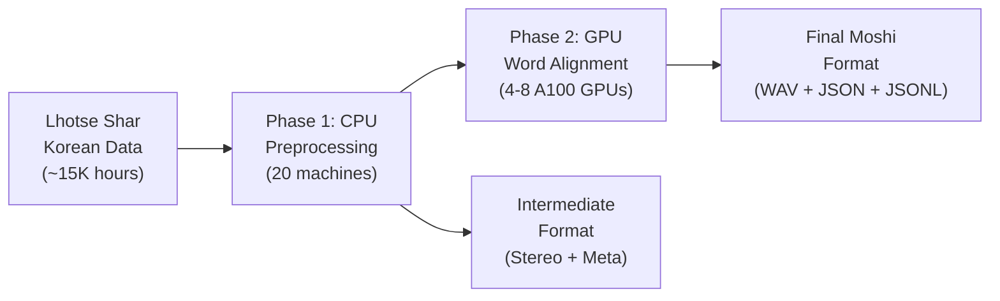
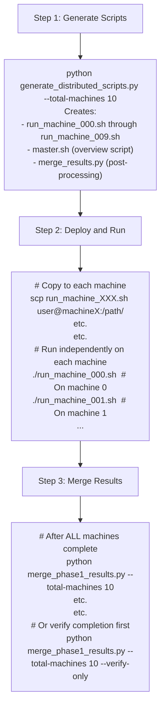
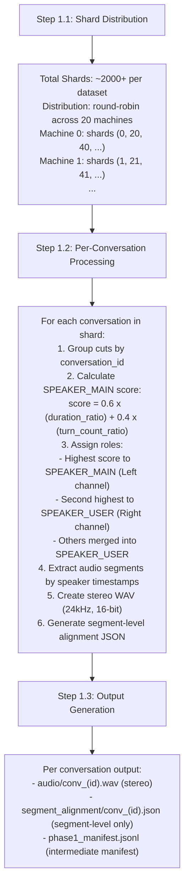
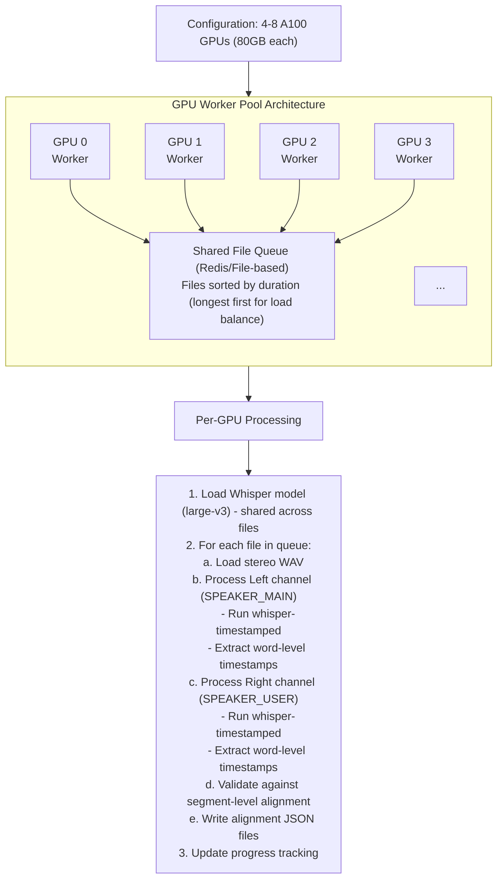

# Korean Moshi Dataset Preparation Pipeline

## Overview

Two-phase pipeline for converting Korean broadcast data (Lhotse Shar format) to Moshi finetuning format.



## Directory Structure

### Source Data (Lhotse Shar)
```
/path/to/data
├── aihub-broadcast-key463-839g-train/
│   ├── cuts.000000.jsonl.gz
│   ├── recording.000000.tar
│   └── ...
├── aihub-broadcast-key463-839g-valid/
├── aihub-broadcast-key71314-559g-train/
└── aihub-broadcast-key71314-559g-valid/
```

### Output Data (Moshi Format)
```
/path/to/data
├── aihub-broadcast-key463-839g/
│   ├── train/
│   │   ├── audio/
│   │   │   ├── conv_000001.flac         # Stereo FLAC: L=MAIN, R=USER (50-60% smaller)
│   │   │   ├── conv_000002.flac
│   │   │   └── ...
│   │   ├── metadata/                     # Rich metadata for Phase 2
│   │   │   ├── conv_000001.json         # Speaker info, segments, timestamps
│   │   │   └── ...
│   │   ├── alignment_speaker01/          # SPEAKER_MAIN alignments
│   │   │   ├── conv_000001.json
│   │   │   └── ...
│   │   ├── alignment_speaker02/          # SPEAKER_USER alignments
│   │   │   ├── conv_000001.json
│   │   │   └── ...
│   │   └── manifest.jsonl
│   └── valid/
│       └── (same structure)
├── aihub-broadcast-key71314-559g/
│   ├── train/
│   └── valid/
└── metadata/
    ├── processing_log.json
    ├── speaker_stats.json
    └── quality_report.json
```

---

## Phase 1: CPU-Based Preprocessing

### Objectives
1. Read Lhotse Shar format data
2. Select SPEAKER_MAIN using hybrid scoring
3. Convert mono to stereo (speaker separation)
4. Generate segment-level alignment
5. Create intermediate format for Phase 2

### Parallelization Strategy
- **N machines** processing in parallel (flexible count, e.g., 10, 20, 50)
- Each machine handles shards via round-robin assignment
- No inter-machine communication required
- Checkpoint/resume support per machine
- **FLAC output** for 50-60% disk savings (lossless compression)

### Distributed Processing Workflow



### Processing Steps



### Intermediate Format (Phase 1 Output)

**segment_alignment/conv_000001.json**:
```json
{
  "conversation_id": "conv_000001",
  "duration": 45.6,
  "speakers": {
    "SPEAKER_MAIN": {
      "original_id": "speaker_003",
      "score": 0.72,
      "total_duration": 28.4,
      "turn_count": 12
    },
    "SPEAKER_USER": {
      "original_ids": ["speaker_001", "speaker_002"],
      "total_duration": 17.2,
      "turn_count": 10
    }
  },
  "segments": [
    {
      "speaker": "SPEAKER_MAIN",
      "start": 0.0,
      "end": 3.45,
      "text": "안녕하세요 오늘 날씨가 좋네요"
    },
    {
      "speaker": "SPEAKER_USER",
      "start": 3.50,
      "end": 5.20,
      "text": "네 정말 좋은 날씨입니다"
    }
  ]
}
```

---

## Phase 2: GPU-Based Word Alignment

### Objectives
1. Generate word-level timestamps using whisper-timestamped
2. Validate alignment quality
3. Create final Moshi format output

### Tool Selection: whisper-timestamped

**Rationale**:
1. **Native Korean support** - No additional language-specific model required
2. **Memory efficient** - Handles long files without memory issues
3. **No extra inference** - DTW on cross-attention (efficient)
4. **Quality** - Word-level timestamps with confidence scores

**Alternative consideration**: WhisperX with Korean wav2vec2
- Pros: Batch processing (70x realtime)
- Cons: Requires separate alignment model, less tested for Korean

### GPU Parallelization Strategy



### Whisper Model Selection

| Model | VRAM | Speed | Accuracy | Recommendation |
|-------|------|-------|----------|----------------|
| large-v3 | ~10GB | 1x | Best | ✅ Primary choice |
| large-v2 | ~10GB | 1x | Excellent | Fallback |
| medium | ~5GB | 2x | Good | For testing |
| small | ~2GB | 4x | Moderate | Not recommended |

**Recommendation**: Use `large-v3` for best Korean accuracy.

### Processing Flow

```python
# Pseudocode for Phase 2 GPU worker
def process_conversation(conv_path, segment_alignment_path, output_dir):
    # Load stereo audio
    audio, sr = load_audio(conv_path)  # 24kHz stereo
    left_channel = audio[0]   # SPEAKER_MAIN
    right_channel = audio[1]  # SPEAKER_USER

    # Load segment alignment for validation
    segments = load_json(segment_alignment_path)

    # Process SPEAKER_MAIN (Left channel)
    main_result = whisper_timestamped.transcribe(
        model,
        left_channel,
        language="ko",
        word_timestamps=True,
        vad=True
    )
    main_alignment = extract_word_alignment(main_result, "SPEAKER_MAIN")

    # Process SPEAKER_USER (Right channel)
    user_result = whisper_timestamped.transcribe(
        model,
        right_channel,
        language="ko",
        word_timestamps=True,
        vad=True
    )
    user_alignment = extract_word_alignment(user_result, "SPEAKER_USER")

    # Validate alignment quality
    quality_score = validate_alignment(
        main_alignment, user_alignment, segments
    )

    # Write output
    write_alignment_json(output_dir / "alignment_speaker01", main_alignment)
    write_alignment_json(output_dir / "alignment_speaker02", user_alignment)

    return quality_score
```

---

## Final Output Format (Moshi Compatible)

### alignment_speaker01/conv_000001.json (SPEAKER_MAIN)
```json
{
  "alignments": [
    ["안녕하세요", [0.0, 0.52], "SPEAKER_MAIN"],
    ["오늘", [0.54, 0.78], "SPEAKER_MAIN"],
    ["날씨가", [0.80, 1.12], "SPEAKER_MAIN"],
    ["좋네요", [1.14, 1.56], "SPEAKER_MAIN"]
  ]
}
```

### alignment_speaker02/conv_000001.json (SPEAKER_USER)
```json
{
  "alignments": [
    ["네", [3.50, 3.68], "SPEAKER_USER"],
    ["정말", [3.70, 3.98], "SPEAKER_USER"],
    ["좋은", [4.00, 4.28], "SPEAKER_USER"],
    ["날씨입니다", [4.30, 5.20], "SPEAKER_USER"]
  ]
}
```

### manifest.jsonl
```json
{"audio": "audio/conv_000001.wav", "alignment_speaker01": "alignment_speaker01/conv_000001.json", "alignment_speaker02": "alignment_speaker02/conv_000001.json", "duration": 45.6, "speakers": 2}
{"audio": "audio/conv_000002.wav", "alignment_speaker01": "alignment_speaker01/conv_000002.json", "alignment_speaker02": "alignment_speaker02/conv_000002.json", "duration": 32.1, "speakers": 2}
```

---

## Time/Resource Estimation

### Phase 1 (CPU)
- **Data volume**: ~15,289 hours
- **Processing speed**: ~10x realtime per core
- **Machines**: 20 (assume 16 cores each = 320 cores)
- **Estimated time**: 15,289 / (10 × 320) ≈ **4.8 hours**

### Phase 2 (GPU)
- **Data volume**: ~15,289 hours
- **Processing speed**: ~1x realtime with large-v3 per GPU
- **GPUs**: 8 × A100
- **Estimated time**: 15,289 / 8 ≈ **1,911 hours ≈ 80 days**

**Optimization options**:
1. Use WhisperX with batch processing (70x faster) → ~1.1 days
2. Use medium model (2x faster) → 40 days
3. Process only SPEAKER_MAIN channel → 40 days
4. Combination of above → **2-5 days realistic**

### Recommended Strategy
1. **Start with whisper-timestamped** for quality validation on sample
2. **Switch to WhisperX** with Korean wav2vec2 for production if quality acceptable
3. **Batch + medium model** for initial pass, **large-v3** for quality-critical segments

---

## Quality Assurance

### Validation Checks
1. **Timestamp consistency**: Word boundaries within segment boundaries
2. **Coverage**: All segments have word-level alignment
3. **Duration match**: Sum of word durations ≈ segment duration
4. **Text match**: Concatenated words ≈ segment text (allowing for ASR variations)

### Quality Metrics
```python
quality_metrics = {
    "word_coverage": 0.95,        # % of text covered by word alignments
    "timestamp_accuracy": 0.90,   # % of words with <100ms boundary error
    "segment_alignment": 0.98,    # % of segments properly aligned
    "confidence_threshold": 0.7   # Minimum word confidence to include
}
```

### Filtering Criteria
- Skip conversations with < 10 seconds duration
- Skip conversations with > 2 hours duration (memory issues)
- Skip if word alignment coverage < 80%
- Flag for review if timestamp gaps > 500ms

---

## Module Structure

```
data_preparation/
├── __init__.py
├── config.py                    # Configuration and paths
├── readers/
│   ├── __init__.py
│   └── lhotse_shar.py          # Lhotse Shar format reader
├── processors/
│   ├── __init__.py
│   ├── speaker_selector.py      # SPEAKER_MAIN selection logic
│   ├── stereo_converter.py      # Mono to stereo conversion
│   └── segment_aligner.py       # Segment-level alignment
├── aligners/
│   ├── __init__.py
│   ├── whisper_timestamped.py   # whisper-timestamped wrapper
│   └── whisperx_aligner.py      # WhisperX wrapper (alternative)
├── writers/
│   ├── __init__.py
│   └── moshi_format.py          # Moshi format output writer
├── orchestrators/
│   ├── __init__.py
│   ├── phase1_cpu.py            # Phase 1 orchestrator
│   └── phase2_gpu.py            # Phase 2 orchestrator
├── utils/
│   ├── __init__.py
│   ├── audio.py                 # Audio processing utilities
│   ├── validation.py            # Quality validation
│   └── progress.py              # Progress tracking
├── scripts/
│   ├── run_phase1.py                 # CLI for Phase 1 processing
│   ├── run_phase2.py                 # CLI for Phase 2 (future)
│   ├── generate_distributed_scripts.py  # Generate machine-specific scripts
│   └── merge_phase1_results.py       # Merge results from distributed processing
└── tests/
    ├── test_reader.py
    ├── test_processors.py
    └── test_aligners.py
```
