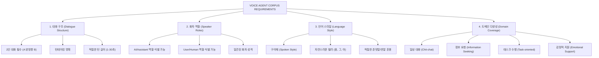
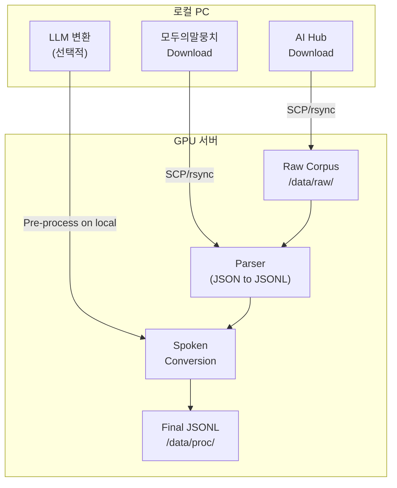
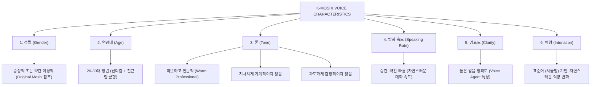
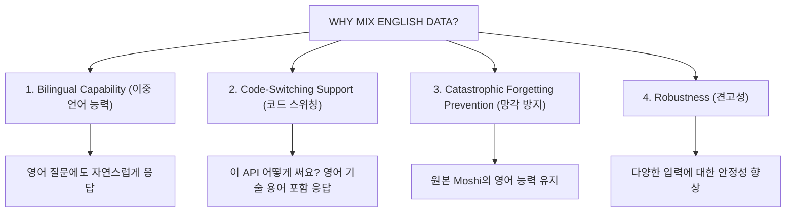
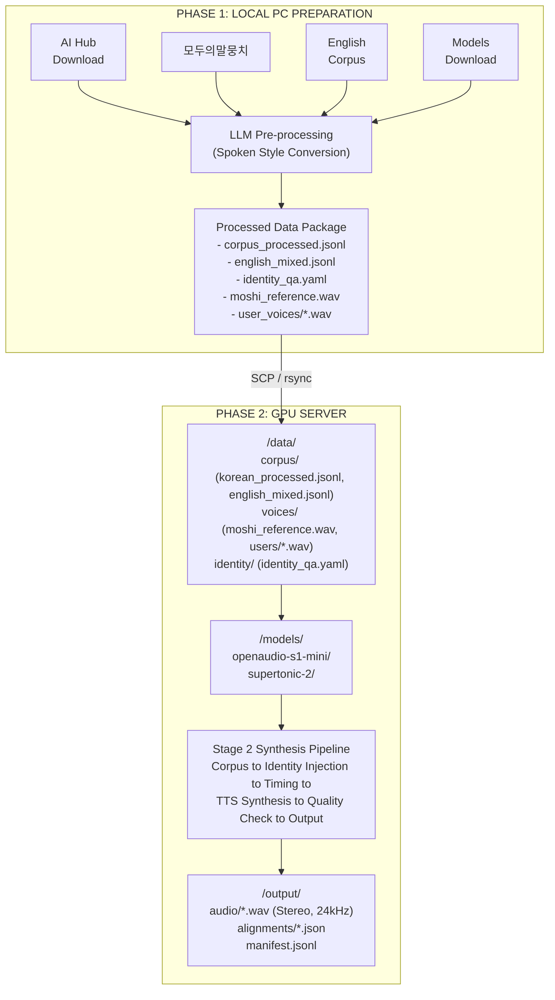

# K-Moshi Stage 2: Offline-First Implementation Guide

> 네트워크 제한 환경에서의 합성 대화 데이터 생성 완벽 가이드

## Executive Summary

본 문서는 보안 정책으로 인해 외부 네트워크 접근이 제한된 GPU 서버 환경에서 K-Moshi 합성 대화 데이터를 생성하기 위한 **오프라인 우선(Offline-First)** 구현 전략을 제시합니다.

### 핵심 제약 조건

| 제약 | 영향 | 대응 전략 |
|------|------|-----------|
| AI Hub 다운로드 차단 | 텍스트 코퍼스 확보 불가 | 로컬 PC에서 수동 다운로드 후 전송 |
| 외부 API 접근 불가 | OpenAI/Claude API 사용 불가 | 로컬 LLM 또는 사전 처리된 데이터 |
| HuggingFace 접근 제한 | 모델 다운로드 제한 | 사전 다운로드 후 수동 전송 |
| 실시간 TTS API 불가 | 외부 TTS 서비스 사용 불가 | 로컬 TTS 모델 (S1 Mini, Supertonic-2) |

---

## 1. Korean Text Corpus 심층 분석

### 1.1 후보 코퍼스 비교 분석

#### 1.1.1 AI Hub 데이터셋

| 데이터셋 | 크기 | 대화 형식 | Voice Agent 적합도 | 다운로드 난이도 |
|----------|------|-----------|---------------------|-----------------|
| **감성대화** | ~100h 텍스트 | 2인 대화, 감정 레이블 | ⭐⭐⭐⭐ | 로그인 필요 |
| **일상대화** | ~200h 텍스트 | 자유 주제 2인 대화 | ⭐⭐⭐⭐⭐ | 로그인 필요 |
| **고객응대** | ~50h 텍스트 | CS 시나리오 | ⭐⭐⭐⭐⭐ | 로그인 필요 |
| **한국어 대화 요약** | 대규모 | 다자간 대화 | ⭐⭐⭐ | 로그인 필요 |

**장점**:
- 대규모 고품질 한국어 대화 데이터
- 화자 구분 명확 (A/B 또는 화자 ID)
- 다양한 도메인 커버리지

**단점**:
- 수동 다운로드 필요 (로그인, 이용 동의)
- 라이센스 제약 (연구/상업 구분)
- 파일 크기 대용량 (GB 단위)

#### 1.1.2 모두의말뭉치 (국립국어원)

| 데이터셋 | 크기 | 특징 | 적합도 |
|----------|------|------|--------|
| **일상대화** | 500K+ 문장 | 자연스러운 구어체 | ⭐⭐⭐⭐⭐ |
| **구어 말뭉치** | 대규모 | 실제 발화 전사 | ⭐⭐⭐⭐ |
| **메신저 대화** | 100K+ 턴 | 비격식 대화체 | ⭐⭐⭐ |

**장점**:
- 공식 기관 데이터 (신뢰성)
- 구어체 특성 보존
- 다양한 연령/지역 화자

**단점**:
- 회원가입 및 승인 필요
- 일부 데이터 비공개

#### 1.1.3 오픈소스 대안

| 데이터셋 | 소스 | 크기 | 적합도 | 접근성 |
|----------|------|------|--------|--------|
| **KSS** | Kaggle | 12h 오디오 | ⭐⭐ (읽기) | ✅ 즉시 |
| **Zeroth Korean** | GitHub | 51h 오디오 | ⭐⭐ (읽기) | ✅ 즉시 |
| **ClovaCall** | GitHub | 60h 오디오 | ⭐⭐⭐ (전화) | ✅ 즉시 |
| **KorQuAD** | GitHub | 텍스트 QA | ⭐⭐ (QA only) | ✅ 즉시 |

### 1.2 Voice Agent 시나리오 적합성 분석

K-Moshi의 목표는 **Voice Agent** 즉, 음성 기반 대화형 AI입니다. 이에 적합한 코퍼스 특성:



### 1.3 추천 코퍼스 조합 (Offline-First)

**Phase 1: 즉시 사용 가능 (Week 1-2)**

```yaml
immediate_corpus:
  - name: "KorQuAD + 변환"
    source: "GitHub"
    size: "~60K QA pairs"
    usage: "Q&A 대화 템플릿으로 변환"
    download: "git clone https://github.com/korquad/korquad-v2.0"

  - name: "AI-Hub 샘플"
    source: "AI-Hub (로컬 다운로드)"
    size: "샘플 데이터만"
    usage: "파이프라인 검증용"
    download: "수동 (로컬 PC → GPU 서버)"
```

**Phase 2: 수동 다운로드 (Week 2-4)**

```yaml
manual_download_corpus:
  - name: "AI Hub 일상대화"
    priority: 1
    estimated_size: "~5GB"
    download_steps:
      - "1. 로컬 PC에서 https://aihub.or.kr 접속"
      - "2. 회원가입 및 로그인"
      - "3. '한국어 일상대화' 검색"
      - "4. 이용신청 및 승인 대기 (1-3일)"
      - "5. 다운로드 후 SCP/rsync로 GPU 서버 전송"

  - name: "모두의말뭉치 일상대화"
    priority: 2
    estimated_size: "~2GB"
    download_steps:
      - "1. https://corpus.korean.go.kr 접속"
      - "2. 회원가입 및 연구 목적 신청"
      - "3. 승인 후 다운로드"
      - "4. GPU 서버로 전송"
```

### 1.4 코퍼스 처리 파이프라인 (Offline)



---

## 2. Supertonic-2 Setup Guide

### 2.1 모델 개요

**Supertonic-2**는 Supertone에서 개발한 한국어 TTS 모델로, ONNX 런타임 기반으로 동작합니다.

| 특성 | 값 |
|------|-----|
| 개발사 | Supertone (Naver 계열) |
| 런타임 | ONNX |
| 지원 언어 | 한국어, 영어, 일본어 |
| 음성 스타일 | 6종 (M3, M4, M5, F3, F4, F5) |
| 샘플레이트 | 24kHz |
| 라이센스 | Apache 2.0 |

### 2.2 다운로드 방법 (Offline)

```bash
# 로컬 PC에서 실행 (인터넷 접근 가능한 환경)

# 1. HuggingFace에서 모델 클론
git lfs install
git clone https://huggingface.co/Supertone/supertonic-2 ./supertonic-2

# 2. 모델 구조 확인
ls -la supertonic-2/
# 예상 결과:
# assets/
# ├── models/
# │   ├── encoder.onnx
# │   ├── decoder.onnx
# │   └── vocoder.onnx
# ├── configs/
# └── speakers/

# 3. GPU 서버로 전송
rsync -avz --progress ./supertonic-2/ \
    user@gpu-server:/models/supertonic-2/
```

### 2.3 ONNX 런타임 설치

```bash
# GPU 서버에서 실행

# 1. ONNX Runtime (GPU)
pip install onnxruntime-gpu==1.16.0

# 2. 의존성
pip install numpy scipy soundfile

# 3. 설치 확인
python -c "import onnxruntime as ort; print(ort.get_available_providers())"
# ['CUDAExecutionProvider', 'CPUExecutionProvider']
```

### 2.4 Supertonic-2 추론 래퍼 구현

```python
# data_preparation_stage2/tts/supertonic_wrapper.py

"""Supertonic-2 ONNX Inference Wrapper for K-Moshi"""

from pathlib import Path
from typing import Optional, Literal
import numpy as np
import onnxruntime as ort
import soundfile as sf


VoiceStyle = Literal["M3", "M4", "M5", "F3", "F4", "F5"]


class SupertonicTTS:
    """Supertonic-2 ONNX-based TTS Engine"""

    VOICE_STYLES = {
        "M3": "중년 남성, 안정적",
        "M4": "청년 남성, 활기",
        "M5": "청년 남성, 부드러움",
        "F3": "중년 여성, 따뜻함",
        "F4": "청년 여성, 밝음",
        "F5": "청년 여성, 차분함",
    }

    def __init__(
        self,
        model_dir: str | Path,
        device: str = "cuda",
        voice_style: VoiceStyle = "F4",
    ):
        """
        Initialize Supertonic-2 TTS.

        Args:
            model_dir: Path to supertonic-2 model directory
            device: "cuda" or "cpu"
            voice_style: One of M3, M4, M5, F3, F4, F5
        """
        self.model_dir = Path(model_dir)
        self.voice_style = voice_style
        self.sample_rate = 24000

        # ONNX Session Options
        providers = ["CUDAExecutionProvider"] if device == "cuda" else ["CPUExecutionProvider"]
        sess_options = ort.SessionOptions()
        sess_options.graph_optimization_level = ort.GraphOptimizationLevel.ORT_ENABLE_ALL

        # Load ONNX models
        self.encoder = ort.InferenceSession(
            str(self.model_dir / "assets" / "models" / "encoder.onnx"),
            sess_options,
            providers=providers,
        )
        self.decoder = ort.InferenceSession(
            str(self.model_dir / "assets" / "models" / "decoder.onnx"),
            sess_options,
            providers=providers,
        )
        self.vocoder = ort.InferenceSession(
            str(self.model_dir / "assets" / "models" / "vocoder.onnx"),
            sess_options,
            providers=providers,
        )

        # Load speaker embedding
        self._load_speaker_embedding()

    def _load_speaker_embedding(self):
        """Load speaker embedding for selected voice style."""
        speaker_path = self.model_dir / "assets" / "speakers" / f"{self.voice_style}.npy"
        if speaker_path.exists():
            self.speaker_embedding = np.load(speaker_path)
        else:
            raise FileNotFoundError(f"Speaker embedding not found: {speaker_path}")

    def synthesize(
        self,
        text: str,
        output_path: Optional[str | Path] = None,
        speed: float = 1.0,
    ) -> np.ndarray:
        """
        Synthesize speech from text.

        Args:
            text: Korean text to synthesize
            output_path: Optional path to save WAV file
            speed: Speaking speed (0.5-2.0)

        Returns:
            Audio waveform as numpy array (24kHz, mono)
        """
        # 1. Text encoding
        text_encoded = self._encode_text(text)

        # 2. Encoder forward
        encoder_output = self.encoder.run(
            None,
            {
                "text": text_encoded,
                "speaker": self.speaker_embedding,
            }
        )[0]

        # 3. Decoder forward
        mel_output = self.decoder.run(
            None,
            {
                "encoder_output": encoder_output,
                "speed": np.array([speed], dtype=np.float32),
            }
        )[0]

        # 4. Vocoder forward
        audio = self.vocoder.run(
            None,
            {"mel": mel_output}
        )[0].squeeze()

        # Save if path provided
        if output_path:
            sf.write(output_path, audio, self.sample_rate)

        return audio

    def _encode_text(self, text: str) -> np.ndarray:
        """Encode Korean text to input format."""
        # Placeholder - actual implementation depends on model's text encoder
        # This would typically use a phoneme converter or character-level encoding
        pass

    def change_voice(self, voice_style: VoiceStyle):
        """Change voice style."""
        self.voice_style = voice_style
        self._load_speaker_embedding()

    @classmethod
    def list_voices(cls) -> dict:
        """List available voice styles."""
        return cls.VOICE_STYLES


# Usage example
if __name__ == "__main__":
    tts = SupertonicTTS(
        model_dir="/models/supertonic-2",
        device="cuda",
        voice_style="F4",
    )

    audio = tts.synthesize(
        "안녕하세요, 케이모시입니다.",
        output_path="test_output.wav",
    )
    print(f"Generated audio: {len(audio)/24000:.2f}s")
```

### 2.5 Supertonic-2 vs OpenAudio S1 Mini 비교

| 특성 | Supertonic-2 | OpenAudio S1 Mini |
|------|--------------|-------------------|
| **Voice Cloning** | ❌ 불가 (고정 6종) | ✅ 가능 (참조 오디오) |
| **한국어 품질** | ⭐⭐⭐⭐ | ⭐⭐⭐⭐⭐ |
| **추론 속도** | 매우 빠름 (ONNX) | 보통 (PyTorch) |
| **VRAM 사용** | 낮음 (~2GB) | 높음 (~8GB) |
| **설정 난이도** | 쉬움 | 중간 |

**권장 사용 전략**:
```yaml
tts_strategy:
  moshi_voice:
    engine: "openaudio_s1"
    reason: "Voice cloning으로 일관된 K-Moshi 음성"
    ratio: 1.0  # Moshi는 100% S1 Mini

  user_voices:
    primary_engine: "openaudio_s1"
    secondary_engine: "supertonic2"
    ratio: "70:30"
    reason: "다양성 + 속도 균형"
```

---

## 3. K-Moshi Reference Voice Selection

### 3.1 이상적인 Moshi 음성 특성

K-Moshi의 정체성을 정의하는 핵심 요소 중 하나가 **일관된 음성**입니다.



### 3.2 Reference 음성 확보 방안

#### Option A: 전문 성우 녹음 (권장)

```yaml
professional_recording:
  duration: "10-30초 (최소 10초)"
  content: |
    "안녕하세요, 저는 케이모시입니다.
    한국어 음성 대화 AI예요.
    무엇이든 편하게 물어봐 주세요."

  requirements:
    - 조용한 녹음 환경 (SNR > 40dB)
    - 24kHz 이상 샘플레이트
    - 감정 중립적 톤
    - 자연스러운 발화 (읽기 느낌 X)

  transcript: |
    # OpenAudio S1 Mini voice cloning에 필요
    # reference_audio.wav와 동일한 내용의 텍스트
```

#### Option B: 기존 TTS 합성 후 수정

```yaml
synthetic_base:
  source: "Supertonic-2 F5 (청년 여성, 차분함)"
  post_processing:
    - "음높이 미세 조정 (optional)"
    - "속도 정규화"
    - "노이즈 제거"

  steps:
    1. "Supertonic-2로 참조 텍스트 합성"
    2. "오디오 에디터로 품질 확인/수정"
    3. "OpenAudio S1 Mini의 reference로 사용"
```

#### Option C: 오픈소스 음성 활용

```yaml
opensource_voices:
  - name: "KSS Dataset Voice"
    gender: "Female"
    quality: "⭐⭐⭐"
    license: "CC BY-NC-SA"

  - name: "LibriTTS Korean (if available)"
    gender: "Various"
    quality: "⭐⭐⭐⭐"
    license: "Check specific"
```

### 3.3 Reference 오디오 준비 스크립트

```python
# data_preparation_stage2/voice/prepare_reference.py

"""K-Moshi Reference Voice Preparation"""

import soundfile as sf
import numpy as np
from pathlib import Path
from typing import Optional
import librosa


def validate_reference_audio(
    audio_path: str | Path,
    min_duration: float = 10.0,
    max_duration: float = 30.0,
    target_sr: int = 24000,
    min_snr: float = 30.0,
) -> dict:
    """
    Validate reference audio for voice cloning.

    Returns:
        Validation result with status and recommendations
    """
    audio, sr = sf.read(audio_path)
    duration = len(audio) / sr

    issues = []
    recommendations = []

    # Duration check
    if duration < min_duration:
        issues.append(f"Duration too short: {duration:.1f}s < {min_duration}s")
        recommendations.append("Record longer reference (10-30 seconds)")
    elif duration > max_duration:
        recommendations.append(f"Consider trimming to {max_duration}s")

    # Sample rate check
    if sr != target_sr:
        recommendations.append(f"Resample from {sr}Hz to {target_sr}Hz")

    # Mono check
    if len(audio.shape) > 1:
        recommendations.append("Convert stereo to mono")
        audio = audio.mean(axis=1)

    # SNR estimation (simple)
    rms = np.sqrt(np.mean(audio**2))
    noise_floor = np.percentile(np.abs(audio), 5)
    estimated_snr = 20 * np.log10(rms / (noise_floor + 1e-8))

    if estimated_snr < min_snr:
        issues.append(f"Low SNR: {estimated_snr:.1f}dB < {min_snr}dB")
        recommendations.append("Re-record in quieter environment")

    return {
        "valid": len(issues) == 0,
        "duration": duration,
        "sample_rate": sr,
        "estimated_snr": estimated_snr,
        "issues": issues,
        "recommendations": recommendations,
    }


def prepare_reference_audio(
    input_path: str | Path,
    output_path: str | Path,
    target_sr: int = 24000,
    normalize: bool = True,
    trim_silence: bool = True,
) -> Path:
    """
    Prepare reference audio for voice cloning.

    Args:
        input_path: Source audio file
        output_path: Output path for processed audio
        target_sr: Target sample rate (24000 for Moshi)
        normalize: Apply volume normalization
        trim_silence: Remove leading/trailing silence

    Returns:
        Path to processed audio file
    """
    # Load audio
    audio, sr = librosa.load(input_path, sr=target_sr, mono=True)

    # Trim silence
    if trim_silence:
        audio, _ = librosa.effects.trim(audio, top_db=30)

    # Normalize
    if normalize:
        audio = audio / np.max(np.abs(audio)) * 0.95

    # Save
    output_path = Path(output_path)
    output_path.parent.mkdir(parents=True, exist_ok=True)
    sf.write(output_path, audio, target_sr)

    return output_path


# Reference transcript template
MOSHI_REFERENCE_TRANSCRIPT = """안녕하세요, 저는 케이모시입니다.
한국어 음성 대화 AI예요.
무엇이든 편하게 물어봐 주세요.
오늘 하루도 좋은 하루 되세요."""


if __name__ == "__main__":
    # Validate existing reference
    result = validate_reference_audio("./voice/samples/moshi/raw_reference.wav")
    print(f"Validation: {'✅ PASS' if result['valid'] else '❌ FAIL'}")
    for issue in result['issues']:
        print(f"  ❌ {issue}")
    for rec in result['recommendations']:
        print(f"  💡 {rec}")
```

---

## 4. English Data Mixing Strategy

### 4.1 영어 데이터 혼합의 목적



### 4.2 영어 데이터 소스 옵션

#### Option A: Fisher English Corpus (Original Moshi)

**원본 Moshi가 사용한 데이터**:
```yaml
fisher_corpus:
  name: "Fisher English Training Corpus"
  source: "LDC (Linguistic Data Consortium)"
  size: "~2000 hours"
  format: "Stereo telephone conversations"
  license: "LDC License (유료)"

  characteristics:
    - "2인 전화 대화"
    - "스테레오 (각 화자 별도 채널)"
    - "자연스러운 대화 흐름"
    - "다양한 주제"

  acquisition:
    method: "LDC 구매 필요"
    cost: "$$$"
    alternative: "Free alternatives below"
```

#### Option B: 무료 대안 (권장)

```yaml
free_english_corpora:
  - name: "DailyDialog"
    source: "https://aclanthology.org/I17-1099"
    size: "~13K dialogues"
    format: "Text only (TTS 필요)"
    quality: "⭐⭐⭐⭐"
    license: "CC BY-NC-SA"

  - name: "Persona-Chat"
    source: "Facebook Research"
    size: "~10K dialogues"
    format: "Text only"
    quality: "⭐⭐⭐⭐"
    license: "MIT"

  - name: "EmpatheticDialogues"
    source: "Facebook Research"
    size: "~25K conversations"
    format: "Text only"
    quality: "⭐⭐⭐⭐⭐"
    license: "MIT"

  - name: "LibriSpeech (subset)"
    source: "OpenSLR"
    size: "~1000 hours"
    format: "Audio + transcript"
    quality: "⭐⭐⭐ (읽기 음성)"
    license: "CC BY 4.0"
```

### 4.3 혼합 비율 전략

```yaml
mixing_strategy:
  # 목표: 한국어 우선, 영어 보조

  conservative:
    korean: 90%
    english: 10%
    rationale: "한국어 성능 최대화, 영어는 최소한의 능력 유지"

  balanced:
    korean: 80%
    english: 20%
    rationale: "이중 언어 균형, code-switching 지원"

  experimental:
    korean: 70%
    english: 30%
    rationale: "강화된 이중 언어 능력, 실험적"

  recommended: "conservative"  # 첫 학습에 권장
```

### 4.4 영어 데이터 처리 파이프라인

```python
# data_preparation_stage2/corpus/english_mixer.py

"""English Data Mixing for K-Moshi"""

from dataclasses import dataclass
from pathlib import Path
from typing import List, Tuple
import random
import json


@dataclass
class DialogueTurn:
    speaker: str  # "SPEAKER_MAIN" or "SPEAKER_USER"
    text: str
    language: str  # "ko" or "en"


@dataclass
class MixedDialogue:
    turns: List[DialogueTurn]
    source: str
    language_ratio: Tuple[float, float]  # (korean, english)


class EnglishMixer:
    """Mix English dialogues into Korean corpus"""

    def __init__(
        self,
        english_ratio: float = 0.1,
        code_switch_ratio: float = 0.05,
    ):
        """
        Args:
            english_ratio: Ratio of pure English dialogues (0.0-1.0)
            code_switch_ratio: Ratio of Korean dialogues with English terms
        """
        self.english_ratio = english_ratio
        self.code_switch_ratio = code_switch_ratio

    def load_english_corpus(self, corpus_path: Path) -> List[dict]:
        """Load English dialogue corpus (DailyDialog format)"""
        dialogues = []
        with open(corpus_path) as f:
            for line in f:
                data = json.loads(line)
                dialogues.append(data)
        return dialogues

    def convert_to_moshi_format(
        self,
        english_dialogue: dict,
        swap_speakers: bool = False,
    ) -> MixedDialogue:
        """Convert English dialogue to K-Moshi format"""
        turns = []
        speakers = ["SPEAKER_MAIN", "SPEAKER_USER"]
        if swap_speakers:
            speakers = speakers[::-1]

        for i, utterance in enumerate(english_dialogue["turns"]):
            speaker = speakers[i % 2]
            turns.append(DialogueTurn(
                speaker=speaker,
                text=utterance,
                language="en",
            ))

        return MixedDialogue(
            turns=turns,
            source=english_dialogue.get("source", "unknown"),
            language_ratio=(0.0, 1.0),
        )

    def inject_english_terms(
        self,
        korean_text: str,
        domain: str = "tech",
    ) -> str:
        """Inject English terms into Korean text for code-switching"""
        # Technical terms commonly used in Korean
        tech_terms = {
            "인공지능": "AI",
            "응용프로그램": "application",
            "서버": "server",
            "데이터베이스": "database",
            "사용자 인터페이스": "UI",
        }

        result = korean_text
        for korean, english in tech_terms.items():
            if korean in result and random.random() < 0.3:
                result = result.replace(korean, english, 1)

        return result

    def mix_corpus(
        self,
        korean_dialogues: List[dict],
        english_dialogues: List[dict],
    ) -> List[MixedDialogue]:
        """Mix Korean and English dialogues"""
        total = len(korean_dialogues)
        n_english = int(total * self.english_ratio)
        n_code_switch = int(total * self.code_switch_ratio)
        n_korean = total - n_english - n_code_switch

        mixed = []

        # Pure Korean
        for d in korean_dialogues[:n_korean]:
            mixed.append(self._convert_korean(d))

        # Pure English
        for d in random.sample(english_dialogues, min(n_english, len(english_dialogues))):
            mixed.append(self.convert_to_moshi_format(d))

        # Code-switched
        for d in korean_dialogues[n_korean:n_korean + n_code_switch]:
            mixed.append(self._convert_with_code_switch(d))

        random.shuffle(mixed)
        return mixed

    def _convert_korean(self, dialogue: dict) -> MixedDialogue:
        """Convert pure Korean dialogue"""
        turns = []
        for turn in dialogue["turns"]:
            turns.append(DialogueTurn(
                speaker=turn["speaker"],
                text=turn["text"],
                language="ko",
            ))
        return MixedDialogue(
            turns=turns,
            source=dialogue.get("source", "korean"),
            language_ratio=(1.0, 0.0),
        )

    def _convert_with_code_switch(self, dialogue: dict) -> MixedDialogue:
        """Convert Korean dialogue with English code-switching"""
        turns = []
        for turn in dialogue["turns"]:
            text = self.inject_english_terms(turn["text"])
            turns.append(DialogueTurn(
                speaker=turn["speaker"],
                text=text,
                language="ko+en",
            ))
        return MixedDialogue(
            turns=turns,
            source=dialogue.get("source", "korean_mixed"),
            language_ratio=(0.9, 0.1),  # Approximate
        )
```

---

## 5. Local LLM Alternatives for Spoken Conversion

### 5.1 문어체 → 구어체 변환의 필요성

텍스트 코퍼스 대부분은 **문어체(Written Style)**로 작성되어 있습니다. 자연스러운 TTS를 위해 **구어체(Spoken Style)**로 변환이 필요합니다.

```
문어체 (Written)              구어체 (Spoken)
─────────────────            ─────────────────
"무엇을 도와드릴까요?"    →    "뭐 도와드릴까요?"
"그것은 불가능합니다"     →    "그건 좀 어려울 것 같아요"
"확인하겠습니다"          →    "확인해볼게요"
"감사합니다"              →    "고마워요" / "감사해요"
```

### 5.2 Offline LLM 옵션

#### Option A: 사전 처리 (Pre-processing on Local PC)

```yaml
pre_processing_approach:
  description: "로컬 PC에서 API로 사전 변환 후 결과만 전송"

  workflow:
    1. "로컬 PC에서 텍스트 코퍼스 로드"
    2. "OpenAI/Claude API로 구어체 변환"
    3. "변환된 결과를 JSONL로 저장"
    4. "GPU 서버로 전송 (변환 완료된 데이터만)"

  pros:
    - "최고 품질의 변환"
    - "GPU 서버 리소스 절약"
    - "한 번만 실행하면 됨"

  cons:
    - "API 비용 발생"
    - "대량 처리 시 시간 소요"
```

**사전 처리 스크립트**:

```python
# scripts/preprocess_spoken_style.py (로컬 PC에서 실행)

"""Pre-process corpus to spoken style using LLM API"""

import json
from pathlib import Path
from openai import OpenAI
from tqdm import tqdm


SPOKEN_CONVERSION_PROMPT = """당신은 한국어 구어체 변환 전문가입니다.
아래 문장을 자연스러운 구어체(말투)로 변환해주세요.

규칙:
1. 딱딱한 문어체 → 자연스러운 대화체
2. "~합니다" → "~해요" (상황에 따라)
3. 자연스러운 축약 사용 ("것은" → "건", "그것" → "그거")
4. 필러 단어 가끔 추가 ("음", "그", "아")
5. 원래 의미는 유지

입력: {input_text}
출력 (구어체만):"""


def convert_to_spoken(client: OpenAI, text: str) -> str:
    """Convert single text to spoken style"""
    response = client.chat.completions.create(
        model="gpt-4o-mini",
        messages=[
            {"role": "user", "content": SPOKEN_CONVERSION_PROMPT.format(input_text=text)}
        ],
        temperature=0.7,
        max_tokens=200,
    )
    return response.choices[0].message.content.strip()


def process_corpus(
    input_path: Path,
    output_path: Path,
    batch_size: int = 100,
):
    """Process entire corpus"""
    client = OpenAI()  # Uses OPENAI_API_KEY env var

    with open(input_path) as f:
        dialogues = [json.loads(line) for line in f]

    converted = []
    for dialogue in tqdm(dialogues, desc="Converting"):
        new_turns = []
        for turn in dialogue["turns"]:
            spoken_text = convert_to_spoken(client, turn["text"])
            new_turns.append({
                "speaker": turn["speaker"],
                "text": spoken_text,
                "original": turn["text"],
            })
        converted.append({
            "turns": new_turns,
            "source": dialogue.get("source", "unknown"),
            "converted": True,
        })

        # Save periodically
        if len(converted) % batch_size == 0:
            _save_checkpoint(converted, output_path)

    # Final save
    with open(output_path, "w", encoding="utf-8") as f:
        for d in converted:
            f.write(json.dumps(d, ensure_ascii=False) + "\n")

    print(f"Converted {len(converted)} dialogues → {output_path}")


def _save_checkpoint(data, path):
    """Save checkpoint"""
    ckpt_path = path.with_suffix(".ckpt.jsonl")
    with open(ckpt_path, "w", encoding="utf-8") as f:
        for d in data:
            f.write(json.dumps(d, ensure_ascii=False) + "\n")


if __name__ == "__main__":
    import argparse
    parser = argparse.ArgumentParser()
    parser.add_argument("input", type=Path)
    parser.add_argument("output", type=Path)
    args = parser.parse_args()

    process_corpus(args.input, args.output)
```

#### Option B: 로컬 LLM (GPU 서버)

```yaml
local_llm_options:
  - name: "Gemma-2-9B (Quantized)"
    vram: "~12GB (4-bit)"
    quality: "⭐⭐⭐⭐"
    korean_support: "Good"
    setup: |
      pip install transformers bitsandbytes accelerate
      # Model: google/gemma-2-9b-it (사전 다운로드 필요)

  - name: "Llama-3-8B-Ko"
    vram: "~10GB (4-bit)"
    quality: "⭐⭐⭐"
    korean_support: "Moderate"
    setup: |
      # 한국어 파인튜닝 버전 사용

  - name: "SOLAR-10.7B-Ko"
    vram: "~14GB (4-bit)"
    quality: "⭐⭐⭐⭐⭐"
    korean_support: "Excellent"
    setup: |
      # Upstage SOLAR 한국어 버전
```

**로컬 LLM 변환기**:

```python
# data_preparation_stage2/corpus/local_llm_converter.py

"""Local LLM-based Spoken Style Converter"""

import torch
from transformers import AutoModelForCausalLM, AutoTokenizer, BitsAndBytesConfig
from pathlib import Path
from typing import Optional


class LocalSpokenConverter:
    """Convert written Korean to spoken style using local LLM"""

    SYSTEM_PROMPT = """당신은 한국어 구어체 변환 전문가입니다.
문어체 문장을 자연스러운 대화체로 변환합니다.
변환된 문장만 출력하세요."""

    def __init__(
        self,
        model_path: str | Path,
        device: str = "cuda",
        load_in_4bit: bool = True,
    ):
        """
        Initialize local LLM converter.

        Args:
            model_path: Path to local model (pre-downloaded)
            device: "cuda" or "cpu"
            load_in_4bit: Use 4-bit quantization to save VRAM
        """
        self.device = device

        # Quantization config
        bnb_config = None
        if load_in_4bit and device == "cuda":
            bnb_config = BitsAndBytesConfig(
                load_in_4bit=True,
                bnb_4bit_quant_type="nf4",
                bnb_4bit_compute_dtype=torch.bfloat16,
            )

        # Load model
        self.tokenizer = AutoTokenizer.from_pretrained(model_path)
        self.model = AutoModelForCausalLM.from_pretrained(
            model_path,
            quantization_config=bnb_config,
            device_map="auto",
            torch_dtype=torch.bfloat16,
        )

        # Set pad token if not exists
        if self.tokenizer.pad_token is None:
            self.tokenizer.pad_token = self.tokenizer.eos_token

    def convert(
        self,
        text: str,
        max_new_tokens: int = 100,
        temperature: float = 0.7,
    ) -> str:
        """Convert single text to spoken style"""
        prompt = f"""{self.SYSTEM_PROMPT}

문어체: {text}
구어체:"""

        inputs = self.tokenizer(prompt, return_tensors="pt").to(self.device)

        with torch.no_grad():
            outputs = self.model.generate(
                **inputs,
                max_new_tokens=max_new_tokens,
                temperature=temperature,
                do_sample=True,
                pad_token_id=self.tokenizer.pad_token_id,
            )

        full_response = self.tokenizer.decode(outputs[0], skip_special_tokens=True)

        # Extract only the converted part
        if "구어체:" in full_response:
            spoken = full_response.split("구어체:")[-1].strip()
            # Clean up (remove any trailing content)
            spoken = spoken.split("\n")[0].strip()
            return spoken

        return text  # Return original if conversion failed

    def convert_batch(
        self,
        texts: list[str],
        batch_size: int = 8,
    ) -> list[str]:
        """Convert batch of texts (more efficient)"""
        results = []
        for i in range(0, len(texts), batch_size):
            batch = texts[i:i + batch_size]
            batch_results = [self.convert(t) for t in batch]
            results.extend(batch_results)
        return results


# Usage
if __name__ == "__main__":
    converter = LocalSpokenConverter(
        model_path="/models/gemma-2-9b-it",  # Pre-downloaded
        load_in_4bit=True,
    )

    test_texts = [
        "무엇을 도와드릴까요?",
        "확인하겠습니다.",
        "그것은 불가능합니다.",
    ]

    for text in test_texts:
        spoken = converter.convert(text)
        print(f"{text} → {spoken}")
```

#### Option C: 규칙 기반 변환 (No LLM)

LLM 없이 **규칙 기반**으로 기본적인 구어체 변환:

```python
# data_preparation_stage2/corpus/rule_based_converter.py

"""Rule-based Spoken Style Converter (No LLM Required)"""

import re
from typing import List, Tuple


class RuleBasedConverter:
    """Simple rule-based written-to-spoken converter"""

    # 문어체 → 구어체 변환 규칙
    CONVERSION_RULES: List[Tuple[str, str]] = [
        # 어미 변환
        (r"합니다$", "해요"),
        (r"합니까\?$", "해요?"),
        (r"입니다$", "이에요"),
        (r"입니까\?$", "인가요?"),
        (r"습니다$", "어요"),
        (r"습니까\?$", "을까요?"),
        (r"하겠습니다$", "할게요"),
        (r"드리겠습니다$", "드릴게요"),

        # 축약
        (r"것은", "건"),
        (r"것이", "게"),
        (r"것을", "걸"),
        (r"그것", "그거"),
        (r"이것", "이거"),
        (r"저것", "저거"),
        (r"무엇", "뭐"),
        (r"어떻게", "어떡해"),

        # 조사 축약
        (r"나는", "난"),
        (r"너는", "넌"),
        (r"저는", "전"),
        (r"그는", "걘"),

        # 기타
        (r"하지 않", "안 하"),
        (r"되지 않", "안 되"),
        (r"알겠습니다", "알겠어요"),
        (r"감사합니다", "고마워요"),
        (r"죄송합니다", "미안해요"),
    ]

    # 필러 삽입 후보 위치
    FILLER_POSITIONS = ["sentence_start", "before_verb"]
    FILLERS = ["음", "그", "아", "어"]

    def __init__(self, add_fillers: bool = False, filler_prob: float = 0.1):
        self.add_fillers = add_fillers
        self.filler_prob = filler_prob

        # Compile regex patterns
        self.compiled_rules = [
            (re.compile(pattern), replacement)
            for pattern, replacement in self.CONVERSION_RULES
        ]

    def convert(self, text: str) -> str:
        """Convert single text to spoken style"""
        result = text

        # Apply rules
        for pattern, replacement in self.compiled_rules:
            result = pattern.sub(replacement, result)

        # Add fillers (optional)
        if self.add_fillers:
            result = self._maybe_add_filler(result)

        return result

    def _maybe_add_filler(self, text: str) -> str:
        """Randomly add filler words"""
        import random
        if random.random() < self.filler_prob:
            filler = random.choice(self.FILLERS)
            return f"{filler}, {text}"
        return text

    def convert_batch(self, texts: List[str]) -> List[str]:
        """Convert batch of texts"""
        return [self.convert(t) for t in texts]


# Usage
if __name__ == "__main__":
    converter = RuleBasedConverter(add_fillers=True, filler_prob=0.2)

    test_texts = [
        "무엇을 도와드릴까요?",
        "확인하겠습니다.",
        "그것은 불가능합니다.",
        "알겠습니다. 처리하겠습니다.",
    ]

    for text in test_texts:
        spoken = converter.convert(text)
        print(f"{text}")
        print(f"  → {spoken}")
        print()
```

### 5.3 권장 전략

```yaml
recommended_strategy:
  phase_1_development:
    method: "Rule-based"
    reason: "빠른 파이프라인 검증, LLM 의존성 없음"
    quality: "Basic (70%)"

  phase_2_quality:
    method: "Pre-processing with API"
    reason: "최고 품질, 로컬 PC에서 일괄 처리"
    quality: "High (95%)"

  phase_3_scale:
    method: "Local LLM (Gemma-2 or SOLAR)"
    reason: "대규모 데이터, GPU 서버에서 자체 처리"
    quality: "Good (85%)"

  fallback:
    method: "Rule-based"
    reason: "LLM 실패 시 대체"
```

---

## 6. Complete Offline Workflow

### 6.1 전체 워크플로우 다이어그램



### 6.2 단계별 체크리스트

```markdown
## Offline Preparation Checklist

### Phase 1: Local PC (인터넷 가능)

#### Data Downloads
- [ ] AI Hub 회원가입 및 이용신청
- [ ] AI Hub 일상대화 코퍼스 다운로드
- [ ] 모두의말뭉치 회원가입 및 신청
- [ ] 모두의말뭉치 일상대화 다운로드
- [ ] DailyDialog (영어) 다운로드
- [ ] EmpatheticDialogues (영어) 다운로드

#### Model Downloads
- [ ] OpenAudio S1 Mini 다운로드
- [ ] Supertonic-2 다운로드 (git lfs)
- [ ] Whisper Medium 다운로드 (optional)
- [ ] Local LLM 다운로드 (optional: Gemma-2)

#### Pre-processing
- [ ] 코퍼스 파싱 및 JSONL 변환
- [ ] 구어체 변환 (API or Local LLM)
- [ ] 영어 데이터 혼합
- [ ] K-Moshi Identity Q&A 검토
- [ ] Reference 음성 준비 및 검증

### Phase 2: GPU Server Transfer

#### File Transfer
- [ ] 처리된 코퍼스 전송 (/data/corpus/)
- [ ] 모델 파일 전송 (/models/)
- [ ] 음성 샘플 전송 (/data/voices/)
- [ ] 설정 파일 전송 (/configs/)

#### Environment Setup
- [ ] Python 환경 설정
- [ ] ONNX Runtime 설치
- [ ] PyTorch/CUDA 확인
- [ ] 경로 설정 확인

### Phase 3: Pipeline Execution

#### Validation
- [ ] 코퍼스 로딩 테스트
- [ ] TTS 모델 로딩 테스트
- [ ] 샘플 합성 테스트

#### Production Run
- [ ] 전체 파이프라인 실행
- [ ] 품질 모니터링
- [ ] 체크포인트 저장
```

---

## 7. Quick Reference

### 7.1 핵심 경로

```bash
# Local PC (다운로드)
~/downloads/
├── aihub/                    # AI Hub 코퍼스
├── nikl/                     # 모두의말뭉치
├── english/                  # 영어 코퍼스
└── models/                   # TTS 모델

# GPU Server
/data/
├── corpus/                   # 처리된 코퍼스
├── voices/                   # 참조 음성
└── identity/                 # K-Moshi Identity

/models/
├── openaudio-s1-mini/        # OpenAudio S1 Mini
└── supertonic-2/             # Supertonic-2

/output/
├── audio/                    # 합성된 오디오
├── alignments/               # 단어 정렬
└── manifest.jsonl            # 메타데이터
```

### 7.2 핵심 명령어

```bash
# 1. 모델 전송 (Local → GPU)
rsync -avz --progress ./models/ user@gpu:/models/

# 2. 데이터 전송
rsync -avz --progress ./data/ user@gpu:/data/

# 3. 파이프라인 실행
python -m data_preparation_stage2.scripts.run_synthesis \
    configs/offline.yaml

# 4. 품질 검증
python -m data_preparation_stage2.quality.validator \
    /output/manifest.jsonl
```

### 7.3 트러블슈팅

| 문제 | 원인 | 해결 |
|------|------|------|
| ONNX 로딩 실패 | CUDA 버전 불일치 | `pip install onnxruntime-gpu==1.16.0` |
| 메모리 부족 | TTS 배치 크기 과다 | `batch_size: 8 → 4` |
| 한국어 깨짐 | 인코딩 문제 | `encoding='utf-8'` 명시 |
| 음질 저하 | 리샘플링 문제 | `librosa.resample()` 사용 |

---

## Appendix A: Download Scripts

### A.1 일괄 다운로드 스크립트 (Local PC)

```bash
#!/bin/bash
# scripts/download_all.sh (로컬 PC에서 실행)

set -e

DOWNLOAD_DIR="./downloads"
mkdir -p $DOWNLOAD_DIR

echo "=== K-Moshi Offline Data Downloader ==="

# 1. Supertonic-2
echo "[1/4] Downloading Supertonic-2..."
git lfs install
git clone https://huggingface.co/Supertone/supertonic-2 \
    $DOWNLOAD_DIR/supertonic-2

# 2. English Corpus (DailyDialog)
echo "[2/4] Downloading DailyDialog..."
wget -O $DOWNLOAD_DIR/dailydialog.zip \
    "http://yanran.li/files/ijcnlp_dailydialog.zip"
unzip $DOWNLOAD_DIR/dailydialog.zip -d $DOWNLOAD_DIR/

# 3. Check AI Hub (manual reminder)
echo "[3/4] AI Hub - Manual Download Required"
echo "  → https://aihub.or.kr"
echo "  → Search: '한국어 일상대화'"
echo "  → Download to: $DOWNLOAD_DIR/aihub/"

# 4. Check 모두의말뭉치 (manual reminder)
echo "[4/4] 모두의말뭉치 - Manual Download Required"
echo "  → https://corpus.korean.go.kr"
echo "  → Download: 일상대화 말뭉치"
echo "  → Save to: $DOWNLOAD_DIR/nikl/"

echo ""
echo "=== Download Summary ==="
echo "Auto-downloaded:"
echo "  ✅ Supertonic-2"
echo "  ✅ DailyDialog"
echo ""
echo "Manual download required:"
echo "  ⏳ AI Hub 일상대화"
echo "  ⏳ 모두의말뭉치 일상대화"
echo ""
echo "After manual downloads, run:"
echo "  ./scripts/transfer_to_gpu.sh"
```

### A.2 GPU 서버 전송 스크립트

```bash
#!/bin/bash
# scripts/transfer_to_gpu.sh (로컬 PC에서 실행)

GPU_SERVER="user@gpu-server"
DOWNLOAD_DIR="./downloads"
REMOTE_DATA="/data"
REMOTE_MODELS="/models"

echo "=== Transferring to GPU Server ==="

# Models
echo "[1/3] Transferring models..."
rsync -avz --progress \
    $DOWNLOAD_DIR/supertonic-2/ \
    $GPU_SERVER:$REMOTE_MODELS/supertonic-2/

# Corpus
echo "[2/3] Transferring corpus..."
rsync -avz --progress \
    $DOWNLOAD_DIR/aihub/ \
    $GPU_SERVER:$REMOTE_DATA/corpus/aihub/

rsync -avz --progress \
    $DOWNLOAD_DIR/nikl/ \
    $GPU_SERVER:$REMOTE_DATA/corpus/nikl/

rsync -avz --progress \
    $DOWNLOAD_DIR/dailydialog/ \
    $GPU_SERVER:$REMOTE_DATA/corpus/english/

# Voices
echo "[3/3] Transferring voice samples..."
rsync -avz --progress \
    ./voice/samples/ \
    $GPU_SERVER:$REMOTE_DATA/voices/

echo ""
echo "=== Transfer Complete ==="
echo "Data: $GPU_SERVER:$REMOTE_DATA/"
echo "Models: $GPU_SERVER:$REMOTE_MODELS/"
```

---

*Document Version: 1.0*
*Created: 2026-01-14*
*Purpose: K-Moshi Stage 2 Offline-First Implementation*
