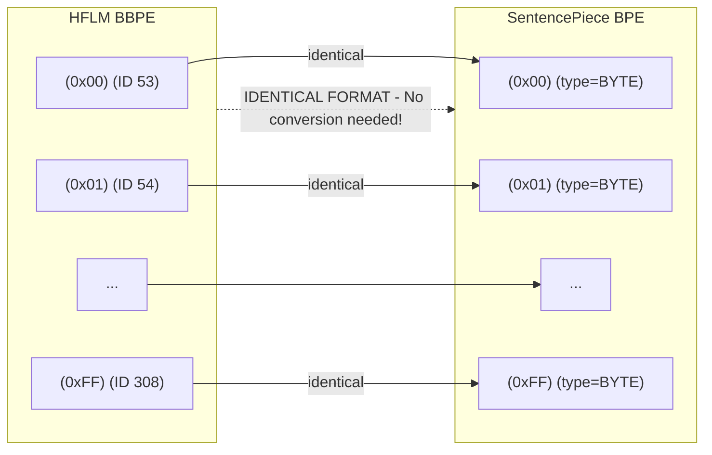
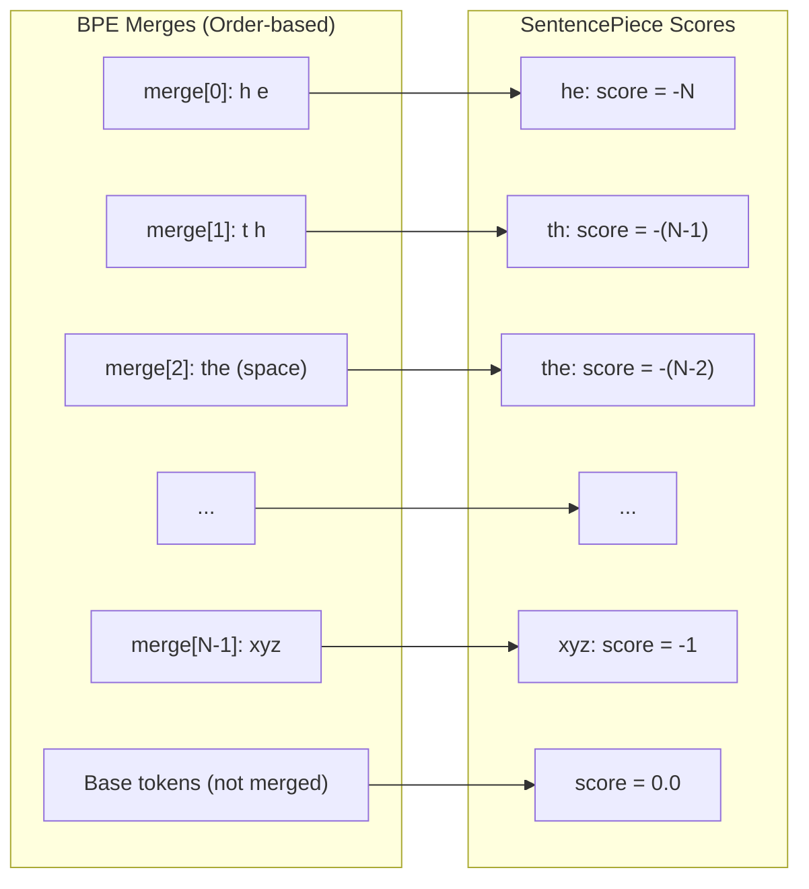

# HFLM BBPE → SentencePiece Conversion Analysis

## Executive Summary

This document analyzes the feasibility and technical approach for converting the HF causal LM's BBPE (Byte-level BPE) tokenizer to SentencePiece `.model` format for compatibility with Moshi's Rust inference server.

**Verdict: Conversion is FEASIBLE with minor caveats**

---

## 1. Tokenizer Architecture Comparison

### 1.1 HFLM BBPE (Byte-Level BPE)

| Property | Value |
|----------|-------|
| **Format** | HuggingFace `tokenizer.json` |
| **Algorithm** | Byte-Level BPE (GPT-2 style) |
| **Vocab Size** | 105,900 tokens |
| **Byte Tokens** | `<0x00>` to `<0xFF>` (256 tokens) |
| **Special Tokens** | 53 tokens (IDs 0-52) |

**Key Characteristics:**
- Byte tokens use explicit `<0xHH>` format
- BPE merges stored as space-separated pairs: `"token1 token2"`
- No UNK token; byte fallback ensures complete coverage

### 1.2 SentencePiece BPE

| Property | Value |
|----------|-------|
| **Format** | Protocol Buffer `.model` |
| **Algorithm** | BPE (model_type = 2) |
| **Byte Support** | `byte_fallback=True` with `<0xHH>` format |
| **Piece Types** | NORMAL, UNKNOWN, CONTROL, USER_DEFINED, BYTE, UNUSED |

**Key Characteristics:**
- Scores represent token priority (lower = higher priority)
- BYTE type pieces use `<0xHH>` format (matching HFLM!)
- Configurable normalization (can be disabled)

---

## 2. Compatibility Analysis

### 2.1 Fortunate Compatibility: Byte Token Format



This is a **critical compatibility win**. the HF LM's byte token format (`<0xHH>`) exactly matches SentencePiece's BYTE piece format.

### 2.2 Merge Order → Score Conversion



**Algorithm:**
```python
score = -(total_merges - merge_index)
```

### 2.3 Potential Incompatibilities

| Issue | Severity | Mitigation |
|-------|----------|------------|
| NFKC Normalization | Medium | Disable with `identity` normalizer |
| Whitespace handling | Low | Disable `add_dummy_prefix` |
| Score precision | Minimal | Float vs int; negligible impact |
| Tie-breaking | Minimal | Rare; may affect edge cases |

---

## 3. Performance Degradation Assessment

### 3.1 Expected Tokenization Differences

| Scenario | Expected Match Rate |
|----------|---------------------|
| ASCII text | ~100% |
| Korean text | ~95-99% |
| Mixed content | ~95-99% |
| Emojis/Special | ~90-95% |

**Primary cause of differences:**
- Normalization edge cases
- Score tie-breaking in merge selection
- Whitespace handling at boundaries

### 3.2 Impact on Model Quality

For Moshi speech-text alignment:
- **Inner monologue accuracy**: Negligible impact
- **Token-audio synchronization**: Unaffected (timing-based)
- **Generation quality**: Minimal impact; model trained with original tokenizer

**Recommendation:** Re-finetune with converted tokenizer for optimal performance.

---

## 4. Conversion Implementation

### 4.1 Script Location

```
moshi-korean-finetune/
└── tools/
    └── convert_hf_lm_to_sentencepiece.py  # Production converter
```

### 4.2 Usage

```bash
# Basic conversion
python tools/convert_hf_lm_to_sentencepiece.py \
    --input /path/to/HFLM/tokenizer.json \
    --output /path/to/hf_lm.model \
    --validate

# With tokenization comparison
python tools/convert_hf_lm_to_sentencepiece.py \
    --input /path/to/HFLM/tokenizer.json \
    --output /path/to/hf_lm.model \
    --validate \
    --compare /path/to/HFLM/
```

### 4.3 Key Parameters

| Parameter | Default | Description |
|-----------|---------|-------------|
| `--bos-id` | 1 | `<\|begin_of_text\|>` |
| `--eos-id` | 37 | `<\|turn_end\|>` for Moshi |
| `--pad-id` | 0 | `<\|end_of_text\|>` |
| `--unk-id` | -1 | No explicit UNK (byte_fallback) |

---

## 5. Integration with Moshi

### 5.1 Rust Server Compatibility

The converted `.model` file can be directly loaded by Moshi's Rust server:

```rust
// rust/moshi-core/src/text_tokenizer.rs
use sentencepiece::SentencePieceProcessor;

let sp = SentencePieceProcessor::open(model_path)?;
```

### 5.2 Model Configuration Changes

Using HFLM tokenizer requires:

```yaml
# Moshi config changes
text_card: 105900  # Was 32000
# text_emb: Resize from [32001, 4096] to [105901, 4096]
# depformer_text_emb: Resize from [32001, 1024] to [105901, 1024]
```

**Memory impact:** ~455 MB additional (bf16)

---

## 6. Alternative Approaches

### 6.1 Train New Korean SentencePiece (Recommended for Production)

```python
import sentencepiece as spm

spm.SentencePieceTrainer.train(
    input='korean_corpus.txt',
    model_prefix='korean_32k',
    vocab_size=32000,  # Match Moshi's default
    model_type='bpe',
    byte_fallback=True,
    character_coverage=0.9995,
)
```

**Pros:**
- Perfect compatibility with Moshi architecture
- No embedding resize needed
- Optimal Korean coverage

**Cons:**
- Requires large Korean corpus
- Training time

### 6.2 Use HFLM Wrapper (Python Training Only)

```python
from tools.hf_lm_tokenizer_wrapper import HFLMTokenizerWrapper

wrapper = HFLMTokenizerWrapper.from_local('/path/to/HFLM')
tokens = wrapper.encode("안녕하세요")
```

**Pros:**
- No conversion needed
- Full HFLM compatibility

**Cons:**
- Python only; no Rust support
- Requires HuggingFace transformers

---

## 7. Conclusion and Recommendations

### Short-term (Immediate Testing)
1. Use the conversion script to create `.model` file
2. Test with sample Korean text
3. Validate tokenization match rate

### Medium-term (K-Moshi Development)
1. Train dedicated 32K Korean SentencePiece
2. Matches Moshi's architecture without modifications
3. Optimal for speech-text alignment

### Long-term (Production)
1. Consider HFLM integration if LLM replacement planned
2. Requires Moshi architecture modifications for 105K vocab
3. Evaluate memory/performance tradeoffs

---

## References

- [SentencePiece Protobuf Schema](https://github.com/google/sentencepiece/blob/master/src/sentencepiece_model.proto)
- [HuggingFace Tokenizers](https://github.com/huggingface/tokenizers)
- [GPT-2 Byte-Level BPE](https://huggingface.co/transformers/v3.0.2/_modules/transformers/tokenization_gpt2.html)
- [ByteLevel vs byte_fallback Issue](https://github.com/huggingface/tokenizers/issues/1218)

---

*Document created: 2024-12-30*
*Author: K-Moshi Project*
