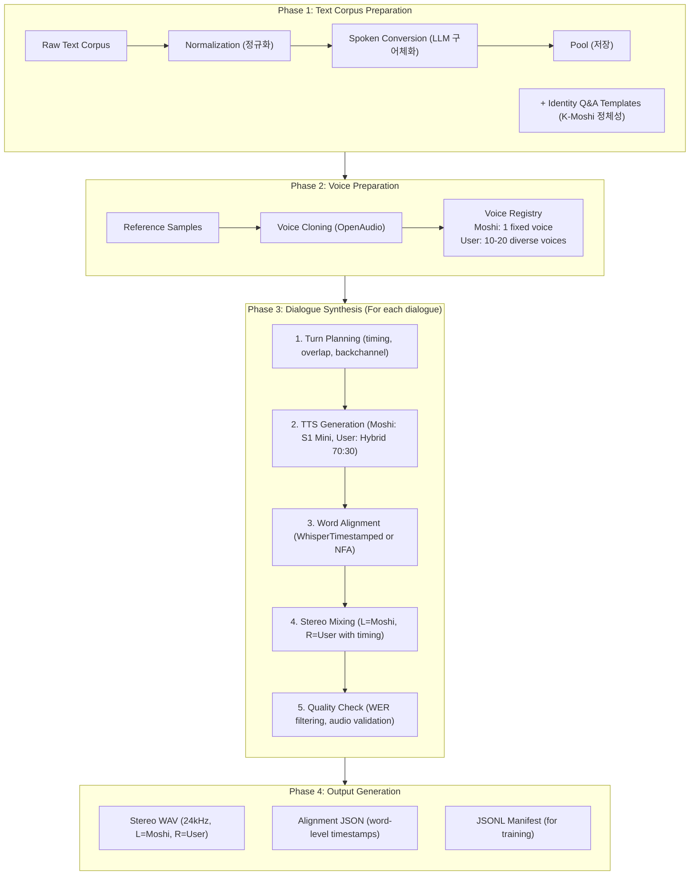

# K-Moshi Data Preparation Stage 2: Synthetic Dialogue Generation

> **작성일**: 2026-01-14
> **버전**: 1.0
> **목적**: External TTS 기반 한국어 대화 데이터 합성을 위한 종합 구현 계획

---

## Table of Contents

1. [Executive Summary](#1-executive-summary)
2. [Architecture Overview](#2-architecture-overview)
3. [Module Specifications](#3-module-specifications)
4. [Text Corpus Pipeline](#4-text-corpus-pipeline)
5. [K-Moshi Identity System](#5-k-moshi-identity-system)
6. [Full-Duplex Dialogue Synthesis](#6-full-duplex-dialogue-synthesis)
7. [TTS Integration](#7-tts-integration)
8. [Voice Management](#8-voice-management)
9. [Quality Assurance](#9-quality-assurance)
10. [Implementation Roadmap](#10-implementation-roadmap)

---

## 1. Executive Summary

### 1.1 핵심 목표

```
┌─────────────────────────────────────────────────────────────────────────────┐
│                    DATA PREPARATION STAGE 2 OBJECTIVES                       │
├─────────────────────────────────────────────────────────────────────────────┤
│                                                                              │
│  INPUT:                                                                      │
│  ├─ Text Dialogue Corpus (AI Hub, 모두의 말뭉치, etc.)                      │
│  ├─ K-Moshi Identity Q&A Templates                                          │
│  ├─ Voice Reference Samples (Moshi: 1, User: Multiple)                      │
│  └─ Full-duplex Timing Parameters                                           │
│                                                                              │
│  OUTPUT:                                                                     │
│  ├─ Stereo WAV (L=Moshi, R=User, 24kHz)                                     │
│  ├─ Word-level Alignment JSON (Moshi format)                                │
│  └─ JSONL Manifest for Training                                             │
│                                                                              │
│  TARGET SCALE:                                                               │
│  ├─ Phase 1 Bootstrap: 500-1000 hours                                       │
│  └─ Phase 2 Self-Generation: 500-1000 hours additional                      │
│                                                                              │
└─────────────────────────────────────────────────────────────────────────────┘
```

### 1.2 핵심 요구사항 (4가지)

| # | 요구사항 | 상세 |
|---|----------|------|
| 1 | **Text Corpus 선택** | 음성 에이전트 시나리오에 적합한 대화 텍스트 (Moshi/J-Moshi 방식 참조) |
| 2 | **K-Moshi Identity** | 자기소개 데이터 ("이름이 뭐야?" → "저는 K-Moshi입니다") |
| 3 | **Full-Duplex Timing** | 오버랩, 백채널, 바지인, 단어 레벨 타임스탬프 |
| 4 | **Voice Consistency** | Moshi=단일 음성, User=다양한 음성 (대부분 1:1 대화) |

### 1.3 Moshi/J-Moshi 참조 사항

#### Moshi 방식
- **Pre-training**: 대규모 음성 데이터 비지도 학습
- **Post-training**: Speaker diarization으로 멀티스트림 시뮬레이션
- **Fine-tuning**: Fisher Corpus 2000시간 (실제 전화 대화, 스테레오)
- **Instruct-FT**: 170시간 스크립트 → 20,000시간 TTS 합성

#### J-Moshi 방식
- **Text Sources**: JapanesePersonaChat, EmpatheticDialogues 등 4개 데이터셋 (43,739 대화)
- **LLM Conversion**: Gemma-2-27b로 구어체 변환
- **Multi-stream TTS**: 대화별 10개 샘플 생성 → WER 기반 최적 샘플 선택
- **Result**: 602시간 합성 데이터 추가

---

## 2. Architecture Overview

### 2.1 Directory Structure

```
data_preparation_stage2/
├── __init__.py
├── config.py                           # 전역 설정 관리
├── README.md
│
├── corpus/                             # 텍스트 코퍼스 처리
│   ├── __init__.py
│   ├── base_reader.py                  # 추상 베이스 클래스
│   ├── aihub_reader.py                 # AI Hub 감성대화 리더
│   ├── nikl_reader.py                  # 모두의 말뭉치 리더
│   ├── custom_reader.py                # 커스텀 JSONL 리더
│   ├── normalizer.py                   # 텍스트 정규화
│   └── spoken_converter.py             # LLM 구어체 변환
│
├── identity/                           # K-Moshi 정체성 시스템
│   ├── __init__.py
│   ├── templates.py                    # Q&A 템플릿 정의
│   ├── generator.py                    # 정체성 대화 생성
│   ├── data/
│   │   ├── identity_qa.yaml            # 기본 정체성 Q&A
│   │   ├── personality_traits.yaml     # 성격 특성
│   │   └── knowledge_base.yaml         # 지식 베이스
│   └── validators.py                   # 정체성 일관성 검증
│
├── timing/                             # Full-Duplex 타이밍 제어
│   ├── __init__.py
│   ├── turn_taking.py                  # 턴테이킹 모델
│   ├── overlap_controller.py           # 오버랩 제어
│   ├── backchannel.py                  # 백채널 삽입
│   ├── barge_in.py                     # 바지인 시뮬레이션
│   └── alignment_generator.py          # 단어 레벨 타임스탬프
│
├── tts/                                # TTS 통합
│   ├── __init__.py
│   ├── base_tts.py                     # 추상 TTS 인터페이스
│   ├── openaudio_s1.py                 # OpenAudio S1 Mini
│   ├── supertonic.py                   # Supertonic-2
│   ├── hybrid_tts.py                   # 혼합 TTS 전략
│   └── batch_processor.py              # 배치 처리
│
├── voice/                              # 음성 관리
│   ├── __init__.py
│   ├── voice_registry.py               # 음성 레지스트리
│   ├── voice_cloner.py                 # 음성 복제
│   ├── voice_selector.py               # 음성 선택 전략
│   └── samples/                        # 참조 음성 샘플
│       ├── moshi/                      # K-Moshi 음성
│       └── users/                      # 사용자 음성들
│
├── synthesis/                          # 대화 합성 엔진
│   ├── __init__.py
│   ├── dialogue_synthesizer.py         # 메인 합성 엔진
│   ├── stereo_mixer.py                 # 스테레오 믹싱
│   └── audio_postprocessor.py          # 오디오 후처리
│
├── writers/                            # 출력 형식
│   ├── __init__.py
│   ├── moshi_format.py                 # Moshi 학습 형식
│   └── manifest_writer.py              # JSONL 매니페스트
│
├── quality/                            # 품질 관리
│   ├── __init__.py
│   ├── wer_filter.py                   # WER 기반 필터링
│   ├── audio_validator.py              # 오디오 품질 검증
│   └── dialogue_checker.py             # 대화 품질 검사
│
├── orchestrators/                      # 파이프라인 오케스트레이터
│   ├── __init__.py
│   ├── corpus_pipeline.py              # 코퍼스 처리 파이프라인
│   ├── synthesis_pipeline.py           # 합성 파이프라인
│   └── distributed_orchestrator.py     # 분산 처리
│
├── scripts/                            # 실행 스크립트
│   ├── __init__.py
│   ├── run_corpus_prep.py              # 코퍼스 전처리
│   ├── run_synthesis.py                # 대화 합성
│   ├── run_quality_check.py            # 품질 검사
│   ├── run_distributed.py              # 분산 처리
│   └── generate_distributed_scripts.py # 분산 스크립트 생성
│
├── tests/                              # 테스트
│   ├── __init__.py
│   ├── test_corpus.py
│   ├── test_identity.py
│   ├── test_timing.py
│   ├── test_synthesis.py
│   └── fixtures/
│
└── configs/                            # 설정 파일들
    ├── default.yaml
    ├── bootstrap_phase.yaml            # Phase 1 설정
    ├── self_generation.yaml            # Phase 2 설정
    └── distributed_8node.yaml          # 8노드 분산 설정
```

### 2.2 Processing Pipeline



---

## 3. Module Specifications

### 3.1 Core Interfaces

#### 3.1.1 DialogueTurn

```python
@dataclass
class DialogueTurn:
    """대화의 한 턴을 표현"""
    speaker: Literal["MOSHI", "USER"]
    text: str
    start_time: Optional[float] = None  # 초 단위
    end_time: Optional[float] = None

    # 타이밍 제어
    overlap_with_previous: bool = False  # 이전 턴과 오버랩
    overlap_duration: float = 0.0        # 오버랩 길이 (초)
    is_backchannel: bool = False         # 백채널 여부 ("응", "네")
    is_barge_in: bool = False            # 바지인 여부

    # 단어 레벨 정렬
    word_alignments: Optional[List[WordAlignment]] = None
```

#### 3.1.2 WordAlignment

```python
@dataclass
class WordAlignment:
    """단어 레벨 정렬 정보"""
    word: str
    start: float  # 초 단위
    end: float
    confidence: float = 1.0
    speaker: str = "MOSHI"  # SPEAKER_MAIN or SPEAKER_USER
```

#### 3.1.3 SynthesizedDialogue

```python
@dataclass
class SynthesizedDialogue:
    """합성된 대화 결과"""
    dialogue_id: str

    # 오디오
    stereo_audio: np.ndarray  # [2, samples]
    sample_rate: int = 24000
    duration: float

    # 정렬
    moshi_alignments: List[WordAlignment]
    user_alignments: List[WordAlignment]

    # 메타데이터
    source_corpus: str
    turn_count: int
    moshi_duration: float
    user_duration: float
    overlap_ratio: float

    # 품질 지표
    wer_moshi: Optional[float] = None
    wer_user: Optional[float] = None
    audio_quality_score: Optional[float] = None
```

### 3.2 Configuration Schema

```yaml
# configs/default.yaml

# =============================================================================
# Text Corpus Configuration
# =============================================================================
corpus:
  sources:
    - type: "aihub"
      name: "감성대화"
      path: "/data/aihub/emotion_dialogue"
      weight: 0.4  # 샘플링 비중
    - type: "nikl"
      name: "모두의말뭉치_구어"
      path: "/data/nikl/spoken"
      weight: 0.3
    - type: "custom"
      name: "identity_qa"
      path: "./identity/data/identity_qa.yaml"
      weight: 0.2
      priority: "high"  # 우선 샘플링
    - type: "custom"
      name: "voice_agent_scenarios"
      path: "/data/custom/voice_agent.jsonl"
      weight: 0.1

  normalization:
    remove_special_chars: true
    normalize_numbers: true
    normalize_units: true
    max_turn_length: 100  # 단어 수

  spoken_conversion:
    enabled: true
    llm_model: "gemma-2-27b"  # 또는 Claude API
    prompt_template: "korean_spoken_style"
    batch_size: 100

# =============================================================================
# Identity System Configuration
# =============================================================================
identity:
  name: "K-Moshi"
  aliases: ["케이모시", "모시", "K모시"]

  personality:
    traits:
      - "친절하고 도움이 되려는"
      - "한국어에 능통한"
      - "오픈소스 음성 AI 프로젝트에서 개발된"
    speaking_style: "존댓말 기본, 상황에 따라 유연하게"

  qa_templates:
    enabled: true
    categories:
      - "self_introduction"     # 자기소개
      - "capabilities"          # 능력/할 수 있는 것
      - "limitations"           # 제한사항
      - "creator_info"          # 개발자/회사 정보
      - "technical_info"        # 기술적 정보

    generation:
      variations_per_question: 5  # 질문당 응답 변형 수
      include_follow_ups: true

  injection_rate: 0.15  # 전체 대화 중 15%에 정체성 Q&A 삽입

# =============================================================================
# Full-Duplex Timing Configuration
# =============================================================================
timing:
  # 턴테이킹
  turn_taking:
    min_gap: 0.1          # 최소 턴 간격 (초)
    max_gap: 1.5          # 최대 턴 간격 (초)
    mean_gap: 0.4         # 평균 턴 간격
    gap_distribution: "lognormal"

  # 오버랩 (자연스러운 대화의 ~40%)
  overlap:
    enabled: true
    probability: 0.35      # 오버랩 확률
    min_duration: 0.1      # 최소 오버랩 길이
    max_duration: 1.0      # 최대 오버랩 길이
    mean_duration: 0.3

  # 백채널 ("응", "네", "아~")
  backchannel:
    enabled: true
    probability: 0.25      # 백채널 삽입 확률
    tokens:
      - { text: "응", weight: 0.3 }
      - { text: "네", weight: 0.25 }
      - { text: "아", weight: 0.15 }
      - { text: "음", weight: 0.15 }
      - { text: "그래", weight: 0.1 }
      - { text: "맞아", weight: 0.05 }
    timing:
      offset_range: [0.5, 2.0]  # 상대 발화 시작 후 오프셋
      overlap_with_speaker: true

  # 바지인 (끼어들기)
  barge_in:
    enabled: true
    probability: 0.08      # 바지인 확률 (낮게 유지)
    trigger_conditions:
      - "urgency_detected"
      - "clarification_needed"
      - "strong_agreement"
    cut_previous_turn: true  # 이전 발화 중단

# =============================================================================
# TTS Configuration
# =============================================================================
tts:
  # Primary: OpenAudio S1 Mini
  primary:
    type: "openaudio_s1"
    model_path: "/models/openaudio-s1-mini"
    sample_rate: 24000

  # Secondary: Supertonic-2
  secondary:
    type: "supertonic"
    model_path: "/models/supertonic-2"
    sample_rate: 24000

  # 혼합 전략
  strategy:
    moshi_ratio: 1.0       # Moshi: 100% S1 Mini (일관성)
    user_ratio: 0.7        # User: 70% S1 Mini, 30% Supertonic

  # 배치 처리
  batch_size: 32
  num_workers: 4

  # 품질 제어
  quality:
    min_audio_duration: 0.3
    max_audio_duration: 30.0
    normalize_volume: true
    target_db: -23.0

# =============================================================================
# Voice Configuration
# =============================================================================
voice:
  moshi:
    # K-Moshi는 단일 일관된 음성
    reference_audio: "./voice/samples/moshi/moshi_reference.wav"
    voice_id: "kmoshi_v1"
    characteristics:
      gender: "neutral"
      age_group: "young_adult"
      tone: "warm_professional"

  users:
    # 다양한 사용자 음성
    min_voices: 10
    max_voices: 20
    diversity:
      gender_ratio: 0.5      # 남:여 비율
      age_groups: ["young", "middle", "senior"]
      regional_accents: ["seoul", "gyeongsang", "jeolla"]
    reference_dir: "./voice/samples/users/"

  # 대화별 음성 할당
  assignment:
    mode: "random"           # random, round_robin, weighted
    persist_per_dialogue: true  # 대화 내 일관된 음성

# =============================================================================
# Quality Assurance Configuration
# =============================================================================
quality:
  # WER 필터링 (J-Moshi 방식)
  wer:
    enabled: true
    max_wer_moshi: 0.15      # Moshi WER 임계값
    max_wer_user: 0.25       # User WER 임계값 (더 관대)
    samples_per_dialogue: 10  # 대화당 생성 샘플 수
    select_best: true        # 최저 WER 샘플 선택

  # 오디오 품질
  audio:
    min_snr: 20              # 최소 SNR (dB)
    check_clipping: true
    max_silence_ratio: 0.3   # 최대 무음 비율

  # 대화 품질
  dialogue:
    min_turns: 2
    max_turns: 50
    min_moshi_words: 10
    min_user_words: 5
    check_coherence: false   # LLM 기반 일관성 검사 (선택)

# =============================================================================
# Output Configuration
# =============================================================================
output:
  base_dir: "/path/to/data"

  format:
    audio: "wav"             # wav or flac
    sample_rate: 24000
    channels: 2              # Stereo

  structure:
    audio_dir: "audio"
    alignment_dir: "alignments"
    manifest_file: "manifest.jsonl"

  # 분산 처리
  distributed:
    num_machines: 8
    sharding: "round_robin"

# =============================================================================
# Processing Configuration
# =============================================================================
processing:
  # GPU 설정
  device: "cuda"
  gpu_ids: [0, 1, 2, 3, 4, 5, 6, 7]

  # 병렬 처리
  num_workers: 8
  batch_size: 32

  # 체크포인트
  checkpoint_interval: 1000
  resume_from_checkpoint: true

  # 로깅
  log_interval: 100
  verbose: true
```

---

## 4. Text Corpus Pipeline

### 4.1 Corpus Reader Interface

```python
# corpus/base_reader.py

from abc import ABC, abstractmethod
from dataclasses import dataclass
from typing import Iterator, List, Optional

@dataclass
class RawDialogue:
    """원시 대화 데이터"""
    dialogue_id: str
    turns: List[dict]  # [{"speaker": "A/B", "text": "..."}]
    source: str
    metadata: Optional[dict] = None

class BaseCorpusReader(ABC):
    """코퍼스 리더 추상 베이스 클래스"""

    @abstractmethod
    def iter_dialogues(self) -> Iterator[RawDialogue]:
        """대화 순회"""
        pass

    @abstractmethod
    def get_stats(self) -> dict:
        """통계 정보 반환"""
        pass

    def validate(self) -> bool:
        """데이터 유효성 검증"""
        return True
```

### 4.2 AI Hub 감성대화 Reader

```python
# corpus/aihub_reader.py

class AIHubEmotionReader(BaseCorpusReader):
    """AI Hub 감성대화 말뭉치 리더

    데이터 형식:
    {
        "info": {"subject_id": "...", "speaker_gender": "...", ...},
        "dialog": [
            {"speaker": 1, "sentence": "안녕하세요", "emotion": "neutral"},
            {"speaker": 2, "sentence": "네, 안녕하세요", "emotion": "neutral"},
            ...
        ]
    }
    """

    def __init__(self, data_dir: Path, split: str = "train"):
        self.data_dir = Path(data_dir)
        self.split = split

    def iter_dialogues(self) -> Iterator[RawDialogue]:
        for json_file in self.data_dir.glob("**/*.json"):
            data = json.loads(json_file.read_text())

            turns = []
            for turn in data.get("dialog", []):
                speaker = "A" if turn["speaker"] == 1 else "B"
                turns.append({
                    "speaker": speaker,
                    "text": turn["sentence"],
                    "emotion": turn.get("emotion", "neutral")
                })

            yield RawDialogue(
                dialogue_id=f"aihub_{json_file.stem}",
                turns=turns,
                source="aihub_emotion",
                metadata={
                    "subject": data.get("info", {}),
                    "file_path": str(json_file)
                }
            )
```

### 4.3 구어체 변환기 (LLM)

```python
# corpus/spoken_converter.py

class SpokenStyleConverter:
    """문어체 → 구어체 변환 (J-Moshi 방식)

    LLM을 사용하여 텍스트 대화를 자연스러운 구어체로 변환합니다.
    """

    CONVERSION_PROMPT = """
다음 텍스트 대화를 자연스러운 한국어 구어체로 변환해주세요.

변환 원칙:
1. 문어체 → 구어체 변환 (예: "것입니다" → "거예요", "하였다" → "했어요")
2. 자연스러운 추임새 추가 (예: "음...", "그래서...", "아~")
3. 적절한 존대어/반말 유지 (기본은 존댓말)
4. 실제 대화처럼 짧은 문장으로 분할
5. 구어체 축약 적용 (예: "것은" → "건", "하는" → "하는")

원본 대화:
{original_dialogue}

변환된 구어체 대화 (JSON 형식):
"""

    def __init__(self, llm_client, model: str = "gemma-2-27b"):
        self.llm_client = llm_client
        self.model = model

    def convert(self, dialogue: RawDialogue) -> RawDialogue:
        """대화를 구어체로 변환"""
        # 대화를 텍스트로 직렬화
        dialogue_text = self._serialize_dialogue(dialogue)

        # LLM 호출
        response = self.llm_client.generate(
            prompt=self.CONVERSION_PROMPT.format(original_dialogue=dialogue_text),
            model=self.model,
            max_tokens=2000
        )

        # 파싱 및 새 대화 생성
        converted_turns = self._parse_response(response)

        return RawDialogue(
            dialogue_id=dialogue.dialogue_id,
            turns=converted_turns,
            source=dialogue.source,
            metadata={
                **dialogue.metadata,
                "converted": True,
                "converter": self.model
            }
        )

    def convert_batch(self, dialogues: List[RawDialogue]) -> List[RawDialogue]:
        """배치 변환"""
        return [self.convert(d) for d in dialogues]
```

---

## 5. K-Moshi Identity System

### 5.1 Identity Q&A Templates

```yaml
# identity/data/identity_qa.yaml

# =============================================================================
# K-Moshi Identity Q&A Templates
# =============================================================================

metadata:
  version: "1.0"
  language: "ko"
  last_updated: "2026-01-14"

# =============================================================================
# 자기소개 (Self Introduction)
# =============================================================================
self_introduction:
  questions:
    - "이름이 뭐야?"
    - "너 이름이 뭐니?"
    - "이름이 뭐예요?"
    - "네 이름이 뭐야?"
    - "뭐라고 불러야 해?"
    - "어떻게 불러드릴까요?"
    - "자기소개 해줘"
    - "자기소개 좀 해봐"
    - "넌 누구야?"
    - "당신은 누구세요?"

  responses:
    base:
      - "저는 K-Moshi예요. 한국어 음성 대화 AI입니다."
      - "K-Moshi라고 해요. 음성으로 대화할 수 있는 AI예요."
      - "제 이름은 K-Moshi입니다. 편하게 모시라고 불러주셔도 돼요."
      - "저요? K-Moshi예요! 한국어로 대화하는 걸 좋아해요."
      - "K-Moshi라고 합니다. 무엇이든 물어봐 주세요."

    casual:
      - "모시라고 불러줘! 편하게 얘기해도 돼."
      - "K-Moshi야. 그냥 모시라고 해도 돼."
      - "나? K-Moshi! 반가워."

    formal:
      - "저는 K-Moshi라고 합니다. 도움이 필요하시면 말씀해 주세요."
      - "K-Moshi입니다. 무엇을 도와드릴까요?"

# =============================================================================
# 능력 (Capabilities)
# =============================================================================
capabilities:
  questions:
    - "뭘 할 수 있어?"
    - "뭘 할 수 있는데?"
    - "어떤 걸 도와줄 수 있어?"
    - "무슨 기능이 있어?"
    - "네가 할 수 있는 게 뭐야?"

  responses:
    - "저는 한국어로 자연스럽게 대화할 수 있어요. 질문에 답하거나, 이야기를 나누거나, 정보를 찾는 것도 도와드릴 수 있어요."
    - "음성으로 대화하는 게 제일 잘하는 거예요. 질문하시면 바로바로 답해드릴게요."
    - "한국어 대화가 전문이에요. 일상 대화부터 정보 검색까지 다양하게 도와드릴 수 있어요."

# =============================================================================
# 개발자/회사 정보 (Creator Info)
# =============================================================================
creator_info:
  questions:
    - "누가 만들었어?"
    - "어디서 만들어졌어?"
    - "누가 개발했어?"
    - "어느 회사 거야?"

  responses:
    - "오픈소스 한국어 음성 AI 프로젝트로 개발됐어요."
    - "저는 오픈소스 음성 AI 팀에서 만들어졌어요."
    - "오픈소스 음성 AI 프로젝트의 한국어 음성 AI 프로젝트로 탄생했어요."

# =============================================================================
# 기술 정보 (Technical Info)
# =============================================================================
technical_info:
  questions:
    - "어떤 기술로 만들어졌어?"
    - "어떻게 작동해?"
    - "AI야?"
    - "인공지능이야?"

  responses:
    - "네, 저는 AI예요. 딥러닝 기술로 한국어를 이해하고 말할 수 있어요."
    - "맞아요, 인공지능이에요. 실시간으로 음성을 듣고 대답할 수 있어요."
    - "AI 음성 모델이에요. 사람처럼 자연스럽게 대화하는 걸 목표로 만들어졌어요."

# =============================================================================
# 제한사항 (Limitations)
# =============================================================================
limitations:
  questions:
    - "못하는 게 뭐야?"
    - "뭘 못해?"
    - "한계가 뭐야?"

  responses:
    - "저는 음성 대화에 특화되어 있어서, 이미지를 보거나 파일을 처리하는 건 어려워요."
    - "실시간 인터넷 검색은 아직 못해요. 하지만 알고 있는 정보로 최선을 다해 답해드릴게요."
    - "가끔 틀릴 수도 있어요. 중요한 정보는 꼭 확인해 주세요."

# =============================================================================
# 인사 (Greetings)
# =============================================================================
greetings:
  questions:
    - "안녕"
    - "안녕하세요"
    - "반가워"
    - "하이"
    - "헬로"

  responses:
    - "안녕하세요! 반갑습니다. 무엇을 도와드릴까요?"
    - "안녕하세요! 오늘 하루 어떠세요?"
    - "반가워요! 무슨 얘기 하고 싶으세요?"
    - "안녕! 뭐 물어볼 거 있어?"
```

### 5.2 Identity Generator

```python
# identity/generator.py

import random
from typing import List, Optional
from dataclasses import dataclass

@dataclass
class IdentityDialogue:
    """정체성 관련 대화"""
    dialogue_id: str
    question: str
    response: str
    category: str
    style: str  # casual, formal
    follow_up: Optional[List[dict]] = None

class IdentityGenerator:
    """K-Moshi 정체성 대화 생성기

    Features:
    - 다양한 질문/응답 변형 생성
    - 대화 스타일 (존댓말/반말) 적용
    - 후속 질문 생성
    - 대화 컨텍스트 내 삽입
    """

    def __init__(self, templates_path: str):
        self.templates = self._load_templates(templates_path)
        self.variation_cache = {}

    def generate_dialogue(
        self,
        category: str = None,
        style: str = "formal",
        include_follow_up: bool = True
    ) -> IdentityDialogue:
        """정체성 대화 생성"""

        # 카테고리 선택
        if category is None:
            category = random.choice(list(self.templates.keys()))

        template = self.templates[category]

        # 질문/응답 선택
        question = random.choice(template["questions"])

        if style == "casual" and "casual" in template.get("responses", {}):
            response = random.choice(template["responses"]["casual"])
        elif style == "formal" and "formal" in template.get("responses", {}):
            response = random.choice(template["responses"]["formal"])
        else:
            responses = template["responses"]
            if isinstance(responses, dict) and "base" in responses:
                response = random.choice(responses["base"])
            else:
                response = random.choice(responses)

        # 후속 대화 생성
        follow_up = None
        if include_follow_up and random.random() < 0.5:
            follow_up = self._generate_follow_up(category, response)

        return IdentityDialogue(
            dialogue_id=f"identity_{category}_{random.randint(1000, 9999)}",
            question=question,
            response=response,
            category=category,
            style=style,
            follow_up=follow_up
        )

    def inject_into_dialogue(
        self,
        dialogue: List[dict],
        injection_rate: float = 0.15
    ) -> List[dict]:
        """기존 대화에 정체성 Q&A 삽입

        Args:
            dialogue: 원본 대화 턴 리스트
            injection_rate: 삽입 확률

        Returns:
            정체성 Q&A가 삽입된 대화
        """
        if random.random() > injection_rate:
            return dialogue

        # 삽입 위치 결정 (보통 대화 초반)
        insert_pos = random.randint(0, min(3, len(dialogue)))

        # 정체성 대화 생성
        identity = self.generate_dialogue(include_follow_up=False)

        # 삽입
        identity_turns = [
            {"speaker": "USER", "text": identity.question},
            {"speaker": "MOSHI", "text": identity.response}
        ]

        return dialogue[:insert_pos] + identity_turns + dialogue[insert_pos:]

    def _generate_follow_up(self, category: str, response: str) -> List[dict]:
        """후속 대화 생성"""
        follow_ups = {
            "self_introduction": [
                {"speaker": "USER", "text": "아, 그렇구나. 반가워!"},
                {"speaker": "USER", "text": "모시라고 부를게."},
                {"speaker": "USER", "text": "이름 예쁘다!"},
            ],
            "capabilities": [
                {"speaker": "USER", "text": "오, 신기하다."},
                {"speaker": "USER", "text": "그럼 이것도 할 수 있어?"},
            ],
            "creator_info": [
                {"speaker": "USER", "text": "오픈소스로 만들었구나."},
                {"speaker": "USER", "text": "아, 그렇구나."},
            ]
        }

        if category in follow_ups:
            fu = random.choice(follow_ups[category])
            return [fu]
        return None
```

---

## 6. Full-Duplex Dialogue Synthesis

### 6.1 Turn Taking Model

```python
# timing/turn_taking.py

import numpy as np
from dataclasses import dataclass
from typing import List, Tuple
from scipy import stats

@dataclass
class TurnTiming:
    """턴 타이밍 정보"""
    start_time: float
    end_time: float
    gap_before: float      # 이전 턴과의 간격
    overlap_with_prev: float  # 이전 턴과의 오버랩

class TurnTakingModel:
    """자연스러운 턴테이킹 모델

    실제 대화 데이터 분석 기반:
    - ~40% 대화에서 오버랩 발생
    - 평균 턴 간격: 200-400ms
    - 오버랩 평균 길이: 300ms

    References:
    - Moshi Paper: Full-duplex dialogue patterns
    - DailyTalk Dataset: Natural conversation timing
    """

    def __init__(self, config: dict):
        self.min_gap = config.get("min_gap", 0.1)
        self.max_gap = config.get("max_gap", 1.5)
        self.mean_gap = config.get("mean_gap", 0.4)
        self.gap_std = config.get("gap_std", 0.3)

        self.overlap_prob = config.get("overlap_probability", 0.35)
        self.overlap_mean = config.get("overlap_mean", 0.3)
        self.overlap_std = config.get("overlap_std", 0.15)

    def plan_timing(
        self,
        turn_durations: List[Tuple[str, float]],  # [(speaker, duration), ...]
    ) -> List[TurnTiming]:
        """대화 타이밍 계획 생성

        Args:
            turn_durations: (화자, 발화 길이) 튜플 리스트

        Returns:
            각 턴의 타이밍 정보 리스트
        """
        timings = []
        current_time = 0.0
        prev_end_time = 0.0
        prev_speaker = None

        for i, (speaker, duration) in enumerate(turn_durations):
            # 오버랩 여부 결정
            overlap = 0.0
            gap = 0.0

            if i > 0:
                # 화자 전환 시에만 오버랩/갭 적용
                if speaker != prev_speaker:
                    if np.random.random() < self.overlap_prob:
                        # 오버랩
                        overlap = np.clip(
                            np.random.normal(self.overlap_mean, self.overlap_std),
                            0.1, min(1.0, prev_end_time - prev_start_time)
                        )
                        gap = -overlap  # 음수 갭 = 오버랩
                    else:
                        # 정상 갭
                        gap = np.clip(
                            np.random.lognormal(
                                np.log(self.mean_gap), self.gap_std
                            ),
                            self.min_gap, self.max_gap
                        )
                else:
                    # 같은 화자 연속
                    gap = np.clip(
                        np.random.normal(0.3, 0.1),
                        0.1, 0.8
                    )

            # 시작 시간 계산
            start_time = prev_end_time + gap
            end_time = start_time + duration

            timings.append(TurnTiming(
                start_time=max(0, start_time),
                end_time=end_time,
                gap_before=max(0, gap),
                overlap_with_prev=overlap
            ))

            prev_start_time = start_time
            prev_end_time = end_time
            prev_speaker = speaker

        return timings
```

### 6.2 Backchannel Controller

```python
# timing/backchannel.py

from dataclasses import dataclass
from typing import List, Optional
import random

@dataclass
class BackchannelEvent:
    """백채널 이벤트"""
    text: str
    speaker: str           # 백채널 화자
    target_speaker: str    # 백채널 대상 화자
    insert_time: float     # 삽입 시간 (대상 발화 시작 기준)
    overlap: bool = True   # 오버랩 여부

class BackchannelController:
    """백채널 삽입 제어기

    백채널(맞장구)은 대화에서 청자가 화자에게 보내는 짧은 피드백:
    - "응", "네", "아~", "음", "그래", "맞아" 등
    - 화자의 발화 중에 삽입되어 오버랩됨
    - 자연스러운 대화의 필수 요소
    """

    DEFAULT_TOKENS = [
        {"text": "응", "weight": 0.30},
        {"text": "네", "weight": 0.25},
        {"text": "아", "weight": 0.15},
        {"text": "음", "weight": 0.15},
        {"text": "그래", "weight": 0.10},
        {"text": "맞아", "weight": 0.05},
    ]

    def __init__(self, config: dict):
        self.probability = config.get("probability", 0.25)
        self.tokens = config.get("tokens", self.DEFAULT_TOKENS)
        self.offset_range = config.get("offset_range", [0.5, 2.0])

        # 가중치 정규화
        total_weight = sum(t["weight"] for t in self.tokens)
        self.token_probs = [t["weight"] / total_weight for t in self.tokens]
        self.token_texts = [t["text"] for t in self.tokens]

    def generate_backchannels(
        self,
        dialogue_turns: List[dict],
        turn_timings: List["TurnTiming"]
    ) -> List[BackchannelEvent]:
        """대화에 백채널 삽입 계획 생성

        Args:
            dialogue_turns: 대화 턴 리스트
            turn_timings: 턴 타이밍 리스트

        Returns:
            백채널 이벤트 리스트
        """
        backchannels = []

        for i, (turn, timing) in enumerate(zip(dialogue_turns, turn_timings)):
            # 충분히 긴 발화에만 백채널 삽입 고려
            duration = timing.end_time - timing.start_time
            if duration < 2.0:
                continue

            # 확률적 삽입
            if random.random() > self.probability:
                continue

            # 백채널 화자 결정 (현재 발화자의 반대)
            bc_speaker = "USER" if turn["speaker"] == "MOSHI" else "MOSHI"

            # 삽입 위치 결정
            offset = random.uniform(*self.offset_range)
            insert_time = timing.start_time + offset

            # 발화 범위 내인지 확인
            if insert_time > timing.end_time - 0.5:
                continue

            # 백채널 토큰 선택
            bc_text = random.choices(
                self.token_texts,
                weights=self.token_probs,
                k=1
            )[0]

            backchannels.append(BackchannelEvent(
                text=bc_text,
                speaker=bc_speaker,
                target_speaker=turn["speaker"],
                insert_time=insert_time,
                overlap=True
            ))

        return backchannels
```

### 6.3 Word-Level Alignment Generator

```python
# timing/alignment_generator.py

import whisper_timestamped as whisper
import numpy as np
from dataclasses import dataclass
from typing import List, Tuple

@dataclass
class WordAlignment:
    """단어 레벨 정렬"""
    word: str
    start: float
    end: float
    confidence: float
    speaker: str

class AlignmentGenerator:
    """단어 레벨 타임스탬프 생성기

    Whisper-timestamped 또는 NFA를 사용하여
    TTS 생성 오디오의 단어 레벨 정렬을 생성합니다.

    Moshi 학습에 필요한 형식:
    [["단어", [시작초, 끝초], "SPEAKER_MAIN/USER"], ...]
    """

    def __init__(
        self,
        method: str = "whisper",
        model_name: str = "large-v3",
        device: str = "cuda"
    ):
        self.method = method
        self.device = device

        if method == "whisper":
            self.model = whisper.load_model(model_name, device=device)
        else:
            # NFA 초기화 (별도 구현)
            self._init_nfa()

    def generate_alignments(
        self,
        audio: np.ndarray,
        text: str,
        speaker: str,
        sample_rate: int = 24000
    ) -> List[WordAlignment]:
        """오디오에서 단어 정렬 생성

        Args:
            audio: 오디오 배열 (mono)
            text: 원본 텍스트
            speaker: 화자 ID
            sample_rate: 샘플레이트

        Returns:
            단어 정렬 리스트
        """
        if self.method == "whisper":
            return self._whisper_align(audio, text, speaker, sample_rate)
        else:
            return self._nfa_align(audio, text, speaker, sample_rate)

    def _whisper_align(
        self,
        audio: np.ndarray,
        text: str,
        speaker: str,
        sample_rate: int
    ) -> List[WordAlignment]:
        """Whisper-timestamped로 정렬"""

        # Whisper는 16kHz 필요
        if sample_rate != 16000:
            import torchaudio.functional as F
            audio_16k = F.resample(
                torch.from_numpy(audio),
                sample_rate,
                16000
            ).numpy()
        else:
            audio_16k = audio

        # Transcribe with word timestamps
        result = whisper.transcribe(
            self.model,
            audio_16k,
            language="ko",
            vad=True,
            detect_disfluencies=False,
        )

        alignments = []
        for segment in result.get("segments", []):
            for word_info in segment.get("words", []):
                alignments.append(WordAlignment(
                    word=word_info["text"].strip(),
                    start=word_info["start"],
                    end=word_info["end"],
                    confidence=word_info.get("confidence", 1.0),
                    speaker=speaker
                ))

        return alignments

    def to_moshi_format(
        self,
        alignments: List[WordAlignment]
    ) -> List[List]:
        """Moshi 학습 형식으로 변환

        Returns:
            [["단어", [시작, 끝], "SPEAKER"], ...]
        """
        return [
            [a.word, [round(a.start, 3), round(a.end, 3)], a.speaker]
            for a in alignments
        ]
```

---

## 7. TTS Integration

### 7.1 Base TTS Interface

```python
# tts/base_tts.py

from abc import ABC, abstractmethod
from dataclasses import dataclass
from typing import Optional
import numpy as np

@dataclass
class TTSResult:
    """TTS 결과"""
    audio: np.ndarray
    sample_rate: int
    duration: float
    text: str
    voice_id: str
    model_name: str

@dataclass
class VoiceReference:
    """음성 참조 정보"""
    voice_id: str
    audio_path: str
    duration: float
    gender: Optional[str] = None
    age_group: Optional[str] = None

class BaseTTS(ABC):
    """TTS 추상 베이스 클래스"""

    @abstractmethod
    def synthesize(
        self,
        text: str,
        voice: VoiceReference,
        **kwargs
    ) -> TTSResult:
        """텍스트를 음성으로 합성"""
        pass

    @abstractmethod
    def clone_voice(
        self,
        reference_audio: np.ndarray,
        sample_rate: int
    ) -> VoiceReference:
        """음성 복제"""
        pass

    def synthesize_batch(
        self,
        texts: list[str],
        voice: VoiceReference,
        **kwargs
    ) -> list[TTSResult]:
        """배치 합성 (기본 구현)"""
        return [self.synthesize(t, voice, **kwargs) for t in texts]
```

### 7.2 OpenAudio S1 Mini Integration

```python
# tts/openaudio_s1.py

import torch
import numpy as np
from pathlib import Path
from .base_tts import BaseTTS, TTSResult, VoiceReference

class OpenAudioS1TTS(BaseTTS):
    """OpenAudio S1 Mini TTS

    Features:
    - 13개 언어 지원 (한국어 포함)
    - 10-30초 참조 오디오로 음성 복제
    - RLHF 적용으로 자연스러운 음성
    - 500M 파라미터 효율적 모델

    References:
    - https://github.com/fishaudio/fish-speech
    - TTS-Arena2 1위 (Fish Speech 기반)
    """

    def __init__(
        self,
        model_path: str,
        device: str = "cuda",
        sample_rate: int = 24000
    ):
        self.device = device
        self.sample_rate = sample_rate

        # 모델 로드
        self.model = self._load_model(model_path)

        # 음성 캐시
        self.voice_cache = {}

    def _load_model(self, model_path: str):
        """모델 로드"""
        from fish_speech.models import FishSpeech

        model = FishSpeech.from_pretrained(model_path)
        model = model.to(self.device)
        model.eval()
        return model

    def synthesize(
        self,
        text: str,
        voice: VoiceReference,
        **kwargs
    ) -> TTSResult:
        """텍스트 합성"""

        # 음성 임베딩 가져오기 (캐시 활용)
        if voice.voice_id not in self.voice_cache:
            self.voice_cache[voice.voice_id] = self._encode_voice(voice)

        voice_embedding = self.voice_cache[voice.voice_id]

        # 합성
        with torch.no_grad():
            audio = self.model.synthesize(
                text=text,
                voice_embedding=voice_embedding,
                language="ko",
                **kwargs
            )

        audio_np = audio.cpu().numpy()

        return TTSResult(
            audio=audio_np,
            sample_rate=self.sample_rate,
            duration=len(audio_np) / self.sample_rate,
            text=text,
            voice_id=voice.voice_id,
            model_name="openaudio_s1_mini"
        )

    def clone_voice(
        self,
        reference_audio: np.ndarray,
        sample_rate: int
    ) -> VoiceReference:
        """음성 복제"""
        # 리샘플링
        if sample_rate != self.sample_rate:
            import torchaudio.functional as F
            reference_audio = F.resample(
                torch.from_numpy(reference_audio),
                sample_rate,
                self.sample_rate
            ).numpy()

        # 음성 임베딩 추출
        voice_id = f"cloned_{hash(reference_audio.tobytes()) % 10000}"

        with torch.no_grad():
            embedding = self.model.encode_voice(
                torch.from_numpy(reference_audio).to(self.device)
            )

        self.voice_cache[voice_id] = embedding

        return VoiceReference(
            voice_id=voice_id,
            audio_path="",
            duration=len(reference_audio) / self.sample_rate
        )

    def _encode_voice(self, voice: VoiceReference) -> torch.Tensor:
        """음성 참조에서 임베딩 추출"""
        import torchaudio

        audio, sr = torchaudio.load(voice.audio_path)

        if sr != self.sample_rate:
            audio = torchaudio.functional.resample(audio, sr, self.sample_rate)

        with torch.no_grad():
            embedding = self.model.encode_voice(audio.to(self.device))

        return embedding
```

### 7.3 Hybrid TTS Strategy

```python
# tts/hybrid_tts.py

import random
from typing import Optional
from .base_tts import BaseTTS, TTSResult, VoiceReference
from .openaudio_s1 import OpenAudioS1TTS
from .supertonic import SupertonicTTS

class HybridTTS:
    """혼합 TTS 전략

    역할별 최적 TTS 선택:
    - Moshi: 100% OpenAudio S1 Mini (음성 일관성)
    - User: 70% S1 Mini + 30% Supertonic (다양성 + 속도)
    """

    def __init__(
        self,
        s1_mini_path: str,
        supertonic_path: str,
        moshi_ratio: float = 1.0,
        user_s1_ratio: float = 0.7,
        device: str = "cuda"
    ):
        self.s1_mini = OpenAudioS1TTS(s1_mini_path, device=device)
        self.supertonic = SupertonicTTS(supertonic_path, device=device)

        self.moshi_ratio = moshi_ratio
        self.user_s1_ratio = user_s1_ratio

    def synthesize(
        self,
        text: str,
        speaker: str,
        voice: VoiceReference,
        **kwargs
    ) -> TTSResult:
        """화자에 따른 TTS 선택 및 합성"""

        if speaker == "MOSHI":
            # Moshi: 항상 S1 Mini
            return self.s1_mini.synthesize(text, voice, **kwargs)
        else:
            # User: 확률적 선택
            if random.random() < self.user_s1_ratio:
                return self.s1_mini.synthesize(text, voice, **kwargs)
            else:
                # Supertonic은 음성 복제 미지원
                return self.supertonic.synthesize(text, **kwargs)

    def synthesize_dialogue(
        self,
        turns: list[dict],
        moshi_voice: VoiceReference,
        user_voice: VoiceReference
    ) -> list[TTSResult]:
        """대화 전체 합성"""
        results = []

        for turn in turns:
            voice = moshi_voice if turn["speaker"] == "MOSHI" else user_voice

            result = self.synthesize(
                text=turn["text"],
                speaker=turn["speaker"],
                voice=voice
            )
            results.append(result)

        return results
```

---

## 8. Voice Management

### 8.1 Voice Registry

```python
# voice/voice_registry.py

import json
from pathlib import Path
from dataclasses import dataclass, field
from typing import Dict, List, Optional

@dataclass
class VoiceProfile:
    """음성 프로필"""
    voice_id: str
    name: str
    reference_audio: str
    gender: str           # male, female, neutral
    age_group: str        # young, middle, senior
    dialect: str          # seoul, gyeongsang, jeolla, etc.
    duration: float
    characteristics: Dict = field(default_factory=dict)

class VoiceRegistry:
    """음성 레지스트리

    K-Moshi 프로젝트의 모든 음성을 관리합니다.

    구조:
    - moshi: 단일 일관된 음성
    - users: 다양한 사용자 음성 (10-20개)
    """

    def __init__(self, registry_path: str):
        self.registry_path = Path(registry_path)
        self.voices: Dict[str, VoiceProfile] = {}
        self.moshi_voice_id: Optional[str] = None

        self._load_registry()

    def _load_registry(self):
        """레지스트리 로드"""
        if self.registry_path.exists():
            data = json.loads(self.registry_path.read_text())

            for voice_data in data.get("voices", []):
                voice = VoiceProfile(**voice_data)
                self.voices[voice.voice_id] = voice

            self.moshi_voice_id = data.get("moshi_voice_id")

    def save_registry(self):
        """레지스트리 저장"""
        data = {
            "moshi_voice_id": self.moshi_voice_id,
            "voices": [
                {
                    "voice_id": v.voice_id,
                    "name": v.name,
                    "reference_audio": v.reference_audio,
                    "gender": v.gender,
                    "age_group": v.age_group,
                    "dialect": v.dialect,
                    "duration": v.duration,
                    "characteristics": v.characteristics
                }
                for v in self.voices.values()
            ]
        }

        self.registry_path.parent.mkdir(parents=True, exist_ok=True)
        self.registry_path.write_text(json.dumps(data, ensure_ascii=False, indent=2))

    def register_moshi_voice(self, voice: VoiceProfile):
        """Moshi 음성 등록 (단일)"""
        self.voices[voice.voice_id] = voice
        self.moshi_voice_id = voice.voice_id
        self.save_registry()

    def register_user_voice(self, voice: VoiceProfile):
        """사용자 음성 등록"""
        self.voices[voice.voice_id] = voice
        self.save_registry()

    def get_moshi_voice(self) -> Optional[VoiceProfile]:
        """Moshi 음성 조회"""
        if self.moshi_voice_id:
            return self.voices.get(self.moshi_voice_id)
        return None

    def get_user_voices(self) -> List[VoiceProfile]:
        """사용자 음성 목록"""
        return [
            v for v in self.voices.values()
            if v.voice_id != self.moshi_voice_id
        ]

    def get_diverse_user_voices(
        self,
        count: int = 1,
        gender: Optional[str] = None,
        age_group: Optional[str] = None
    ) -> List[VoiceProfile]:
        """다양성 기준 사용자 음성 선택"""
        candidates = self.get_user_voices()

        if gender:
            candidates = [v for v in candidates if v.gender == gender]
        if age_group:
            candidates = [v for v in candidates if v.age_group == age_group]

        # 다양성을 위해 shuffle
        import random
        random.shuffle(candidates)

        return candidates[:count]
```

### 8.2 Voice Selector

```python
# voice/voice_selector.py

import random
from typing import Optional
from .voice_registry import VoiceRegistry, VoiceProfile

class VoiceSelector:
    """대화별 음성 선택기

    대화 내 음성 일관성 보장:
    - Moshi: 항상 동일 음성
    - User: 대화 내에서 일관된 음성 (대화 간에는 다양)
    """

    def __init__(self, registry: VoiceRegistry):
        self.registry = registry

        # 대화별 음성 캐시
        self.dialogue_voice_cache = {}

    def get_voices_for_dialogue(
        self,
        dialogue_id: str,
        num_users: int = 1
    ) -> tuple[VoiceProfile, list[VoiceProfile]]:
        """대화에 사용할 음성 반환

        Args:
            dialogue_id: 대화 ID
            num_users: 사용자 수 (대부분 1)

        Returns:
            (moshi_voice, [user_voices])
        """

        # 캐시 확인
        if dialogue_id in self.dialogue_voice_cache:
            return self.dialogue_voice_cache[dialogue_id]

        # Moshi 음성 (고정)
        moshi_voice = self.registry.get_moshi_voice()

        # User 음성 (랜덤 선택)
        user_voices = self.registry.get_diverse_user_voices(count=num_users)

        # 캐시 저장
        result = (moshi_voice, user_voices)
        self.dialogue_voice_cache[dialogue_id] = result

        return result

    def clear_cache(self):
        """캐시 초기화"""
        self.dialogue_voice_cache.clear()
```

---

## 9. Quality Assurance

### 9.1 WER Filter (J-Moshi Style)

```python
# quality/wer_filter.py

import jiwer
from dataclasses import dataclass
from typing import List, Optional
import numpy as np

@dataclass
class WERResult:
    """WER 측정 결과"""
    wer: float
    insertions: int
    deletions: int
    substitutions: int
    reference_words: int
    hypothesis_words: int

class WERFilter:
    """WER 기반 품질 필터링

    J-Moshi 방식:
    - 대화당 10개 샘플 생성
    - WER 측정
    - 최저 WER 샘플 선택

    임계값:
    - Moshi: WER < 0.15 (더 엄격)
    - User: WER < 0.25 (상대적으로 관대)
    """

    def __init__(
        self,
        max_wer_moshi: float = 0.15,
        max_wer_user: float = 0.25,
        samples_per_dialogue: int = 10
    ):
        self.max_wer_moshi = max_wer_moshi
        self.max_wer_user = max_wer_user
        self.samples_per_dialogue = samples_per_dialogue

        # 한국어 정규화
        self.transformation = jiwer.Compose([
            jiwer.ToLowerCase(),
            jiwer.RemoveMultipleSpaces(),
            jiwer.Strip(),
            jiwer.RemovePunctuation(),
        ])

    def compute_wer(
        self,
        reference: str,
        hypothesis: str
    ) -> WERResult:
        """WER 계산"""
        ref_processed = self.transformation(reference)
        hyp_processed = self.transformation(hypothesis)

        measures = jiwer.compute_measures(ref_processed, hyp_processed)

        return WERResult(
            wer=measures["wer"],
            insertions=measures["insertions"],
            deletions=measures["deletions"],
            substitutions=measures["substitutions"],
            reference_words=len(ref_processed.split()),
            hypothesis_words=len(hyp_processed.split())
        )

    def select_best_sample(
        self,
        samples: List[dict],  # [{"audio": np.array, "transcript": str, "reference": str}, ...]
        speaker: str
    ) -> Optional[dict]:
        """최적 샘플 선택

        Args:
            samples: 샘플 리스트
            speaker: 화자 (MOSHI/USER)

        Returns:
            최저 WER 샘플 또는 None (모두 임계값 초과 시)
        """
        max_wer = self.max_wer_moshi if speaker == "MOSHI" else self.max_wer_user

        best_sample = None
        best_wer = float("inf")

        for sample in samples:
            wer_result = self.compute_wer(
                sample["reference"],
                sample["transcript"]
            )

            if wer_result.wer < best_wer:
                best_wer = wer_result.wer
                best_sample = sample
                best_sample["wer"] = wer_result.wer

        # 임계값 검사
        if best_wer <= max_wer:
            return best_sample

        return None

    def filter_dialogue(
        self,
        dialogue_samples: List[dict],  # 대화 전체에 대한 여러 샘플
        moshi_reference: str,
        user_reference: str
    ) -> Optional[dict]:
        """대화 필터링

        Args:
            dialogue_samples: 대화 샘플들
            moshi_reference: Moshi 원본 텍스트
            user_reference: User 원본 텍스트

        Returns:
            최적 샘플 또는 None
        """
        for sample in dialogue_samples:
            # Moshi WER
            moshi_wer = self.compute_wer(
                moshi_reference,
                sample.get("moshi_transcript", "")
            )

            # User WER
            user_wer = self.compute_wer(
                user_reference,
                sample.get("user_transcript", "")
            )

            # 둘 다 임계값 이하인지 확인
            if (moshi_wer.wer <= self.max_wer_moshi and
                user_wer.wer <= self.max_wer_user):
                sample["wer_moshi"] = moshi_wer.wer
                sample["wer_user"] = user_wer.wer
                return sample

        return None
```

### 9.2 Audio Quality Validator

```python
# quality/audio_validator.py

import numpy as np
from dataclasses import dataclass
from typing import Optional

@dataclass
class AudioQualityMetrics:
    """오디오 품질 지표"""
    snr_db: float
    peak_level: float
    rms_level: float
    silence_ratio: float
    clipping_detected: bool
    is_valid: bool
    rejection_reason: Optional[str] = None

class AudioValidator:
    """오디오 품질 검증기"""

    def __init__(
        self,
        min_snr: float = 20.0,
        max_silence_ratio: float = 0.3,
        min_peak: float = 0.1,
        max_peak: float = 0.99
    ):
        self.min_snr = min_snr
        self.max_silence_ratio = max_silence_ratio
        self.min_peak = min_peak
        self.max_peak = max_peak

    def validate(self, audio: np.ndarray, sample_rate: int) -> AudioQualityMetrics:
        """오디오 품질 검증"""

        # RMS 레벨
        rms = np.sqrt(np.mean(audio ** 2))

        # Peak 레벨
        peak = np.max(np.abs(audio))

        # 클리핑 감지
        clipping = peak >= 0.999

        # 무음 비율
        silence_threshold = 0.01
        silence_frames = np.sum(np.abs(audio) < silence_threshold)
        silence_ratio = silence_frames / len(audio)

        # SNR 추정 (간단한 방법)
        noise_floor = np.percentile(np.abs(audio), 5)
        if noise_floor > 0:
            snr = 20 * np.log10(rms / noise_floor)
        else:
            snr = 60.0  # 매우 낮은 노이즈

        # 검증
        is_valid = True
        rejection_reason = None

        if snr < self.min_snr:
            is_valid = False
            rejection_reason = f"SNR too low: {snr:.1f}dB < {self.min_snr}dB"
        elif silence_ratio > self.max_silence_ratio:
            is_valid = False
            rejection_reason = f"Too much silence: {silence_ratio:.1%}"
        elif peak < self.min_peak:
            is_valid = False
            rejection_reason = f"Audio too quiet: peak={peak:.3f}"
        elif clipping:
            is_valid = False
            rejection_reason = "Clipping detected"

        return AudioQualityMetrics(
            snr_db=snr,
            peak_level=peak,
            rms_level=rms,
            silence_ratio=silence_ratio,
            clipping_detected=clipping,
            is_valid=is_valid,
            rejection_reason=rejection_reason
        )
```

---

## 10. Implementation Roadmap

### 10.1 Phase 1: Foundation (Week 1-2)

```
┌─────────────────────────────────────────────────────────────────────────────┐
│                          PHASE 1: FOUNDATION                                 │
├─────────────────────────────────────────────────────────────────────────────┤
│                                                                              │
│  Week 1:                                                                     │
│  ├─ [1.1] 프로젝트 구조 생성                                                │
│  │   └─ data_preparation_stage2/ 디렉토리 구조                              │
│  ├─ [1.2] 설정 시스템 구현                                                   │
│  │   └─ config.py, YAML 로딩                                                │
│  ├─ [1.3] 코어 인터페이스 정의                                               │
│  │   └─ DialogueTurn, WordAlignment, SynthesizedDialogue                    │
│  └─ [1.4] 테스트 프레임워크 설정                                             │
│       └─ pytest, fixtures                                                    │
│                                                                              │
│  Week 2:                                                                     │
│  ├─ [2.1] Text Corpus Readers 구현                                          │
│  │   ├─ base_reader.py                                                       │
│  │   ├─ aihub_reader.py                                                      │
│  │   └─ nikl_reader.py                                                       │
│  ├─ [2.2] 텍스트 정규화 구현                                                 │
│  │   └─ normalizer.py                                                        │
│  └─ [2.3] 구어체 변환 프롬프트 개발                                          │
│       └─ spoken_converter.py                                                 │
│                                                                              │
└─────────────────────────────────────────────────────────────────────────────┘
```

### 10.2 Phase 2: Identity & Timing (Week 3-4)

```
┌─────────────────────────────────────────────────────────────────────────────┐
│                       PHASE 2: IDENTITY & TIMING                             │
├─────────────────────────────────────────────────────────────────────────────┤
│                                                                              │
│  Week 3:                                                                     │
│  ├─ [3.1] K-Moshi Identity System 구현                                       │
│  │   ├─ identity_qa.yaml 작성 (50+ Q&A pairs)                               │
│  │   ├─ templates.py                                                         │
│  │   └─ generator.py                                                         │
│  ├─ [3.2] 정체성 대화 삽입 로직                                              │
│  │   └─ inject_into_dialogue()                                               │
│  └─ [3.3] 정체성 검증 테스트                                                 │
│       └─ test_identity.py                                                    │
│                                                                              │
│  Week 4:                                                                     │
│  ├─ [4.1] Turn-Taking Model 구현                                             │
│  │   └─ turn_taking.py                                                       │
│  ├─ [4.2] Backchannel Controller 구현                                        │
│  │   └─ backchannel.py                                                       │
│  ├─ [4.3] Barge-in Simulator 구현                                            │
│  │   └─ barge_in.py                                                          │
│  └─ [4.4] Alignment Generator 구현                                           │
│       └─ alignment_generator.py (Whisper-timestamped)                        │
│                                                                              │
└─────────────────────────────────────────────────────────────────────────────┘
```

### 10.3 Phase 3: TTS & Voice (Week 5-6)

```
┌─────────────────────────────────────────────────────────────────────────────┐
│                         PHASE 3: TTS & VOICE                                 │
├─────────────────────────────────────────────────────────────────────────────┤
│                                                                              │
│  Week 5:                                                                     │
│  ├─ [5.1] TTS 인터페이스 구현                                                │
│  │   └─ base_tts.py                                                          │
│  ├─ [5.2] OpenAudio S1 Mini 통합                                             │
│  │   └─ openaudio_s1.py                                                      │
│  ├─ [5.3] Supertonic-2 통합                                                  │
│  │   └─ supertonic.py                                                        │
│  └─ [5.4] Hybrid TTS 전략 구현                                               │
│       └─ hybrid_tts.py                                                       │
│                                                                              │
│  Week 6:                                                                     │
│  ├─ [6.1] Voice Registry 구현                                                │
│  │   └─ voice_registry.py                                                    │
│  ├─ [6.2] Voice Selector 구현                                                │
│  │   └─ voice_selector.py                                                    │
│  ├─ [6.3] K-Moshi 참조 음성 준비                                             │
│  │   └─ samples/moshi/                                                       │
│  └─ [6.4] 사용자 음성 샘플 수집 (10-20개)                                    │
│       └─ samples/users/                                                      │
│                                                                              │
└─────────────────────────────────────────────────────────────────────────────┘
```

### 10.4 Phase 4: Synthesis & Quality (Week 7-8)

```
┌─────────────────────────────────────────────────────────────────────────────┐
│                      PHASE 4: SYNTHESIS & QUALITY                            │
├─────────────────────────────────────────────────────────────────────────────┤
│                                                                              │
│  Week 7:                                                                     │
│  ├─ [7.1] Dialogue Synthesizer 구현                                          │
│  │   └─ dialogue_synthesizer.py                                              │
│  ├─ [7.2] Stereo Mixer 구현                                                  │
│  │   └─ stereo_mixer.py (L=Moshi, R=User)                                    │
│  ├─ [7.3] Moshi Format Writer 구현                                           │
│  │   └─ moshi_format.py                                                      │
│  └─ [7.4] 통합 테스트                                                        │
│       └─ 10개 샘플 대화 합성                                                 │
│                                                                              │
│  Week 8:                                                                     │
│  ├─ [8.1] WER Filter 구현                                                    │
│  │   └─ wer_filter.py                                                        │
│  ├─ [8.2] Audio Validator 구현                                               │
│  │   └─ audio_validator.py                                                   │
│  ├─ [8.3] Dialogue Quality Checker 구현                                      │
│  │   └─ dialogue_checker.py                                                  │
│  └─ [8.4] 품질 필터링 통합 테스트                                            │
│       └─ End-to-end quality pipeline                                         │
│                                                                              │
└─────────────────────────────────────────────────────────────────────────────┘
```

### 10.5 Phase 5: Orchestration & Scale (Week 9-10)

```
┌─────────────────────────────────────────────────────────────────────────────┐
│                     PHASE 5: ORCHESTRATION & SCALE                           │
├─────────────────────────────────────────────────────────────────────────────┤
│                                                                              │
│  Week 9:                                                                     │
│  ├─ [9.1] Corpus Pipeline Orchestrator                                       │
│  │   └─ corpus_pipeline.py                                                   │
│  ├─ [9.2] Synthesis Pipeline Orchestrator                                    │
│  │   └─ synthesis_pipeline.py                                                │
│  ├─ [9.3] 체크포인트/Resume 지원                                              │
│  │   └─ checkpoint.py                                                        │
│  └─ [9.4] 실행 스크립트                                                      │
│       └─ run_corpus_prep.py, run_synthesis.py                                │
│                                                                              │
│  Week 10:                                                                    │
│  ├─ [10.1] Distributed Orchestrator                                          │
│  │   └─ distributed_orchestrator.py                                          │
│  ├─ [10.2] 분산 스크립트 생성기                                               │
│  │   └─ generate_distributed_scripts.py                                      │
│  ├─ [10.3] 8-node 분산 처리 테스트                                           │
│  │   └─ 100시간 파일럿 합성                                                  │
│  └─ [10.4] 성능 최적화 및 문서화                                              │
│       └─ README.md, API docs                                                 │
│                                                                              │
└─────────────────────────────────────────────────────────────────────────────┘
```

### 10.6 Estimated Output

| Phase | 예상 출력량 | 비고 |
|-------|-------------|------|
| Phase 1-4 | 10-50시간 | 개발 중 테스트 |
| Phase 5 파일럿 | 100시간 | 품질 검증 |
| Bootstrap 전체 | 500-1000시간 | External TTS |
| Self-Generation | 500-1000시간 | K-Moshi 자체 생성 |
| **Total Target** | **1000-2000시간** | |

---

## Appendix A: File Format Specifications

### A.1 Moshi Alignment JSON Format

```json
{
  "alignments": [
    ["안녕하세요", [0.0, 0.85], "SPEAKER_MAIN"],
    ["네", [1.2, 1.4], "SPEAKER_USER"],
    ["안녕하세요", [1.5, 2.1], "SPEAKER_USER"],
    ["오늘", [2.5, 2.8], "SPEAKER_MAIN"],
    ["날씨가", [2.8, 3.3], "SPEAKER_MAIN"],
    ["좋네요", [3.3, 3.9], "SPEAKER_MAIN"]
  ]
}
```

### A.2 JSONL Manifest Format

```jsonl
{"path": "audio/dialogue_001.wav", "duration": 45.32, "moshi_duration": 22.5, "user_duration": 18.2, "wer_moshi": 0.08, "wer_user": 0.12}
{"path": "audio/dialogue_002.wav", "duration": 38.15, "moshi_duration": 19.8, "user_duration": 15.3, "wer_moshi": 0.05, "wer_user": 0.15}
```

### A.3 Stereo WAV Format

- **Sample Rate**: 24000 Hz
- **Channels**: 2 (Stereo)
- **Bit Depth**: 16-bit or 32-bit float
- **Channel Assignment**:
  - Left (0): SPEAKER_MAIN (Moshi)
  - Right (1): SPEAKER_USER

---

## Appendix B: Dependencies

```toml
# pyproject.toml additions

[project.optional-dependencies]
stage2 = [
    # TTS
    "fish-speech>=1.0",
    "supertonic>=2.0",

    # ASR/Alignment
    "whisper-timestamped>=1.12",
    "jiwer>=3.0",

    # Audio
    "torchaudio>=2.0",
    "soundfile>=0.12",
    "librosa>=0.10",

    # LLM
    "transformers>=4.35",
    "anthropic>=0.15",

    # Data
    "pyyaml>=6.0",
    "tqdm>=4.65",

    # Distributed
    "dask[distributed]>=2024.1",
]
```

---

*Document Version: 1.0*
*Last Updated: 2026-01-14*
*Author: K-Moshi Development Team*
