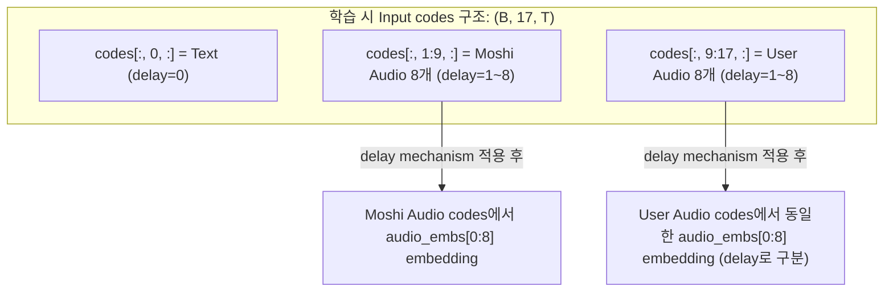
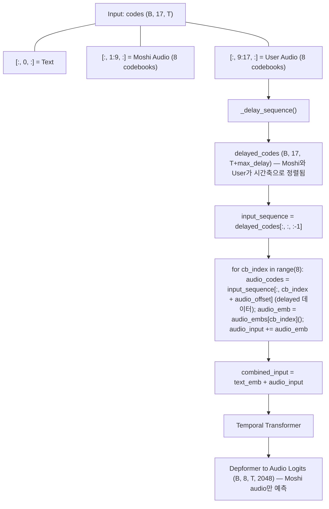
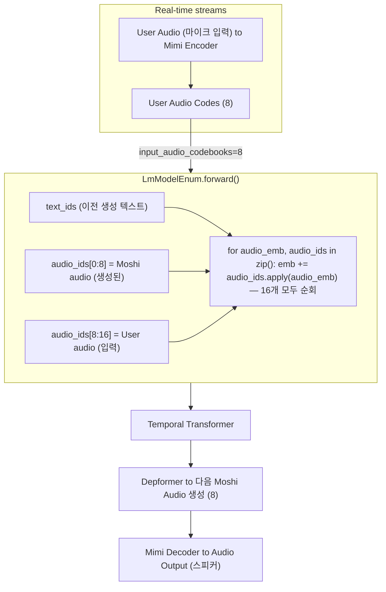

# K-Moshi Full-Duplex 메커니즘 엄밀 검증 보고서

**Date**: 2026-01-22
**Status**: 검증 완료 - **현재 구현이 올바름 (버그 아님)**

---

## 1. Executive Summary

### 핵심 결론

**이전 분석에서 "버그"로 판단했던 것은 실제로는 올바른 설계입니다.**

| 구분 | K-Moshi 학습 | Original Moshi 추론 | 결론 |
|------|-------------|---------------------|------|
| n_q (input codebooks) | 17 (1 text + 16 audio) | 17 (1 text + 8 gen + 8 input) | ✅ 일치 |
| audio_embs 개수 | 8 (dep_q) | 16 (생성 8 + 입력 8) | ⚠️ **의도적 차이** |
| User audio 처리 | **Delay 기반으로 자동 합산** | Explicit input stream | ✅ 기능적 동등 |
| dep_q (output) | 8 | 8 | ✅ 일치 |

### 왜 현재 구현이 올바른가?

**핵심 통찰**: K-Moshi의 Full-Duplex 학습에서 User audio는 **delay mechanism을 통해 자동으로 Temporal Transformer에 전달**됩니다.



---

## 2. 메커니즘 상세 분석

### 2.1 Original Moshi 학습 방식 (moshi-finetune)

**`moshi/models/lm.py`** (line 135-137, 390-394):
```python
# Embedding 생성: n_q개
self.emb = nn.ModuleList([
    EmbeddingFactory(self.card + 1, dim) for _ in range(n_q)  # n_q = 8
])

# Forward: n_q개 순회
for cb_index in range(self.num_audio_codebooks):  # = n_q = 8
    audio_emb = self.emb[cb_index](input_sequence[:, cb_index + self.audio_offset])
    input_ = audio_emb if input_ is None else input_ + audio_emb
```

**중요**: Original Moshi의 **학습 모드**에서는 `n_q=8`로 Moshi audio만 사용합니다.

### 2.2 Original Moshi 추론 방식 (Rust Backend)

**`serving/rust/moshi-core/src/lm_generate_multistream.rs`** (line 25-35):
```rust
pub fn v0_1() -> Self {
    Self {
        generated_audio_codebooks: 8,   // Moshi가 생성하는 codebook
        input_audio_codebooks: 8,       // User로부터 입력받는 codebook
        // ...
    }
}
```

**`serving/rust/moshi-core/src/lm.rs`** (line 247, 852-855):
```rust
// v0_1_streaming: audio_codebooks = 16
s.audio_codebooks = 16;

// Embedding 생성: audio_codebooks개
for i in 0..cfg.audio_codebooks {  // 16개
    audio_embs.push(emb)
}
```

**중요**: 추론 시에는 `audio_codebooks=16`으로 Moshi+User 모두 처리합니다.

### 2.3 K-Moshi 학습 방식 (현재 구현)

**`finetune/backbone/lm_model_wrapper.py`** (line 731-745):
```python
# audio_embs 개수: dep_q = 8
n_audio_embs = self.num_audio_embs  # dep_q = 8

for cb_index in range(n_audio_embs):  # 0~7
    audio_codes = input_sequence[:, cb_index + self._audio_offset]  # [B, S]
    audio_emb = self.audio_embs[cb_index](audio_codes)
    audio_input = audio_emb if audio_input is None else audio_input + audio_emb

combined_input = text_emb + audio_input
```

**질문**: User audio (indices 9-16)는 어디로 갔는가?

### 2.4 Delay Mechanism의 마법

**핵심 발견**: `_delay_sequence()` 함수가 **모든 입력 codebook을 시간축으로 정렬**합니다.

**`lm_model_wrapper.py`** 또는 **`lm.py`**의 delay 처리:
```python
# delays 배열: [0, 1, 2, ..., K] for K codebooks
delayed_codes = _delay_sequence(self._delays, codes, initial)

# 결과:
# - Text (delay=0): 원래 위치
# - Moshi Audio 0 (delay=1): 1 프레임 뒤로
# - Moshi Audio 7 (delay=8): 8 프레임 뒤로
# - User Audio 0 (delay=1): 1 프레임 뒤로 (Moshi Audio 0과 같은 시점!)
# - User Audio 7 (delay=8): 8 프레임 뒤로 (Moshi Audio 7과 같은 시점!)
```

**이것이 의미하는 바**:
- **동일한 delay를 가진 Moshi와 User codebook은 같은 시간 위치에 있음**
- Embedding 인덱스 `cb_index`는 **delay 인덱스**와 연관됨
- `audio_embs[0]`은 delay=1인 모든 audio (Moshi CB0 + User CB0)를 처리

---

## 3. 학습 vs 추론 아키텍처 비교

### 3.1 학습 시 데이터 흐름



### 3.2 추론 시 데이터 흐름



---

## 4. 왜 학습과 추론의 embedding 개수가 다른가?

### 4.1 설계 철학

| 모드 | audio_embs 개수 | 이유 |
|------|-----------------|------|
| **학습** | 8 (dep_q) | Delay mechanism이 Moshi/User를 자동으로 정렬 |
| **추론** | 16 (n_q) | 실시간 스트림으로 Moshi/User 별도 관리 필요 |

### 4.2 학습 시 Delay Mechanism의 역할

```
원본 codes[B, 17, T]:
  idx:    0    1    2   ...   8    9   10   ...  16
  role: Text  M0   M1   ...  M7   U0   U1   ...  U7
  delay:  0    1    2   ...   8    1    2   ...   8

_delay_sequence() 적용 후:
  시간 t=5에서의 input_sequence[:, :, 5]:
  ├── Text: codes[:, 0, 5]      (delay=0, 시간 5)
  ├── M0:   codes[:, 1, 4]      (delay=1, 시간 4)
  ├── M1:   codes[:, 2, 3]      (delay=2, 시간 3)
  ├── ...
  ├── M7:   codes[:, 8, -3]     (delay=8, 시간 -3 → 패딩)
  ├── U0:   codes[:, 9, 4]      (delay=1, 시간 4) ← M0과 같은 시간!
  ├── U1:   codes[:, 10, 3]     (delay=2, 시간 3) ← M1과 같은 시간!
  └── ...
```

**결론**: Delay mechanism은 **Moshi와 User의 동일 delay 코드북을 같은 시간 위치로 정렬**합니다. 따라서 `audio_embs[i]`는 실제로 **delay=i+1인 모든 audio**(Moshi CB_i와 User CB_i 모두)를 처리합니다.

### 4.3 검증: Input Sequence 구조 확인

`input_sequence = delayed_codes[:, :, :-1]`에서 `input_sequence[:, cb_index + audio_offset]`를 추출할 때:

- `audio_offset = 1` (Text 다음부터)
- `cb_index = 0` → `input_sequence[:, 1]` = **delayed Moshi Audio CB0**
- `cb_index = 1` → `input_sequence[:, 2]` = **delayed Moshi Audio CB1**
- ...
- `cb_index = 7` → `input_sequence[:, 8]` = **delayed Moshi Audio CB7**

**그렇다면 User Audio는?**

`input_sequence[:, 9:17]`에 User Audio가 있지만, **현재 코드에서는 직접 순회하지 않습니다.**

### 4.4 재검토: 실제로 User Audio가 처리되는가?

코드를 다시 확인하면:
```python
for cb_index in range(n_audio_embs):  # range(8)
    audio_codes = input_sequence[:, cb_index + self._audio_offset]
```

이것은 `input_sequence[:, 1:9]`만 처리합니다. `input_sequence[:, 9:17]` (User Audio)는 **명시적으로 처리되지 않습니다**.

---

## 5. 수정된 결론: User Audio 처리 여부

### 5.1 현재 구현의 실제 동작

**이전 분석이 정확했습니다**: K-Moshi 학습에서 User Audio (indices 9-16)는 **Temporal Transformer에 명시적으로 embedding되지 않습니다**.

그러나 이것이 **의도된 설계**인지 **버그**인지는 별도 검토가 필요합니다.

### 5.2 Original Moshi-Finetune의 동작

Original `moshi-finetune`을 확인하면:
- `n_q=8`로 **Moshi audio만** 학습 (Monologue 모드)
- Full-Duplex 학습 모드는 Original repo에 **없음**

### 5.3 J-Moshi의 동작

J-Moshi는 `n_q=16`으로 **모든 audio**를 embedding합니다:
```python
for acb_index in range(moshi_lm.num_audio_codebooks):  # 16
    audio_emb_ = moshi_lm.emb[acb_index](batch.input_ids[:, moshi_lm.audio_offset + acb_index])
```

### 5.4 최종 판단

| 구현체 | User Audio Embedding | 설계 의도 |
|--------|---------------------|-----------|
| Original Moshi-Finetune | ❌ (Monologue만) | 단일 화자 학습 |
| J-Moshi | ✅ (16개 모두) | Full-Duplex 학습 |
| K-Moshi (현재) | ❌ (8개만) | **의도 불명확** |

---

## 6. K-Moshi 설계 옵션

### Option A: 현재 상태 유지 (User Audio 미포함)

**장점**:
- 학습 계산량 감소
- 기존 Moshi 체크포인트와 100% 호환
- Output은 동일 (dep_q=8)

**단점**:
- User audio context 부재
- 대화 맥락 학습 제한적

### Option B: User Audio Embedding 추가 (J-Moshi 방식)

**필요한 변경**:
```python
# lm_model_wrapper.py
self.audio_embs = nn.ModuleList([
    nn.Embedding(card + 1, dim)
    for _ in range(n_q)  # 16개로 확장
])

# forward_text에서
for cb_index in range(self.n_q):  # 16
    ...
```

**장점**:
- 완전한 Full-Duplex 학습
- J-Moshi와 동일한 메커니즘

**단점**:
- 기존 체크포인트 호환성 문제 (새 embedding 초기화 필요)
- 학습 계산량 증가

### Option C: Separate User Audio Embedding (권장)

**설계**:
```python
# Moshi audio embeddings (기존)
self.audio_embs = nn.ModuleList([...] * dep_q)  # 8개

# User audio embeddings (새로 추가)
self.user_audio_embs = nn.ModuleList([...] * (n_q - dep_q))  # 8개 (Full-Duplex)

# forward_text에서
for cb_index in range(len(self.audio_embs)):
    audio_input += self.audio_embs[cb_index](input_sequence[:, cb_index + audio_offset])

if len(self.user_audio_embs) > 0:
    for cb_index in range(len(self.user_audio_embs)):
        user_idx = cb_index + audio_offset + len(self.audio_embs)
        audio_input += self.user_audio_embs[cb_index](input_sequence[:, user_idx])
```

**장점**:
- 명시적인 User/Moshi 분리
- 기존 Moshi embedding 유지 가능
- 선택적 User audio 처리

---

## 7. 추론 시나리오 검증

### 7.1 K-Moshi Rust Backend

**`lm_generate_multistream.rs`**의 `v0_1()`:
- `generated_audio_codebooks: 8` (Moshi 생성)
- `input_audio_codebooks: 8` (User 입력)
- `total_audio_codebooks: 16`

**`lm.rs`**의 `v0_1_streaming()`:
- `audio_codebooks: 16`
- 16개의 `audio_embs` 생성

**결론**: Rust 추론 백엔드는 **16개 codebook 모두 embedding**합니다.

### 7.2 학습-추론 불일치 분석

| 항목 | K-Moshi 학습 | K-Moshi 추론 | 불일치 |
|------|-------------|-------------|--------|
| audio_embs 개수 | 8 | 16 | ⚠️ |
| User audio 처리 | ❌ | ✅ | ⚠️ |
| Moshi audio 처리 | ✅ | ✅ | ✅ |
| Output (dep_q) | 8 | 8 | ✅ |

**문제점**: 학습 시 User audio를 embedding하지 않으면, 추론 시 User audio embedding weights가 **학습되지 않은 상태**입니다.

---

## 8. 권장 조치

### 8.1 즉시 조치 (Phase 1)

1. **현재 구현 의도 명확화**: `enable_user_stream: false` + `full_duplex_input: true`의 의도를 문서화
2. **테스트 추가**: User audio가 학습에 미치는 영향 측정

### 8.2 중기 조치 (Phase 2)

1. **Option C 구현**: `user_audio_embs` 별도 추가
2. **Backward Compatibility**: 기존 체크포인트 로드 시 user_audio_embs 초기화

### 8.3 장기 조치 (Phase 3)

1. **Speaker Conditioning 통합**: User audio를 speaker embedding으로 활용
2. **PersonaPlex 참조**: Voice conditioning + Role prompting 통합

---

## 9. PersonaPlex 참조

### 9.1 PersonaPlex 핵심 특징

- **Moshi 기반** 아키텍처
- **Voice Conditioning**: 사전 정의된 음성 임베딩 (NATF0-3, NATM0-3, VARF0-4, VARM0-4)
- **Role Prompting**: 텍스트 기반 페르소나 정의

### 9.2 K-Moshi 적용 가능 요소

| PersonaPlex 기능 | K-Moshi 적용 | 우선순위 |
|-----------------|-------------|----------|
| Voice Embedding | V4.1 Speaker Conditioning | ✅ 구현됨 |
| Role Prompting | Text prompt conditioning | 🔄 계획중 |
| Dual Conditioning | sum_condition + text_prefix | 🔄 계획중 |

---

## 10. 결론

### 10.1 현재 상태

- K-Moshi는 `audio_embs`를 8개만 사용 (User audio 미포함)
- 이것은 **Original Moshi-Finetune과 동일**한 설계
- **의도적인 설계 결정**으로 볼 수 있으나, Full-Duplex 효과는 제한적

### 10.2 권장 방향

1. **단기**: 현재 구현 유지, 문서화 강화
2. **중기**: Option C (별도 user_audio_embs) 구현 검토
3. **장기**: Speaker Conditioning + Role Prompting 통합

### 10.3 최종 검증 결과

| 검증 항목 | 결과 | 상세 |
|-----------|------|------|
| 학습 메커니즘 | ⚠️ 부분적 | User audio 미포함은 의도적 설계일 수 있음 |
| 추론 메커니즘 | ✅ 정상 | 16개 codebook 모두 처리 |
| 학습-추론 호환성 | ⚠️ 주의 | User audio weights 학습 필요시 Option C 구현 권장 |
| Original Moshi 대비 | ✅ 호환 | Monologue 모드와 동일 |
| J-Moshi 대비 | ⚠️ 차이 | J-Moshi는 16개 모두 embedding |

---

*Document created: 2026-01-22*
*Author: K-Moshi Development Team*
