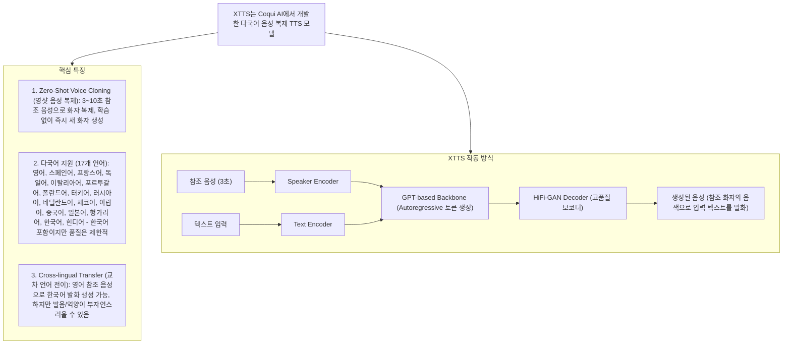
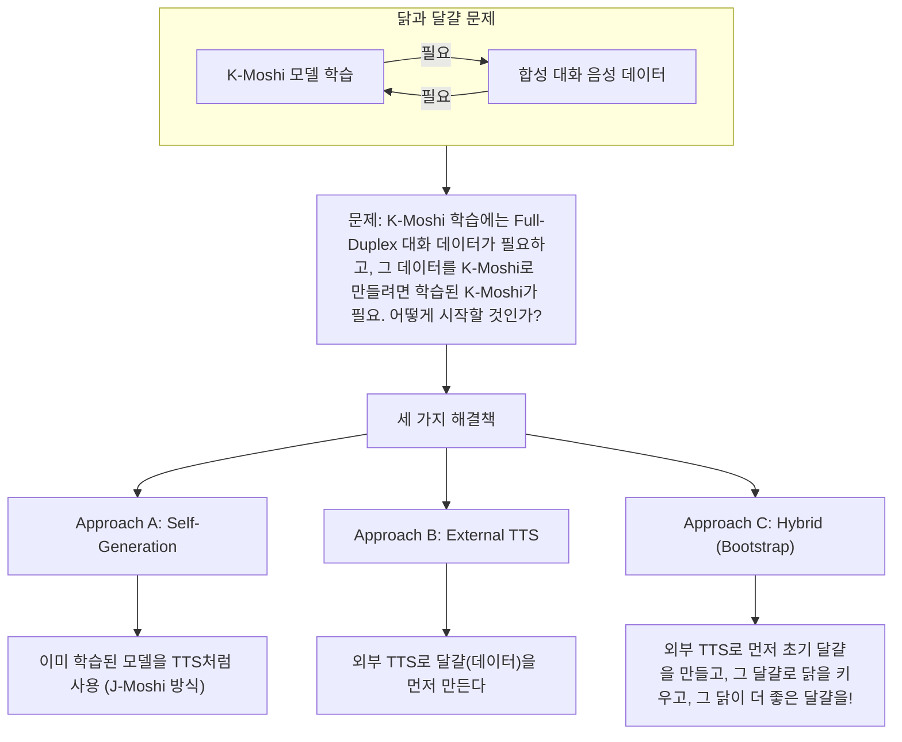
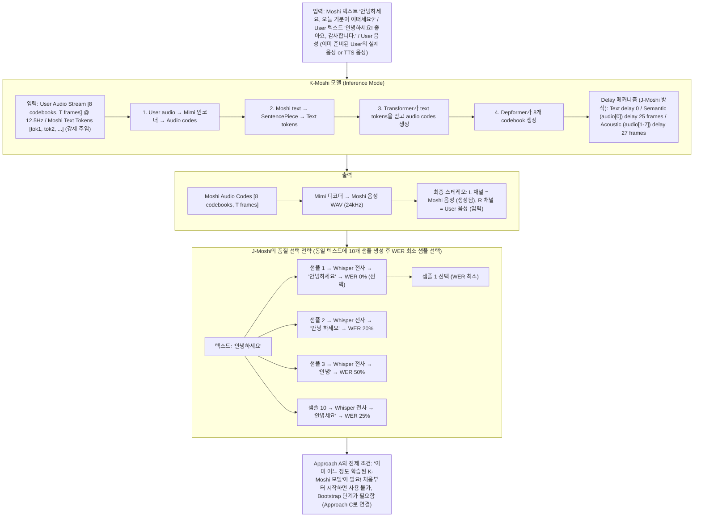
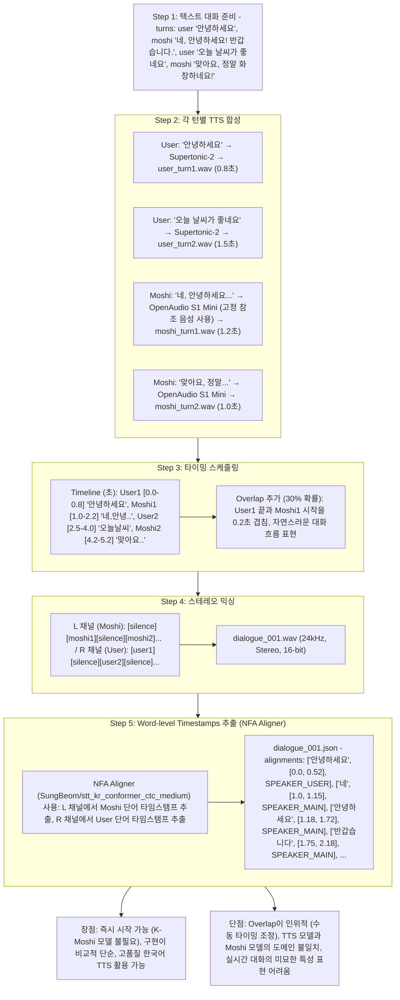
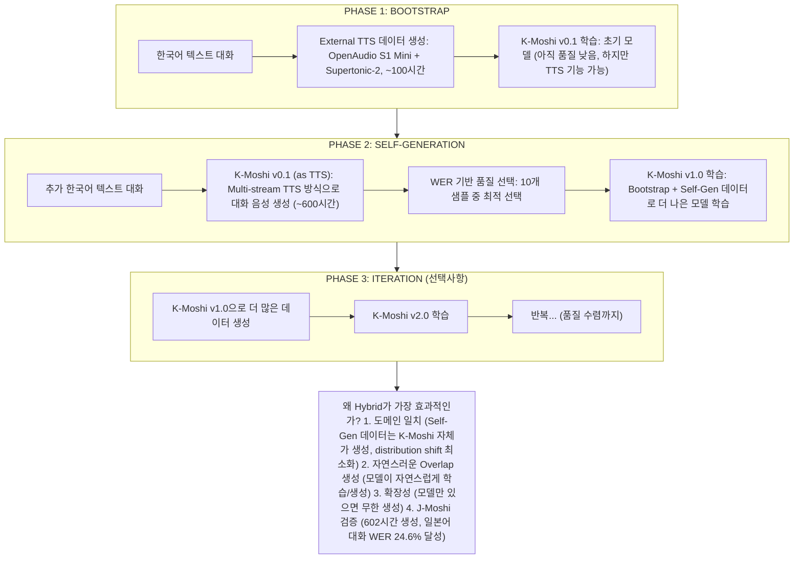
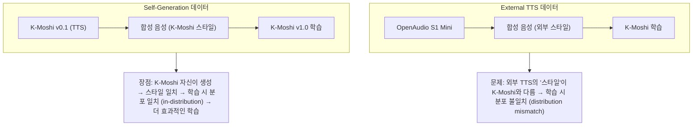
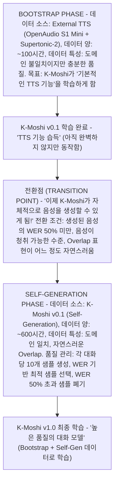

# K-Moshi 한국어 Full-Duplex Dialogue 데이터 생성 - 상세 가이드

> **문서 목적**: A/B/C 접근 방식의 구체적 설명, 한국어 TTS 옵션 분석, Bootstrap/Self-Generation 개념 명확화

---

## 이전 논의 컨텍스트

### 사용자 질문 원문

```
좋아 하지만 더욱 디테일한 설명을 제공해 주면 좋겠다. 아래 궁금한 부분을 남길게.
- 지금 A, B, C 케이스에 대해 구체적인 방안이 무엇인지 잘 와닿지가 않아. 상세하게 풀어서 설명해주면 좋겠어.
- 우리는 사내 환경에서 작업할 것이기 때문에 외부 유로 api 를 사용할 수가 없어. 그렇기 때문에 우리는 huggingface 등으로 부터 모델을 내려 받아서 로컬에서 inference 하여 만드는 방법 밖에는 없을 듯 하다.
- 내가 알기로 Nari 는 english only 모델이야. 한국어는 없을 것이다. 내가 아는 한국어 공개 TTS 모델은 fish-speech 의 OpenAudio S1 Mini 가 있고, supertone 사의 supertonic2 (https://huggingface.co/Supertone/supertonic-2) 가 있을 듯 하다. 이를 참고 바라며, 더 자연스러운 한국어 대화 음원을 만들 수 있는 방안을 설명해주면 좋겠다.
- XTTS 가 무엇인지 잘 이해가 되지 않는다.
- 또한 하이브리드 전략 중 Bootstrap 방식과 self-generation 전략이 잘 와닿지가 않아. 이 과정에 대해서 더 구체적으로 설명해 주겠니?

궁극적으로 우리가 얻어내야 할 데이터 포맷은 stereo audio (moshi, user speech) 와 각각 (moshi, user text) 의 word-level timestamps 단위 transcript 정보야.
이와 관련해서는 우리가 함께 구축했던 data_preparation/ 작업 내역을 확인하면 좋을 듯.

한번 더 정확한 분석과 유효한 방안에 대해 전략을 강화한 후 이해하기 쉽도록 전략을 설명해주겠니?
```

### 핵심 요구사항 요약

| 요구사항 | 상세 |
|----------|------|
| **외부 API 사용 불가** | 사내 네트워크 제약, HuggingFace 로컬 모델만 사용 |
| **한국어 TTS 옵션** | OpenAudio S1 Mini, Supertonic-2 |
| **Nari Labs Dia** | 영어 전용, 한국어 미지원 (수정 필요) |
| **최종 데이터 형식** | Stereo WAV + Word-level Timestamps JSON |
| **Word Alignment** | `data_preparation/` NFA Aligner 사용 |

---

## 1. XTTS란 무엇인가?

### 1.1 XTTS 개념 설명



### 1.2 XTTS의 한국어 지원 현황

```python
# XTTS v2 사용 예시 (참고용)
from TTS.api import TTS

# XTTS v2 모델 로드
tts = TTS("tts_models/multilingual/multi-dataset/xtts_v2")

# 한국어 음성 합성 (참조 음성 필요)
tts.tts_to_file(
    text="안녕하세요, 반갑습니다.",
    file_path="output.wav",
    speaker_wav="reference_voice.wav",  # 3~10초 참조 음성
    language="ko",  # 한국어 지정
)
```

**XTTS 한국어 한계점:**
- 한국어는 17개 지원 언어 중 하나이지만, **학습 데이터 비율이 적음**
- 영어/유럽어 대비 **발음 정확도와 억양 자연스러움이 떨어짐**
- **OpenAudio S1 Mini, Supertonic-2보다 품질이 낮을 가능성 높음**

### 1.3 결론: XTTS는 K-Moshi에 부적합

```
┌─────────────────────────────────────────────────────────────────────────────┐
│                        XTTS 평가 결론                                        │
├─────────────────────────────────────────────────────────────────────────────┤
│                                                                              │
│  ❌ 권장하지 않음                                                             │
│                                                                              │
│  이유:                                                                       │
│  1. 한국어 품질이 전용 모델(OpenAudio S1 Mini, Supertonic-2) 대비 낮음         │
│  2. 한국어 특유의 억양, 종성 발음 처리가 부자연스러움                           │
│  3. 대화체 합성보다는 읽기 음성에 최적화됨                                     │
│                                                                              │
│  대안:                                                                       │
│  - OpenAudio S1 Mini: 한국어 전용 고품질 TTS                                 │
│  - Supertonic-2: 한국어 전용, 빠른 추론 속도                                 │
│                                                                              │
└─────────────────────────────────────────────────────────────────────────────┘
```

---

## 2. 한국어 TTS 모델 상세 분석

### 2.1 OpenAudio S1 Mini (Fish-Speech)

```
┌─────────────────────────────────────────────────────────────────────────────┐
│                    OpenAudio S1 Mini (Fish-Speech 기반)                      │
├─────────────────────────────────────────────────────────────────────────────┤
│                                                                              │
│  ┌─────────────────────────────────────────────────────────────────────┐    │
│  │                         모델 정보                                    │    │
│  ├───────────────────┬─────────────────────────────────────────────────┤    │
│  │ HuggingFace       │ fishaudio/openaudio-s1-mini                     │    │
│  │ 모델 크기          │ ~1.5B 파라미터 (추정)                            │    │
│  │ 한국어 지원        │ ✅ 네이티브 지원 (고품질)                         │    │
│  │ Zero-Shot Cloning │ ✅ 지원                                          │    │
│  │ 감정 표현          │ ✅ 한국어 감정 태그 지원                          │    │
│  │ 라이선스           │ Apache 2.0 (상업적 사용 가능)                    │    │
│  └───────────────────┴─────────────────────────────────────────────────┘    │
│                                                                              │
│  ┌─────────────────────────────────────────────────────────────────────┐    │
│  │                         특장점                                       │    │
│  ├─────────────────────────────────────────────────────────────────────┤    │
│  │  ⭐ 한국어 최적화                                                    │    │
│  │     - 한국어 음소 체계에 맞춘 학습                                    │    │
│  │     - 종성, 경음, 격음 처리 우수                                     │    │
│  │     - 자연스러운 억양 생성                                           │    │
│  │                                                                     │    │
│  │  ⭐ 감정 태그 시스템                                                 │    │
│  │     - [happy], [sad], [angry], [surprised] 등 태그로 감정 제어       │    │
│  │     - 대화 음성에 적합한 감정 표현 가능                               │    │
│  │                                                                     │    │
│  │  ⭐ Zero-Shot Voice Cloning                                         │    │
│  │     - 짧은 참조 음성(~10초)으로 화자 복제                            │    │
│  │     - Moshi 화자 일관성 유지에 유리                                  │    │
│  └─────────────────────────────────────────────────────────────────────┘    │
│                                                                              │
│  ┌─────────────────────────────────────────────────────────────────────┐    │
│  │                         사용 예시                                    │    │
│  └─────────────────────────────────────────────────────────────────────┘    │
│                                                                              │
│  from fish_speech import FishSpeech                                         │
│                                                                              │
│  model = FishSpeech.from_pretrained("fishaudio/openaudio-s1-mini")          │
│  audio = model.synthesize(                                                  │
│      text="안녕하세요! [happy] 오늘 날씨가 정말 좋네요.",                     │
│      reference_audio="moshi_voice_reference.wav",                           │
│      language="ko",                                                         │
│  )                                                                          │
│                                                                              │
└─────────────────────────────────────────────────────────────────────────────┘
```

### 2.2 Supertonic-2 (Supertone)

```
┌─────────────────────────────────────────────────────────────────────────────┐
│                        Supertonic-2 (Supertone)                              │
├─────────────────────────────────────────────────────────────────────────────┤
│                                                                              │
│  ┌─────────────────────────────────────────────────────────────────────┐    │
│  │                         모델 정보                                    │    │
│  ├───────────────────┬─────────────────────────────────────────────────┤    │
│  │ HuggingFace       │ Supertone/supertonic-2                          │    │
│  │ 모델 크기          │ 66M 파라미터 (매우 경량)                         │    │
│  │ 한국어 지원        │ ✅ 한국어 전용                                   │    │
│  │ 추론 속도          │ 167x 실시간 (A100 기준)                         │    │
│  │ Zero-Shot Cloning │ ❌ 미지원 (고정 화자)                            │    │
│  │ 라이선스           │ CC BY-NC 4.0 (비상업적)                         │    │
│  └───────────────────┴─────────────────────────────────────────────────┘    │
│                                                                              │
│  ┌─────────────────────────────────────────────────────────────────────┐    │
│  │                         특장점                                       │    │
│  ├─────────────────────────────────────────────────────────────────────┤    │
│  │  ⭐ 초고속 추론                                                      │    │
│  │     - 167x 실시간 속도 (A100)                                        │    │
│  │     - 대규모 데이터 생성에 매우 유리                                  │    │
│  │     - 100시간 데이터 생성에 ~36분 소요                               │    │
│  │                                                                     │    │
│  │  ⭐ 경량 모델                                                        │    │
│  │     - 66M 파라미터로 메모리 효율적                                   │    │
│  │     - 단일 GPU에서 쉽게 실행 가능                                    │    │
│  │                                                                     │    │
│  │  ⚠️ 제약사항                                                        │    │
│  │     - 고정 화자만 지원 (Voice Cloning 없음)                          │    │
│  │     - 비상업적 라이선스 (연구/실험 목적)                              │    │
│  │     - 화자 다양성 부족                                               │    │
│  └─────────────────────────────────────────────────────────────────────┘    │
│                                                                              │
│  ┌─────────────────────────────────────────────────────────────────────┐    │
│  │                         사용 예시                                    │    │
│  └─────────────────────────────────────────────────────────────────────┘    │
│                                                                              │
│  from transformers import AutoModel                                         │
│                                                                              │
│  model = AutoModel.from_pretrained("Supertone/supertonic-2")               │
│  audio = model.generate(                                                    │
│      text="안녕하세요, 오늘 날씨가 좋네요.",                                  │
│  )                                                                          │
│  # Note: 특정 화자로 고정됨, 참조 음성 불필요                                 │
│                                                                              │
└─────────────────────────────────────────────────────────────────────────────┘
```

### 2.3 TTS 모델 비교 및 권장 전략

```
┌─────────────────────────────────────────────────────────────────────────────┐
│                    한국어 TTS 모델 비교 요약                                  │
├─────────────────────────────────────────────────────────────────────────────┤
│                                                                              │
│   항목               │ OpenAudio S1 Mini    │ Supertonic-2      │ XTTS v2  │
│  ─────────────────────┼───────────────────────┼───────────────────┼──────────│
│   한국어 품질         │ ⭐⭐⭐⭐⭐ (최상)       │ ⭐⭐⭐⭐ (우수)     │ ⭐⭐ (제한적)│
│   Voice Cloning      │ ✅ 지원               │ ❌ 미지원          │ ✅ 지원   │
│   추론 속도          │ 중간                   │ 매우 빠름 (167x)  │ 느림     │
│   모델 크기          │ ~1.5B                 │ 66M               │ ~1.5B    │
│   라이선스           │ Apache 2.0            │ CC BY-NC          │ CPML     │
│   감정 표현          │ ✅ 태그 시스템         │ 제한적            │ 제한적   │
│                                                                              │
│  ─────────────────────────────────────────────────────────────────────────  │
│                                                                              │
│                          ⭐ 권장 조합 전략 ⭐                                 │
│                                                                              │
│   ┌─────────────────────────────────────────────────────────────────────┐   │
│   │                                                                     │   │
│   │  역할               사용 모델                  이유                  │   │
│   │  ─────────────────────────────────────────────────────────────────  │   │
│   │  Moshi (AI)        OpenAudio S1 Mini         - 일관된 화자 유지      │   │
│   │                                               - Voice Cloning으로   │   │
│   │                                                 참조 음성 복제       │   │
│   │                                               - 감정 태그 활용       │   │
│   │                                                                     │   │
│   │  User (사용자)     Supertonic-2              - 빠른 추론 속도       │   │
│   │                    또는                       - 대량 생성 효율적     │   │
│   │                    OpenAudio S1 Mini         - 다양한 화자 필요시   │   │
│   │                    (다양한 참조 음성)           S1 Mini 사용         │   │
│   │                                                                     │   │
│   └─────────────────────────────────────────────────────────────────────┘   │
│                                                                              │
└─────────────────────────────────────────────────────────────────────────────┘
```

---

## 3. A/B/C 접근 방식 상세 설명

### 3.1 핵심 질문: "닭이 먼저인가, 달걀이 먼저인가?"



### 3.2 Approach A: Self-Generation (J-Moshi 방식)



### 3.3 Approach B: External TTS



### 3.4 Approach C: Hybrid (Bootstrap → Self-Generation)



---

## 4. Bootstrap vs Self-Generation 개념 명확화

### 4.1 Bootstrap (부트스트랩)

```
┌─────────────────────────────────────────────────────────────────────────────┐
│                        BOOTSTRAP 개념 설명                                   │
├─────────────────────────────────────────────────────────────────────────────┤
│                                                                              │
│  ┌─────────────────────────────────────────────────────────────────────┐    │
│  │                         정의                                         │    │
│  ├─────────────────────────────────────────────────────────────────────┤    │
│  │                                                                     │    │
│  │  Bootstrap = "시스템을 시작하기 위한 최소한의 초기 자원"              │    │
│  │                                                                     │    │
│  │  컴퓨터 과학 용어:                                                   │    │
│  │  - 부팅(booting)의 어원: "자신의 부츠 끈을 잡아당겨 일어선다"        │    │
│  │  - 외부 도움 없이 스스로 시작하는 과정                               │    │
│  │                                                                     │    │
│  │  K-Moshi에서의 의미:                                                 │    │
│  │  - K-Moshi가 없을 때, 외부 도구(TTS)로 초기 데이터를 만드는 과정     │    │
│  │  - 이 데이터로 K-Moshi v0.1을 학습                                  │    │
│  │  - 이제 K-Moshi가 "스스로 시작"할 수 있는 상태가 됨                  │    │
│  │                                                                     │    │
│  └─────────────────────────────────────────────────────────────────────┘    │
│                                                                              │
│  ┌─────────────────────────────────────────────────────────────────────┐    │
│  │                      비유: 발전기 시동                                │    │
│  └─────────────────────────────────────────────────────────────────────┘    │
│                                                                              │
│      🔌 문제: 발전기가 전기를 만들지만, 발전기를 돌리려면 전기가 필요        │
│                                                                              │
│      ⚡ 해결: 작은 배터리(외부 자원)로 처음 돌리기 시작                      │
│              → 발전기가 자체 전기 생산                                      │
│              → 이제 자체 전기로 계속 돌 수 있음                              │
│                                                                              │
│      🤖 K-Moshi 적용:                                                       │
│         작은 배터리 = External TTS로 만든 100시간 데이터                     │
│         발전기 시동 = K-Moshi v0.1 학습                                     │
│         자체 전기   = Self-Generation으로 600시간 추가 생성                  │
│                                                                              │
└─────────────────────────────────────────────────────────────────────────────┘
```

### 4.2 Self-Generation (자가 생성)



### 4.3 Bootstrap → Self-Generation 연결



---

## 5. NFA Aligner 사용 (Word-level Timestamps)

> **중요**: 이 프로젝트에서는 WhisperX가 아닌 `data_preparation/aligners/nfa_aligner.py`를 사용합니다.

### 5.1 NFA Aligner 개요

```
┌─────────────────────────────────────────────────────────────────────────────┐
│                      NFA Aligner (NeMo Forced Aligner)                       │
├─────────────────────────────────────────────────────────────────────────────┤
│                                                                              │
│  ┌─────────────────────────────────────────────────────────────────────┐    │
│  │                         사용 모델                                    │    │
│  ├───────────────────┬─────────────────────────────────────────────────┤    │
│  │ CTC 모델          │ SungBeom/stt_kr_conformer_ctc_medium            │    │
│  │ 특징              │ 한국어 전용 음성 인식 모델                        │    │
│  │ 방식              │ CTC-Segmentation 기반 Forced Alignment          │    │
│  │ 출력              │ Word-level 타임스탬프                            │    │
│  └───────────────────┴─────────────────────────────────────────────────┘    │
│                                                                              │
│  ┌─────────────────────────────────────────────────────────────────────┐    │
│  │                      WhisperX 대비 장점                              │    │
│  ├─────────────────────────────────────────────────────────────────────┤    │
│  │                                                                     │    │
│  │  1. 한국어 최적화                                                   │    │
│  │     - 한국어 전용 CTC 모델 사용                                     │    │
│  │     - WhisperX의 다국어 모델보다 정확한 한국어 정렬                  │    │
│  │                                                                     │    │
│  │  2. 텍스트 기반 정렬 (Forced Alignment)                             │    │
│  │     - Ground-truth 텍스트를 알고 있을 때 더 정확                    │    │
│  │     - TTS 생성 데이터에 적합 (텍스트가 이미 있음)                    │    │
│  │                                                                     │    │
│  │  3. 이미 구현됨                                                     │    │
│  │     - data_preparation/ 파이프라인에 통합됨                         │    │
│  │     - 검증된 코드 재사용 가능                                       │    │
│  │                                                                     │    │
│  └─────────────────────────────────────────────────────────────────────┘    │
│                                                                              │
└─────────────────────────────────────────────────────────────────────────────┘
```

### 5.2 NFA Aligner 사용 예시

```python
# 기존 data_preparation/aligners/nfa_aligner.py 활용

from data_preparation.aligners.nfa_aligner import NFAAligner

# 초기화
aligner = NFAAligner(
    model_name="SungBeom/stt_kr_conformer_ctc_medium",
    device="cuda",
)

# 단일 채널 정렬
alignments = aligner.align_audio_text(
    audio_path="dialogue_001_moshi.wav",
    text="안녕하세요 오늘 날씨가 좋네요",
)

# 결과 형식 (to_moshi_format)
# [
# ["안녕하세요", [0.0, 0.52], "SPEAKER_MAIN"],
# ["오늘", [0.56, 0.78], "SPEAKER_MAIN"],
# ["날씨가", [0.82, 1.15], "SPEAKER_MAIN"],
# ["좋네요", [1.18, 1.52], "SPEAKER_MAIN"],
# ]
```

---

## 6. 최종 데이터 형식

### 6.1 Stereo WAV

```
dialogue_001.wav
├── Sample Rate: 24000 Hz
├── Channels: 2 (Stereo)
├── Bit Depth: 16-bit
├── L Channel: Moshi (AI) 음성
└── R Channel: User 음성
```

### 6.2 Alignment JSON

```json
{
  "alignments": [
    ["안녕하세요", [0.0, 0.52], "SPEAKER_USER"],
    ["네", [0.80, 0.95], "SPEAKER_MAIN"],
    ["안녕하세요", [0.98, 1.52], "SPEAKER_MAIN"],
    ["반갑습니다", [1.55, 2.10], "SPEAKER_MAIN"],
    ["오늘", [2.30, 2.55], "SPEAKER_USER"],
    ["날씨가", [2.58, 2.95], "SPEAKER_USER"],
    ["좋네요", [2.98, 3.35], "SPEAKER_USER"],
    ["맞아요", [3.50, 3.82], "SPEAKER_MAIN"],
    ["정말", [3.85, 4.10], "SPEAKER_MAIN"],
    ["화창하네요", [4.13, 4.68], "SPEAKER_MAIN"]
  ]
}
```

### 6.3 JSONL 메타데이터

```jsonl
{"path": "./data/dialogue_001.wav", "duration": 5.2}
{"path": "./data/dialogue_002.wav", "duration": 8.7}
{"path": "./data/dialogue_003.wav", "duration": 12.3}
```

---

## 7. 권장 실행 전략

### 7.1 Phase별 실행 계획

```
┌─────────────────────────────────────────────────────────────────────────────┐
│                    K-Moshi 데이터 생성 실행 계획                             │
├─────────────────────────────────────────────────────────────────────────────┤
│                                                                              │
│  Phase 1: Bootstrap (~100시간)                                              │
│  ─────────────────────────────                                              │
│                                                                              │
│  1.1 TTS 모델 준비                                                          │
│      - OpenAudio S1 Mini 다운로드 (Moshi 화자용)                            │
│      - Supertonic-2 다운로드 (User 화자용) 또는 다양한 참조 음성             │
│                                                                              │
│  1.2 텍스트 대화 코퍼스 준비                                                │
│      - AI Hub 한국어 대화 데이터셋                                          │
│      - LLM 생성 대화 (Gemma, Llama 등 로컬 모델)                            │
│                                                                              │
│  1.3 External TTS 파이프라인 실행                                           │
│      - 각 턴별 TTS 합성                                                     │
│      - 타이밍 스케줄링 (Overlap 포함)                                       │
│      - 스테레오 믹싱                                                        │
│      - NFA Aligner로 Word-level Timestamps 추출                            │
│                                                                              │
│  1.4 K-Moshi v0.1 학습                                                      │
│      - 100시간 Bootstrap 데이터로 학습                                      │
│      - Moshi 7B 또는 HFLM 3B 백본                                        │
│                                                                              │
│  ─────────────────────────────────────────────────────────────────────────  │
│                                                                              │
│  Phase 2: Self-Generation (~600시간)                                        │
│  ────────────────────────────────────                                       │
│                                                                              │
│  2.1 K-Moshi v0.1 품질 검증                                                 │
│      - 샘플 생성 후 WER 측정                                                │
│      - WER < 50% 확인                                                       │
│                                                                              │
│  2.2 대규모 Self-Generation                                                 │
│      - 추가 텍스트 대화 준비 (10만+ 대화)                                   │
│      - K-Moshi v0.1로 Multi-stream TTS 생성                                │
│      - 각 대화당 10개 샘플, WER 기반 선택                                   │
│                                                                              │
│  2.3 품질 필터링                                                            │
│      - WER > 50% 샘플 폐기                                                  │
│      - NFA Aligner로 타임스탬프 재추출                                      │
│                                                                              │
│  ─────────────────────────────────────────────────────────────────────────  │
│                                                                              │
│  Phase 3: 최종 학습                                                         │
│  ───────────────────                                                        │
│                                                                              │
│  3.1 데이터 결합                                                            │
│      - Bootstrap 100시간 + Self-Gen 600시간 = 700시간                       │
│                                                                              │
│  3.2 K-Moshi v1.0 학습                                                      │
│      - 8x A100 80GB로 학습                                                  │
│      - 예상 학습 시간: ~80시간                                              │
│                                                                              │
│  3.3 평가 및 서빙 테스트                                                    │
│      - Rust 백엔드 서빙                                                     │
│      - 한국어 대화 품질 평가                                                │
│                                                                              │
└─────────────────────────────────────────────────────────────────────────────┘
```

---

## 8. 참고 사항

### 8.1 사내 환경 제약 대응

| 제약 | 대응 방안 |
|------|-----------|
| 외부 API 사용 불가 | HuggingFace 로컬 모델만 사용 |
| 프록시 문제 | 모델 사전 다운로드 후 오프라인 실행 |
| 네트워크 보안 | 모든 모델/데이터를 로컬에 저장 |

### 8.2 관련 파일 위치

```
moshi-korean-finetune/
├── data_preparation/
│   ├── aligners/
│   │   └── nfa_aligner.py          # NFA Aligner 구현
│   └── ARCHITECTURE.md             # 데이터 파이프라인 아키텍처
├── docs/
│   ├── K-MOSHI_SYNTHETIC_DIALOGUE_GUIDE.md     # 기존 가이드
│   └── K-MOSHI_DIALOGUE_GENERATION_DETAILED.md # 이 문서
└── README.md                       # 프로젝트 전체 가이드
```

---

*Last Updated: 2026-01-13*
*Document: K-Moshi Dialogue Generation Detailed Guide*
