# K-Moshi Zero-Shot Speaker Conditioning: 이론적 기반과 아키텍처

**Version**: 1.0
**Created**: 2026-01-21
**Author**: K-Moshi Development Team

---

## 목차

1. [Input Embedding 개념 명확화](#1-input-embedding-개념-명확화)
2. [Zero-Shot Speaker Conditioning 기법 이론화](#2-zero-shot-speaker-conditioning-기법-이론화)
3. [Depth Transformer 구조 개선 Future Work](#3-depth-transformer-구조-개선-future-work)
4. [K-Moshi 아키텍처 다이어그램](#4-k-moshi-아키텍처-다이어그램)
5. [개발 히스토리 및 현재 상태](#5-개발-히스토리-및-현재-상태)

---

## 1. Input Embedding 개념 명확화

### 1.1 기본 수식 정의

Moshi의 Temporal Transformer에 입력되는 `combined_input`은 다음과 같이 정의됩니다:

```
combined_input[t] = text_emb[t] + Σᵢ audio_emb[i][t] + speaker_condition
```

**수학적 표현:**

$$
\mathbf{h}_t = \mathbf{E}_{text}(x_t^{text}) + \sum_{i=0}^{K-1} \mathbf{E}_{audio}^{(i)}(x_t^{audio,i}) + \mathbf{s}
$$

여기서:
- $\mathbf{h}_t \in \mathbb{R}^D$: 시간 $t$에서의 combined input (D=4096)
- $\mathbf{E}_{text}$: Text embedding layer (vocab_size → D)
- $\mathbf{E}_{audio}^{(i)}$: i번째 audio codebook embedding layer (2048 → D)
- $x_t^{text}$: 시간 $t$의 text token
- $x_t^{audio,i}$: 시간 $t$의 i번째 audio codebook token
- $K$: Audio codebook 수 (dep_q=8)
- $\mathbf{s} \in \mathbb{R}^D$: Speaker conditioning vector (time-invariant)

### 1.2 각 컴포넌트의 역할

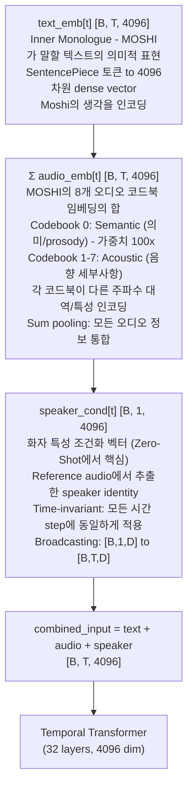

### 1.3 코드 레벨 매핑 (lm_model_wrapper.py:730-765)

```python
# Step 1: Audio embedding summation (8 codebooks)
audio_input = None
for cb_index in range(n_audio_embs):  # n_audio_embs = dep_q = 8
    audio_codes = input_sequence[:, cb_index + self._audio_offset]  # [B, S]
    audio_emb = self.audio_embs[cb_index](audio_codes)  # [B, S, D=4096]
    audio_input = audio_emb if audio_input is None else audio_input + audio_emb

# Step 2: Text embedding
text_codes = input_sequence[:, 0]  # [B, S]
text_emb = self.text_emb(text_codes)  # [B, S, D=4096]

# Step 3: Combine text + audio
combined_input = text_emb + audio_input  # [B, S, D=4096]

# Step 4: Add speaker conditioning (NEW in K-Moshi)
if effective_sum_condition is not None:
    # Broadcasting: [B, 1, D] + [B, S, D] → [B, S, D]
    combined_input = combined_input + effective_sum_condition.to(combined_input)
```

### 1.4 Embedding 차원 흐름도

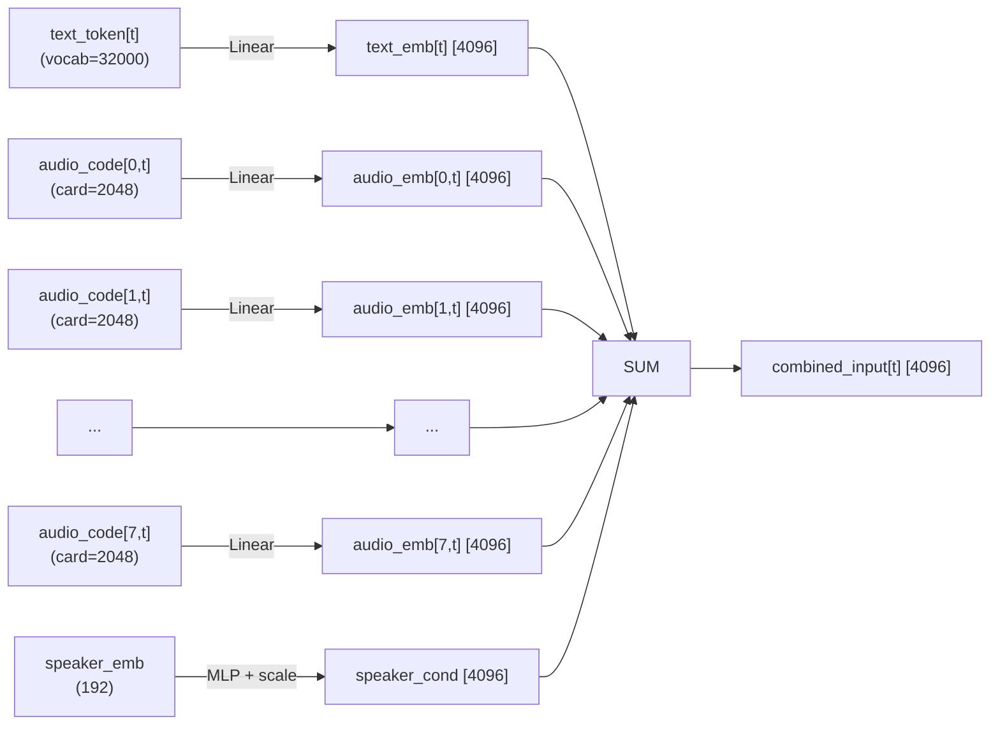

---

## 2. Zero-Shot Speaker Conditioning 기법 이론화

K-Moshi는 **2가지 상호 보완적인 Speaker Conditioning 방법**을 지원합니다.

### 2.1 기법 분류 체계

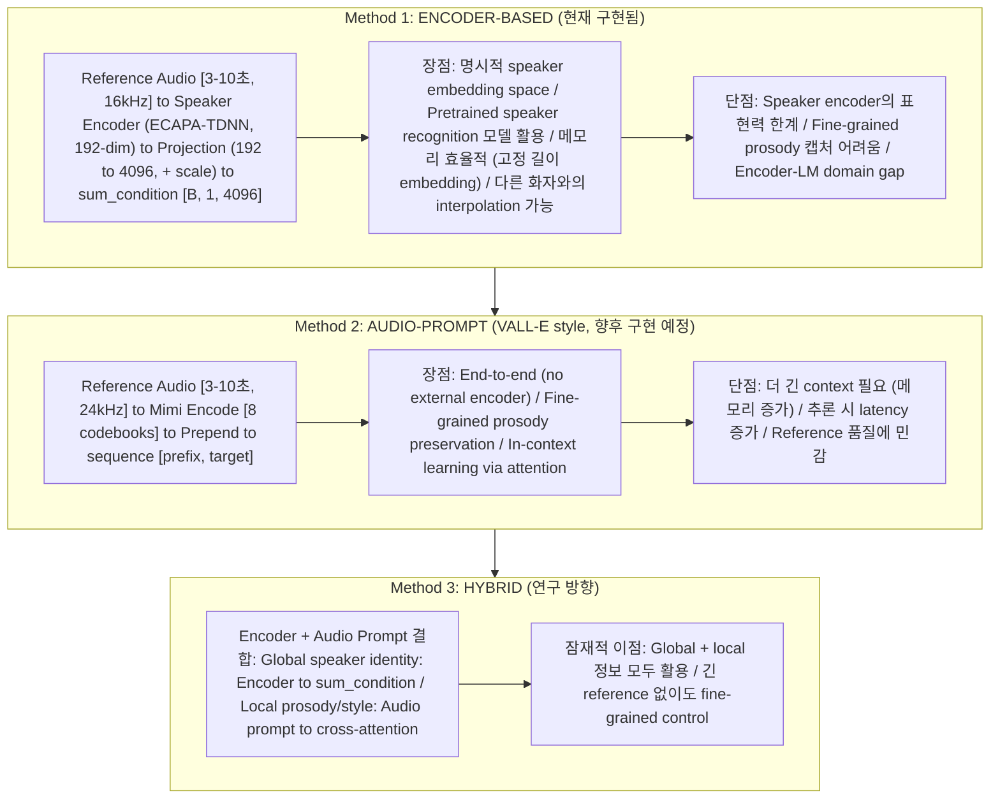

### 2.2 Method 1: Encoder-Based (상세 이론)

#### 2.2.1 수학적 정의

**Speaker Encoder Function:**
$$
\mathbf{e}_{spk} = f_{enc}(\mathbf{x}_{ref}) \in \mathbb{R}^{192}
$$

**Speaker Conditioner Function:**
$$
\mathbf{s} = \alpha \cdot \mathbf{W} \cdot \text{LayerNorm}(\mathbf{e}_{spk}) \in \mathbb{R}^{4096}
$$

여기서:
- $f_{enc}$: ECAPA-TDNN speaker encoder (pretrained)
- $\mathbf{x}_{ref}$: Reference audio waveform [T_ref samples]
- $\mathbf{W} \in \mathbb{R}^{4096 \times 192}$: Learnable projection matrix
- $\alpha \in \mathbb{R}$: Learnable scale parameter (초기값 0.1)

#### 2.2.2 Architecture Detail

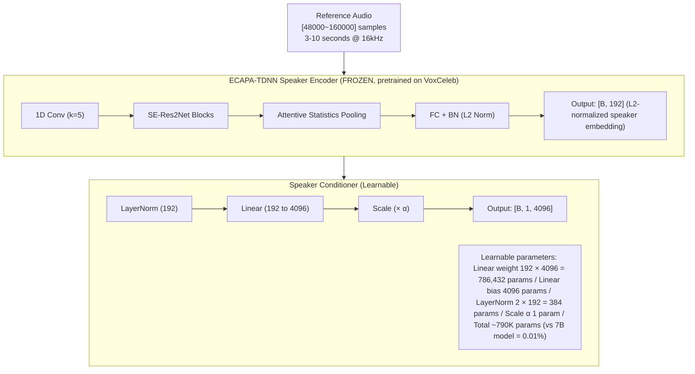

#### 2.2.3 Scale Parameter 설계 원리

**왜 작은 초기 scale (α=0.1)?**

1. **안정적 학습 시작**: 큰 speaker conditioning은 초기에 불안정
2. **점진적 통합**: 모델이 먼저 text+audio 관계 학습 후 speaker 정보 통합
3. **Residual connection 유사**: skip connection처럼 점진적 기여

```python
# Scale mode options
scale_mode = "multiply"  # Default: α × projection(emb)
# OR
scale_mode = "gated"     # Advanced: σ(gate(emb)) × projection(emb)
```

### 2.3 Method 2: Audio-Prompt (VALL-E Style) - 이론적 설계

#### 2.3.1 수학적 정의

Reference audio를 Mimi로 인코딩하여 sequence에 prefix로 추가:

$$
\mathbf{X}_{input} = [\mathbf{X}_{ref}; \mathbf{X}_{target}]
$$

여기서:
- $\mathbf{X}_{ref} \in \mathbb{R}^{K \times T_{ref}}$: Reference audio codes
- $\mathbf{X}_{target} \in \mathbb{R}^{K \times T_{target}}$: Target audio codes
- $K = 9$: Total codebooks (1 text + 8 audio)

#### 2.3.2 Proposed Architecture

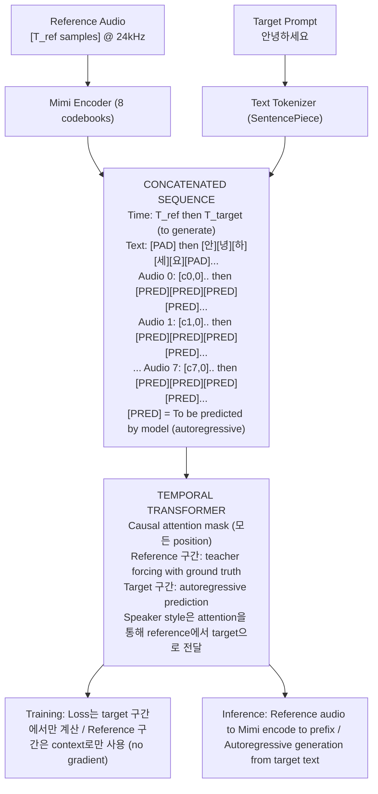

### 2.4 기법 비교 분석

| 속성 | Encoder-Based | Audio-Prompt |
|------|---------------|--------------|
| **메모리** | O(1) - 고정 192-dim | O(T_ref) - reference 길이 비례 |
| **Latency** | 낮음 (encoder 한 번) | 높음 (긴 context attention) |
| **Speaker Fidelity** | 중간 (global identity) | 높음 (fine-grained style) |
| **Prosody Control** | 제한적 | 우수 |
| **Cross-speaker Mix** | 가능 (embedding interpolation) | 어려움 |
| **Training Data** | 동일 화자 reference 필요 | 동일 세션 reference 필요 |
| **Inference Flexibility** | 높음 (다른 reference 사용 가능) | 중간 |

### 2.5 수학적 통합 프레임워크

두 방법을 통합하는 일반화된 수식:

$$
\mathbf{h}_t = \mathbf{E}_{text}(x_t^{text}) + \sum_{i=0}^{K-1} \mathbf{E}_{audio}^{(i)}(x_t^{audio,i}) + \underbrace{\mathbf{s}_{global}}_{\text{Encoder}} + \underbrace{\text{CrossAttn}(\mathbf{h}_t, \mathbf{H}_{ref})}_{\text{Audio-Prompt}}
$$

여기서:
- $\mathbf{s}_{global}$: Encoder 기반 global speaker identity
- $\text{CrossAttn}$: Reference sequence에 대한 cross-attention

---

## 3. Depth Transformer 구조 개선 Future Work

### 3.1 현재 Depth Transformer 구조

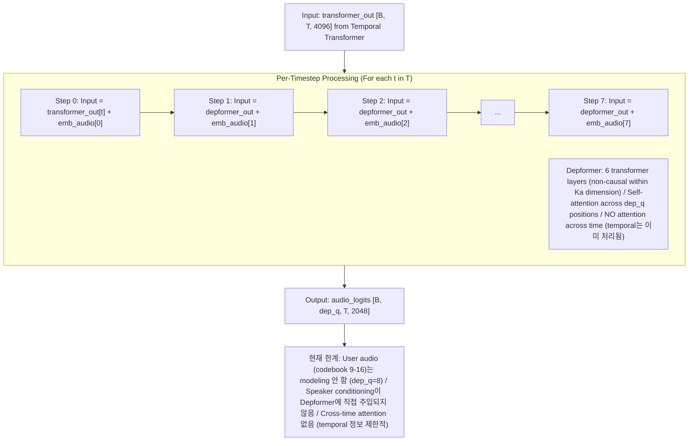

### 3.2 개선 방향 1: Speaker-Conditioned Depformer

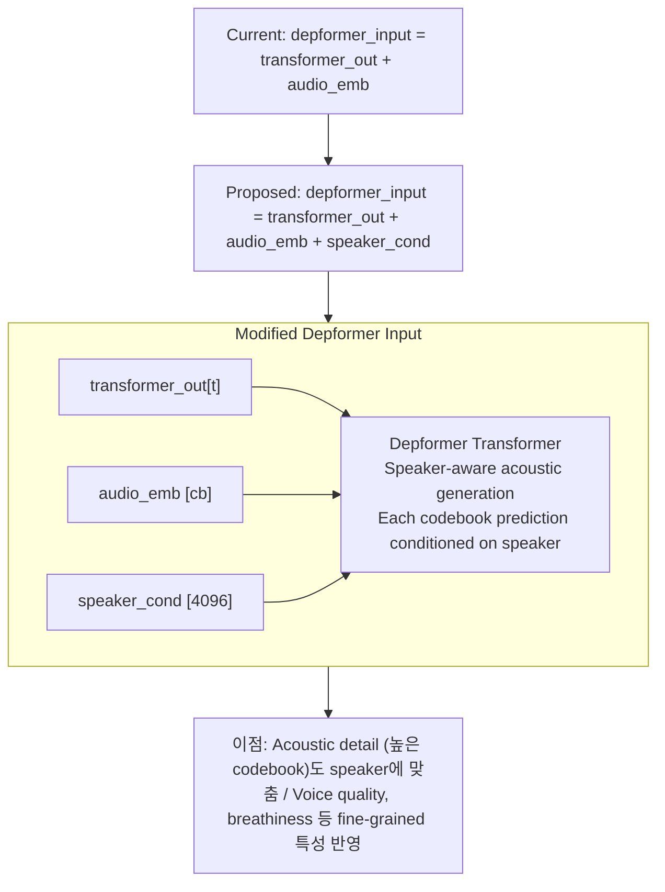

### 3.3 개선 방향 2: Cross-Time Attention in Depformer

```
┌─────────────────────────────────────────────────────────────────────────────┐
│              PROPOSED: TEMPORAL-AWARE DEPTH TRANSFORMER                      │
├─────────────────────────────────────────────────────────────────────────────┤
│                                                                             │
│  Current:  Each timestep processed independently                            │
│            depformer(t) doesn't see depformer(t-1, t-2, ...)               │
│                                                                             │
│  Proposed: Limited temporal context in Depformer                            │
│                                                                             │
│  ┌─────────────────────────────────────────────────────────────────────┐   │
│  │                    Cross-Time Depformer                              │   │
│  │                                                                      │   │
│  │  Time:     t-2        t-1         t         t+1                     │   │
│  │            ↓          ↓          ↓          ↓                       │   │
│  │        ┌──────┐   ┌──────┐   ┌──────┐   ┌──────┐                    │   │
│  │  Ka=0  │ ○──○─┼───┼──○──○┼───┼──●──○┼───┼──○   │                    │   │
│  │  Ka=1  │ ○──○─┼───┼──○──○┼───┼──●──○┼───┼──○   │                    │   │
│  │  Ka=2  │ ○──○─┼───┼──○──○┼───┼──●──○┼───┼──○   │                    │   │
│  │   ...  │ ...  │   │ ...  │   │ ...  │   │ ...  │                    │   │
│  │  Ka=7  │ ○──○─┼───┼──○──○┼───┼──●──○┼───┼──○   │                    │   │
│  │        └──────┘   └──────┘   └──────┘   └──────┘                    │   │
│  │                                                                      │   │
│  │  ● = Current prediction                                             │   │
│  │  ○ = Context (attended via cross-time attention)                    │   │
│  │  ─ = Attention connections                                          │   │
│  └─────────────────────────────────────────────────────────────────────┘   │
│                                                                             │
│  이점:                                                                      │
│  • 시간적 연속성 개선 (smoother transitions)                               │
│  • Prosody patterns 더 잘 캡처                                             │
│                                                                             │
│  구현 고려사항:                                                             │
│  • Window size 제한 (e.g., ±2 frames)                                      │
│  • Causal constraint 유지 필요                                             │
│  • 메모리/계산 비용 증가                                                    │
└─────────────────────────────────────────────────────────────────────────────┘
```

### 3.4 개선 방향 3: Adaptive Codebook Weighting

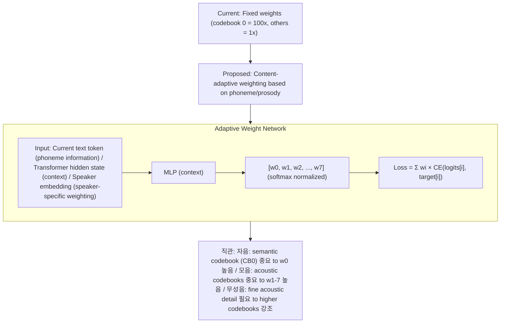

### 3.5 Future Work Roadmap

| Phase | Task | Priority | Complexity |
|-------|------|----------|------------|
| 3.1 | Speaker-Conditioned Depformer | High | Medium |
| 3.2 | Cross-Time Attention (limited window) | Medium | High |
| 3.3 | Adaptive Codebook Weighting | Low | Medium |
| 3.4 | User Audio Modeling (dep_q=16) | Medium | High |
| 3.5 | Multi-Scale Depformer | Research | Very High |

---

## 4. K-Moshi 아키텍처 다이어그램

### 4.1 전체 시스템 아키텍처 (현재 구현)

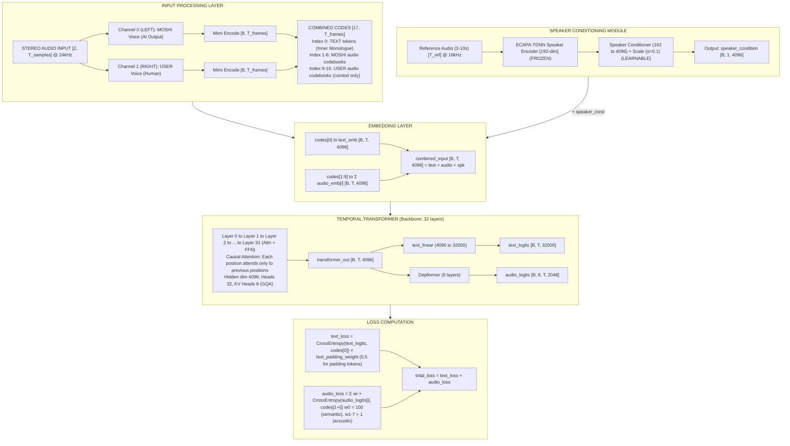

### 4.2 Training Data Flow

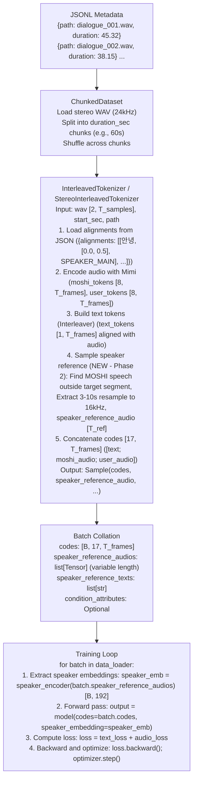

### 4.3 Inference Pipeline (Future)

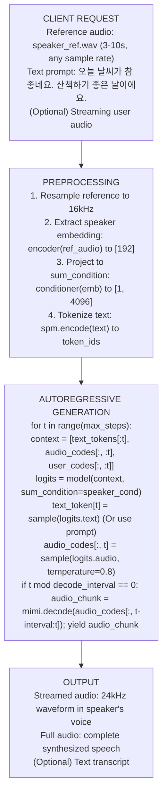

---

## 5. 개발 히스토리 및 현재 상태

### 5.1 버전 히스토리

| Version | Date | Description |
|---------|------|-------------|
| V1 | 2026-01-10 | MONOLOGUE mode (9 codebooks) |
| V2 | 2026-01-12 | USER-STREAM mode (17 codebooks, dep_q=16) - deprecated |
| V3 | 2026-01-15 | FULL-DUPLEX mode (17 codebooks, dep_q=8) |
| **V4** | 2026-01-18 | **Modular Backbone + Custom Tokenizer** |
| **V4.1** | 2026-01-21 | **Zero-Shot Speaker Conditioning (Phase 1+2)** |

### 5.2 Phase 1: Speaker Encoder Integration (COMPLETED)

**Created Files:**
- `finetune/modules/__init__.py` (~30 lines)
- `finetune/modules/speaker_encoder.py` (~280 lines)
- `finetune/modules/speaker_conditioner.py` (~350 lines)
- `tests/__init__.py` (~2 lines)
- `tests/test_speaker_conditioning.py` (~350 lines)

**Modified Files:**
- `finetune/backbone/lm_model_wrapper.py` (+80 lines)
- `finetune/args.py` (+170 lines)

**Key Features:**
- ECAPA-TDNN speaker encoder (pretrained, frozen)
- Speaker conditioner with learnable projection and scale
- Integration via `sum_condition` mechanism in forward()

### 5.3 Phase 2: Reference Sampling Pipeline (COMPLETED)

**Modified Files:**
- `finetune/data/interleaver.py` (+350 lines)
  - Extended Sample/Batch classes
  - Added `_sample_speaker_reference()` method
  - Updated `get_interleaved_tokenizer()` factory
- `train.py` (+80 lines)
  - Speaker encoder/conditioner initialization
  - Training loop integration

**Key Features:**
- Automatic reference sampling from MOSHI channel
- Avoids target segment overlap
- Resampling 24kHz → 16kHz
- Configurable duration (3-10 seconds)

### 5.4 Current Configuration Example

```yaml
# example/korean_speaker_conditioning.yaml

# Speaker Conditioning (Phase 1+2)
speaker:
  enabled: true
  method: "encoder"  # "encoder" or "audio_prompt" (future)

  encoder:
    encoder_type: "ecapa_tdnn"
    pretrained_path: "speechbrain/spkrec-ecapa-voxceleb"
    freeze: true
    output_dim: 192
    sample_rate: 16000
    normalize_embedding: true

  conditioner:
    output_dim: 4096
    initial_scale: 0.1
    use_layernorm: true
    dropout: 0.0
    learnable_scale: true
    scale_mode: "multiply"

  reference_sampler:
    min_duration_sec: 3.0
    max_duration_sec: 10.0
    sample_rate: 24000
    target_sample_rate: 16000

# Korean Configuration
korean:
  enable_user_stream: false
  full_duplex_input: true

# Training
batch_size: 4
duration_sec: 60
max_steps: 10000
```

### 5.5 File Structure Summary

```
moshi-korean-finetune/
├── finetune/
│   ├── backbone/
│   │   └── lm_model_wrapper.py    # ✅ Speaker conditioning integrated
│   ├── data/
│   │   ├── interleaver.py         # ✅ Reference sampling added
│   │   └── dataset.py
│   ├── modules/                   # ✅ NEW: Speaker conditioning modules
│   │   ├── __init__.py
│   │   ├── speaker_encoder.py
│   │   └── speaker_conditioner.py
│   └── args.py                    # ✅ Speaker conditioning args added
├── tests/
│   ├── __init__.py                # ✅ NEW
│   └── test_speaker_conditioning.py  # ✅ NEW
├── train.py                       # ✅ Speaker conditioning integrated
├── docs/
│   ├── SPEAKER_CONDITIONING_IMPLEMENTATION_LOG.md  # ✅ NEW
│   ├── K-MOSHI_SPEAKER_CONDITIONING_THEORY.md      # ✅ NEW (this file)
│   └── ...
└── example/
    └── korean_speaker_conditioning.yaml  # ✅ To be created
```

### 5.6 총 코드 변경량

| Category | Lines Added |
|----------|-------------|
| Phase 1: Speaker Modules | ~1,280 |
| Phase 2: Data Pipeline | ~550 |
| Documentation | ~800 |
| **Total** | **~2,630** |

### 5.7 Next Steps

1. **Integration Testing**: End-to-end test with speaker conditioning
2. **Phase 3**: VALL-E style audio prompt method
3. **Phase 4**: Training experiments with different configurations
4. **Phase 5**: Rust server integration for inference

---

## 참고 문헌

1. **Moshi Paper**: [arXiv:2410.00037](https://arxiv.org/abs/2410.00037)
2. **J-Moshi Paper**: [arXiv:2506.02979](https://arxiv.org/abs/2506.02979)
3. **ECAPA-TDNN**: [arXiv:2005.07143](https://arxiv.org/abs/2005.07143)
4. **VALL-E**: [arXiv:2301.02111](https://arxiv.org/abs/2301.02111)

---

*Document Version: 1.0*
*Created: 2026-01-21*
*Author: K-Moshi Development Team*
