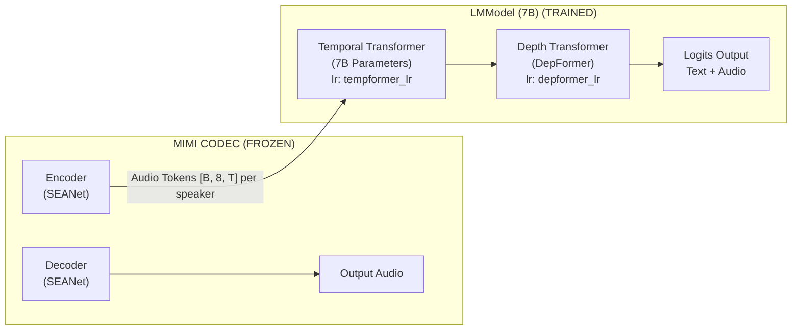
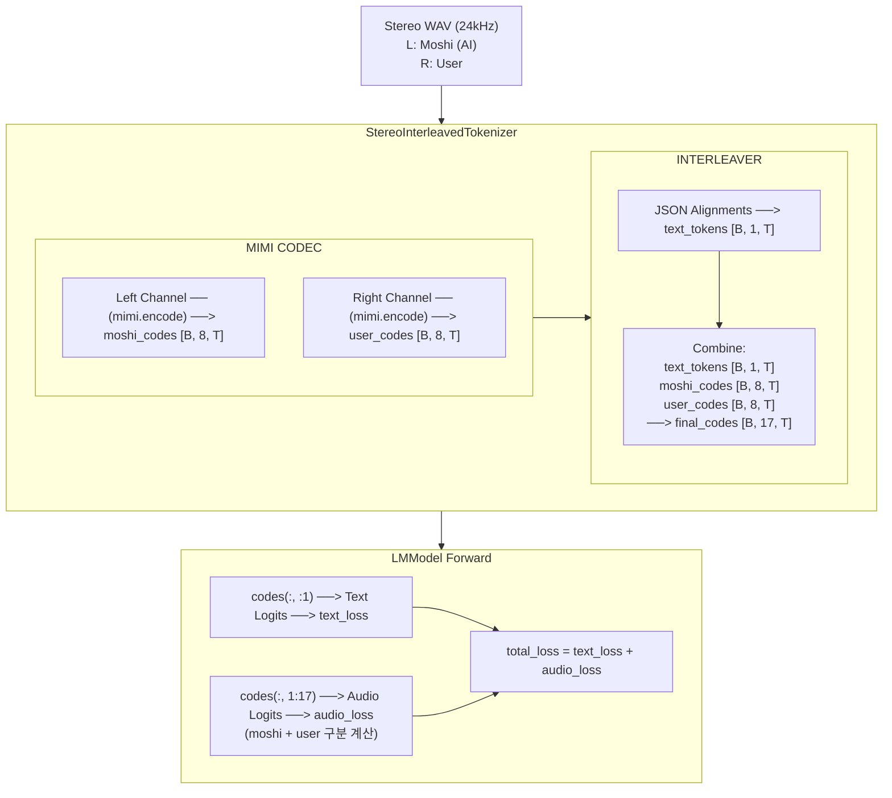
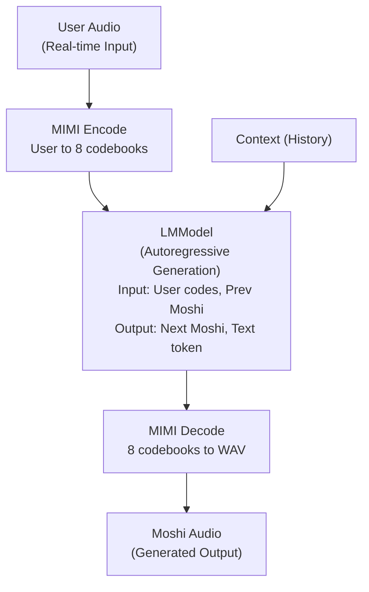
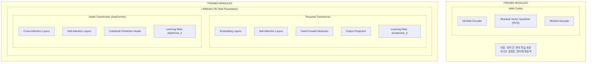
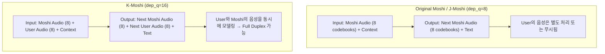

# K-Moshi 아키텍처 상세 분석

*Last Updated: 2025-12-30*

## 목차
1. [개요](#1-개요)
2. [모델 구조](#2-모델-구조)
3. [17-Stream 아키텍처](#3-17-stream-아키텍처)
4. [Full Duplex 입출력 흐름](#4-full-duplex-입출력-흐름)
5. [학습 모듈 분석](#5-학습-모듈-분석)
6. [Two-Rate Optimizer](#6-two-rate-optimizer)
7. [손실 함수 구조](#7-손실-함수-구조)
8. [Moshi/J-Moshi 비교](#8-moshij-moshi-비교)

---

## 1. 개요

K-Moshi는 한국어 Full Duplex 음성 대화 모델로, 원본 Moshi 아키텍처를 기반으로 **사용자 음성 스트림**을 추가하여 양방향 실시간 대화를 지원합니다.

### 핵심 특징

| 특성 | K-Moshi | Original Moshi | J-Moshi |
|------|---------|----------------|---------|
| **dep_q** | 16 | 8 | 8 |
| **Total Streams** | 17 | 9 | 9 |
| **User Stream** | ✅ 지원 | ❌ | ❌ |
| **대화 모드** | Full Duplex | Half Duplex | Half Duplex |
| **학습 대상** | TempFormer + DepFormer | 전체 LM | TempFormer + DepFormer |

---

## 2. 모델 구조

### 2.1 전체 아키텍처



### 2.2 컴포넌트별 상세

#### A. MIMI Codec (Frozen)
```python
# train.py:316-318
mimi = checkpoint_info.get_mimi(device="cuda")
mimi.eval()
for p in mimi.parameters():
    p.requires_grad = False  # 완전 동결
```

- **역할**: 오디오 ↔ 토큰 변환
- **학습 여부**: ❌ **FROZEN** (언어 간 전이 학습 보존)
- **구성**: SEANet Encoder + RVQ + SEANet Decoder
- **출력**: 8개 코드북, 12.5Hz (80ms/frame)

#### B. LMModel - Temporal Transformer (Trained)
```python
# wrapped_model.py:478-490
def _set_requires_grad(model: torch.nn.Module, args: TrainArgs):
    if args.lora.enable and not args.full_finetuning:
        # LoRA 모드
        for name, param in model.named_parameters():
            if "lora_" not in name:
                param.requires_grad = False
    else:
        # Full Finetuning 모드: 전체 파라미터 학습
        for param in model.parameters():
            param.requires_grad = True
```

- **역할**: 시간축 시퀀스 모델링 (텍스트 + 오디오 통합)
- **파라미터**: ~7B
- **학습률**: `tempformer_lr` (default: 3e-5)
- **학습 여부**: ✅ **TRAINED**

#### C. LMModel - Depth Transformer (Trained)
- **역할**: 코드북 간 의존성 모델링
- **학습률**: `depformer_lr` (별도 설정 가능)
- **학습 여부**: ✅ **TRAINED**
- **특징**: "depformer" 이름 포함 파라미터 자동 분리

---

## 3. 17-Stream 아키텍처

### 3.1 스트림 구성

```
┌─────────────────────────────────────────────────────────────────────────────┐
│                        17-STREAM TOKEN STRUCTURE                            │
├─────────────────────────────────────────────────────────────────────────────┤
│                                                                              │
│  Index │ Stream Type      │ Content              │ Weight   │ Speaker       │
│  ──────┼──────────────────┼──────────────────────┼──────────┼───────────────│
│    0   │ Text Stream      │ Inner Monologue      │ 1.0      │ MOSHI (AI)    │
│  ──────┼──────────────────┼──────────────────────┼──────────┼───────────────│
│    1   │ Audio Codebook 0 │ Moshi Semantic       │ 100.0    │ MOSHI (AI)    │
│    2   │ Audio Codebook 1 │ Moshi Acoustic       │ 1.0      │ MOSHI (AI)    │
│    3   │ Audio Codebook 2 │ Moshi Acoustic       │ 1.0      │ MOSHI (AI)    │
│    4   │ Audio Codebook 3 │ Moshi Acoustic       │ 1.0      │ MOSHI (AI)    │
│    5   │ Audio Codebook 4 │ Moshi Acoustic       │ 1.0      │ MOSHI (AI)    │
│    6   │ Audio Codebook 5 │ Moshi Acoustic       │ 1.0      │ MOSHI (AI)    │
│    7   │ Audio Codebook 6 │ Moshi Acoustic       │ 1.0      │ MOSHI (AI)    │
│    8   │ Audio Codebook 7 │ Moshi Acoustic       │ 1.0      │ MOSHI (AI)    │
│  ──────┼──────────────────┼──────────────────────┼──────────┼───────────────│
│    9   │ Audio Codebook 8 │ User Semantic        │ varies   │ USER          │
│   10   │ Audio Codebook 9 │ User Acoustic        │ varies   │ USER          │
│   11   │ Audio Codebook 10│ User Acoustic        │ varies   │ USER          │
│   12   │ Audio Codebook 11│ User Acoustic        │ varies   │ USER          │
│   13   │ Audio Codebook 12│ User Acoustic        │ varies   │ USER          │
│   14   │ Audio Codebook 13│ User Acoustic        │ varies   │ USER          │
│   15   │ Audio Codebook 14│ User Acoustic        │ varies   │ USER          │
│   16   │ Audio Codebook 15│ User Acoustic        │ varies   │ USER          │
│                                                                              │
└─────────────────────────────────────────────────────────────────────────────┘

dep_q = 16 (총 오디오 코드북 수: Moshi 8 + User 8)
num_codebooks = 17 (1 text + 16 audio)
```

### 3.2 스트림별 가중치 설정

```yaml
# korean_v2_fsdp.yaml
first_codebook_weight_multiplier: 100.0  # Semantic 토큰 강조
text_padding_weight: 0.5                  # PAD 토큰 가중치 감소

# User stream 가중치 (korean 섹션)
korean:
  enable_user_stream: true
  user_semantic_weight: 10.0              # User semantic 가중치
  user_acoustic_weight: 0.1               # User acoustic 가중치
```

### 3.3 시간축 예시

```
                    시간 축 (12.5Hz = 80ms/frame)
                    ─────────────────────────────────────────►
                    t=0    t=1    t=2    t=3    t=4    t=5    t=6

┌─────────────────────────────────────────────────────────────────────────────┐
│ [0] Text          │ [안]  │ [녕]  │ [PAD] │ [EOP] │ [하]  │ [세]  │ [요]  │
│     (Moshi)       │       │       │       │       │       │       │       │
├───────────────────┼───────┼───────┼───────┼───────┼───────┼───────┼───────┤
│ [1] Audio CB0     │ C0_0  │ C0_1  │ C0_2  │ C0_3  │ C0_4  │ C0_5  │ C0_6  │
│     Moshi Semantic│       │       │       │       │       │       │       │
├───────────────────┼───────┼───────┼───────┼───────┼───────┼───────┼───────┤
│ [2-8] Audio CB1-7 │  ...  │  ...  │  ...  │  ...  │  ...  │  ...  │  ...  │
│     Moshi Acoustic│       │       │       │       │       │       │       │
├───────────────────┼───────┼───────┼───────┼───────┼───────┼───────┼───────┤
│ [9] Audio CB8     │ C8_0  │ C8_1  │ C8_2  │ C8_3  │ C8_4  │ C8_5  │ C8_6  │
│     User Semantic │       │       │       │       │       │       │       │
├───────────────────┼───────┼───────┼───────┼───────┼───────┼───────┼───────┤
│ [10-16] Audio 9-15│  ...  │  ...  │  ...  │  ...  │  ...  │  ...  │  ...  │
│     User Acoustic │       │       │       │       │       │       │       │
└───────────────────┴───────┴───────┴───────┴───────┴───────┴───────┴───────┘

특수 토큰:
  [PAD] = text_padding_token_id (무음 구간 패딩)
  [EOP] = end_of_text_padding_id (단어 시작 직전)
  zero_token_id = 오디오 무음 표시 (-1)
```

---

## 4. Full Duplex 입출력 흐름

### 4.1 학습 시 데이터 흐름



### 4.2 추론 시 데이터 흐름 (예상)



---

## 5. 학습 모듈 분석

### 5.1 Frozen vs Trained 요약



### 5.2 Full Finetuning 코드 경로

```python
# 1. 모델 로드 (wrapped_model.py)
model = loaders.LMModel(config)
model = model.to(dtype=torch.bfloat16, device="cuda")

# 2. FSDP 래핑
model = FSDP(model, ...)

# 3. requires_grad 설정 (wrapped_model.py:478-490)
if args.full_finetuning:
    for param in model.parameters():
        param.requires_grad = True  # 모든 LM 파라미터 학습

# 4. MIMI는 별도로 동결 (train.py:316-318)
mimi.eval()
for p in mimi.parameters():
    p.requires_grad = False
```

---

## 6. Two-Rate Optimizer

### 6.1 구현 원리

```python
# scheduler.py:171-243

def get_two_rate_optimizer(
    model: torch.nn.Module,
    tempformer_lr: float,
    depformer_lr: float,
    ...
) -> torch.optim.AdamW:

    tempformer_params = []
    depformer_params = []

    for name, param in model.named_parameters():
        if not param.requires_grad:
            continue

        # "depformer" 키워드로 파라미터 그룹 분리
        if "depformer" in name.lower():
            depformer_params.append(param)
        else:
            tempformer_params.append(param)

    param_groups = [
        {"params": tempformer_params, "lr": tempformer_lr, "name": "tempformer"},
        {"params": depformer_params, "lr": depformer_lr, "name": "depformer"},
    ]

    return torch.optim.AdamW(param_groups, ...)
```

### 6.2 활성화 조건

```python
# train.py:713-716

use_two_rate = (
    args.optim.depformer_lr is not None
    and args.optim.depformer_lr != args.optim.lr  # 다른 값이어야 활성화!
)

if use_two_rate:
    optimizer = get_two_rate_optimizer(model, args.optim.lr, args.optim.depformer_lr)
else:
    optimizer = torch.optim.AdamW(model.parameters(), lr=args.optim.lr)
```

### 6.3 TensorBoard 로깅

```python
# metrics_logger.py:112-122

if isinstance(lr, dict):
    metrics["lr"] = lr.get("tempformer", lr.get("lr", 0.0))
    if "tempformer" in lr:
        metrics["lr_tempformer"] = lr["tempformer"]
    if "depformer" in lr:
        metrics["lr_depformer"] = lr["depformer"]
```

**주의**: YAML에서 `lr`과 `depformer_lr`이 동일한 값이면 Two-Rate 모드가 **비활성화**됨

```yaml
# 비활성화 예시 (같은 값)
optim:
  lr: 3.0e-5
  depformer_lr: 3.0e-5  # ❌ Two-rate 비활성화

# 활성화 예시 (다른 값)
optim:
  lr: 2.0e-6            # TempFormer LR
  depformer_lr: 4.0e-6  # DepFormer LR (✅ Two-rate 활성화)
```

---

## 7. 손실 함수 구조

### 7.1 J-Moshi 스타일 토큰 카운트 정규화

```python
# loss.py:270-320 (간략화)

def compute_audio_loss_per_speaker(
    logits: torch.Tensor,      # [B, dep_q, T, V]
    codes: torch.Tensor,       # [B, dep_q, T]
    mask: torch.Tensor,        # [B, T]
    dep_q: int = 16,
    semantic_weight: float = 100.0,
    acoustic_weight: float = 1.0,
    user_semantic_weight: float = 1.0,
    user_acoustic_weight: float = 1.0,
) -> AudioLossResult:

    # Moshi 스트림 (코드북 0-7)
    moshi_codes = codes[:, :8]
    moshi_logits = logits[:, :8]

    # User 스트림 (코드북 8-15)
    user_codes = codes[:, 8:16]
    user_logits = logits[:, 8:16]

    # Semantic vs Acoustic 가중치 적용
    # Codebook 0, 8 = Semantic (높은 가중치)
    # Codebook 1-7, 9-15 = Acoustic (낮은 가중치)

    moshi_loss = compute_weighted_loss(moshi_logits, moshi_codes, semantic_weight, acoustic_weight)
    user_loss = compute_weighted_loss(user_logits, user_codes, user_semantic_weight, user_acoustic_weight)

    return AudioLossResult(
        total_loss=moshi_loss + user_loss,
        moshi_total_loss=moshi_loss,
        user_total_loss=user_loss,
        ...
    )
```

### 7.2 손실 가중치 구조

```
┌─────────────────────────────────────────────────────────────────────────────┐
│                         LOSS WEIGHT STRUCTURE                                │
├─────────────────────────────────────────────────────────────────────────────┤
│                                                                              │
│  Text Stream (Index 0):                                                      │
│    ├── Regular tokens: weight = 1.0                                          │
│    └── PAD tokens: weight = text_padding_weight (0.5)                        │
│                                                                              │
│  Moshi Audio (Index 1-8):                                                    │
│    ├── Codebook 0 (Semantic): weight = first_codebook_weight (100.0)         │
│    └── Codebook 1-7 (Acoustic): weight = 1.0                                 │
│                                                                              │
│  User Audio (Index 9-16):                                                    │
│    ├── Codebook 8 (Semantic): weight = user_semantic_weight (10.0)           │
│    └── Codebook 9-15 (Acoustic): weight = user_acoustic_weight (0.1)         │
│                                                                              │
│  Total Loss = text_loss + moshi_audio_loss + user_audio_loss                 │
│                                                                              │
└─────────────────────────────────────────────────────────────────────────────┘
```

---

## 8. Moshi/J-Moshi 비교

### 8.1 아키텍처 비교

| 항목 | Original Moshi | J-Moshi | K-Moshi |
|------|----------------|---------|---------|
| **기본 구조** | Helium (7B LM) | Helium 기반 | Helium 기반 |
| **dep_q** | 8 | 8 | **16** |
| **Total Streams** | 9 (1+8) | 9 (1+8) | **17 (1+16)** |
| **User Stream** | ❌ 없음 | ❌ 없음 | ✅ **있음** |
| **대화 모드** | Half Duplex | Half Duplex | **Full Duplex** |
| **훈련 데이터** | 스테레오 (분리됨) | 모노/합성 | 스테레오 |

### 8.2 dep_q 차이의 의미



### 8.3 학습 방식 비교

| 항목 | Original Moshi | J-Moshi | K-Moshi |
|------|----------------|---------|---------|
| **프레임워크** | Custom | Custom (ours) | moshi-finetune |
| **분산 학습** | - | FSDP | **FSDP** |
| **옵티마이저** | AdamW | AdamW | **Two-Rate AdamW** |
| **스케줄러** | - | CosineWarmup | **CosineWarmup** |
| **손실 정규화** | Mean | Token-count | **Token-count** |
| **LoRA 지원** | ❌ | ❌ | ✅ |

### 8.4 J-Moshi가 dep_q=8인 이유 (분석)

J-Moshi는 다음과 같은 이유로 dep_q=8을 유지한 것으로 추정됩니다:

1. **원본 Moshi 호환성**: 기존 moshi 체크포인트를 그대로 로드하기 위해 구조 변경 최소화
2. **모노로그 학습 방식**: 대화 시뮬레이션 없이 AI 발화만 학습
3. **계산 효율성**: 16 codebook 대비 메모리/연산 절반
4. **단순화된 목표**: 일본어 TTS 품질에 집중 (Full Duplex 대화 불필요)

K-Moshi는 이와 달리:
1. **Full Duplex 목표**: 실시간 양방향 대화 지원 필수
2. **스테레오 데이터 활용**: L/R 채널 동시 학습
3. **Depth Transformer 확장**: 16개 코드북 처리 가능하도록 모델 확장

---

## 부록: 주요 파일 위치

| 기능 | 파일 | 핵심 라인 |
|------|------|-----------|
| MIMI 동결 | `train.py` | 316-318 |
| Full finetuning 설정 | `wrapped_model.py` | 478-490 |
| dep_q 확장 | `wrapped_model.py` | 동적 확장 로직 |
| Two-rate optimizer | `scheduler.py` | 171-243 |
| 손실 함수 | `loss.py` | 270-487 |
| TensorBoard 로깅 | `monitoring/metrics_logger.py` | 112-122 |
| 17-stream 토크나이저 | `data/interleaver.py` | StereoInterleavedTokenizer |

---

## 9. J-Moshi dep_q=8 분석 (왜 User Stream이 없는가?)

### 9.1 J-Moshi 코드 구조 분석

J-Moshi 저장소를 분석한 결과, **User Stream 지원 코드가 존재하지만 기본적으로 비활성화**되어 있습니다.

#### A. 데이터 준비 (17 streams 준비됨)

```python
# j-moshi-finetune/utils/data.py:8-29
def main_speaker_streams(batched_examples, speakers):
    for speaker in speakers:
        other = {"A": "B", "B": "A"}[speaker]
        for main_example, other_example in zip(...):
            streams = np.concat([
                np.array(main_example),      # 1 text + 8 audio = 9 streams
                np.array(other_example)[1:], # 8 audio (other speaker)
            ], axis=0)
            # 총 17 streams 생성!
```

→ **데이터는 17 streams로 준비되지만, 모델이 어떻게 사용할지는 별개**

#### B. 모델 초기화 (dep_q 선택)

```python
# j-moshi-finetune/tools/init_moshi_for_ft.py:55-63
if args.extend_modules_for_user_stream:
    print("Extending the depth transformer's modules for user stream...")
    moshi_lm_kwargs.update({
        "dep_q": 16,          # 8(moshi) + 8(user)
        "depformer_context": 16,
    })
    moshi_lm = extend_moshi_modules_for_user_stream(moshi_lm)
```

**핵심**: `--extend_modules_for_user_stream` 플래그가 **기본적으로 비활성화** (`action="store_true"`)

#### C. 학습 시 User Stream 선택

```python
# j-moshi-finetune/finetune.py:93-96
parser.add_argument(
    "--model_user_stream",
    action="store_true",  # 기본값: False
    help="Whether to train the user's audio stream",
)

# finetune.py:457-460
if model_user_stream:
    audio_labels = batch.labels[:, 1:, 1:]      # 모든 오디오 (1-16)
else:
    audio_labels = batch.labels[:, 1:9, 1:]     # Moshi 오디오만 (1-8)
```

### 9.2 J-Moshi가 dep_q=8을 선택한 이유

```
┌─────────────────────────────────────────────────────────────────────────────┐
│                  J-Moshi 설계 선택 분석                                      │
├─────────────────────────────────────────────────────────────────────────────┤
│                                                                              │
│  1. 🎯 프로젝트 목표의 차이                                                   │
│  ┌─────────────────────────────────────────────────────────────────────────┐ │
│  │  J-Moshi 목표: 일본어 음성 합성(TTS) 품질 향상                           │ │
│  │  K-Moshi 목표: 한국어 Full Duplex 실시간 대화 지원                       │ │
│  │                                                                         │ │
│  │  → J-Moshi는 AI 발화만 잘하면 됨 (Half Duplex)                          │ │
│  │  → K-Moshi는 동시 대화가 필요 (Full Duplex)                             │ │
│  └─────────────────────────────────────────────────────────────────────────┘ │
│                                                                              │
│  2. 🔄 원본 체크포인트 호환성                                                 │
│  ┌─────────────────────────────────────────────────────────────────────────┐ │
│  │  dep_q=8 유지 시:                                                       │ │
│  │  ✅ 원본 Moshi 체크포인트 직접 로드 가능                                 │ │
│  │  ✅ 추론 시 원본 moshi.server 사용 가능                                  │ │
│  │  ✅ 메모리 사용량 절반                                                   │ │
│  │                                                                         │ │
│  │  dep_q=16 확장 시:                                                      │ │
│  │  ❌ DepFormer 모듈 2배 확장 필요                                        │ │
│  │  ❌ 별도 추론 코드 작성 필요                                             │ │
│  │  ❌ 메모리/연산량 증가                                                   │ │
│  └─────────────────────────────────────────────────────────────────────────┘ │
│                                                                              │
│  3. 📊 계산 효율성                                                           │
│  ┌─────────────────────────────────────────────────────────────────────────┐ │
│  │  dep_q=8  → DepFormer 출력: 8개 코드북 예측                              │ │
│  │  dep_q=16 → DepFormer 출력: 16개 코드북 예측 (2배 연산)                  │ │
│  │                                                                         │ │
│  │  J-Moshi 입장:                                                          │ │
│  │  "User 음성 예측이 필요 없다면, 왜 2배 연산을 하는가?"                    │ │
│  └─────────────────────────────────────────────────────────────────────────┘ │
│                                                                              │
│  4. 🎓 학습 단순화                                                           │
│  ┌─────────────────────────────────────────────────────────────────────────┐ │
│  │  dep_q=8:                                                               │ │
│  │  - Loss 계산: Moshi 음성 + 텍스트만                                     │ │
│  │  - 단순한 손실 함수                                                     │ │
│  │                                                                         │ │
│  │  dep_q=16:                                                              │ │
│  │  - Loss 계산: Moshi + User 음성 + 텍스트                                │ │
│  │  - User 가중치 튜닝 필요 (user_semantic_weight, user_acoustic_weight)   │ │
│  │  - 학습 복잡도 증가                                                     │ │
│  └─────────────────────────────────────────────────────────────────────────┘ │
│                                                                              │
└─────────────────────────────────────────────────────────────────────────────┘
```

### 9.3 J-Moshi의 DepFormer 확장 메커니즘

J-Moshi도 user stream 지원을 위한 확장 코드가 구현되어 있습니다:

```python
# j-moshi-finetune/models/utils.py:8-56
def extend_moshi_modules_for_user_stream(lm: LMModel) -> LMModel:
    """
    Extend the depth transformer's modules to model user stream.
    1. depformer_in * 2
    2. depformer_emb * 2 + 1
    3. depformer (layers)
        3.1 self_attn.in_proj_weight * 2
        3.2 self_attn.out_proj * 2
        3.3 gating * 2
    4. linears * 2
    """
    lm_us = deepcopy(lm)

    # 1. depformer_in 확장
    lm_us.depformer_in.extend(deepcopy(lm.depformer_in))

    # 2. depformer_emb 확장 (8 → 16 + 1)
    lm_us.depformer_emb.append(deepcopy(lm.depformer_emb[0]))
    lm_us.depformer_emb.extend(deepcopy(lm.depformer_emb))

    # 3. depformer layers 확장
    for layer in lm_us.depformer.layers:
        layer.self_attn.in_proj_weight.data = \
            layer.self_attn.in_proj_weight.data.repeat(2, 1)
        layer.self_attn.out_proj = expand_linear(layer.self_attn.out_proj, 2)
        layer.gating.extend(deepcopy(layer.gating))

    # 4. linears 확장
    lm_us.linears.extend(deepcopy(lm_us.linears))

    return lm_us
```

### 9.4 K-Moshi vs J-Moshi 설계 결정 비교

| 항목 | J-Moshi | K-Moshi | 이유 |
|------|---------|---------|------|
| **dep_q 기본값** | 8 | 16 | 프로젝트 목표 차이 |
| **User Stream** | 선택적 (`--extend_modules_for_user_stream`) | 기본 활성화 (`enable_user_stream: true`) | Full Duplex 필요성 |
| **확장 방식** | 별도 스크립트로 모델 확장 후 저장 | wrapped_model.py에서 동적 확장 | 유연성 vs 편의성 |
| **데이터 형식** | 17 streams (A+B 분리) | 17 streams (L+R 스테레오) | 동일 개념, 다른 표현 |
| **손실 함수** | Moshi만 계산 (기본) | Moshi + User 동시 계산 | 학습 목표 차이 |

### 9.5 결론

```
┌─────────────────────────────────────────────────────────────────────────────┐
│                         핵심 결론                                            │
├─────────────────────────────────────────────────────────────────────────────┤
│                                                                              │
│  J-Moshi가 dep_q=8인 이유는 "기술적 한계"가 아닌 "의도적 설계 선택":          │
│                                                                              │
│  1. ✅ J-Moshi는 dep_q=16 확장 코드가 이미 구현되어 있음                      │
│  2. ✅ --extend_modules_for_user_stream 플래그로 활성화 가능                  │
│  3. ✅ --model_user_stream 플래그로 user audio 학습 가능                      │
│                                                                              │
│  하지만 기본적으로 비활성화한 이유:                                           │
│                                                                              │
│  1. 🎯 일본어 TTS가 주 목표 (Full Duplex 불필요)                             │
│  2. 🔄 원본 Moshi 호환성 유지                                                │
│  3. 📊 계산 효율성 (메모리/연산 절반)                                        │
│  4. 🎓 학습 단순화 (손실 함수 복잡도 감소)                                   │
│                                                                              │
│  K-Moshi는 Full Duplex 실시간 대화가 목표이므로:                              │
│  → 처음부터 dep_q=16, enable_user_stream=true로 설계                         │
│                                                                              │
└─────────────────────────────────────────────────────────────────────────────┘
```

---

*Document generated for K-Moshi Korean Finetuning Project*
