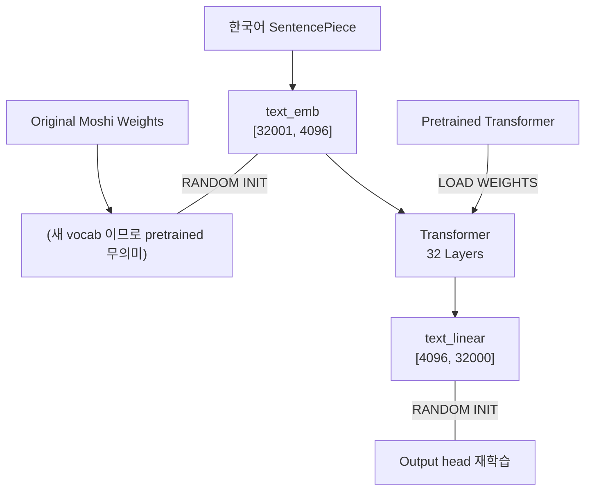

# K-Moshi Korean Tokenizer Integration Guide

## Document Purpose

이 문서는 K-Moshi 프로젝트에서 한국어 토크나이저를 통합하는 과정에서 탐구한 내용을 기록합니다.
추후 개발 시 참고 자료로 활용됩니다.

---

## 1. 토크나이저 옵션 검토 결과

### 1.1 검토된 옵션들

| 옵션 | 설명 | 결론 |
|------|------|------|
| **HFLM BBPE 변환** | a Hugging Face causal LM의 BBPE 토크나이저를 SentencePiece로 변환 | ❌ 불가능 |
| **신규 한국어 SentencePiece** | 한국어 코퍼스로 직접 학습한 SentencePiece | ✅ **채택** |
| **기존 Moshi 토크나이저** | 원본 `tokenizer_spm_32k_3.model` 유지 | ⚠️ 한국어 성능 제한 |

### 1.2 HFLM BBPE → SentencePiece 변환 실패 원인

```
┌─────────────────────────────────────────────────────────────────────────────┐
│                    BBPE vs SentencePiece 근본적 차이                         │
├─────────────────────────────────────────────────────────────────────────────┤
│                                                                              │
│  GPT-2 Style BBPE (HFLM)           SentencePiece BPE                      │
│  ─────────────────────────           ─────────────────                      │
│  bytes_to_unicode() 매핑 사용         직접 UTF-8 바이트 처리                 │
│  "안녕" → [Ġ, ì, ķ, ...]              "안녕" → [▁안녕] or [▁안, 녕]          │
│                                                                              │
│  ⚠️ 문제: bytes_to_unicode() 매핑이 SentencePiece에 존재하지 않음            │
│  ⚠️ 결과: 동일한 텍스트가 완전히 다른 토큰 시퀀스로 변환됨                    │
│                                                                              │
│  테스트 결과:                                                                │
│    "안녕하세요" → HF HFLM: [14532] (1 token)                               │
│    "안녕하세요" → Converted SP: [218, 282, ...] (15 tokens)                  │
│    매치율: 0%                                                                │
└─────────────────────────────────────────────────────────────────────────────┘
```

**변환 시도 스크립트**: `tools/convert_hf_lm_to_sentencepiece.py`

---

## 2. 채택된 솔루션: 한국어 SentencePiece Unigram

### 2.1 토크나이저 정보

```yaml
모델 경로 (Linux GPU Server):
  /path/to/workspace
  tokenizer_spe_unigram_v32000_max_500_pad_bos_eos/tokenizer.model

알고리즘: Unigram (SentencePiece)
Vocab Size: 32,000 (Moshi 기본값과 일치)
학습 데이터: 한국어 코퍼스
특수 토큰: <unk>, <s>, </s>, <pad>, <dummy1-5>, <eos>, 언어 토큰 등
```

### 2.2 Special Token ID 검증 결과

```python
# GPU 서버에서 검증 (2024-12-30)
import sentencepiece as spm
sp = spm.SentencePieceProcessor()
sp.load('tokenizer.model')

print(f"Vocab size: {sp.get_piece_size()}")  # 32000
print(f"bos_id: {sp.bos_id()}")  # 1 -> '<s>'
print(f"eos_id: {sp.eos_id()}")  # 2 -> '</s>'
print(f"pad_id: {sp.pad_id()}")  # 3 -> '<pad>'
print(f"unk_id: {sp.unk_id()}")  # 0 -> '<unk>'
```

### 2.3 Moshi 호환성 매트릭스

```
┌─────────────────────────────────────────────────────────────────────────────┐
│                    MOSHI COMPATIBILITY MATRIX (100% 호환)                    │
├─────────────────────────────────────────────────────────────────────────────┤
│                                                                              │
│  Moshi 요구사항                  한국어 토크나이저        상태               │
│  ─────────────────────────────   ──────────────────────   ────────────────  │
│  existing_text_padding_id = 3    <pad> = ID 3             ✅ 완벽 일치      │
│  existing_text_end_padding_id=0  <unk> = ID 0             ✅ 완벽 일치      │
│  bos_id() (SentencePiece API)    <s> = ID 1               ✅ 호환           │
│  eos_id() (SentencePiece API)    </s> = ID 2              ✅ 호환           │
│  text_card = 32,000              vocab_size = 32,000      ✅ 완벽 일치      │
│                                                                              │
│  결론: 코드 수정 없이 즉시 사용 가능                                         │
└─────────────────────────────────────────────────────────────────────────────┘
```

---

## 3. YAML 설정 가이드

### 3.1 최소 수정 사항

```yaml
# example/korean_v3_fsdp.yaml (또는 다른 config)

moshi_paths:
  hf_repo_id: null
  moshi_path: '/path/to/model'
  mimi_path: '/path/to/model'

  # 이 줄만 수정하면 됩니다!
  tokenizer_path: '/path/to/workspace'

  config_path: '/path/to/model'
```

### 3.2 수정 불필요 항목

다음 항목들은 한국어 토크나이저의 ID와 이미 일치하므로 수정 불필요:

```yaml
# config.json (moshi_7b_202409.json)
{
    "existing_text_padding_id": 3,  # <pad> ID와 일치 - 수정 불필요
    "text_card": 32000              # vocab size와 일치 - 수정 불필요
}
```

---

## 4. Full Finetuning 시 영향받는 Layer

### 4.1 Text 관련 Layer (vocab size 의존)

| Layer | Shape | Parameters | 학습 시 처리 |
|-------|-------|------------|-------------|
| `text_emb` | [32001, 4096] | 131.1M | 랜덤 초기화 → 학습 |
| `text_linear` | [4096, 32000] | 131.1M | 랜덤 초기화 → 학습 |
| `depformer_text_emb` | [32001, 1024] | 32.8M | 랜덤 초기화 → 학습 |
| **총 Text Params** | | **~295M** | 전체 7B의 ~4.2% |

### 4.2 학습 흐름



---

## 5. 향후 Vocab Size 변경 시

### 5.1 config.json 수정

```json
// configs/korean_config.json (새로 생성)
{
    "dim": 4096,
    "text_card": 64000,  // 새 vocab size로 변경
    "existing_text_padding_id": 3,
    // ... 나머지 동일
}
```

### 5.2 YAML에서 참조

```yaml
moshi_paths:
  config_path: './configs/korean_config.json'  # 새 config 참조
```

### 5.3 메모리 영향

| Vocab Size | 추가 메모리 (bf16) |
|------------|-------------------|
| 32,000 (기본) | 기준 |
| 64,000 | +590 MB |
| 100,000 | +1.36 GB |

---

## 6. 관련 파일 참조

| 파일 | 용도 |
|------|------|
| `tools/convert_hf_lm_to_sentencepiece.py` | BBPE→SP 변환 시도 (실패 기록) |
| `docs/BBPE_TO_SENTENCEPIECE_ANALYSIS.md` | BBPE vs SP 분석 문서 |
| `finetune/data/interleaver.py` | 토크나이저 사용처 |
| `serving/moshi/moshi/models/lm.py` | LMModel text 관련 layer |
| `serving/moshi/moshi/models/loaders.py` | 토크나이저 로딩 로직 |

---

## 7. Quick Reference

```bash
# 학습 시작 (tokenizer_path만 변경된 상태)
torchrun --nproc-per-node 8 -m train example/korean_v3_fsdp.yaml

# 토크나이저 검증
python -c "
import sentencepiece as spm
sp = spm.SentencePieceProcessor()
sp.load('/path/to/tokenizer.model')
print(f'vocab: {sp.get_piece_size()}, bos: {sp.bos_id()}, eos: {sp.eos_id()}, pad: {sp.pad_id()}, unk: {sp.unk_id()}')
"
```

---

*Document Created: 2024-12-31*
*Project: K-Moshi (Korean Moshi Finetuning)*
*Author: K-Moshi Development Team*
