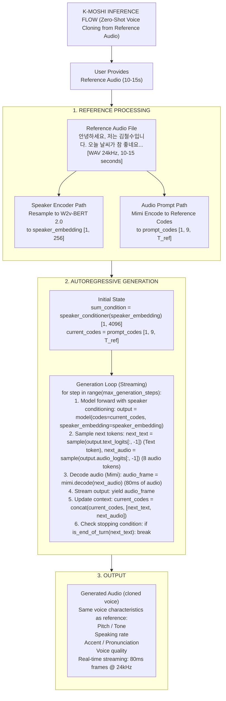
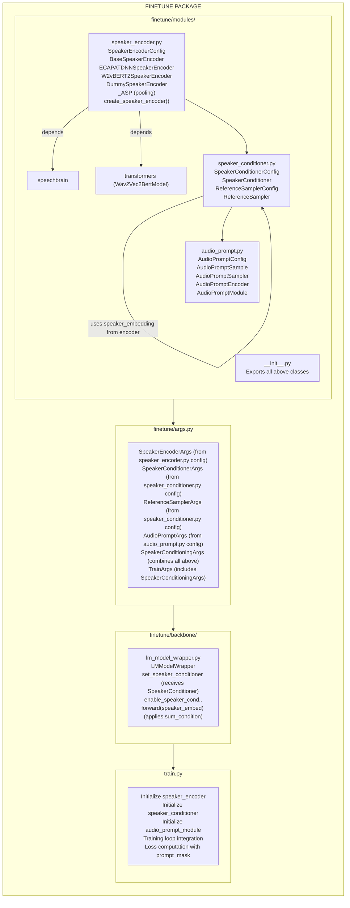

# K-Moshi Speaker Conditioning Architecture Diagrams

**작성일**: 2026-01-22
**버전**: 1.0

---

## 1. 전체 시스템 아키텍처

```mermaid
flowchart TD
    subgraph SYS["K-MOSHI SPEAKER CONDITIONING V2 (W2v-BERT 2.0 SV + VALL-E Style Audio/Text Prompting)"]
        direction TB
        subgraph INPUT["INPUT PROCESSING"]
            direction TB
            TD["Training Data (Korean Dialogue)"]
            WAV["Stereo WAV (24kHz)<br/>Left: SPEAKER_MAIN<br/>Right: SPEAKER_USER"]
            JSON["JSONL + Alignment JSON<br/>path: dialogue.wav, duration: 45.32<br/>alignments: [[안녕, [0.0, 0.5], SPEAKER_MAIN], ...]"]
            TD --> WAV
            TD --> JSON
            subgraph TOK["InterleavedTokenizer"]
                direction TB
                MIMI["Mimi Encoder<br/>24kHz to Codes<br/>8 codebooks"]
                SP["SentencePiece (32K)<br/>Korean Tokenizer"]
                ILV["Interleaver<br/>Text-Audio Alignment @ 12.5Hz"]
                CODES1["codes tensor: [B, 9, T] (1 text + 8 audio)"]
                MIMI --> CODES1
                SP --> CODES1
                ILV --> CODES1
            end
            WAV --> TOK
            JSON --> TOK
        end

        subgraph SCM["SPEAKER CONDITIONING MODULE"]
            direction TB
            CODESIN["codes: [B, 9, T]"]
            subgraph RSS["Reference Segment Sampling"]
                direction TB
                FULL["Full Sequence (0 to T)"]
                EXC["Exclude Region (Training Segment)<br/>exclude_start to exclude_end"]
                VALID["Valid Sampling Regions:<br/>Region 1, Region 2"]
                SAMP["Sampled Reference (10-15초, random)<br/>reference_segment (start_idx, end_idx)"]
                FULL --> EXC --> VALID --> SAMP
            end
            CODESIN --> RSS

            subgraph P1["PATH 1: Speaker Encoder (Global Condition)"]
                direction TB
                REFRAW["Reference Audio (Raw)<br/>Frame to Audio Sample 변환<br/>samples_per_frame = 1920"]
                RESAMP["Resample 24kHz to 16kHz<br/>(for Speaker Encoder)"]
                subgraph SVENC["W2v-BERT 2.0 SV Encoder"]
                    direction TB
                    BACK["w2v-BERT 2.0 Backbone (HuggingFace)"]
                    MFA["MFA (Multi-layer Feature Aggregation)<br/>25 layers to concat"]
                    ASP["ASP (Attentive Stats Pooling)<br/>weighted mean/std"]
                    BN["Bottleneck FC<br/>to 256-dim embedding"]
                    SE["speaker_embedding: [B, 256]"]
                    BACK --> MFA --> ASP --> BN --> SE
                end
                REFRAW --> RESAMP --> SVENC
                subgraph SCOND["Speaker Conditioner"]
                    direction TB
                    LIN["Linear(256 to 4096)<br/>+ LayerNorm (optional)<br/>+ Scale (learnable)"]
                    SUMC["sum_condition: [B, 4096]"]
                    LIN --> SUMC
                end
                SVENC --> SCOND
            end

            subgraph P2["PATH 2: Audio Prompt (VALL-E Style) (Local Condition)"]
                direction TB
                REFCODES["Reference Codes [9, T_ref]<br/>codes[:, start_idx:end_idx]"]
                PROMPTC["Prompt Codes (audio_text mode)<br/>Text: [안녕][하세요][PAD][오늘]...<br/>Audio: [C0][C1][C2]...[C7] x T_ref"]
                PREPEND["Prepend to Main Sequence<br/>prompted_codes: [B, 9, T_ref + T_main]<br/>PROMPT (T_ref, Loss 제외) | MAIN SEQUENCE (T_main, Loss 계산)<br/>prompt_mask: [B, T_ref + T_main]<br/>[True True ... True | False ... False]"]
                REFCODES --> PROMPTC --> PREPEND
            end
            RSS --> P1
            RSS --> P2
            JOIN["merge to Temporal Transformer"]
            P1 --> JOIN
            P2 --> JOIN
        end
        INPUT --> SCM

        subgraph TT["TEMPORAL TRANSFORMER"]
            direction TB
            INP["Inputs:<br/>prompted_codes: [B, 9, T_ref + T_main] (Audio Prompt 적용됨)<br/>sum_condition: [B, 4096] (Speaker Embedding 투영됨)"]
            subgraph MOSHI["Moshi 7B Temporal Transformer"]
                direction TB
                EMB["Embedding Layer<br/>Text Embed (32K vocab) + Audio Embed (8 codebooks, 2048 vocab each)<br/>combined_embed: [B, T, 4096]"]
                INJ["Speaker Conditioning Injection Point<br/>hidden_states = combined_embed + sum_condition.unsqueeze(1)<br/>Global Speaker Identity broadcasted to all timesteps"]
                LAYERS["32 Transformer Layers<br/>for layer in transformer_layers:<br/>hidden = layer.attention(hidden) (Prompt to Main cross-attention 가능)<br/>hidden = layer.ffn(hidden)<br/>Audio Prompt가 Attention에서 Reference Style을 Main Sequence에 전달"]
                DEP["DepFormer (Depth-wise Transformer for Audio Codebooks)<br/>text_logits: [B, T, 32K]<br/>audio_logits: [B, T, 8, 2048]"]
                EMB --> INJ --> LAYERS --> DEP
            end
            INP --> MOSHI
        end
        SCM --> TT

        subgraph LOSS["LOSS COMPUTATION"]
            direction TB
            PM["prompt_mask 적용<br/>prompted_codes: [PROMPT | MAIN]<br/>prompt_mask: [True True True | False False ... False]<br/>prompt_mask=True 위치는 Loss 계산에서 제외"]
            TL["Text Loss (Inner Monologue)<br/>CrossEntropy(text_logits[:, ~prompt_mask], text_targets[:, ~prompt_mask])<br/>x text_padding_weight"]
            AL["Audio Loss (8 Codebooks)<br/>CrossEntropy(audio_logits[:, ~prompt_mask], audio_targets[:, ~prompt_mask])<br/>x first_codebook_weight (100x)"]
            TOTAL["total_loss = text_loss + audio_loss"]
            PM --> TL
            PM --> AL
            TL --> TOTAL
            AL --> TOTAL
        end
        TT --> LOSS
    end
```

---

## 2. Training Flow 다이어그램

```mermaid
flowchart TD
    TITLE["K-MOSHI TRAINING FLOW (with Speaker Conditioning V2)"]
    ENTRY["train.py<br/>Entry Point"]
    TITLE --> ENTRY

    subgraph S1["1. INITIALIZATION"]
        direction TB
        MC["Model Components<br/>LMModel (7B)<br/>Mimi Codec<br/>SentencePiece<br/>Interleaver"]
        SC["Speaker Components<br/>W2vBERT2SpeakerEncoder<br/>SpeakerConditioner<br/>AudioPromptModule<br/>ReferenceSampler"]
        SET["model.set_speaker_conditioner(speaker_conditioner)<br/>model.enable_speaker_conditioning(True)"]
        MC --> SET
        SC --> SET
    end
    ENTRY --> S1

    S2["2. DATA LOADING (per batch)<br/>DataLoader<br/>batch = {<br/>codes: [B, 9, T] (InterleavedTokenizer output)<br/>main_audio: [B, T_audio] (Raw Moshi audio 24kHz)<br/>user_audio: [B, T_audio] (Raw User audio if full_duplex)<br/>metadata: {...} (Alignment info, etc.) }"]
    S1 --> S2

    S3["3. REFERENCE SAMPLING<br/>ReferenceSampler.sample()<br/>1. 유효 영역 계산 (avoid_overlap=True): valid_regions = [(0, exclude_start), (exclude_end, T)]<br/>2. 랜덤 duration 선택 (10-15초): duration_frames = randint(min_frames, max_frames)<br/>3. 시작 위치 샘플링: start_frame = sample_from_valid_regions()<br/>4. Reference 추출: reference_codes = codes[:, start_frame:end_frame], reference_audio = raw_audio[start_sample:end_sample]<br/>Output: reference_codes [B, 9, T_ref], reference_audio [B, T_audio_ref]"]
    S2 --> S3

    S4["4. SPEAKER EMBEDDING EXTRACTION<br/>speaker_encoder(reference_audio)<br/>1. Resample 24kHz to 16kHz: resampled_audio = torchaudio.resample(reference_audio, 24000, 16000)<br/>2. W2v-BERT 2.0 Forward: features = w2v_bert(resampled_audio, output_hidden_states=True)<br/>3. Multi-layer Feature Aggregation: mfa_features = concat(features.hidden_states[-25:], dim=-1)<br/>4. Attentive Statistics Pooling: pooled = ASP(mfa_features) to [B, 2*D]<br/>5. Bottleneck: embedding = bottleneck(pooled) to [B, 256]<br/>6. L2 Normalize: speaker_embedding = F.normalize(embedding, p=2, dim=-1)<br/>Output: speaker_embedding [B, 256]"]
    S3 --> S4

    S5["5. SPEAKER CONDITIONING<br/>speaker_conditioner(speaker_embedding)<br/>Linear projection: projected = linear(speaker_embedding) [B, 256] to [B, 4096]<br/>Layer normalization (optional): normalized = layer_norm(projected)<br/>Learnable scale: sum_condition = normalized * scale (scale=0.1 initially)<br/>Output: sum_condition [B, 4096]"]
    S4 --> S5

    S6["6. AUDIO PROMPTING (VALL-E Style)<br/>audio_prompt_module(codes, exclude_start, exclude_end)<br/>1. Sample prompt codes: prompt_samples = sampler.sample_batch(codes, exclude_start, exclude_end)<br/>2. Apply prompts (prepend): prompted_codes, prompt_mask = sampler.apply_prompts(codes, prompt_samples)<br/>prompted_codes: [B, 9, T_prompt + T_main]<br/>prompt_mask: [B, T_prompt + T_main] - True for prompt positions<br/>Output: prompted_codes, prompt_mask"]
    S5 --> S6

    S7["7. MODEL FORWARD<br/>output = model(codes=prompted_codes, speaker_embedding=speaker_embedding (sum_condition 적용))<br/>Inside model.forward():<br/>1. Embedding: hidden = embed(prompted_codes) [B, T_total, 4096]<br/>2. Add sum_condition (global speaker identity): hidden = hidden + sum_condition.unsqueeze(1)<br/>3. Transformer layers (Prompt to Main cross-attention 자연 발생): for layer in transformer_layers: hidden = layer(hidden)<br/>4. DepFormer output: text_logits = text_lm_head(hidden), audio_logits = depformer(hidden)<br/>Output: text_logits, audio_logits"]
    S6 --> S7

    S8["8. LOSS COMPUTATION<br/>Prompt 영역 제외한 Loss 계산<br/>prompt_mask 활용: valid_positions = ~prompt_mask (Main sequence만)<br/>text_loss = cross_entropy(text_logits[:, valid_positions], text_targets[:, valid_positions]) * text_padding_weight<br/>audio_loss = cross_entropy(audio_logits[:, valid_positions], audio_targets[:, valid_positions], first_codebook_weight_multiplier=100.0)<br/>total_loss = text_loss + audio_loss"]
    S7 --> S8

    S9["9. OPTIMIZATION<br/>loss.backward()<br/>optimizer.step()<br/>scheduler.step()<br/>Repeat for all batches"]
    S8 --> S9
```

---

## 3. Inference Flow 다이어그램

---

## 4. 모듈 의존성 다이어그램

---

## 5. 파일 목록 요약

| 파일 | 역할 | 핵심 클래스/함수 |
|------|------|-----------------|
| `finetune/modules/speaker_encoder.py` | Speaker 임베딩 추출 | `W2vBERT2SpeakerEncoder`, `create_speaker_encoder` |
| `finetune/modules/speaker_conditioner.py` | 임베딩 → sum_condition | `SpeakerConditioner`, `ReferenceSampler` |
| `finetune/modules/audio_prompt.py` | VALL-E 스타일 프롬프팅 | `AudioPromptModule`, `AudioPromptSampler` |
| `finetune/modules/__init__.py` | 모듈 exports | - |
| `finetune/args.py` | 설정 dataclasses | `SpeakerConditioningArgs`, `TrainArgs` |
| `finetune/backbone/lm_model_wrapper.py` | 모델 래퍼 | `set_speaker_conditioner`, `forward` |
| `train.py` | 학습 진입점 | Speaker conditioning 통합 |
| `example/*.yaml` | 설정 파일 | `speaker:` 섹션 |

---

*Last Updated: 2026-01-22*
*Author: K-Moshi Development Team*
