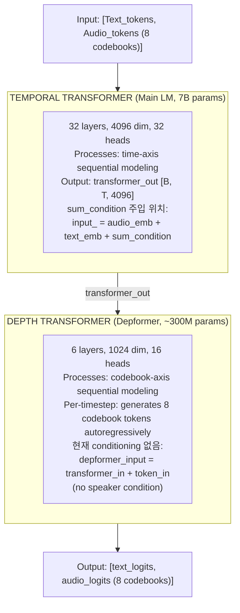
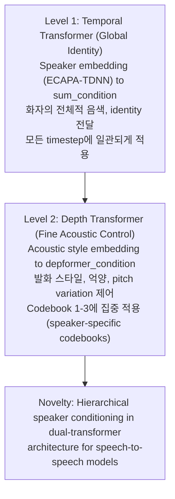
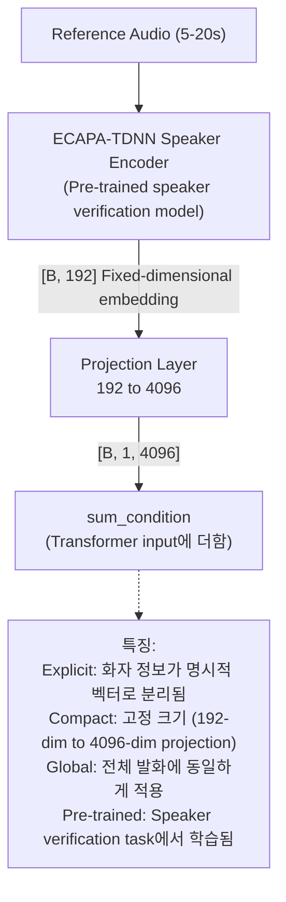
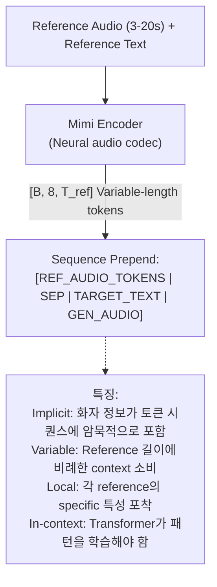
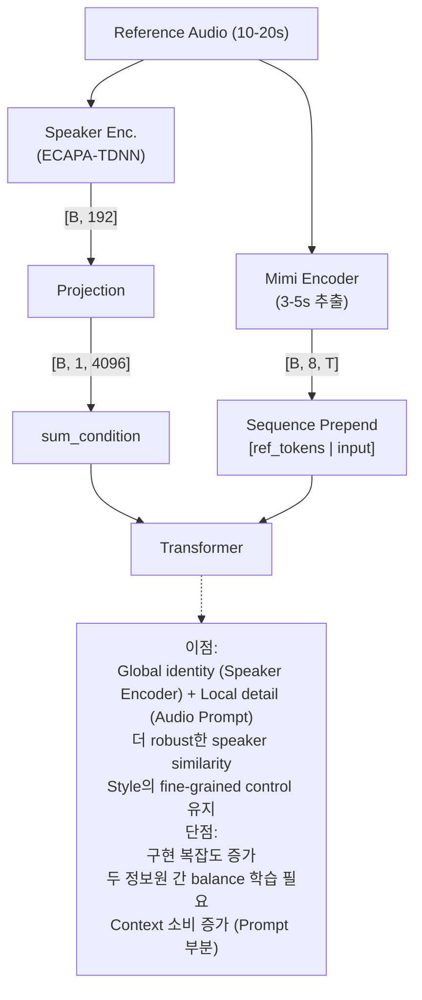
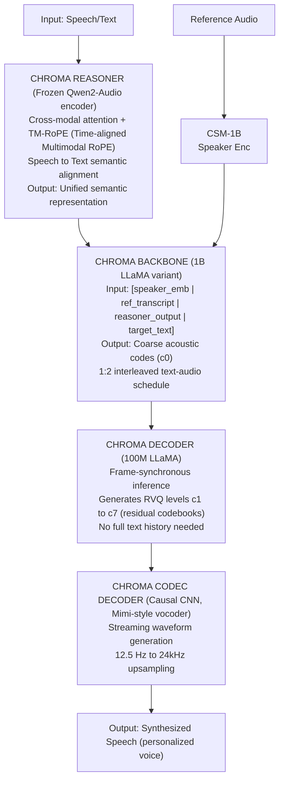
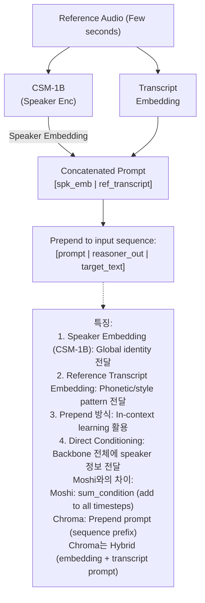
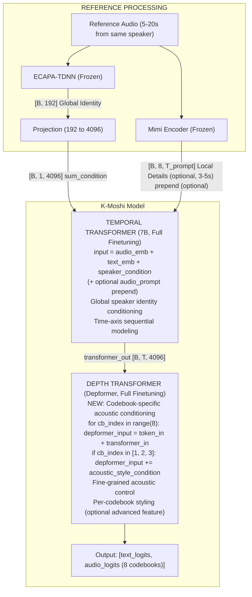

# K-Moshi Speaker Conditioning: 종합 심층 분석

> **분석 일자**: 2026-01-20
> **분석 범위**: Temporal/Depth Transformer Conditioning, Speaker Embedding vs Audio Prompt, Multi-speaker Training, FlashLabs Chroma 1.0
> **목적**: 논문 수준의 엄밀한 분석 및 K-Moshi 구현 방향 제안

---

## 목차

1. [질문 1: Temporal vs Depth Transformer Conditioning](#1-temporal-vs-depth-transformer-conditioning-분석)
2. [질문 2: Speaker Encoder vs Audio Prompt 심층 비교](#2-speaker-encoder-vs-audio-prompt-심층-비교)
3. [질문 3: Multi-speaker Dialogue 학습 시나리오](#3-multi-speaker-dialogue-학습-시나리오)
4. [질문 4: FlashLabs Chroma 1.0 상세 분석](#4-flashlabs-chroma-10-상세-분석)
5. [종합 권장안: K-Moshi Speaker Conditioning Architecture](#5-종합-권장안-k-moshi-speaker-conditioning-architecture)

---

## 1. Temporal vs Depth Transformer Conditioning 분석

### 1.1 Moshi 아키텍처 리뷰



### 1.2 현재 구현 분석

#### Temporal Transformer (sum_condition)

```python
# lm.py:379-408 - forward_text()
def forward_text(self, sequence, sum_condition=None, cross_attention_src=None):
    # 1. Embedding 합산
    input_ = audio_emb + text_emb

    # 2.  Speaker Conditioning (현재 지원됨)
    if sum_condition is not None:
        input_ = input_ + sum_condition.to(input_)

    # 3. Transformer 실행
    transformer_out = self.transformer(input_, cross_attention_src=cross_attention_src)
    return transformer_out, text_logits
```

**특징**:
- `sum_condition`: Shape `[B, 1, 4096]` - **모든 timestep에 동일하게 적용**
- Global conditioning으로 **화자의 전체적 특성 (timbre, identity)** 에 적합
- 이미 인프라가 존재함 (conditioners/base.py의 ConditionFuser)

#### Depth Transformer (현재 conditioning 없음)

```python
# lm.py:410-448 - forward_depformer_training()
def forward_depformer_training(self, sequence, transformer_out):
    for cb_index in range(Ka):
        # Linear projection from temporal transformer output
        transformer_in = self.depformer_in[linear_index](transformer_out)

        # Previous token embedding
        if cb_index == 0:
            token_in = self.depformer_text_emb(sequence[:, 0])
        else:
            token_in = self.depformer_emb[cb_index - 1](sequence[:, cb_index + offset - 1])

        # NO speaker condition!
        depformer_inputs.append(token_in + transformer_in)

    depformer_output = self.depformer(depformer_input)
    return logits
```

**핵심 발견**: Depformer는 **speaker conditioning이 없음**
- `transformer_out`에서 간접적으로 speaker 정보를 받을 뿐
- Fine-grained acoustic 특성 (pitch variation, prosody detail) 제어 불가

### 1.3 Depth Transformer Conditioning 제안

#### 제안 A: Depformer Sum Conditioning

```python
# 제안: forward_depformer_training() 수정
def forward_depformer_training(
    self,
    sequence: torch.Tensor,
    transformer_out: torch.Tensor,
    depformer_condition: torch.Tensor | None = None,  # ⭐ 새로운 인자
) -> torch.Tensor:
    for cb_index in range(Ka):
        transformer_in = self.depformer_in[linear_index](transformer_out)

        if cb_index == 0:
            token_in = self.depformer_text_emb(sequence[:, 0])
        else:
            token_in = self.depformer_emb[cb_index - 1](sequence[:, cb_index + offset - 1])

        depformer_input = token_in + transformer_in

        # NEW: Depformer-level speaker conditioning
        if depformer_condition is not None:
            depformer_input = depformer_input + depformer_condition

        depformer_inputs.append(depformer_input)
```

**장점**:
- Fine-grained acoustic 특성 (pitch, prosody) 직접 제어
- Temporal transformer와 독립적인 acoustic styling

**단점**:
- Depformer는 per-timestep 독립 실행 → global conditioning 효과 제한적
- 추가 projection layer 필요

#### 제안 B: Codebook-specific Conditioning

```python
# 더 정교한 제안: Codebook별 다른 conditioning
def forward_depformer_training_v2(
    self,
    sequence: torch.Tensor,
    transformer_out: torch.Tensor,
    codebook_conditions: list[torch.Tensor | None] = None,  # Per-codebook conditions
) -> torch.Tensor:
    for cb_index in range(Ka):
        # ... 기존 로직 ...

        depformer_input = token_in + transformer_in

        # Codebook-specific conditioning
        # Codebook 0: Semantic (less speaker-specific)
        # Codebook 1-7: Acoustic (more speaker-specific)
        if codebook_conditions and codebook_conditions[cb_index] is not None:
            depformer_input = depformer_input + codebook_conditions[cb_index]
```

**이론적 근거**:
- RVQ 구조에서 codebook별 역할 분화:
  - **Codebook 0**: Semantic (WavLM distillation) - content 위주
  - **Codebook 1-3**: Coarse acoustic - speaker identity 강함
  - **Codebook 4-7**: Fine acoustic - detail (noise, subtle variations)
- Speaker conditioning은 **Codebook 1-3에 집중**하는 것이 효과적

### 1.4 Temporal vs Depth Conditioning 비교

| 측면 | Temporal Transformer | Depth Transformer |
|------|---------------------|-------------------|
| **역할** | 시간축 모델링 (언제 무엇을 말할지) | 음향축 모델링 (어떤 소리로 말할지) |
| **적합한 Conditioning** | Global speaker identity, style | Fine acoustic details, prosody |
| **현재 지원** | ✅ sum_condition, cross_attention | ❌ 없음 |
| **구현 복잡도** | 낮음 (인프라 존재) | 중간 (수정 필요) |
| **학습 영향** | 전체 모델 영향 | Depformer만 영향 |

### 1.5 논문 제안 관점에서의 Contribution



---

## 2. Speaker Encoder vs Audio Prompt 심층 비교

### 2.1 두 방식의 핵심 차이

#### 방식 A: Speaker Encoder (Explicit Embedding)



#### 방식 B: Audio Prompt (In-context Learning)



### 2.2 정보 전달 관점 분석

```
┌─────────────────────────────────────────────────────────────────────────────┐
│           Information Flow Analysis: What Gets Captured?                     │
├─────────────────────────────────────────────────────────────────────────────┤
│                                                                              │
│   ┌────────────────────────────────────────────────────────────────────┐    │
│   │                    SPEAKER ENCODER (ECAPA-TDNN)                     │    │
│   ├────────────────────────────────────────────────────────────────────┤    │
│   │ ✅ 강하게 포착:                                                     │    │
│   │    • Speaker identity (who is speaking)                            │    │
│   │    • Timbre/voice quality (fundamental frequency)                  │    │
│   │    • Accent patterns (regional characteristics)                    │    │
│   │                                                                     │    │
│   │ ⚠️ 약하게/부분적 포착:                                              │    │
│   │    • Speaking style (formal/casual) - context-dependent            │    │
│   │    • Emotion (requires emotion-aware encoder)                      │    │
│   │    • Prosody details (pitch contour variations)                    │    │
│   │                                                                     │    │
│   │ ❌ 포착 못함:                                                       │    │
│   │    • Specific utterance characteristics                            │    │
│   │    • Recording conditions                                          │    │
│   │    • Background noise patterns                                     │    │
│   └────────────────────────────────────────────────────────────────────┘    │
│                                                                              │
│   ┌────────────────────────────────────────────────────────────────────┐    │
│   │                    AUDIO PROMPT (In-Context)                        │    │
│   ├────────────────────────────────────────────────────────────────────┤    │
│   │ ✅ 강하게 포착:                                                     │    │
│   │    • All acoustic details (pitch, energy, timing)                  │    │
│   │    • Prosody patterns (rhythm, emphasis)                           │    │
│   │    • Recording environment                                         │    │
│   │    • Emotion/mood in that specific utterance                       │    │
│   │                                                                     │    │
│   │ ⚠️ 약하게/부분적 포착:                                              │    │
│   │    • Speaker identity (entangled with content)                     │    │
│   │    • Style consistency across different content                    │    │
│   │                                                                     │    │
│   │ ❌ 포착 못함 (연구 발견):                                            │    │
│   │    • Clean separation of speaker vs content                        │    │
│   │    • "Semantic units carry rich acoustic information..."           │    │
│   │    • Content leakage into style representation                     │    │
│   └────────────────────────────────────────────────────────────────────┘    │
│                                                                              │
└─────────────────────────────────────────────────────────────────────────────┘
```

### 2.3 Trade-off 상세 분석

| 평가 기준 | Speaker Encoder | Audio Prompt | 승자 |
|----------|-----------------|--------------|------|
| **Speaker Identity 보존** | ⭐⭐⭐⭐⭐ (최적화됨) | ⭐⭐⭐⭐ (entangled) | Encoder |
| **Prosody/Style 전달** | ⭐⭐⭐ (제한적) | ⭐⭐⭐⭐⭐ (풍부함) | Prompt |
| **Context 효율성** | ⭐⭐⭐⭐⭐ (1 token) | ⭐⭐ (100+ tokens) | Encoder |
| **Streaming 호환** | ⭐⭐⭐⭐⭐ (즉시) | ⭐⭐⭐ (prefill 필요) | Encoder |
| **구현 복잡도** | 중간 | 낮음 | Prompt |
| **Zero-shot 품질** | ⭐⭐⭐⭐ | ⭐⭐⭐⭐⭐ | Prompt |
| **학습 안정성** | ⭐⭐⭐⭐⭐ (안정적) | ⭐⭐⭐⭐ (더 많은 데이터 필요) | Encoder |
| **Fine-grained Control** | ⭐⭐⭐ | ⭐⭐⭐⭐⭐ | Prompt |

### 2.4 연구 문헌 근거

#### Speaker Encoder의 한계 (arXiv:2407.04291)

> "While speaker embeddings are commonly used as conditioning inputs in personalized speech generation, they are typically **optimized for speaker recognition**, which encourages the **loss of intra-speaker variation**. This strategy makes them suboptimal for speech generation in terms of modeling rich variations in output speech distribution."

**시사점**: Speaker encoder는 "누가 말하는가"에 최적화되어 있어, "어떻게 말하는가"의 다양성이 손실됨.

#### Audio Prompt의 한계 (arXiv:2403.12402v1)

> "Semantic units carry **rich acoustic information such as pitch, tempo, volume and speech emphasis**, which may **leak from content to synthesized audio**."

> "heterogeneous and nonstationary prompts **hurt audio quality**, contrary to previous findings that longer prompts always lead to better synthesis."

**시사점**: Audio prompt는 content와 style이 entangle되어 있고, prompt 품질에 민감함.

### 2.5 Hybrid 접근법 분석 (두 방식 결합)

#### 최신 트렌드: Hybrid Conditioning



#### FlashLabs Chroma 1.0의 선택 (2025.01)

Chroma는 **Hybrid 방식**을 채택:
- CSM-1B로 speaker embedding 추출
- Reference audio + transcript를 embedding prompt로 prepend
- 결과: 10.96% speaker similarity 향상 (human baseline 대비)

### 2.6 K-Moshi 권장 전략

```
┌─────────────────────────────────────────────────────────────────────────────┐
│              K-Moshi Speaker Conditioning 권장 전략                          │
├─────────────────────────────────────────────────────────────────────────────┤
│                                                                              │
│   Phase 1: Speaker Encoder Only (빠른 검증)                                  │
│   ────────────────────────────────────────                                   │
│   • ECAPA-TDNN + Projection → sum_condition                                 │
│   • Streaming 최적화, context 효율적                                         │
│   • 예상 결과: 기본적인 speaker identity 전달                                │
│                                                                              │
│   Phase 2: Audio Prompt 추가 (품질 향상)                                     │
│   ────────────────────────────────────────                                   │
│   • Short audio prompt (3-5초) prepend                                      │
│   • Fine-grained prosody 전달                                               │
│   • 예상 결과: style 다양성 개선                                             │
│                                                                              │
│   Phase 3: Hybrid + Depth Conditioning (최적화)                              │
│   ────────────────────────────────────────────                               │
│   • Speaker encoder (Temporal) + Audio prompt (short)                       │
│   • Acoustic style → Depth transformer                                      │
│   • 예상 결과: 최고 품질 zero-shot cloning                                   │
│                                                                              │
└─────────────────────────────────────────────────────────────────────────────┘
```

---

## 3. Multi-speaker Dialogue 학습 시나리오

### 3.1 데이터 구조 분석

```
현재 K-Moshi 학습 데이터:
────────────────────────────────
• Multi-speaker dialogue (2명 이상 화자)
• Dialogue마다 다른 화자 조합
• SPEAKER_MAIN (Moshi 역할) ↔ SPEAKER_USER (User 역할)
• 각 화자는 데이터셋 전체에서 여러 dialogue에 등장 가능

데이터 예시:
┌─────────────────────────────────────────────────────────────────┐
│ Dialogue 1:                                                     │
│   SPEAKER_MAIN: 화자 A (여성, 30대)                             │
│   SPEAKER_USER: 화자 B (남성, 40대)                             │
├─────────────────────────────────────────────────────────────────┤
│ Dialogue 2:                                                     │
│   SPEAKER_MAIN: 화자 C (남성, 20대)                             │
│   SPEAKER_USER: 화자 D (여성, 50대)                             │
├─────────────────────────────────────────────────────────────────┤
│ Dialogue 3:                                                     │
│   SPEAKER_MAIN: 화자 A (여성, 30대)  ← 동일 화자, 다른 dialogue │
│   SPEAKER_USER: 화자 E (남성, 30대)                             │
└─────────────────────────────────────────────────────────────────┘
```

### 3.2 학습 시나리오 설계

#### 핵심 통찰

질문: "Reference audio와 Target audio가 같은 화자이면 자연스러운 학습 가능"하다고 했는데, multi-speaker dialogue에서는 어떻게?

**답변**: 동일 dialogue 내에서 **동일 화자의 다른 발화 구간**을 reference로 사용

```
┌─────────────────────────────────────────────────────────────────────────────┐
│              Multi-speaker Dialogue: Zero-shot 학습 시나리오                 │
├─────────────────────────────────────────────────────────────────────────────┤
│                                                                              │
│   Dialogue Timeline (예시):                                                  │
│   ────────────────────────────────────────────────────────────────────────  │
│                                                                              │
│   0s       10s      20s      30s      40s      50s      60s      70s        │
│   |--------|--------|--------|--------|--------|--------|--------|         │
│   [  MAIN  ][ USER ][  MAIN  ][ USER ][  MAIN  ][ USER ][  MAIN  ]         │
│   발화 1    발화 2   발화 3   발화 4    발화 5   발화 6   발화 7            │
│       │                          │                                          │
│       │                          └── Target: 발화 5 생성하려 함             │
│       └─────────────────────────────── Reference: 발화 1 사용               │
│                                                                              │
│   학습 Sample 구성:                                                          │
│   ──────────────────                                                         │
│   1. Reference Audio: MAIN의 발화 1 (또는 발화 3)에서 랜덤 구간 추출        │
│   2. Reference Text: 해당 구간의 transcript                                  │
│   3. Input: 발화 4까지의 context + 발화 5의 text                            │
│   4. Target (GT): 발화 5의 실제 MAIN 음성                                   │
│                                                                              │
│   ⭐ 핵심: Reference와 Target이 같은 화자 (MAIN)이므로                       │
│         Voice Conversion 없이 자연스러운 supervised learning 가능            │
│                                                                              │
└─────────────────────────────────────────────────────────────────────────────┘
```

### 3.3 구체적 데이터 로딩 전략

```python
# 제안: K-Moshi Training Data Pipeline

@dataclass
class ZeroShotDialogueSample:
    """Zero-shot speaker conditioning을 위한 학습 샘플"""

    # Reference (same speaker의 다른 발화)
    reference_audio: torch.Tensor      # [T_ref] raw waveform
    reference_text: str                 # Reference 구간의 transcript
    reference_duration_sec: float       # 5-20초 권장

    # Input context
    input_codes: torch.Tensor          # [9, T_in] 이전 context의 코드
    target_text: str                    # 생성할 발화의 텍스트

    # Target (Ground Truth)
    target_audio: torch.Tensor         # [T_target] 실제 음성
    target_codes: torch.Tensor         # [8, T_target] Mimi 인코딩된 코드

    # Metadata
    speaker_id: str                     # 화자 ID
    dialogue_id: str                    # 대화 ID


def prepare_zero_shot_sample(
    dialogue_audio: torch.Tensor,       # [2, T] stereo (L=MAIN, R=USER)
    alignments: list[Alignment],        # [(word, (start, end), speaker), ...]
    target_utterance_idx: int,          # 생성할 발화 인덱스
    main_speaker_label: str = "SPEAKER_MAIN",
) -> ZeroShotDialogueSample:
    """
    Dialogue에서 zero-shot 학습 샘플 생성

    핵심 전략:
    1. Target utterance: MAIN의 특정 발화를 생성 목표로 설정
    2. Reference: 같은 dialogue 내 MAIN의 다른 발화에서 랜덤 구간 추출
    3. Context: Target 이전까지의 대화 history
    """

    # 1. MAIN 화자의 모든 발화 구간 추출
    main_utterances = [
        (word, start, end)
        for word, (start, end), speaker in alignments
        if speaker == main_speaker_label
    ]

    # 2. Target utterance 설정
    target_start, target_end = main_utterances[target_utterance_idx][1:3]
    target_audio = dialogue_audio[0, int(target_start*24000):int(target_end*24000)]

    # 3. Reference 선택 (target이 아닌 다른 MAIN 발화에서)
    available_refs = [u for i, u in enumerate(main_utterances) if i != target_utterance_idx]
    if not available_refs:
        # Fallback: target 발화의 앞부분 사용
        ref_duration = min(5.0, (target_end - target_start) * 0.3)
        ref_start, ref_end = target_start, target_start + ref_duration
    else:
        # 랜덤하게 reference 구간 선택
        ref_utterance = random.choice(available_refs)
        ref_start, ref_end = ref_utterance[1], ref_utterance[2]

    reference_audio = dialogue_audio[0, int(ref_start*24000):int(ref_end*24000)]

    # 4. Context 구성 (target 이전까지)
    # ... (interleaver로 코드 생성)

    return ZeroShotDialogueSample(
        reference_audio=reference_audio,
        reference_text=extract_text(alignments, ref_start, ref_end),
        target_audio=target_audio,
        # ...
    )
```

### 3.4 학습 Loop 상세

```python
def train_step_zero_shot(
    model: LMModel,
    mimi: MimiEncoder,
    speaker_encoder: ECAPA_TDNN,
    projection: SpeakerProjection,
    sample: ZeroShotDialogueSample,
):
    """Zero-shot speaker conditioning 학습 step"""

    # 1. Speaker embedding 추출
    with torch.no_grad():
        speaker_emb = speaker_encoder(sample.reference_audio)  # [B, 192]
    speaker_condition = projection(speaker_emb)  # [B, 1, 4096]

    # 2. Target을 Mimi로 인코딩 (Frozen)
    with torch.no_grad():
        target_codes = mimi.encode(sample.target_audio)  # [B, 8, T_target]

    # 3. Text target 준비
    text_targets = interleaver.tokenize(sample.target_text)

    # 4. Full target 구성
    full_targets = concat_codes(text_targets, target_codes)

    # 5. Forward with speaker conditioning
    output = model(
        codes=sample.input_codes,
        sum_condition=speaker_condition,  # ⭐ Speaker conditioning
    )

    # 6. Loss 계산
    text_loss = F.cross_entropy(output.text_logits, full_targets[:, :1])
    audio_loss = F.cross_entropy(output.logits, full_targets[:, 1:9])

    total_loss = text_loss + audio_loss
    return total_loss


# 학습 시나리오 요약:
# ──────────────────────────────────
# • Reference: 같은 화자(MAIN)의 다른 발화에서 추출
# • Target GT: 같은 화자(MAIN)의 실제 음성
# • 결과: Reference 화자 = Target 화자 → Voice Conversion 불필요
# • 모델 학습: "Reference 음성 특성을 반영하여 Target text를 음성으로 생성"
```

### 3.5 Voice Conversion 필요성 재검토

```
┌─────────────────────────────────────────────────────────────────────────────┐
│                  Voice Conversion 필요성 최종 분석                           │
├─────────────────────────────────────────────────────────────────────────────┤
│                                                                              │
│   시나리오 1: Multi-speaker Dialogue (K-Moshi 현재 상황)                     │
│   ─────────────────────────────────────────────────────────                  │
│   • Reference: MAIN 화자의 다른 발화                                         │
│   • Target: MAIN 화자의 생성할 발화                                          │
│   • Voice Conversion: ❌ 불필요                                              │
│   • 이유: 같은 화자이므로 자연스러운 supervised learning                     │
│                                                                              │
│   시나리오 2: 특정 Persona 음성으로 통일                                      │
│   ─────────────────────────────────────────────────────────                  │
│   • 목표: 모든 MAIN 발화를 "캐릭터 A"의 목소리로 생성                        │
│   • 원본 데이터: 다양한 화자의 MAIN 발화                                     │
│   • Voice Conversion: ✅ 필요                                               │
│   • 방법: 원본 음성 → "캐릭터 A" 음성으로 VC → Ground Truth로 사용          │
│                                                                              │
│   시나리오 3: 화자 수 확장 (데이터 증강)                                      │
│   ─────────────────────────────────────────────────────────                  │
│   • 목표: 적은 화자 데이터를 다양한 화자로 변환                               │
│   • 방법: VC로 다양한 화자 합성                                              │
│   • Voice Conversion: ✅ 필요 (데이터 증강 목적)                             │
│                                                                              │
│   ⭐ K-Moshi 결론:                                                          │
│   Multi-speaker dialogue 데이터가 충분하다면 Voice Conversion 불필요         │
│   각 dialogue 내에서 같은 화자의 reference-target 쌍 자연스럽게 구성 가능    │
│                                                                              │
└─────────────────────────────────────────────────────────────────────────────┘
```

---

## 4. FlashLabs Chroma 1.0 상세 분석

### 4.1 논문 개요

| 항목 | 내용 |
|------|------|
| **제목** | FlashLabs Chroma 1.0: A Real-Time End-to-End Spoken Dialogue Model with Personalized Voice Cloning |
| **저자** | Tanyu Chen, Tairan Chen, Kai Shen, Zhenghua Bao, Zhihui Zhang, Man Yuan, Yi Shi |
| **발표** | arXiv:2601.11141 (2025-01-20) |
| **핵심 기여** | 최초의 오픈소스 실시간 End-to-End spoken dialogue + personalized voice cloning |

### 4.2 아키텍처 상세



### 4.3 Speaker Conditioning 메커니즘 상세



### 4.4 학습 전략

| 단계 | 구성 | 학습 대상 | λ 값 |
|------|------|----------|------|
| **Stage 1** | Backbone + Decoder joint | 전체 | 0.5 |
| **Stage 2** | Backbone frozen + Decoder | Decoder만 | 1.0 |

**학습 세부사항**:
- 100K steps
- 8x H200 GPUs
- ~6시간 수렴
- AdamW, lr=5×10⁻⁵

### 4.5 Chroma vs Moshi 비교

| 측면 | Chroma 1.0 | Moshi |
|------|-----------|-------|
| **Parameter** | 4B total | 7B total |
| **Backbone** | 1B LLaMA | 7B custom |
| **Depth Model** | 100M LLaMA (Decoder) | 300M Depformer |
| **Voice Cloning** | ✅ CSM-1B embedding | ❌ 없음 |
| **Full-Duplex** | ❌ Half-duplex | ✅ Full-duplex |
| **Streaming** | ✅ Causal | ✅ Streaming |
| **Speaker Cond** | Prepend prompt | sum_condition (기존) |
| **RTF** | 0.43 | ~0.3 |
| **Open Source** | ✅ | ✅ |

### 4.6 K-Moshi에 적용 가능한 Insights

```
┌─────────────────────────────────────────────────────────────────────────────┐
│              Chroma 1.0에서 배울 수 있는 점                                   │
├─────────────────────────────────────────────────────────────────────────────┤
│                                                                              │
│   1. Hybrid Speaker Conditioning의 효과                                      │
│   ────────────────────────────────────                                       │
│   • Speaker embedding + Reference transcript 결합                           │
│   • 10.96% speaker similarity 향상 (human baseline 대비)                    │
│   • K-Moshi도 이 방식 적용 권장                                              │
│                                                                              │
│   2. Two-Stage Training                                                      │
│   ─────────────────────────                                                  │
│   • Stage 1: Joint training (backbone + decoder)                            │
│   • Stage 2: Decoder fine-tuning with frozen backbone                       │
│   • Fine-grained acoustic 품질 향상에 효과적                                 │
│                                                                              │
│   3. 1:2 Interleaved Token Schedule                                          │
│   ───────────────────────────────────                                        │
│   • Text 1 token : Audio 2 tokens                                           │
│   • Streaming latency 감소                                                   │
│   • K-Moshi도 유사한 scheduling 고려 가능                                    │
│                                                                              │
│   4. 분리된 Coarse/Fine Generation                                           │
│   ───────────────────────────────────                                        │
│   • Backbone: Coarse acoustic (c⁰)                                          │
│   • Decoder: Fine acoustic (c¹:⁷)                                           │
│   • Moshi의 Temporal/Depth와 유사한 철학                                    │
│                                                                              │
│   ⚠️ 주의점:                                                                │
│   • Chroma는 Full-duplex가 아님 (Moshi는 Full-duplex)                       │
│   • K-Moshi는 Full-duplex 유지하면서 voice cloning 추가 필요                │
│                                                                              │
└─────────────────────────────────────────────────────────────────────────────┘
```

---

## 5. 종합 권장안: K-Moshi Speaker Conditioning Architecture

### 5.1 최종 아키텍처 제안



### 5.2 구현 Phase 계획

```
┌─────────────────────────────────────────────────────────────────────────────┐
│                    K-Moshi Implementation Roadmap                            │
├─────────────────────────────────────────────────────────────────────────────┤
│                                                                              │
│   Phase 1: Basic Speaker Encoder (2-3주)                                     │
│   ────────────────────────────────────────                                   │
│   ✅ ECAPA-TDNN 통합 (SpeechBrain pre-trained)                              │
│   ✅ Projection layer (192 → 4096)                                          │
│   ✅ sum_condition 경로에 주입                                               │
│   ✅ Multi-speaker dialogue 학습 파이프라인 구현                             │
│   📊 예상 결과: 기본적인 speaker identity 전달                               │
│                                                                              │
│   Phase 2: Hybrid Conditioning (2-3주)                                       │
│   ───────────────────────────────────────                                    │
│   □ Short audio prompt (3-5초) prepend 옵션 추가                            │
│   □ Reference transcript embedding 통합                                      │
│   □ Chroma 스타일 hybrid conditioning                                       │
│   📊 예상 결과: 10%+ speaker similarity 향상                                │
│                                                                              │
│   Phase 3: Depth Transformer Conditioning (2-3주)                            │
│   ─────────────────────────────────────────────                              │
│   □ Depformer에 acoustic style conditioning 추가                            │
│   □ Codebook-specific conditioning (cb 1-3 집중)                            │
│   □ Two-stage training (Chroma 스타일)                                      │
│   📊 예상 결과: Fine-grained prosody 제어                                   │
│                                                                              │
│   Phase 4: Optimization & Evaluation (2주)                                   │
│   ─────────────────────────────────────────                                  │
│   □ Speaker similarity 평가 (ECAPA 기반)                                    │
│   □ MOS 평가 (naturalness, intelligibility)                                 │
│   □ Ablation study (각 component 기여도)                                    │
│   □ 논문 작성                                                               │
│                                                                              │
└─────────────────────────────────────────────────────────────────────────────┘
```

### 5.3 논문 기여점 정리

```
┌─────────────────────────────────────────────────────────────────────────────┐
│              K-Moshi Paper Contributions (제안)                              │
├─────────────────────────────────────────────────────────────────────────────┤
│                                                                              │
│   Contribution 1: Dual-Level Speaker Conditioning                           │
│   ─────────────────────────────────────────────────                          │
│   • Temporal Transformer: Global speaker identity (sum_condition)           │
│   • Depth Transformer: Fine acoustic styling (depformer_condition)          │
│   • 기존 연구와 차별점: Full-duplex dialogue + hierarchical conditioning    │
│                                                                              │
│   Contribution 2: Zero-Shot Voice Cloning in Full-Duplex Dialogue           │
│   ─────────────────────────────────────────────────────────────────          │
│   • Moshi의 full-duplex 능력 유지하면서 voice cloning 추가                  │
│   • Chroma (half-duplex), VALL-E (TTS only)와 차별화                        │
│   • 실시간 대화에서 personalized voice 지원                                 │
│                                                                              │
│   Contribution 3: Multi-Speaker Dialogue Training Strategy                   │
│   ─────────────────────────────────────────────────────────────              │
│   • Same-speaker reference-target pairing (no voice conversion)             │
│   • In-dialogue reference extraction for zero-shot learning                 │
│   • Scalable to large multi-speaker datasets                                │
│                                                                              │
│   Contribution 4: Korean Full-Duplex Dialogue System                        │
│   ─────────────────────────────────────────────────────                      │
│   • 최초의 한국어 full-duplex 음성 대화 시스템                               │
│   • 한국어 토크나이저 최적화                                                 │
│   • 한국어 음성 데이터셋 활용                                                │
│                                                                              │
└─────────────────────────────────────────────────────────────────────────────┘
```

---

## 참고 자료

### 분석에 사용된 논문

1. [FlashLabs Chroma 1.0](https://arxiv.org/abs/2601.11141) - Real-time spoken dialogue with voice cloning (2025)
2. [Moshi](https://arxiv.org/abs/2410.00037) - Full-duplex speech-text foundation model (2024)
3. [VALL-E 2](https://arxiv.org/abs/2406.05370) - Human parity zero-shot TTS (2024)
4. [CosyVoice 2](https://arxiv.org/abs/2412.10117) - Streaming speech synthesis (2024)
5. [Speaker Embeddings Study](https://arxiv.org/abs/2407.04291) - Sub-center modeling (2024)
6. [Speech LM Prompt Study](https://arxiv.org/abs/2403.12402) - Prompt conditioning analysis (2024)

### 코드 참조

- `moshi/moshi/models/lm.py` - LMModel, forward_text, forward_depformer_training
- `moshi/moshi/conditioners/base.py` - ConditionFuser, ConditionProvider
- `moshi-korean-finetune/finetune/data/interleaver.py` - Data pipeline

---

*문서 작성: 2026-01-20*
*K-Moshi Speaker Conditioning 종합 심층 분석*
