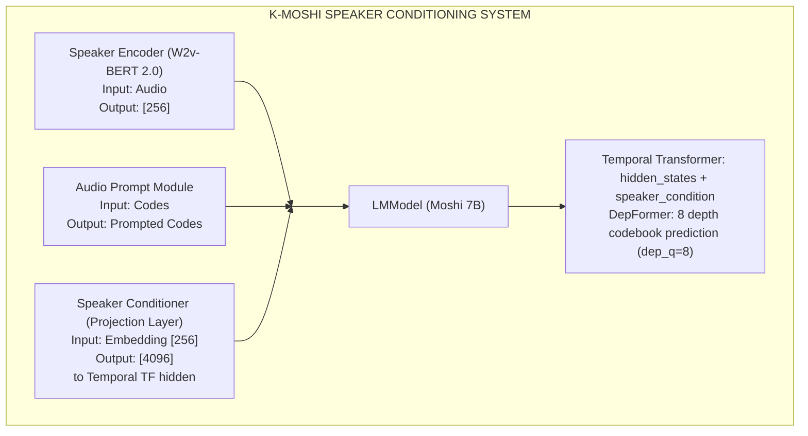
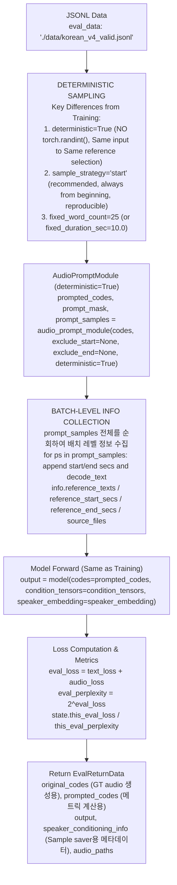
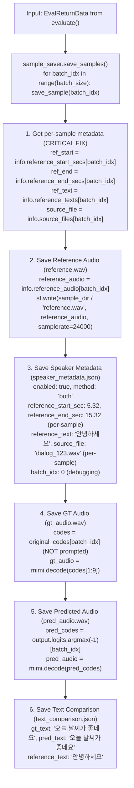
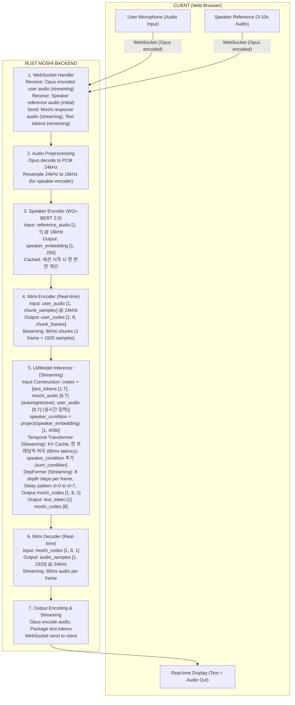
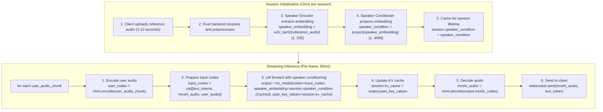
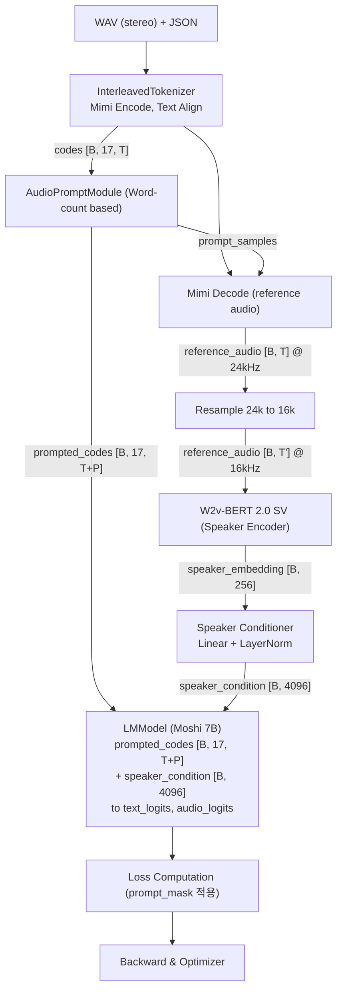
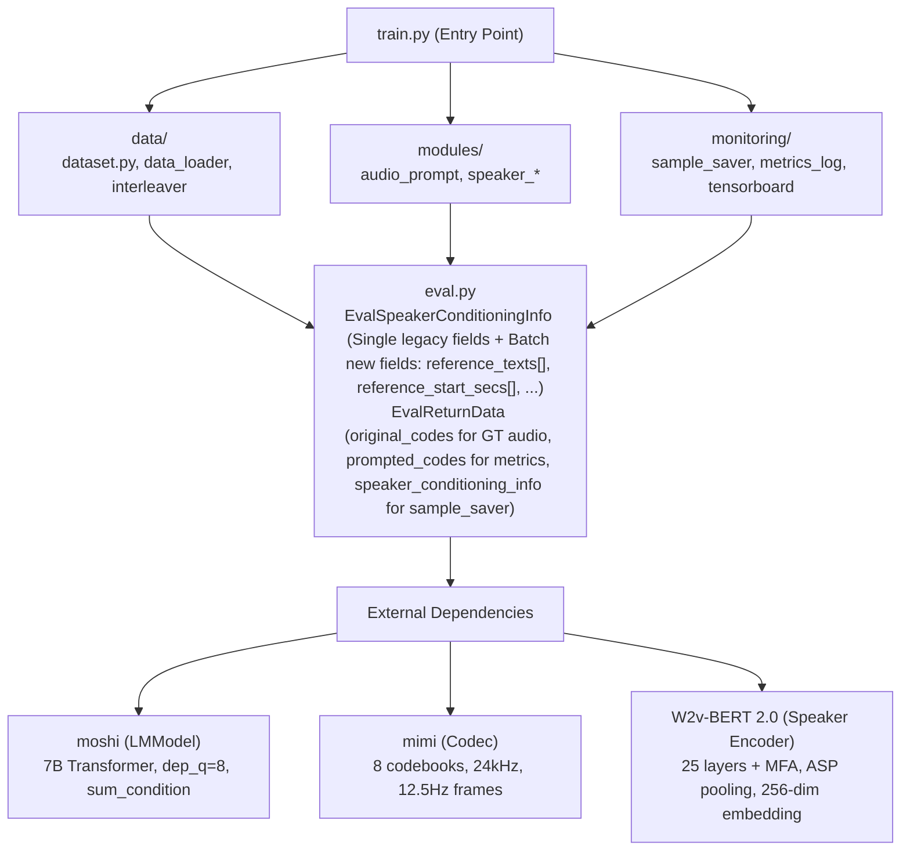

# K-Moshi Speaker Conditioning System Architecture

## 목차
1. [시스템 개요](#1-시스템-개요)
2. [Training Pipeline](#2-training-pipeline)
3. [Validation/Evaluation Pipeline](#3-validationevaluation-pipeline)
4. [Sample Saver Pipeline](#4-sample-saver-pipeline)
5. [Rust Backend Serving](#5-rust-backend-serving)
6. [데이터 흐름 다이어그램](#6-데이터-흐름-다이어그램)
7. [모듈 상호작용](#7-모듈-상호작용)

---

## 1. 시스템 개요

K-Moshi Speaker Conditioning System은 zero-shot speaker adaptation을 위한 종합 시스템입니다.

### 1.1 핵심 컴포넌트



### 1.2 두 가지 컨디셔닝 방식

| 방식 | 설명 | 적용 위치 |
|------|------|-----------|
| **Global Condition** | Speaker embedding → Temporal TF에 sum_condition으로 추가 | 전체 시퀀스 |
| **Local Condition** | Reference audio/text를 시퀀스 앞에 prepend (PersonaPlex) | Prompt 구간만 |

**권장 설정**: `method: "both"` - 두 방식 모두 사용

---

## 2. Training Pipeline

### 2.1 전체 흐름도

```mermaid
flowchart TD
    JSONL["JSONL Data (paths)<br/>train_data: './data/korean_v4_train.jsonl'"]
    TOK["InterleavedTokenizer<br/>Stereo WAV (L=Moshi, R=User) to Mimi Encode [8, T]<br/>to Text-Audio Interleave codes: [B, 17, T]<br/>[0]: text tokens, [1-8]: moshi audio, [9-16]: user audio<br/>JSON 전사 alignments"]
    APM["AudioPromptModule<br/>AudioPromptSampler.sample_single_word_count()<br/>1. Extract text_tokens, 2. Count valid tokens (exclude PAD/EOS/32000)<br/>3. Find segment min_words ~ max_words, 4. Random start (avoid overlap)<br/>Output: AudioPromptSample (audio_codes, text_tokens, user_audio_codes, start_idx, end_idx)<br/>Prepend Prompt to Codes: prompted_codes = [prompt_codes | original_codes]<br/>prompt_mask = [True ... | False ...]"]
    SENC["Speaker Encoder<br/>Reference Audio Extraction: Mimi.decode to reference_audio @ 24kHz<br/>Resample 24kHz to 16kHz to reference_audio_16k<br/>W2v-BERT 2.0 SV (0.14% EER SOTA on VoxCeleb1-O)<br/>25 Transformer layers with MFA, Attentive Statistics Pooling (ASP)<br/>Output: speaker_embedding [B, 256]"]
    SCOND["Speaker Conditioner<br/>Projection: [256] to [4096]<br/>Linear then LayerNorm then * scale (initial 0.1)<br/>speaker_condition [B, 4096]"]
    FWD["LMModel Forward<br/>Input Embedding: text_embed + audio_embed [B, T+P, 4096]<br/>Temporal Transformer (32 layers): hidden + speaker_condition (Global conditioning via sum_condition)<br/>Output Heads: text_logits [B, T+P, vocab_size], audio_logits [B, dep_q, T+P, 2048]"]
    LOSS["Loss Computation (prompt_mask 적용)<br/>Prompt 구간은 loss에서 제외<br/>text_loss = CE masked_select(~prompt_mask).mean()<br/>audio_loss = CE, audio_loss[0] *= 100.0 (first_codebook_weight_multiplier)<br/>total_loss = text_loss + audio_loss"]
    BWD["Backward & Optimizer Step<br/>total_loss.backward()<br/>optimizer.step() (AdamW)<br/>scheduler.step() (CosineWarmup)"]
    JSONL --> TOK
    TOK -->|"batch.codes [B, 17, T], batch.audio_paths"| APM
    APM -->|"prompted_codes [B, 17, T+P], prompt_mask [B, T+P], prompt_samples"| SENC
    SENC -->|"speaker_embedding [B, 256]"| SCOND
    SCOND -->|"speaker_condition [B, 4096]"| FWD
    FWD --> LOSS
    LOSS --> BWD
```



### 2.2 주요 모듈 입출력

| 모듈 | 입력 | 출력 |
|------|------|------|
| **InterleavedTokenizer** | WAV (24kHz, stereo), JSON alignments | codes [B, 17, T] |
| **AudioPromptModule** | codes [B, 17, T] | prompted_codes [B, 17, T+P], prompt_mask [B, T+P], prompt_samples |
| **Speaker Encoder** | reference_audio [B, T] @ 16kHz | speaker_embedding [B, 256] |
| **Speaker Conditioner** | speaker_embedding [B, 256] | speaker_condition [B, 4096] |
| **LMModel** | prompted_codes, speaker_condition | text_logits, audio_logits |

### 2.3 Batch-Level Metadata 저장 (Fix 적용)

```
┌─────────────────────────────────────────────────────────────────────────────┐
│                    BATCH-LEVEL METADATA STORAGE                             │
├─────────────────────────────────────────────────────────────────────────────┤
│                                                                             │
│  prompt_samples: List[AudioPromptSample]                                    │
│      │                                                                      │
│      ├── [0] → reference_texts[0], reference_start_secs[0], ...             │
│      ├── [1] → reference_texts[1], reference_start_secs[1], ...             │
│      ├── [2] → reference_texts[2], reference_start_secs[2], ...             │
│      └── [B-1] → reference_texts[B-1], reference_start_secs[B-1], ...       │
│                                                                             │
│  EvalSpeakerConditioningInfo:                                               │
│      reference_texts: List[str]         # 각 배치 항목의 reference text     │
│      reference_start_secs: List[float]  # 각 배치 항목의 시작 시간          │
│      reference_end_secs: List[float]    # 각 배치 항목의 끝 시간            │
│      source_files: List[str]            # 각 배치 항목의 원본 파일 경로     │
│                                                                             │
│  sample_saver.save_sample(batch_idx=i):                                     │
│      → speaker_metadata.json 에 정확한 per-sample 정보 저장                 │
│                                                                             │
└─────────────────────────────────────────────────────────────────────────────┘
```

---

## 3. Validation/Evaluation Pipeline

### 3.1 전체 흐름도



### 3.2 FSDP 동기화 프로토콜

```
┌─────────────────────────────────────────────────────────────────────────────────┐
│                       FSDP SYNCHRONIZED EVALUATION                              │
├─────────────────────────────────────────────────────────────────────────────────┤
│                                                                                 │
│  문제: 각 rank가 서로 다른 양의 eval 데이터를 가질 수 있음                      │
│  해결: "ALL ranks must have data" 전략                                          │
│                                                                                 │
│  ┌─────────────────────────────────────────────────────────────────────────┐    │
│  │  while True:                                                           │    │
│  │      # 각 rank에서 데이터 유무 확인                                    │    │
│  │      try:                                                              │    │
│  │          batch = next(eval_iterator)                                   │    │
│  │          has_data = torch.tensor([1])                                  │    │
│  │      except StopIteration:                                             │    │
│  │          has_data = torch.tensor([0])                                  │    │
│  │                                                                        │    │
│  │      # 모든 rank에서 has_data 수집                                     │    │
│  │      all_has_data = [...]                                              │    │
│  │      dist.all_gather(all_has_data, has_data)                           │    │
│  │                                                                        │    │
│  │      # 어느 한 rank라도 데이터가 없으면 전체 종료                      │    │
│  │      if not all(t.item() == 1 for t in all_has_data):                  │    │
│  │          break  # 모든 rank가 함께 종료                                │    │
│  │                                                                        │    │
│  │      # 모든 rank가 데이터 있음 → 함께 model() 호출                     │    │
│  │      output = model(codes=prompted_codes)  # FSDP: 모든 rank 참여      │    │
│  └─────────────────────────────────────────────────────────────────────────┘    │
│                                                                                 │
└─────────────────────────────────────────────────────────────────────────────────┘
```

---

## 4. Sample Saver Pipeline

### 4.1 전체 흐름도



### 4.2 Per-Sample Metadata 저장 로직 (Fix 적용 후)

```python
# sample_saver.py (수정 후)

def save_sample(self, batch_idx: int, ...):
    # CRITICAL: 배치 레벨 리스트에서 batch_idx로 정확한 값 추출

    # Timing info
    ref_start_secs = getattr(speaker_conditioning_info, 'reference_start_secs', None)
    if ref_start_secs is not None and batch_idx < len(ref_start_secs):
        sample_start_sec = ref_start_secs[batch_idx]
        sample_end_sec = ref_end_secs[batch_idx]
    else:
        # Legacy fallback
        sample_start_sec = speaker_conditioning_info.reference_start_sec
        sample_end_sec = speaker_conditioning_info.reference_end_sec

    # Reference text
    ref_texts = getattr(speaker_conditioning_info, 'reference_texts', None)
    if ref_texts is not None and batch_idx < len(ref_texts):
        sample_ref_text = ref_texts[batch_idx]
    else:
        sample_ref_text = speaker_conditioning_info.reference_text

    # Source file
    source_files = getattr(speaker_conditioning_info, 'source_files', None)
    if source_files is not None and batch_idx < len(source_files):
        sample_source_file = source_files[batch_idx]
    else:
        sample_source_file = speaker_conditioning_info.source_file

    # Save metadata with per-sample values
    speaker_metadata = {
        "reference_start_sec": sample_start_sec,
        "reference_end_sec": sample_end_sec,
        "reference_text": sample_ref_text,
        "source_file": sample_source_file,
        "batch_idx": batch_idx,  # For debugging
    }
```

---

## 5. Rust Backend Serving

### 5.1 서빙 시나리오 개요



### 5.2 Speaker Conditioning 통합 포인트



### 5.3 Rust 코드 수정 포인트 (TODO)

```
moshi/rust/
├── moshi-backend/
│   ├── src/
│   │   ├── main.rs           # WebSocket 핸들러
│   │   ├── session.rs        # 세션 관리 + speaker_condition 캐시
│   │   ├── speaker.rs        # [NEW] Speaker encoder 통합
│   │   └── inference.rs      # LM 추론 + speaker_embedding 전달
│   └── Cargo.toml
│
└── moshi-core/
    ├── src/
    │   ├── lm_model.rs       # speaker_embedding 파라미터 추가
    │   ├── transformer.rs    # sum_condition 적용
    │   └── lib.rs
    └── Cargo.toml
```

---

## 6. 데이터 흐름 다이어그램

### 6.1 End-to-End 데이터 흐름



### 6.2 텐서 Shape 요약

| 단계 | 텐서 | Shape | 설명 |
|------|------|-------|------|
| Input | codes | [B, 17, T] | Full-duplex mode (1 text + 8 moshi + 8 user) |
| AudioPrompt | prompted_codes | [B, 17, T+P] | Prompt prepended |
| AudioPrompt | prompt_mask | [B, T+P] | True for prompt positions |
| AudioPrompt | prompt_samples | List[AudioPromptSample] | B samples, each with audio_codes [8, P], text_tokens [P] |
| Mimi Decode | reference_audio | [B, T_audio] | @ 24kHz |
| Resample | reference_audio | [B, T_audio'] | @ 16kHz (for speaker encoder) |
| Speaker Encoder | speaker_embedding | [B, 256] | W2v-BERT 2.0 output |
| Speaker Conditioner | speaker_condition | [B, 4096] | Matches Temporal TF hidden dim |
| LMModel | text_logits | [B, T+P, vocab_size] | Text prediction |
| LMModel | audio_logits | [B, dep_q, T+P, 2048] | Audio codebook prediction |

---

## 7. 모듈 상호작용

### 7.1 모듈 의존성 그래프



### 7.2 주요 인터페이스

```python
# audio_prompt.py
class AudioPromptModule:
    def __call__(
        self,
        codes: torch.Tensor,         # [B, 17, T]
        exclude_start: int = None,   # Training segment start
        exclude_end: int = None,     # Training segment end
        deterministic: bool = False, # True for eval
    ) -> Tuple[torch.Tensor, torch.Tensor, List[AudioPromptSample]]:
        # Returns: prompted_codes, prompt_mask, prompt_samples

# speaker_encoder.py
class SpeakerEncoder:
    def forward(
        self,
        audio: torch.Tensor,         # [B, T] @ 16kHz
        lengths: torch.Tensor = None,
    ) -> torch.Tensor:
        # Returns: speaker_embedding [B, 256]

# speaker_conditioner.py
class SpeakerConditioner:
    def forward(
        self,
        speaker_embedding: torch.Tensor,  # [B, 256]
    ) -> torch.Tensor:
        # Returns: speaker_condition [B, 4096]

# eval.py
def evaluate(...) -> EvalReturnData:
    # Returns: codes, output, speaker_conditioning_info

# sample_saver.py
class SampleSaver:
    def save_sample(
        self,
        batch_idx: int,
        codes: torch.Tensor,
        output: Any,
        speaker_conditioning_info: EvalSpeakerConditioningInfo,
        ...
    ) -> None:
        # Saves: reference.wav, gt_audio.wav, pred_audio.wav, speaker_metadata.json
```

---

## 변경 이력

| 날짜 | 버전 | 변경 내용 |
|------|------|----------|
| 2026-01-24 | 1.0 | 초기 문서 작성 |
|  |  | - Training, Validation, Sample Saver, Rust Backend 흐름도 |
|  |  | - Batch-level metadata 저장 수정 반영 |
|  |  | - Word-count 기반 reference 선택 추가 |

---

*Document: K-Moshi Speaker Conditioning System Architecture*
*Version: 1.0*
*Last Updated: 2026-01-24*
