# Training Paradigm Taxonomy: A Comprehensive Guide

> **작성일**: 2026-01-13
> **목적**: Pre-training, Fine-tuning, SFT, Instruction Tuning, Post-training 등 학습 패러다임의 명확한 정의와 상관관계 정리
> **대상**: LLM/NLP 및 Speech/Audio 분야

---

## Table of Contents

1. [Executive Summary](#1-executive-summary)
2. [Training Lifecycle Overview](#2-training-lifecycle-overview)
3. [Detailed Definitions](#3-detailed-definitions)
4. [Relationship Hierarchy](#4-relationship-hierarchy)
5. [LLM/NLP Domain Examples](#5-llmnlp-domain-examples)
6. [Speech/Audio Domain Examples](#6-speechaudio-domain-examples)
7. [Moshi Training Pipeline Analysis](#7-moshi-training-pipeline-analysis)
8. [Data Composition Guide](#8-data-composition-guide)
9. [Practical Decision Framework](#9-practical-decision-framework)
10. [References](#10-references)

---

## 1. Executive Summary

### 1.1 핵심 용어 관계도

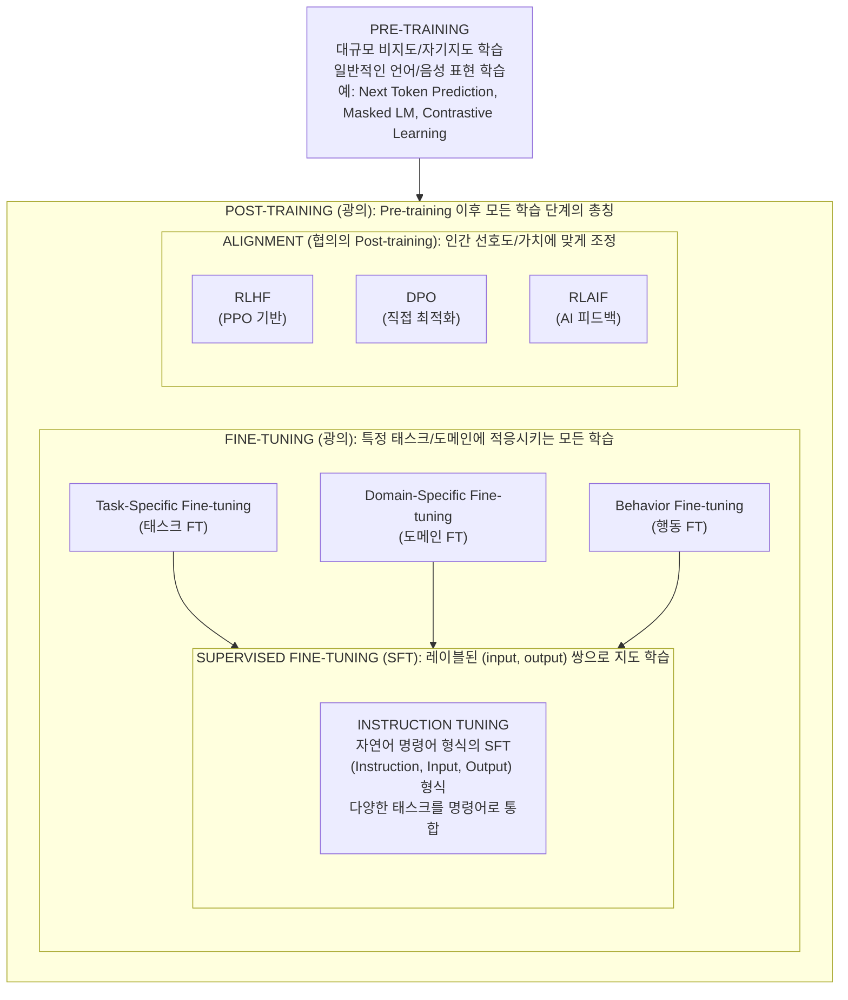

### 1.2 Quick Reference Table

| 용어 | 정의 | 데이터 | 목적 | 상위 개념 |
|------|------|--------|------|-----------|
| **Pre-training** | 대규모 비지도 학습 | 비레이블, 대용량 | 일반 표현 학습 | - |
| **Post-training** | Pre-training 이후 모든 학습 | 다양함 | 특화/정렬 | - |
| **Fine-tuning** | 특정 태스크/도메인 적응 | 소규모, 태스크별 | 태스크 성능 향상 | Post-training |
| **SFT** | 레이블 데이터로 지도 학습 | (input, output) 쌍 | 원하는 출력 학습 | Fine-tuning |
| **Instruction Tuning** | 명령어 형식의 SFT | (instruction, input, output) | 명령 수행 능력 | SFT |
| **Alignment** | 인간 선호도 정렬 | 선호도 데이터 | 안전성/유용성 | Post-training |
| **RLHF** | 강화학습 기반 정렬 | 인간 피드백 | 선호도 최적화 | Alignment |
| **DPO** | 직접 선호도 최적화 | 선호도 쌍 | RLHF 단순화 | Alignment |

---

## 2. Training Lifecycle Overview

### 2.1 LLM Training Lifecycle

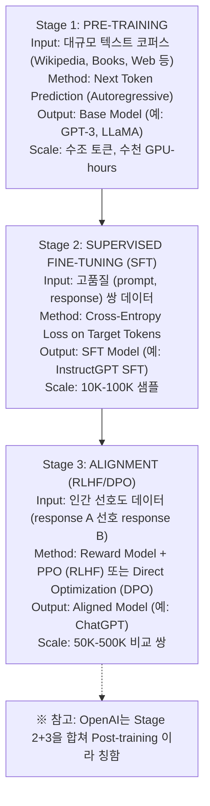

### 2.2 Speech/Audio Training Lifecycle

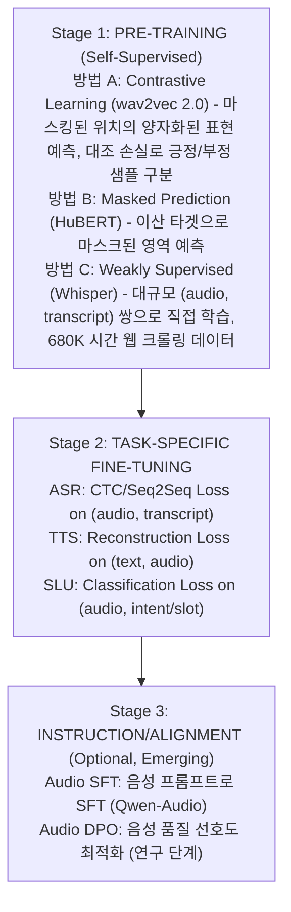

---

## 3. Detailed Definitions

### 3.1 Pre-training (사전 학습)

**정의**: 대규모 데이터에서 **비지도 또는 자기지도 학습**을 통해 **일반적인 표현(representation)**을 학습하는 단계

#### 3.1.1 LLM에서의 Pre-training

```
┌─────────────────────────────────────────────────────────────────────────────────┐
│                         LLM PRE-TRAINING METHODS                                │
├─────────────────────────────────────────────────────────────────────────────────┤
│                                                                                 │
│  1. Autoregressive LM (GPT 계열)                                                │
│  ┌───────────────────────────────────────────────────────────────────────────┐ │
│  │ 목표: P(w_t | w_1, ..., w_{t-1}) 예측                                       │ │
│  │ 입력: "The cat sat on the"                                                 │ │
│  │ 타겟: "mat"                                                                 │ │
│  │ 손실: Cross-Entropy on next token                                          │ │
│  │                                                                             │ │
│  │ 예시 모델: GPT-2, GPT-3, LLaMA, Mistral                                     │ │
│  └───────────────────────────────────────────────────────────────────────────┘ │
│                                                                                 │
│  2. Masked Language Model (BERT 계열)                                           │
│  ┌───────────────────────────────────────────────────────────────────────────┐ │
│  │ 목표: P(w_i | context) 예측 (양방향)                                        │ │
│  │ 입력: "The [MASK] sat on the mat"                                          │ │
│  │ 타겟: "cat"                                                                 │ │
│  │ 손실: Cross-Entropy on masked tokens                                       │ │
│  │                                                                             │ │
│  │ 예시 모델: BERT, RoBERTa, ALBERT                                            │ │
│  └───────────────────────────────────────────────────────────────────────────┘ │
│                                                                                 │
│  3. Encoder-Decoder (T5 계열)                                                   │
│  ┌───────────────────────────────────────────────────────────────────────────┐ │
│  │ 목표: Span Corruption 복원                                                  │ │
│  │ 입력: "The <extra_id_0> sat on <extra_id_1>"                                │ │
│  │ 타겟: "<extra_id_0> cat <extra_id_1> the mat"                               │ │
│  │                                                                             │ │
│  │ 예시 모델: T5, FLAN-T5, UL2                                                 │ │
│  └───────────────────────────────────────────────────────────────────────────┘ │
│                                                                                 │
└─────────────────────────────────────────────────────────────────────────────────┘
```

#### 3.1.2 Speech에서의 Pre-training

```
┌─────────────────────────────────────────────────────────────────────────────────┐
│                       SPEECH PRE-TRAINING METHODS                               │
├─────────────────────────────────────────────────────────────────────────────────┤
│                                                                                 │
│  1. Contrastive Learning (wav2vec 2.0)                                          │
│  ┌───────────────────────────────────────────────────────────────────────────┐ │
│  │ 방법:                                                                       │ │
│  │   1) CNN으로 raw audio → latent representations                             │ │
│  │   2) 일부 프레임 마스킹                                                     │ │
│  │   3) Transformer로 context 학습                                             │ │
│  │   4) 마스크 위치에서 true vs distractors 구분                               │ │
│  │                                                                             │ │
│  │ 손실: InfoNCE (Contrastive Loss)                                            │ │
│  │                                                                             │ │
│  │         exp(sim(c_t, q_t) / τ)                                              │ │
│  │  L = - log ─────────────────────────────                                    │ │
│  │         exp(sim(c_t, q_t)) + Σ exp(sim(c_t, q_n))                           │ │
│  │                                                                             │ │
│  │ c_t = context representation, q_t = true target, q_n = negatives            │ │
│  └───────────────────────────────────────────────────────────────────────────┘ │
│                                                                                 │
│  2. Masked Prediction (HuBERT)                                                  │ │
│  ┌───────────────────────────────────────────────────────────────────────────┐ │
│  │ 방법:                                                                       │ │
│  │   1) K-means로 오디오를 이산 단위로 클러스터링                               │ │
│  │   2) 마스킹된 영역의 클러스터 ID 예측                                       │ │
│  │                                                                             │ │
│  │ 손실: Cross-Entropy on discrete units                                       │ │
│  └───────────────────────────────────────────────────────────────────────────┘ │
│                                                                                 │
│  3. Weakly Supervised (Whisper)                                                 │ │
│  ┌───────────────────────────────────────────────────────────────────────────┐ │
│  │ 특징: 순수 self-supervised가 아닌 (audio, text) 쌍 사용                     │ │
│  │ 데이터: 680K 시간의 웹 크롤링 (audio, transcript)                           │ │
│  │ 손실: Seq2Seq Cross-Entropy                                                 │ │
│  │                                                                             │ │
│  │ ※ "weakly" = 웹에서 자동 수집된 노이즈 있는 레이블                          │ │
│  └───────────────────────────────────────────────────────────────────────────┘ │
│                                                                                 │
└─────────────────────────────────────────────────────────────────────────────────┘
```

### 3.2 Fine-tuning (미세 조정)

**정의**: Pre-trained 모델을 **특정 태스크나 도메인에 적응**시키는 학습

#### 3.2.1 Fine-tuning의 종류

```
┌─────────────────────────────────────────────────────────────────────────────────┐
│                          FINE-TUNING TAXONOMY                                   │
├─────────────────────────────────────────────────────────────────────────────────┤
│                                                                                 │
│  1. Task-Specific Fine-tuning (태스크별 미세 조정)                              │
│  ┌───────────────────────────────────────────────────────────────────────────┐ │
│  │ 목적: 특정 태스크 성능 최적화                                               │ │
│  │ 예시:                                                                       │ │
│  │   • BERT → Sentiment Classification                                        │ │
│  │   • wav2vec 2.0 → ASR with CTC loss                                        │ │
│  │   • GPT → Summarization                                                    │ │
│  └───────────────────────────────────────────────────────────────────────────┘ │
│                                                                                 │
│  2. Domain-Specific Fine-tuning (도메인별 미세 조정)                            │
│  ┌───────────────────────────────────────────────────────────────────────────┐ │
│  │ 목적: 특정 도메인 지식/어휘 습득                                            │ │
│  │ 예시:                                                                       │ │
│  │   • LLaMA → Medical LLM (의료 텍스트)                                       │ │
│  │   • Whisper → Medical ASR (의료 음성)                                       │ │
│  │   • GPT → Legal Document Generator                                         │ │
│  └───────────────────────────────────────────────────────────────────────────┘ │
│                                                                                 │
│  3. Behavior Fine-tuning (행동 미세 조정)                                       │
│  ┌───────────────────────────────────────────────────────────────────────────┐ │
│  │ 목적: 모델의 응답 스타일/행동 조정                                          │ │
│  │ 예시:                                                                       │ │
│  │   • Base LLM → Chat Model (대화형)                                          │ │
│  │   • TTS Model → Emotional TTS (감정 표현)                                   │ │
│  │   • ASR → Conversational ASR (대화체 인식)                                  │ │
│  └───────────────────────────────────────────────────────────────────────────┘ │
│                                                                                 │
│  4. Parameter-Efficient Fine-tuning (파라미터 효율적 미세 조정)                 │
│  ┌───────────────────────────────────────────────────────────────────────────┐ │
│  │ 방법:                                                                       │ │
│  │   • LoRA: 저랭크 어댑터 추가                                                │ │
│  │   • Adapter: 중간 레이어 삽입                                               │ │
│  │   • Prefix Tuning: 소프트 프롬프트 학습                                     │ │
│  │   • QLoRA: 양자화 + LoRA                                                    │ │
│  │                                                                             │ │
│  │ 장점: 메모리 효율적, 원본 가중치 보존                                        │ │
│  └───────────────────────────────────────────────────────────────────────────┘ │
│                                                                                 │
└─────────────────────────────────────────────────────────────────────────────────┘
```

### 3.3 Supervised Fine-tuning (SFT)

**정의**: **레이블된 (input, output) 쌍**으로 지도 학습하는 Fine-tuning

```
┌─────────────────────────────────────────────────────────────────────────────────┐
│                    SUPERVISED FINE-TUNING (SFT) DETAIL                          │
├─────────────────────────────────────────────────────────────────────────────────┤
│                                                                                 │
│  핵심 특징:                                                                     │
│  • "Supervised" = 입력과 출력이 모두 주어진 데이터                              │
│  • 모델이 주어진 입력에 대해 정확한 출력을 생성하도록 학습                       │
│  • Pre-training과 달리 명시적인 정답(target)이 존재                              │
│                                                                                 │
│  ┌───────────────────────────────────────────────────────────────────────────┐ │
│  │                     LLM SFT 데이터 예시                                     │ │
│  ├───────────────────────────────────────────────────────────────────────────┤ │
│  │                                                                             │ │
│  │  Input (Prompt):                                                            │ │
│  │  "다음 문장을 영어로 번역하세요: 오늘 날씨가 좋네요."                        │ │
│  │                                                                             │ │
│  │  Output (Target):                                                           │ │
│  │  "The weather is nice today."                                               │ │
│  │                                                                             │ │
│  │  손실 계산:                                                                  │ │
│  │  L = -Σ log P(output_token_i | input, output_tokens_<i)                     │ │
│  │                                                                             │ │
│  └───────────────────────────────────────────────────────────────────────────┘ │
│                                                                                 │
│  ┌───────────────────────────────────────────────────────────────────────────┐ │
│  │                    Speech SFT 데이터 예시                                   │ │
│  ├───────────────────────────────────────────────────────────────────────────┤ │
│  │                                                                             │ │
│  │  ASR SFT:                                                                   │ │
│  │    Input: [오디오 파형]                                                     │ │
│  │    Output: "안녕하세요 오늘 날씨가 좋네요"                                   │ │
│  │                                                                             │ │
│  │  TTS SFT:                                                                   │ │
│  │    Input: "안녕하세요"                                                       │ │
│  │    Output: [오디오 코드/파형]                                                │ │
│  │                                                                             │ │
│  │  Audio QA SFT (Qwen-Audio):                                                 │ │
│  │    Input: [오디오] + "이 오디오에서 어떤 감정이 느껴지나요?"                 │ │
│  │    Output: "화자는 기쁜 감정을 표현하고 있습니다."                           │ │
│  │                                                                             │ │
│  └───────────────────────────────────────────────────────────────────────────┘ │
│                                                                                 │
└─────────────────────────────────────────────────────────────────────────────────┘
```

### 3.4 Instruction Tuning (명령어 튜닝)

**정의**: **자연어 명령어(instruction) 형식**의 데이터로 SFT하는 것

#### 3.4.1 Instruction Tuning vs 일반 SFT

```
┌─────────────────────────────────────────────────────────────────────────────────┐
│               INSTRUCTION TUNING vs GENERAL SFT                                 │
├─────────────────────────────────────────────────────────────────────────────────┤
│                                                                                 │
│  ┌─────────────────────────────────────┬─────────────────────────────────────┐ │
│  │         일반 SFT (Task-Specific)    │        Instruction Tuning           │ │
│  ├─────────────────────────────────────┼─────────────────────────────────────┤ │
│  │                                     │                                     │ │
│  │  데이터 형식:                       │  데이터 형식:                       │ │
│  │  (input, output)                    │  (instruction, input, output)       │ │
│  │                                     │                                     │ │
│  │  예시:                              │  예시:                              │ │
│  │  Input: "I love this movie"         │  Instruction: "Classify the         │ │
│  │  Output: "positive"                 │   sentiment of the following text." │ │
│  │                                     │  Input: "I love this movie"         │ │
│  │                                     │  Output: "positive"                 │ │
│  │                                     │                                     │ │
│  │  특징:                              │  특징:                              │ │
│  │  • 단일 태스크 최적화               │  • 다양한 태스크 통합               │ │
│  │  • 태스크별 모델 필요               │  • 하나의 모델로 여러 태스크        │ │
│  │  • Zero-shot 능력 제한적            │  • Zero-shot 능력 향상              │ │
│  │                                     │                                     │ │
│  │  모델 예시:                         │  모델 예시:                         │ │
│  │  • BERT + Classification Head       │  • FLAN-T5                          │ │
│  │  • GPT-2 for Summarization          │  • InstructGPT                      │ │
│  │                                     │  • Alpaca, Vicuna                   │ │
│  │                                     │                                     │ │
│  └─────────────────────────────────────┴─────────────────────────────────────┘ │
│                                                                                 │
└─────────────────────────────────────────────────────────────────────────────────┘
```

#### 3.4.2 Instruction Tuning 데이터 형식

```
┌─────────────────────────────────────────────────────────────────────────────────┐
│                    INSTRUCTION TUNING DATA FORMATS                              │
├─────────────────────────────────────────────────────────────────────────────────┤
│                                                                                 │
│  Format 1: Standard Instruction Format                                          │
│  ┌───────────────────────────────────────────────────────────────────────────┐ │
│  │ {                                                                           │ │
│  │   "instruction": "다음 텍스트를 요약하세요.",                               │ │
│  │   "input": "인공지능은 컴퓨터 과학의 한 분야로...(긴 텍스트)...",           │ │
│  │   "output": "인공지능은 인간의 지능을 모방하는 컴퓨터 기술입니다."          │ │
│  │ }                                                                           │ │
│  └───────────────────────────────────────────────────────────────────────────┘ │
│                                                                                 │
│  Format 2: Chat/Conversation Format                                             │
│  ┌───────────────────────────────────────────────────────────────────────────┐ │
│  │ {                                                                           │ │
│  │   "messages": [                                                             │ │
│  │     {"role": "system", "content": "You are a helpful assistant."},          │ │
│  │     {"role": "user", "content": "Python으로 피보나치 수열을 구현해줘"},      │ │
│  │     {"role": "assistant", "content": "def fib(n):\n    if n <= 1:..."}      │ │
│  │   ]                                                                         │ │
│  │ }                                                                           │ │
│  └───────────────────────────────────────────────────────────────────────────┘ │
│                                                                                 │
│  Format 3: Few-shot Format (FLAN)                                               │
│  ┌───────────────────────────────────────────────────────────────────────────┐ │
│  │ "Classify the sentiment. Examples:                                          │ │
│  │  'Great movie!' -> positive                                                 │ │
│  │  'Terrible acting' -> negative                                              │ │
│  │                                                                             │ │
│  │  Now classify: 'I enjoyed every minute of it'"                              │ │
│  │                                                                             │ │
│  │  -> "positive"                                                              │ │
│  └───────────────────────────────────────────────────────────────────────────┘ │
│                                                                                 │
└─────────────────────────────────────────────────────────────────────────────────┘
```

### 3.5 Post-training (후학습)

**정의**: Pre-training 이후 수행되는 **모든 추가 학습 단계의 총칭**

```
┌─────────────────────────────────────────────────────────────────────────────────┐
│                         POST-TRAINING SCOPE                                     │
├─────────────────────────────────────────────────────────────────────────────────┤
│                                                                                 │
│  ┌───────────────────────────────────────────────────────────────────────────┐ │
│  │                    POST-TRAINING (광의)                                    │ │
│  │                                                                             │ │
│  │  = Pre-training 이후의 모든 학습                                            │ │
│  │                                                                             │ │
│  │  포함 범위:                                                                 │ │
│  │  ├─ Fine-tuning (모든 유형)                                                 │ │
│  │  ├─ SFT                                                                     │ │
│  │  ├─ Instruction Tuning                                                      │ │
│  │  ├─ Alignment (RLHF, DPO, RLAIF)                                            │ │
│  │  └─ Continued Pre-training                                                  │ │
│  │                                                                             │ │
│  └───────────────────────────────────────────────────────────────────────────┘ │
│                                                                                 │
│  ┌───────────────────────────────────────────────────────────────────────────┐ │
│  │                    POST-TRAINING (협의 - OpenAI/Anthropic 용례)            │ │
│  │                                                                             │ │
│  │  = SFT + Alignment                                                          │ │
│  │                                                                             │ │
│  │  "Post-training transforms a capable but potentially problematic            │ │
│  │   base model into a helpful, harmless, and honest assistant."               │ │
│  │                                                                             │ │
│  │  주요 목적:                                                                 │ │
│  │  1. Instruction Following (명령 수행 능력)                                  │ │
│  │  2. Helpfulness (유용성)                                                    │ │
│  │  3. Safety (안전성)                                                         │ │
│  │  4. Honesty (정직성)                                                        │ │
│  │                                                                             │ │
│  └───────────────────────────────────────────────────────────────────────────┘ │
│                                                                                 │
│  ※ 용어 사용 주의:                                                              │
│  • Google: "Instruction Fine-tuning"                                           │
│  • OpenAI: "Post-training" (SFT + RLHF)                                        │
│  • Meta: "Fine-tuning" + "Alignment"                                           │
│  • 학계: "Alignment" 또는 "Preference Learning"                                 │
│                                                                                 │
└─────────────────────────────────────────────────────────────────────────────────┘
```

### 3.6 Alignment (정렬)

**정의**: 모델을 **인간의 선호도, 가치, 의도**에 맞게 조정하는 학습

```
┌─────────────────────────────────────────────────────────────────────────────────┐
│                          ALIGNMENT METHODS                                      │
├─────────────────────────────────────────────────────────────────────────────────┤
│                                                                                 │
│  1. RLHF (Reinforcement Learning from Human Feedback)                           │
│  ┌───────────────────────────────────────────────────────────────────────────┐ │
│  │                                                                             │ │
│  │  Step 1: Reward Model 학습                                                  │ │
│  │  ┌─────────────────────────────────────────────────────────────────────┐   │ │
│  │  │  Prompt: "Explain quantum physics"                                   │   │ │
│  │  │  Response A: "Quantum physics is the study of..."  (선호됨)          │   │ │
│  │  │  Response B: "I don't know about that..."  (비선호)                  │   │ │
│  │  │                                                                      │   │ │
│  │  │  → Reward Model: R(prompt, response) → scalar score                  │   │ │
│  │  └─────────────────────────────────────────────────────────────────────┘   │ │
│  │                                                                             │ │
│  │  Step 2: PPO로 정책 최적화                                                  │ │
│  │  ┌─────────────────────────────────────────────────────────────────────┐   │ │
│  │  │  max E[R(response)] - β * KL(π || π_ref)                             │   │ │
│  │  │                                                                      │   │ │
│  │  │  - Reward 최대화하면서                                                │   │ │
│  │  │  - 원본 모델(π_ref)에서 너무 벗어나지 않도록 제약                     │   │ │
│  │  └─────────────────────────────────────────────────────────────────────┘   │ │
│  │                                                                             │ │
│  └───────────────────────────────────────────────────────────────────────────┘ │
│                                                                                 │
│  2. DPO (Direct Preference Optimization)                                        │
│  ┌───────────────────────────────────────────────────────────────────────────┐ │
│  │                                                                             │ │
│  │  핵심 아이디어: Reward Model 없이 직접 선호도 학습                          │ │
│  │                                                                             │ │
│  │  손실 함수:                                                                 │ │
│  │  L = -E[log σ(β * (log π(y_w|x)/π_ref(y_w|x)                               │ │
│  │                    - log π(y_l|x)/π_ref(y_l|x)))]                           │ │
│  │                                                                             │ │
│  │  y_w = preferred (winner), y_l = dispreferred (loser)                       │ │
│  │                                                                             │ │
│  │  장점:                                                                      │ │
│  │  - Reward Model 학습 불필요                                                 │ │
│  │  - PPO 불필요 (복잡한 RL 제거)                                              │ │
│  │  - 안정적인 학습                                                            │ │
│  │  - 구현이 단순                                                              │ │
│  │                                                                             │ │
│  └───────────────────────────────────────────────────────────────────────────┘ │
│                                                                                 │
│  3. RLAIF (RL from AI Feedback)                                                 │
│  ┌───────────────────────────────────────────────────────────────────────────┐ │
│  │                                                                             │ │
│  │  = RLHF와 동일한 프레임워크                                                 │ │
│  │  - 단, Human labeler 대신 AI (강력한 LLM)이 피드백 제공                     │ │
│  │                                                                             │ │
│  │  예: Constitutional AI (Anthropic)                                          │ │
│  │  - Claude가 헌법(principles)에 따라 자기 출력을 평가                        │ │
│  │                                                                             │ │
│  └───────────────────────────────────────────────────────────────────────────┘ │
│                                                                                 │
└─────────────────────────────────────────────────────────────────────────────────┘
```

---

## 4. Relationship Hierarchy

### 4.1 용어 포함 관계

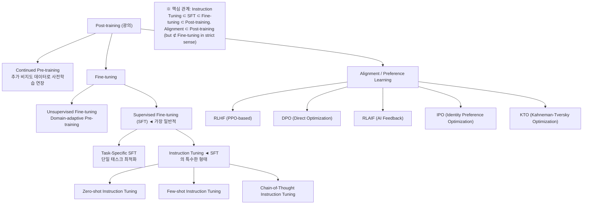

### 4.2 시간순 Training Pipeline

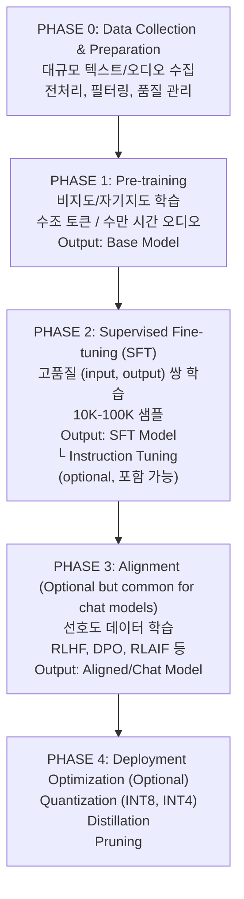

---

## 5. LLM/NLP Domain Examples

### 5.1 실제 모델별 학습 파이프라인

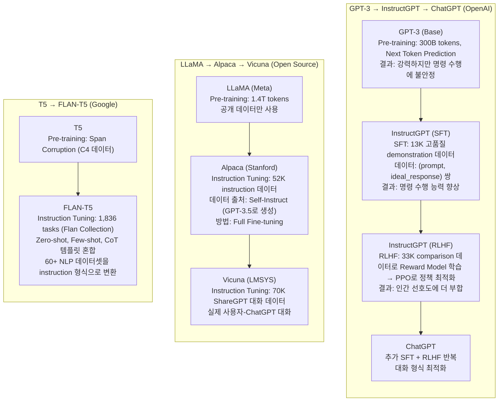

### 5.2 Instruction Tuning 데이터셋 예시

```
┌─────────────────────────────────────────────────────────────────────────────────┐
│                 INSTRUCTION TUNING DATASET EXAMPLES                             │
├─────────────────────────────────────────────────────────────────────────────────┤
│                                                                                 │
│  1. FLAN Collection (Google)                                                    │
│  ┌───────────────────────────────────────────────────────────────────────────┐ │
│  │ 규모: 1,836 tasks, 15M+ examples                                           │ │
│  │ 형식: Zero-shot, Few-shot, Chain-of-Thought 혼합                           │ │
│  │                                                                             │ │
│  │ 예시 (감정 분류):                                                           │ │
│  │ ┌─────────────────────────────────────────────────────────────────────┐   │ │
│  │ │ Zero-shot:                                                          │   │ │
│  │ │ "Is the following sentence positive or negative? 'I love this!'"   │   │ │
│  │ │ → "positive"                                                        │   │ │
│  │ │                                                                     │   │ │
│  │ │ Few-shot:                                                           │   │ │
│  │ │ "Classify sentiment:                                                │   │ │
│  │ │  'Great movie!' → positive                                          │   │ │
│  │ │  'Terrible!' → negative                                             │   │ │
│  │ │  'I love this!' → "                                                 │   │ │
│  │ │ → "positive"                                                        │   │ │
│  │ └─────────────────────────────────────────────────────────────────────┘   │ │
│  └───────────────────────────────────────────────────────────────────────────┘ │
│                                                                                 │
│  2. Self-Instruct / Alpaca (Stanford)                                           │
│  ┌───────────────────────────────────────────────────────────────────────────┐ │
│  │ 규모: 52K instructions                                                      │ │
│  │ 생성: GPT-3.5로 자동 생성                                                   │ │
│  │                                                                             │ │
│  │ 예시:                                                                       │ │
│  │ {                                                                           │ │
│  │   "instruction": "Give three tips for staying healthy.",                   │ │
│  │   "input": "",                                                              │ │
│  │   "output": "1. Eat a balanced diet...\n2. Exercise...\n3. Get sleep..."   │ │
│  │ }                                                                           │ │
│  └───────────────────────────────────────────────────────────────────────────┘ │
│                                                                                 │
│  3. ShareGPT / OpenAssistant (Community)                                        │
│  ┌───────────────────────────────────────────────────────────────────────────┐ │
│  │ 규모: 70K-160K 대화                                                         │ │
│  │ 특징: 실제 사용자 대화 (Multi-turn)                                         │ │
│  │                                                                             │ │
│  │ 예시:                                                                       │ │
│  │ {                                                                           │ │
│  │   "conversations": [                                                        │ │
│  │     {"from": "human", "value": "Python으로 정렬 알고리즘 구현해줘"},        │ │
│  │     {"from": "gpt", "value": "여러 정렬 알고리즘을 구현해드리겠습니다..."}  │ │
│  │   ]                                                                         │ │
│  │ }                                                                           │ │
│  └───────────────────────────────────────────────────────────────────────────┘ │
│                                                                                 │
└─────────────────────────────────────────────────────────────────────────────────┘
```

---

## 6. Speech/Audio Domain Examples

### 6.1 음성 모델 학습 파이프라인

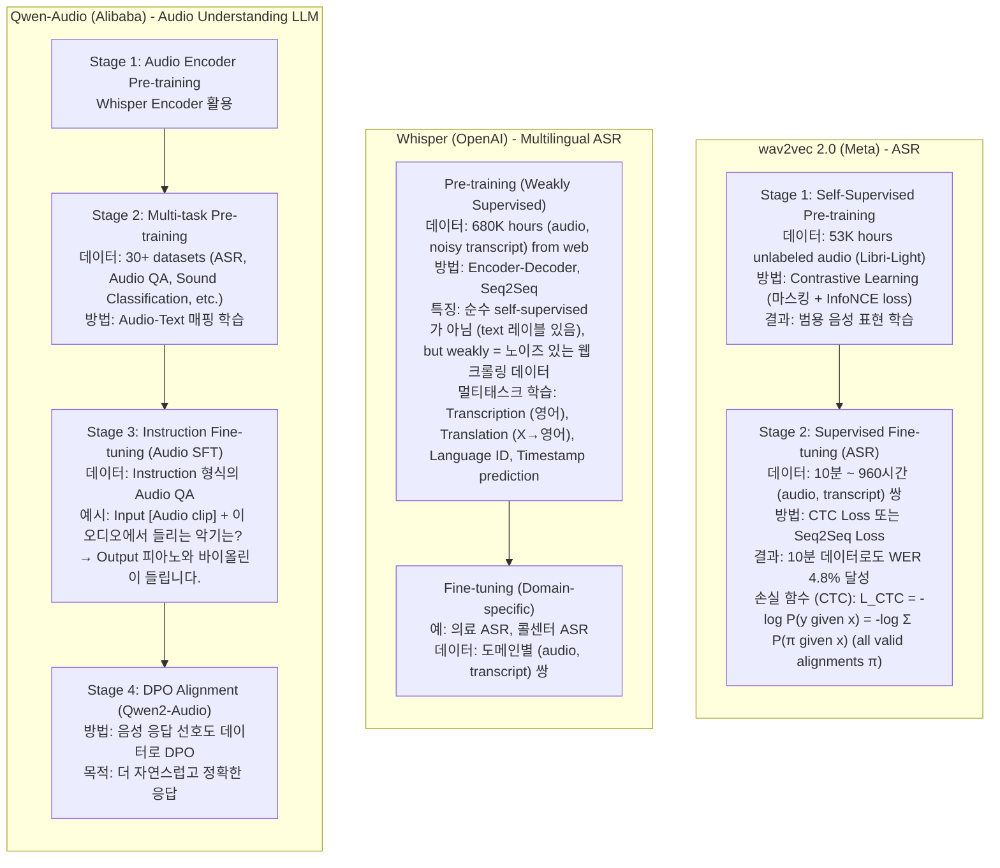

### 6.2 TTS 모델 학습 파이프라인

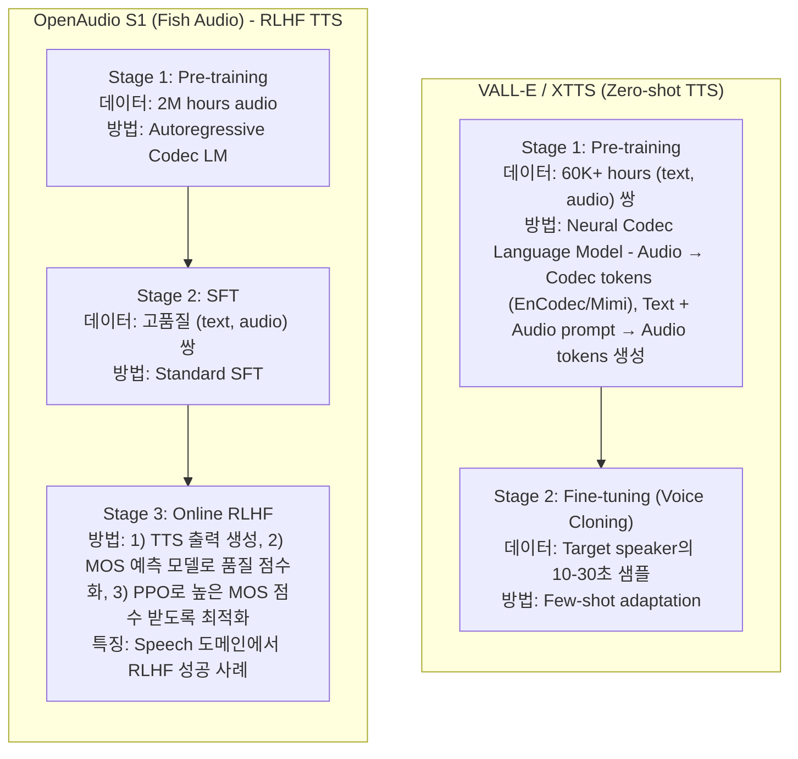

---

## 7. Moshi Training Pipeline Analysis

### 7.1 Moshi의 4단계 학습 파이프라인

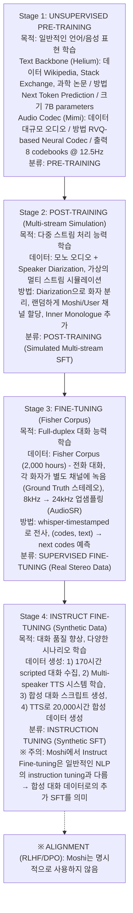

### 7.2 Moshi 학습 단계 분류 정리

| Moshi 용어 | 일반적 분류 | 데이터 | 목적 |
|-----------|-----------|--------|------|
| Unsupervised Pre-training | **Pre-training** | 비레이블 | 일반 표현 학습 |
| Post-training | **SFT** (Simulated) | 시뮬레이션 스테레오 | 멀티스트림 학습 |
| Fine-tuning | **SFT** (Real Data) | Fisher (실제 스테레오) | Full-duplex 학습 |
| Instruct Fine-tuning | **SFT** (Synthetic) | TTS 합성 대화 | 품질 향상 |

### 7.3 J-Moshi의 학습 파이프라인 비교

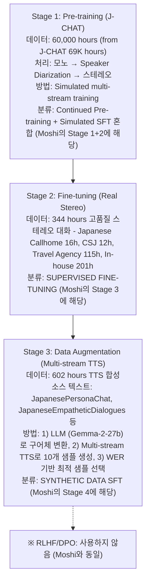

---

## 8. Data Composition Guide

### 8.1 학습 단계별 데이터 특성

```
┌─────────────────────────────────────────────────────────────────────────────────┐
│                    DATA CHARACTERISTICS BY TRAINING STAGE                       │
├─────────────────────────────────────────────────────────────────────────────────┤
│                                                                                 │
│  ┌─────────────────────────────────────────────────────────────────────────┐   │
│  │                        PRE-TRAINING DATA                                 │   │
│  ├─────────────────────────────────────────────────────────────────────────┤   │
│  │                                                                          │   │
│  │  특징:                                                                   │   │
│  │  • 대규모 (TB 단위)                                                      │   │
│  │  • 비레이블 또는 약한 레이블                                             │   │
│  │  • 다양성 중요 (도메인, 스타일, 언어)                                    │   │
│  │  • 품질보다 양이 중요                                                    │   │
│  │                                                                          │   │
│  │  LLM 예시:                                                               │   │
│  │  • Common Crawl, Wikipedia, Books, Code                                  │   │
│  │  • 수조 토큰                                                             │   │
│  │                                                                          │   │
│  │  Speech 예시:                                                            │   │
│  │  • Libri-Light (60K hours), J-CHAT (69K hours)                           │   │
│  │  • YouTube/Podcast 크롤링                                                │   │
│  │                                                                          │   │
│  └─────────────────────────────────────────────────────────────────────────┘   │
│                                                                                 │
│  ┌─────────────────────────────────────────────────────────────────────────┐   │
│  │                        SFT DATA                                          │   │
│  ├─────────────────────────────────────────────────────────────────────────┤   │
│  │                                                                          │   │
│  │  특징:                                                                   │   │
│  │  • 중간 규모 (10K-100K 샘플)                                             │   │
│  │  • 고품질 레이블 필수                                                    │   │
│  │  • (input, output) 쌍 형식                                               │   │
│  │  • 양보다 품질이 중요                                                    │   │
│  │                                                                          │   │
│  │  LLM 예시:                                                               │   │
│  │  • Human demonstrations (prompt, ideal_response)                         │   │
│  │  • 인간 작성자 또는 강력한 LLM 생성                                      │   │
│  │                                                                          │   │
│  │  Speech 예시:                                                            │   │
│  │  • Fisher Corpus (2K hours stereo)                                       │   │
│  │  • 전문 녹음 스튜디오 데이터                                             │   │
│  │                                                                          │   │
│  └─────────────────────────────────────────────────────────────────────────┘   │
│                                                                                 │
│  ┌─────────────────────────────────────────────────────────────────────────┐   │
│  │                    INSTRUCTION TUNING DATA                               │   │
│  ├─────────────────────────────────────────────────────────────────────────┤   │
│  │                                                                          │   │
│  │  특징:                                                                   │   │
│  │  • (instruction, input, output) 3-tuple 형식                             │   │
│  │  • 다양한 태스크/명령어 포함                                             │   │
│  │  • Zero-shot, Few-shot, CoT 템플릿 혼합                                  │   │
│  │                                                                          │   │
│  │  LLM 예시:                                                               │   │
│  │  • FLAN Collection (1,836 tasks)                                         │   │
│  │  • Alpaca (52K instructions)                                             │   │
│  │  • ShareGPT (70K conversations)                                          │   │
│  │                                                                          │   │
│  │  Speech 예시 (emerging):                                                 │   │
│  │  • Audio QA: [audio] + "질문" → "답변"                                   │   │
│  │  • Audio Instruction: "이 오디오를 요약해줘" → "요약"                    │   │
│  │                                                                          │   │
│  └─────────────────────────────────────────────────────────────────────────┘   │
│                                                                                 │
│  ┌─────────────────────────────────────────────────────────────────────────┐   │
│  │                    ALIGNMENT (PREFERENCE) DATA                           │   │
│  ├─────────────────────────────────────────────────────────────────────────┤   │
│  │                                                                          │   │
│  │  특징:                                                                   │   │
│  │  • (prompt, chosen, rejected) 3-tuple 형식                               │   │
│  │  • 인간/AI 평가자의 선호도                                               │   │
│  │  • 상대적 비교 (A > B)                                                   │   │
│  │                                                                          │   │
│  │  LLM 예시:                                                               │   │
│  │  • Anthropic HH-RLHF (170K comparisons)                                  │   │
│  │  • OpenAI comparison data                                                │   │
│  │  • UltraFeedback                                                         │   │
│  │                                                                          │   │
│  │  Speech 예시 (연구 단계):                                                │   │
│  │  • TTS 품질 선호도: Audio A > Audio B                                    │   │
│  │  • MOS 점수 기반 자동 레이블링                                           │   │
│  │                                                                          │   │
│  └─────────────────────────────────────────────────────────────────────────┘   │
│                                                                                 │
└─────────────────────────────────────────────────────────────────────────────────┘
```

### 8.2 K-Moshi를 위한 데이터 구성 권장

```
┌─────────────────────────────────────────────────────────────────────────────────┐
│                    K-MOSHI DATA COMPOSITION RECOMMENDATION                      │
├─────────────────────────────────────────────────────────────────────────────────┤
│                                                                                 │
│  Phase 1: Bootstrap with External TTS (SFT)                                     │
│  ┌───────────────────────────────────────────────────────────────────────────┐ │
│  │                                                                             │ │
│  │  목표: ~500-1000시간 합성 데이터                                           │ │
│  │                                                                             │ │
│  │  텍스트 소스:                                                               │ │
│  │  ├─ AI Hub 감성 대화 → TTS 합성                                            │ │
│  │  ├─ 모두의 말뭉치 구어/메신저 → TTS 합성                                   │ │
│  │  └─ LLM으로 대화 생성 → TTS 합성                                           │ │
│  │                                                                             │ │
│  │  데이터 형식:                                                               │ │
│  │  {                                                                          │ │
│  │    "path": "stereo_audio.wav",  // L=Moshi, R=User                         │ │
│  │    "duration": 45.2,                                                        │ │
│  │    "alignments": [["안녕하세요", [0.0, 0.8], "SPEAKER_MAIN"], ...]         │ │
│  │  }                                                                          │ │
│  │                                                                             │ │
│  │  분류: SUPERVISED FINE-TUNING (Synthetic Data)                              │ │
│  │                                                                             │ │
│  └───────────────────────────────────────────────────────────────────────────┘ │
│                                                                                 │
│  Phase 2: Self-Generation (Data Augmentation)                                   │
│  ┌───────────────────────────────────────────────────────────────────────────┐ │
│  │                                                                             │ │
│  │  목표: ~500-1000시간 추가 데이터                                           │ │
│  │                                                                             │ │
│  │  방법 (J-Moshi 방식):                                                       │ │
│  │  1) Phase 1으로 학습된 K-Moshi 사용                                         │ │
│  │  2) 새로운 텍스트 대화 입력                                                 │ │
│  │  3) Multi-stream TTS로 여러 샘플 생성                                       │ │
│  │  4) WER 기반 최적 샘플 선택                                                 │ │
│  │                                                                             │ │
│  │  분류: SELF-TRAINING / DATA AUGMENTATION                                    │ │
│  │                                                                             │ │
│  └───────────────────────────────────────────────────────────────────────────┘ │
│                                                                                 │
│  Phase 3 (Optional): Real Stereo Fine-tuning                                    │
│  ┌───────────────────────────────────────────────────────────────────────────┐ │
│  │                                                                             │ │
│  │  목표: 실제 한국어 스테레오 대화 데이터로 Fine-tuning                       │ │
│  │                                                                             │ │
│  │  데이터 소스:                                                               │ │
│  │  ├─ KsponSpeech (스테레오 가능 부분)                                        │ │
│  │  └─ 자체 녹음 데이터                                                        │ │
│  │                                                                             │ │
│  │  분류: SUPERVISED FINE-TUNING (Real Data)                                   │ │
│  │                                                                             │ │
│  └───────────────────────────────────────────────────────────────────────────┘ │
│                                                                                 │
└─────────────────────────────────────────────────────────────────────────────────┘
```

---

## 9. Practical Decision Framework

### 9.1 학습 방법 선택 가이드

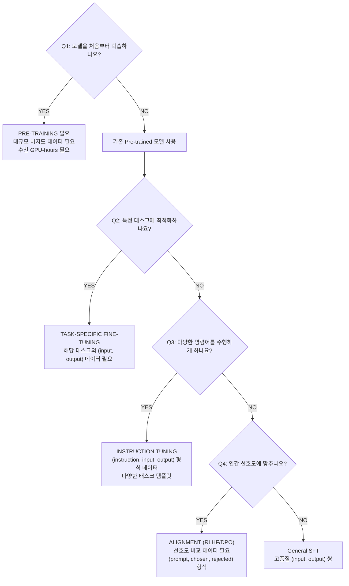

### 9.2 K-Moshi 학습 권장 전략

| 단계 | 방법 | 데이터 | 목표 |
|------|------|--------|------|
| 1 | **Synthetic SFT** | TTS 합성 대화 500-1000h | Full-duplex 기본 능력 |
| 2 | **Self-Generation** | K-Moshi 자체 생성 500-1000h | 데이터 증강 |
| 3 | **Real Data SFT** (Optional) | 실제 스테레오 대화 | 품질 향상 |
| - | ~~RLHF/DPO~~ | - | 미권장 (검증 사례 없음) |

---

## 10. References

### 10.1 핵심 논문

**LLM Training:**
- [Training language models to follow instructions (InstructGPT)](https://openai.com/index/instruction-following/)
- [FLAN: Introducing instruction fine-tuning](https://research.google/blog/introducing-flan-more-generalizable-language-models-with-instruction-fine-tuning/)
- [DPO: Direct Preference Optimization](https://arxiv.org/abs/2305.18290)

**Speech Training:**
- [wav2vec 2.0: Self-Supervised Learning of Speech](https://arxiv.org/abs/2006.11477)
- [Whisper: Robust Speech Recognition](https://openai.com/research/whisper)
- [Moshi: Speech-Text Foundation Model](https://arxiv.org/abs/2410.00037)
- [J-Moshi: Japanese Full-duplex Dialogue](https://arxiv.org/abs/2506.02979)

### 10.2 참고 자료

- [Instruction Tuning Survey](https://arxiv.org/abs/2308.10792)
- [Understanding SFT (Cameron R. Wolfe)](https://cameronrwolfe.substack.com/p/understanding-and-using-supervised)
- [LLM Fine-tuning Guide (IBM)](https://www.ibm.com/think/topics/instruction-tuning)
- [Post-training Methods (Red Hat)](https://developers.redhat.com/articles/2025/11/04/post-training-methods-language-models)

---

*Last Updated: 2026-01-13*
*Document Version: 1.0*
*Author: K-Moshi Development Team*
