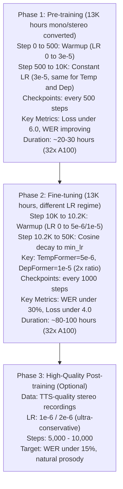

# K-Moshi Training Recipe Analysis

> **Comprehensive Analysis of Training Hyperparameters and Strategies**
>
> Based on: Original Moshi (arXiv:2410.00037), J-Moshi (arXiv:2506.02979)
>
> Last Updated: 2025-01-01

---

## Table of Contents

1. [Executive Summary](#1-executive-summary)
2. [J-Moshi Training Recipe Deep Dive](#2-j-moshi-training-recipe-deep-dive)
3. [Learning Rate Analysis](#3-learning-rate-analysis)
4. [Scheduler Configuration](#4-scheduler-configuration)
5. [Duration vs Batch Size Trade-off](#5-duration-vs-batch-size-trade-off)
6. [Character-Level Interpolation](#6-character-level-interpolation)
7. [Loss Weight Configuration](#7-loss-weight-configuration)
8. [PAD Token Ratio Analysis](#8-pad-token-ratio-analysis)
9. [Recommended Configurations](#9-recommended-configurations)
10. [Training Roadmap](#10-training-roadmap)
11. [Monitoring Guidelines](#11-monitoring-guidelines)
12. [Troubleshooting](#12-troubleshooting)

---

## 1. Executive Summary

### Quick Reference Table

| Parameter | J-Moshi Pre-training | J-Moshi Fine-tuning | K-Moshi Current | K-Moshi Recommended |
|-----------|---------------------|---------------------|-----------------|---------------------|
| **Learning Rate (Temp)** | 3e-5 | 2e-6 | 5e-5 | 3e-5 → 5e-6 |
| **Learning Rate (Dep)** | 3e-5 | 4e-6 | 5e-5 | 3e-5 → 1e-5 |
| **LR Ratio (Temp:Dep)** | 1:1 | 1:2 | 1:1 | 1:1 → 1:2 |
| **Warmup Steps** | 500 | N/A | 100 | 500 |
| **Duration (sec)** | 162 (2.7min) | ? | 40 | 60-90 |
| **Batch Size** | 512 | 16 | 96 | 128 → 64 |
| **PAD Weight** | 0.5 | 0.5 | 0.5 | 0.5 |
| **Semantic:Acoustic** | 100:1 | 100:1 | 100:1 | 100:1 |
| **Total Steps** | 8,880 | 1,423 | 50,000 | 50,000 |

### Key Insights

1. **Two-Stage Training**: J-Moshi uses different LRs for pre-training vs fine-tuning
2. **DepFormer Premium**: Fine-tuning uses 2x LR for DepFormer vs TempFormer
3. **Long Context**: J-Moshi uses 2.7 minute segments (162 seconds)
4. **PAD Ratio**: Japanese has 88% PAD vs English 65% (Korean expected ~85%)

---

## 2. J-Moshi Training Recipe Deep Dive

### 2.1 Paper Reference

**Title**: J-Moshi: Japanese Full-Duplex Spoken Dialogue Model
**arXiv**: 2506.02979
**Published**: June 2025

### 2.2 Pre-training Configuration

```yaml
# J-Moshi Pre-training (69,000 hours monophonic)
dataset:
  name: "J-CHAT corpus"
  size: 69,000 hours
  format: monophonic → converted to stereo via diarization

training:
  duration_tokens: 2,048  # temporal length
  duration_sec: ~162  # 2.7 minutes at 12.5Hz
  batch_size: 512
  total_steps: 8,880  # 1 epoch
  training_time: 36 hours
  hardware: 128x NVIDIA V100 32GB

optimizer:
  type: AdamW
  lr: 3e-5  # single rate for both TempFormer and DepFormer
  beta1: 0.9
  beta2: 0.95
  eps: 1e-5
  weight_decay: 0.1

scheduler:
  type: linear_warmup
  warmup_steps: 500
  # constant after warmup

loss:
  text_padding_weight: 0.5  # 50% weight for PAD tokens
  semantic_weight: 100
  acoustic_weight: 1
```

### 2.3 Fine-tuning Configuration

```yaml
# J-Moshi Fine-tuning (344 hours stereo)
dataset:
  name: "J-CHAT stereo subset"
  size: 344 hours
  format: native stereo recordings

training:
  batch_size: 16
  epochs: 3
  total_steps: 1,423
  training_time: 2 hours
  hardware: 16x NVIDIA V100 32GB

optimizer:
  type: AdamW
  tempformer_lr: 2e-6  # 15x lower than pre-training
  depformer_lr: 4e-6   # 2x higher than TempFormer!
  beta1: 0.9
  beta2: 0.95
  eps: 1e-5
  weight_decay: 0.1
```

### 2.4 Key Observations from J-Moshi

```
┌─────────────────────────────────────────────────────────────────────────────┐
│                    J-MOSHI KEY TRAINING INSIGHTS                            │
├─────────────────────────────────────────────────────────────────────────────┤
│                                                                             │
│  1. MIMI CODEC REMAINS FROZEN                                               │
│     - No Mimi fine-tuning needed for Japanese                               │
│     - Cross-lingual audio encoding works out-of-box                         │
│     - Same expected for Korean                                              │
│                                                                             │
│  2. TWO-STAGE LEARNING RATE STRATEGY                                        │
│     Pre-training:  TempFormer = DepFormer = 3e-5                           │
│     Fine-tuning:   TempFormer = 2e-6, DepFormer = 4e-6                     │
│                                                                             │
│     Ratio change: 1:1 → 1:2                                                 │
│     This suggests DepFormer needs faster adaptation to target language     │
│                                                                             │
│  3. LONG SEQUENCE LENGTH (2.7 minutes)                                      │
│     - Captures complete conversational turns                                │
│     - Better dialogue context modeling                                      │
│     - Higher memory requirement but better quality                          │
│                                                                             │
│  4. HIGH PAD TOKEN RATIO (88%)                                              │
│     - Japanese kanji encode more phonemes per character                     │
│     - Text frames sparse compared to audio frames                           │
│     - PAD weight 0.5 compensates for imbalance                              │
│                                                                             │
│  5. MODEST FINE-TUNING STEPS (1,423)                                        │
│     - Only 3 epochs over 344 hours                                          │
│     - Quality over quantity approach                                        │
│     - Pre-training does heavy lifting                                       │
│                                                                             │
└─────────────────────────────────────────────────────────────────────────────┘
```

---

## 3. Learning Rate Analysis

### 3.1 Learning Rate Comparison

```
Learning Rate Scale (log)
    │
1e-4│
    │  K-Moshi current (5e-5)
5e-5│  ────────────────────────
    │
3e-5│  ════════════════════════  J-Moshi Pre-training
    │
1e-5│
    │
5e-6│  ════════════════════════  K-Moshi Recommended (Fine)
    │  ────────────────────────  J-Moshi Fine (DepFormer: 4e-6)
2e-6│  ═══════════════════════   J-Moshi Fine (TempFormer: 2e-6)
    │
1e-6│
    └──────────────────────────────────────────────────────────►
```

### 3.2 Two-Rate Optimizer Rationale

**Why DepFormer gets higher LR during fine-tuning:**

1. **Architectural Role**:
   - TempFormer: Main temporal transformer (7B parameters)
   - DepFormer: Depth transformer for audio codebook generation (smaller)

2. **Language Adaptation**:
   - TempFormer learned general audio-text alignment patterns
   - DepFormer needs faster adaptation to target language phonetics

3. **Gradient Flow**:
   - TempFormer gradients are more stable (larger model)
   - DepFormer can tolerate higher LR without instability

### 3.3 Implementation in K-Moshi

```python
# finetune/scheduler.py - get_two_rate_optimizer()

def get_two_rate_optimizer(
    model: torch.nn.Module,
    tempformer_lr: float,      # e.g., 5e-6
    depformer_lr: float,       # e.g., 1e-5 (2x)
    weight_decay: float = 0.1,
    betas: tuple = (0.9, 0.95),
    eps: float = 1e-5,
) -> torch.optim.AdamW:
    """
    Creates AdamW with separate LRs for TempFormer and DepFormer.
    """
    tempformer_params = []
    depformer_params = []

    for name, param in model.named_parameters():
        if "depformer" in name.lower():
            depformer_params.append(param)
        else:
            tempformer_params.append(param)

    param_groups = [
        {"params": tempformer_params, "lr": tempformer_lr, "name": "tempformer"},
        {"params": depformer_params, "lr": depformer_lr, "name": "depformer"},
    ]

    return torch.optim.AdamW(param_groups, betas=betas, eps=eps,
                             weight_decay=weight_decay, foreach=False)
```

### 3.4 Recommended LR Schedule

```
Learning Rate
    │
    │ Stage 1: Pre-training          Stage 2: Fine-tuning
    │ (Step 0 → 10,000)              (Step 10,000 → 50,000)
    │
3e-5│     ┌───────────────────┐
    │    /│                   │
    │   / │                   │
    │  /  │                   │\
    │ /   │                   │ \
    │/    │                   │  \
    │     │                   │   \_______  DepFormer (1e-5)
1e-5│     │                   │    \______
    │     │                   │           \_____
5e-6│     │                   │                 \___  TempFormer
    │     │                   │                     \_________
1e-7│─────┴───────────────────┴─────────────────────────────────►
    0    500               10K                              50K  Steps
       warmup
```

---

## 4. Scheduler Configuration

### 4.1 Available Schedulers

| Scheduler | Description | Use Case |
|-----------|-------------|----------|
| `onecycle` | PyTorch OneCycleLR | Original moshi-finetune default |
| `cosine_warmup` | Linear warmup + cosine decay | **Recommended for fine-tuning** |
| `warmup_linear` | Linear warmup + constant | **J-Moshi pre-training style** |
| `cosine_restarts` | Cosine with warm restarts | Experimental |

### 4.2 J-Moshi Scheduler Analysis

```python
# J-Moshi uses DeepSpeed WarmupLR
# Equivalent to our warmup_linear scheduler

# DeepSpeed config from J-Moshi:
{
    "scheduler": {
        "type": "WarmupLR",
        "params": {
            "warmup_min_lr": 0,
            "warmup_max_lr": 3e-5,
            "warmup_num_steps": 500
        }
    }
}
```

### 4.3 Warmup Steps Calculation

```
J-Moshi:
  - Warmup: 500 steps
  - Total: 8,880 steps
  - Warmup ratio: 5.6%

K-Moshi Current:
  - Warmup: 100 steps
  - Total: 50,000 steps
  - Warmup ratio: 0.2%  ← TOO SHORT!

K-Moshi Recommended:
  - Warmup: 500 steps
  - Total: 50,000 steps
  - Warmup ratio: 1.0%  ← Reasonable
```

### 4.4 Recommended Configuration

```yaml
# Pre-training phase (Step 0 → 10,000)
scheduler:
  type: 'warmup_linear'      # J-Moshi style
  warmup_steps: 500
  min_lr: 1.0e-7

# Fine-tuning phase (Step 10,000 → 50,000)
scheduler:
  type: 'cosine_warmup'      # Gradual decay
  warmup_steps: 200          # Shorter warmup for fine-tuning
  min_lr: 1.0e-7
```

---

## 5. Duration vs Batch Size Trade-off

### 5.1 Memory Usage Analysis

```
GPU Memory = Base + Activations + Gradients + Optimizer States

For Moshi 7B on A100 80GB:
┌───────────────────────────────────────────────────────────────┐
│ Component              │ Memory (approx)                      │
├───────────────────────────────────────────────────────────────┤
│ Model Parameters       │ 14 GB (7B × 2 bytes bf16)           │
│ Gradient Checkpointing │ Reduces activations ~70%             │
│ Optimizer States       │ ~28 GB (AdamW: 2x params fp32)      │
│ Activations            │ f(batch × duration × hidden)         │
│ Working Memory         │ ~5-10 GB                             │
├───────────────────────────────────────────────────────────────┤
│ Available for Batch    │ ~25-30 GB                            │
└───────────────────────────────────────────────────────────────┘
```

### 5.2 Configuration Comparison

| Config | Duration | Batch | Frames/Sample | Memory | Context Quality |
|--------|----------|-------|---------------|--------|-----------------|
| J-Moshi | 162s | 512 | 2,025 | V100 128x | Excellent |
| K-Moshi Current | 40s | 96 | 500 | ~60GB | Limited |
| **K-Moshi Opt A** | 60s | 64 | 750 | ~65GB | Good |
| **K-Moshi Opt B** | 90s | 48 | 1,125 | ~70GB | Very Good |
| K-Moshi Opt C | 120s | 32 | 1,500 | ~75GB | Excellent |

### 5.3 Frames Calculation

```python
# 12.5 Hz audio frame rate (80ms per frame)
frames_per_sample = duration_sec * 12.5

# Current: 40s × 12.5 = 500 frames
# Recommended: 60s × 12.5 = 750 frames
# J-Moshi: 162s × 12.5 = 2,025 frames
```

### 5.4 Recommendation for 32x A100 80GB

```yaml
# Effective batch size calculation:
# batch_size × num_gpus / num_microbatches = effective_global_batch

# Option A: Balanced (Recommended)
duration_sec: 60
batch_size: 128              # Per-GPU batch
num_microbatches: 8
# Effective: 128 × 32 / 8 = 512 (matches J-Moshi pre-training!)

# Option B: Long Context
duration_sec: 90
batch_size: 64
num_microbatches: 8
# Effective: 64 × 32 / 8 = 256
```

---

## 6. Character-Level Interpolation

### 6.1 Implementation Overview

The `character_level_interpolation` feature converts word-level timestamps to character-level for more precise token placement. This is especially important for Korean and Japanese where subword tokens may span multiple characters.

```
Word-Level Alignment (Default):
┌─────────────────────────────────────────────────────────────┐
│ Word: "안녕하세요"  Time: (0.0s, 1.0s)                       │
│                                                              │
│ Tokens: [안, 녕, 하, 세, 요] → ALL mapped to single frame   │
│                                                              │
│ Frame: |  0  |  1  |  2  |  3  |  4  |  5  | ...            │
│ Token: |안녕하세요|PAD |PAD |PAD |PAD |PAD | ...             │
│                ↑ All tokens crammed into frame 0!            │
└─────────────────────────────────────────────────────────────┘

Character-Level Alignment (character_level_interpolation=true):
┌─────────────────────────────────────────────────────────────┐
│ Word: "안녕하세요"  Time: (0.0s, 1.0s)                       │
│ ↓ Distribute evenly to characters                           │
│ "안" → (0.00, 0.20)                                          │
│ "녕" → (0.20, 0.40)                                          │
│ "하" → (0.40, 0.60)                                          │
│ "세" → (0.60, 0.80)                                          │
│ "요" → (0.80, 1.00)                                          │
│                                                              │
│ Frame: |  0  |  1  |  2  |  3  |  4  |  5  | ...            │
│ Token: | 안  | 녕  | 하  | 세  | 요  |PAD | ...              │
│                ↑ Tokens distributed across frames!           │
└─────────────────────────────────────────────────────────────┘
```

### 6.2 Algorithm Implementation

```python
# finetune/data/interleaver.py:845-894

def _word_to_character_alignments(alignments: list[Alignment]) -> list[CharacterAlignment]:
    """
    Convert word-level alignments to character-level.

    Example:
        Word "안녕" at (0.0, 0.5s) with 2 characters:
        - "안" → (0.00, 0.25)
        - "녕" → (0.25, 0.50)
    """
    char_alignments = []

    for word, (start, end), speaker in alignments:
        word_stripped = word.strip()
        if not word_stripped:
            continue

        num_chars = len(word_stripped)
        char_duration = (end - start) / num_chars

        for i, char in enumerate(word_stripped):
            char_start = start + i * char_duration
            char_end = start + (i + 1) * char_duration
            char_alignments.append((char, char_start, char_end))

    return char_alignments
```

### 6.3 When to Use

| Scenario | Recommendation | Reason |
|----------|---------------|--------|
| Korean/Japanese | **Enable** | Characters encode more phonemes |
| English | Optional | Words are shorter, less benefit |
| Fast speech | **Enable** | Prevents token cramming |
| Slow speech | Optional | Words naturally span frames |

### 6.4 Early Training Artifacts

**Observed at Step 75:**
```
Target:    장에서 물놀이 한다고
Predicted: 장에서장에서 물이이이이이이다
```

**This is NORMAL for early training:**
- Model is learning token distribution
- Cross-entropy loss favors "confident" predictions
- Repetition patterns common in first 500-1000 steps
- Expected to resolve by Step 2000-5000

---

## 7. Loss Weight Configuration

### 7.1 J-Moshi Loss Computation

```python
# J-Moshi style token-count based normalization
# Implemented in finetune/loss.py

def compute_audio_loss_per_speaker(logits, target, mask, dep_q,
                                    semantic_weight=100.0,
                                    acoustic_weight=1.0):
    """
    J-Moshi Loss Formula:

    audio_weight = N_semantic × w_s + N_acoustic × w_a
    semantic_scale = w_s / audio_weight
    acoustic_scale = w_a / audio_weight

    audio_loss = Σ L_semantic × semantic_scale + Σ L_acoustic × acoustic_scale
    """
```

### 7.2 Weight Configuration

```yaml
# Loss weights (matching J-Moshi)
first_codebook_weight_multiplier: 100.0   # Semantic codebook weight
text_padding_weight: 0.5                   # PAD token loss weight

# Detailed breakdown:
loss_weights:
  text:
    content_tokens: 1.0      # Full weight for actual text
    padding_tokens: 0.5      # 50% weight for PAD (J-Moshi style)

  audio:
    semantic_codebook: 100.0  # Codebook 0 (most important)
    acoustic_codebooks: 1.0   # Codebooks 1-7
```

### 7.3 Why Semantic Codebook Gets 100x Weight

```
Audio Codebook Structure:
┌─────────────────────────────────────────────────────────────┐
│ Codebook 0 (Semantic):                                      │
│   - Encodes linguistic content                              │
│   - Most important for speech understanding                 │
│   - Low bit-rate, high-level features                       │
│   - Weight: 100                                             │
├─────────────────────────────────────────────────────────────┤
│ Codebooks 1-7 (Acoustic):                                   │
│   - Encode acoustic details (prosody, timbre)               │
│   - Fine-grained audio reconstruction                       │
│   - Weight: 1 each                                          │
└─────────────────────────────────────────────────────────────┘

Effective contribution:
  Semantic: 100 / (100 + 7×1) = 93.5%
  Each Acoustic: 1 / (100 + 7×1) = 0.93%
```

---

## 8. PAD Token Ratio Analysis

### 8.1 Language Comparison

```
PAD Token Ratio by Language:
┌───────────┬─────────────┬──────────────────────────────────┐
│ Language  │ PAD Ratio   │ Reason                           │
├───────────┼─────────────┼──────────────────────────────────┤
│ English   │ 65%         │ Longer words, more syllables     │
│ Japanese  │ 88%         │ Kanji = many phonemes/character  │
│ Korean    │ ~85-90%     │ Hangul syllable blocks (예상)     │
└───────────┴─────────────┴──────────────────────────────────┘
```

### 8.2 Calculation Method

```python
# PAD ratio = frames with PAD token / total frames

# At 12.5 Hz (80ms frames):
# - 1 second of speech = 12.5 frames
# - Average speaking rate: ~4 syllables/second
# - Korean syllable = 1-2 tokens typically

# Example calculation:
duration = 40  # seconds
total_frames = 40 * 12.5 = 500
average_tokens = 160  # estimated for Korean

pad_ratio = (500 - 160) / 500 = 68%

# With character_level_interpolation, tokens are spread out
# But PAD ratio remains similar
```

### 8.3 Impact on Training

High PAD ratio means:
1. Most frames predict PAD → easy prediction
2. Content tokens are sparse → harder to learn
3. `text_padding_weight=0.5` compensates:
   - Reduces PAD contribution by 50%
   - Effectively increases content token importance

---

## 9. Recommended Configurations

### 9.1 Stage 1: Pre-training Configuration

```yaml
# korean_v4_pretrain.yaml
# For initial training on large dataset (13K hours)

# Data
data:
  train_data: './data/korean_v4_train.jsonl'
  eval_data: './data/korean_v4_valid.jsonl'
  shuffle: true

# Model
backbone:
  type: "moshi"
  moshi:
    hidden_dim: 4096
    num_layers: 32
    num_heads: 32
    gradient_checkpointing: true

# Korean-specific
korean:
  enable_user_stream: false
  full_duplex_input: true
  interleaver:
    keep_main_only: true
    adaptive_distribute: true
    character_level_interpolation: true
    main_speaker_label: 'SPEAKER_MAIN'

# Training mode
full_finetuning: true

# Loss (J-Moshi style)
first_codebook_weight_multiplier: 100.0
text_padding_weight: 0.5

# Sequence - Longer context
duration_sec: 60
batch_size: 128
num_microbatches: 8
max_steps: 10000
max_norm: 1.0
gradient_checkpointing: true

# Optimizer - J-Moshi Pre-training
optim:
  lr: 3.0e-5
  depformer_lr: 3.0e-5      # Same as TempFormer for pre-training
  weight_decay: 0.1
  beta1: 0.9
  beta2: 0.95
  eps: 1.0e-5

# Scheduler - Linear warmup then constant
scheduler:
  type: 'warmup_linear'
  warmup_steps: 500
  min_lr: 1.0e-7

param_dtype: bfloat16

# Checkpointing
checkpoint:
  enabled: true
  save_freq: 500
  max_keep: 10
  save_optimizer: true
  save_scheduler: true

seed: 42
log_freq: 10
eval_freq: 500
do_eval: true
eval_samples: 100

run_dir: './runs/korean_v4_pretrain'
```

### 9.2 Stage 2: Fine-tuning Configuration

```yaml
# korean_v4_finetune.yaml
# For fine-tuning after pre-training

# ... same data/model settings ...

# Sequence - Stable training
duration_sec: 60
batch_size: 64              # Reduced from pre-training
num_microbatches: 8
max_steps: 50000
max_norm: 1.0

# Optimizer - J-Moshi Fine-tuning (KEY DIFFERENCE!)
optim:
  lr: 5.0e-6                # 6x lower than pre-training
  depformer_lr: 1.0e-5      # 2x higher than TempFormer!
  weight_decay: 0.1
  beta1: 0.9
  beta2: 0.95
  eps: 1.0e-5

# Scheduler - Cosine decay
scheduler:
  type: 'cosine_warmup'
  warmup_steps: 200
  min_lr: 1.0e-7

# Resume from pre-training
checkpoint:
  resume_from: './runs/korean_v4_pretrain/checkpoint-step-10000.pt'
  enabled: true
  save_freq: 1000
  max_keep: 10

run_dir: './runs/korean_v4_finetune'
```

### 9.3 Quick Start (Single-Stage)

For simpler setup without stage separation:

```yaml
# korean_v4_simple.yaml
# Single-stage training with gradual LR decay

optim:
  lr: 2.0e-5               # Middle ground
  depformer_lr: 3.0e-5     # 1.5x ratio
  weight_decay: 0.1
  beta1: 0.9
  beta2: 0.95
  eps: 1.0e-5

scheduler:
  type: 'cosine_warmup'
  warmup_steps: 500
  min_lr: 1.0e-7

max_steps: 50000
```

---

## 10. Training Roadmap

### 10.1 Phase Timeline



### 10.2 Checkpoint Strategy

| Phase | Save Frequency | Keep Count | Reason |
|-------|---------------|------------|--------|
| Pre-training | 500 steps | 10 | Frequent early saves |
| Fine-tuning | 1000 steps | 10 | Stable progress |
| Post-training | 500 steps | 5 | Quality-focused |

---

## 11. Monitoring Guidelines

### 11.1 Expected Metrics Progression

| Step | Loss | WER | CER | Status |
|------|------|-----|-----|--------|
| 0 | 10+ | 95%+ | 80%+ | Random |
| 75 | 8-9 | 77% | 44% | **Current** |
| 500 | 6-7 | 60-65% | 35-40% | Learning patterns |
| 2,000 | 5-6 | 45-50% | 25-30% | Basic structure |
| 5,000 | 4.5-5 | 35-40% | 20-25% | Good progress |
| 10,000 | 4-4.5 | 30-35% | 15-20% | Pre-train complete |
| 30,000 | 3.5-4 | 20-25% | 10-15% | Fine-tune effect |
| 50,000 | 3-3.5 | 15-20% | 8-12% | Converged |

### 11.2 Loss Curves Reference

```
Loss
 │
10│ ×
  │  ×
 8│   ×
  │    ×
 6│     ×××
  │        ×××
 5│           ××××
  │               ××××
 4│                   ×××××××
  │                          ×××××
 3│                               ×××××××××
  │
  └────────────────────────────────────────────────────────────►
  0      5K     10K    15K    20K    25K    30K    40K   50K  Steps
       Pre-training    │        Fine-tuning
```

### 11.3 Warning Signs

| Symptom | Likely Cause | Solution |
|---------|-------------|----------|
| Loss spikes | LR too high | Reduce LR by 2-5x |
| Loss plateau | LR too low | Increase LR or check data |
| WER not improving | Data quality issue | Check alignments |
| Repetitive outputs | Early training | Wait for more steps |
| NaN loss | Gradient explosion | Add gradient clipping |

---

## 12. Troubleshooting

### 12.1 Common Issues

#### Loss Not Decreasing

```yaml
# Possible causes and solutions:
1. LR too low:
   optim.lr: 1e-5 → 3e-5  # Increase

2. Data issue:
   - Check alignment JSON files exist
   - Verify audio/text synchronization

3. Batch size too small:
   batch_size: 32 → 64  # Increase
```

#### GPU OOM (Out of Memory)

```yaml
# Memory reduction strategies:
1. Reduce batch size:
   batch_size: 128 → 64

2. Reduce duration:
   duration_sec: 60 → 40

3. Increase microbatches:
   num_microbatches: 4 → 8

4. Enable gradient checkpointing:
   gradient_checkpointing: true  # MUST be enabled
```

#### Repetitive Text Outputs

```
Symptom: "장에서장에서장에서"
Cause: Early training (normal) or temperature issue
Solution:
  - Wait until step 1000+
  - If persists, check alignment quality
  - Consider disabling character_level_interpolation temporarily
```

#### FSDP Checkpoint Resume Crash

```python
# Ensure optimizer has foreach=False
optimizer = torch.optim.AdamW(
    param_groups,
    foreach=False,  # CRITICAL for FSDP resume
)
```

### 12.2 Diagnostic Commands

```bash
# Check GPU memory usage
nvidia-smi --query-gpu=memory.used,memory.total --format=csv

# Monitor training logs
tail -f runs/korean_v4/train.log | grep -E "(step|loss|WER)"

# Verify data alignment
python -c "import json; print(json.load(open('data/sample.json')))"

# Test single forward pass
torchrun --nproc-per-node 1 -m train example/korean_v4.yaml --max_steps 1
```

---

## Appendix A: Reference Papers

1. **Moshi Original**: https://arxiv.org/abs/2410.00037
   - "Moshi: A Speech-Text Foundation Model for Real-Time Dialogue"
   - Kyutai Labs, October 2024

2. **J-Moshi**: https://arxiv.org/abs/2506.02979
   - "J-Moshi: Japanese Full-Duplex Spoken Dialogue Model"
   - Nagoya University, June 2025

## Appendix B: Code References

| Component | File | Key Functions |
|-----------|------|---------------|
| Training loop | `train.py` | `train()` |
| Two-rate optimizer | `finetune/scheduler.py` | `get_two_rate_optimizer()` |
| Loss computation | `finetune/loss.py` | `compute_audio_loss_per_speaker()` |
| Interleaver | `finetune/data/interleaver.py` | `_tokenize_with_character_interpolation()` |
| Checkpointing | `finetune/checkpointing.py` | `CheckpointManager` |

## Appendix C: Version History

| Version | Date | Changes |
|---------|------|---------|
| 1.0 | 2025-01-01 | Initial comprehensive analysis |

---

*This document is maintained as part of the K-Moshi project.*
*For updates, see: `/path/to/workspace
