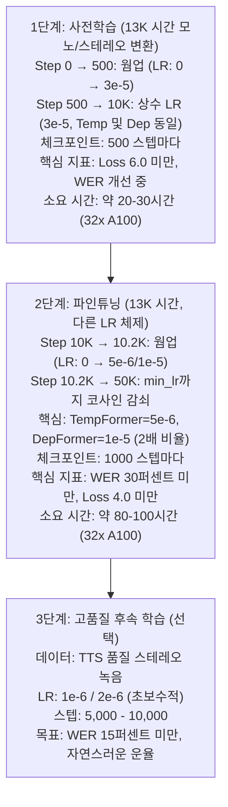

# K-Moshi 학습 레시피 분석 (한국어)

> **학습 하이퍼파라미터 및 전략 종합 분석**
>
> 참고 논문: 원본 Moshi (arXiv:2410.00037), J-Moshi (arXiv:2506.02979)
>
> 최종 업데이트: 2025-01-01

---

## 목차

1. [요약](#1-요약)
2. [J-Moshi 학습 레시피 심층 분석](#2-j-moshi-학습-레시피-심층-분석)
3. [학습률(Learning Rate) 분석](#3-학습률learning-rate-분석)
4. [스케줄러 설정](#4-스케줄러-설정)
5. [Duration과 Batch Size 트레이드오프](#5-duration과-batch-size-트레이드오프)
6. [문자 단위 보간(Character-Level Interpolation)](#6-문자-단위-보간character-level-interpolation)
7. [손실 가중치 설정](#7-손실-가중치-설정)
8. [PAD 토큰 비율 분석](#8-pad-토큰-비율-분석)
9. [권장 설정](#9-권장-설정)
10. [학습 로드맵](#10-학습-로드맵)
11. [모니터링 가이드라인](#11-모니터링-가이드라인)
12. [문제 해결](#12-문제-해결)

---

## 1. 요약

### 핵심 파라미터 비교표

| 파라미터 | J-Moshi 사전학습 | J-Moshi 파인튜닝 | K-Moshi 현재 | K-Moshi 권장 |
|----------|-----------------|------------------|--------------|--------------|
| **학습률 (TempFormer)** | 3e-5 | 2e-6 | 5e-5 | 3e-5 → 5e-6 |
| **학습률 (DepFormer)** | 3e-5 | 4e-6 | 5e-5 | 3e-5 → 1e-5 |
| **학습률 비율 (Temp:Dep)** | 1:1 | 1:2 | 1:1 | 1:1 → 1:2 |
| **웜업 스텝** | 500 | 해당없음 | 100 | 500 |
| **Duration (초)** | 162 (2.7분) | ? | 40 | 60-90 |
| **배치 크기** | 512 | 16 | 96 | 128 → 64 |
| **PAD 가중치** | 0.5 | 0.5 | 0.5 | 0.5 |
| **Semantic:Acoustic** | 100:1 | 100:1 | 100:1 | 100:1 |
| **총 스텝** | 8,880 | 1,423 | 50,000 | 50,000 |

### 핵심 발견사항

1. **2단계 학습**: J-Moshi는 사전학습과 파인튜닝에서 다른 학습률 사용
2. **DepFormer 프리미엄**: 파인튜닝시 DepFormer가 TempFormer보다 2배 높은 학습률 사용
3. **긴 컨텍스트**: J-Moshi는 2.7분(162초) 세그먼트 사용
4. **PAD 비율**: 일본어 88% vs 영어 65% (한국어 예상 ~85%)

---

## 2. J-Moshi 학습 레시피 심층 분석

### 2.1 논문 정보

**제목**: J-Moshi: Japanese Full-Duplex Spoken Dialogue Model
**arXiv**: 2506.02979
**발행일**: 2025년 6월

### 2.2 사전학습 설정

```yaml
# J-Moshi 사전학습 (69,000시간 모노포닉)
데이터셋:
  이름: "J-CHAT 코퍼스"
  크기: 69,000시간
  형식: 모노포닉 → 다이어리제이션을 통해 스테레오로 변환

학습:
  duration_tokens: 2,048  # 시간축 길이
  duration_sec: ~162  # 12.5Hz에서 2.7분
  batch_size: 512
  total_steps: 8,880  # 1 에폭
  학습_시간: 36시간
  하드웨어: 128x NVIDIA V100 32GB

옵티마이저:
  타입: AdamW
  lr: 3e-5  # TempFormer와 DepFormer 동일
  beta1: 0.9
  beta2: 0.95
  eps: 1e-5
  weight_decay: 0.1

스케줄러:
  타입: linear_warmup
  warmup_steps: 500
  # 웜업 후 상수 유지

손실:
  text_padding_weight: 0.5  # PAD 토큰 50% 가중치
  semantic_weight: 100
  acoustic_weight: 1
```

### 2.3 파인튜닝 설정

```yaml
# J-Moshi 파인튜닝 (344시간 스테레오)
데이터셋:
  이름: "J-CHAT 스테레오 서브셋"
  크기: 344시간
  형식: 네이티브 스테레오 녹음

학습:
  batch_size: 16
  epochs: 3
  total_steps: 1,423
  학습_시간: 2시간
  하드웨어: 16x NVIDIA V100 32GB

옵티마이저:
  타입: AdamW
  tempformer_lr: 2e-6  # 사전학습 대비 15배 낮음
  depformer_lr: 4e-6   # TempFormer보다 2배 높음!
  beta1: 0.9
  beta2: 0.95
  eps: 1e-5
  weight_decay: 0.1
```

### 2.4 J-Moshi 핵심 인사이트

```
┌─────────────────────────────────────────────────────────────────────────────┐
│                    J-MOSHI 핵심 학습 인사이트                                │
├─────────────────────────────────────────────────────────────────────────────┤
│                                                                             │
│  1. MIMI 코덱은 동결 상태 유지                                               │
│     - 일본어를 위한 Mimi 파인튜닝 불필요                                     │
│     - 교차 언어 오디오 인코딩이 바로 동작                                    │
│     - 한국어에서도 동일하게 적용 예상                                        │
│                                                                             │
│  2. 2단계 학습률 전략                                                        │
│     사전학습:  TempFormer = DepFormer = 3e-5                                │
│     파인튜닝:  TempFormer = 2e-6, DepFormer = 4e-6                          │
│                                                                             │
│     비율 변화: 1:1 → 1:2                                                     │
│     → DepFormer가 목표 언어에 더 빠르게 적응해야 함을 시사                   │
│                                                                             │
│  3. 긴 시퀀스 길이 (2.7분)                                                   │
│     - 완전한 대화 턴 캡처                                                    │
│     - 더 나은 대화 컨텍스트 모델링                                           │
│     - 메모리 요구량 높지만 품질 향상                                         │
│                                                                             │
│  4. 높은 PAD 토큰 비율 (88%)                                                 │
│     - 일본어 한자는 문자당 더 많은 음소 인코딩                               │
│     - 오디오 프레임 대비 텍스트 프레임 희소                                  │
│     - PAD 가중치 0.5로 불균형 보상                                           │
│                                                                             │
│  5. 적절한 파인튜닝 스텝 수 (1,423)                                          │
│     - 344시간에 대해 3 에폭만 수행                                           │
│     - 양보다 질 우선 접근                                                    │
│     - 사전학습이 주요 작업 담당                                              │
│                                                                             │
└─────────────────────────────────────────────────────────────────────────────┘
```

---

## 3. 학습률(Learning Rate) 분석

### 3.1 학습률 비교

```
학습률 스케일 (로그)
    │
1e-4│
    │  K-Moshi 현재 (5e-5)
5e-5│  ────────────────────────
    │
3e-5│  ════════════════════════  J-Moshi 사전학습
    │
1e-5│
    │
5e-6│  ════════════════════════  K-Moshi 권장 (파인튜닝)
    │  ────────────────────────  J-Moshi 파인튜닝 (DepFormer: 4e-6)
2e-6│  ═══════════════════════   J-Moshi 파인튜닝 (TempFormer: 2e-6)
    │
1e-6│
    └──────────────────────────────────────────────────────────►
```

### 3.2 2중 학습률 옵티마이저 원리

**DepFormer가 파인튜닝시 더 높은 학습률을 받는 이유:**

1. **아키텍처적 역할**:
   - TempFormer: 주요 시간축 트랜스포머 (7B 파라미터)
   - DepFormer: 오디오 코드북 생성용 깊이 트랜스포머 (더 작음)

2. **언어 적응**:
   - TempFormer는 일반적인 오디오-텍스트 정렬 패턴을 학습
   - DepFormer는 목표 언어 음운에 더 빠르게 적응 필요

3. **그래디언트 흐름**:
   - TempFormer 그래디언트는 더 안정적 (큰 모델)
   - DepFormer는 불안정성 없이 더 높은 학습률 허용 가능

### 3.3 K-Moshi 구현

```python
# finetune/scheduler.py - get_two_rate_optimizer()

def get_two_rate_optimizer(
    model: torch.nn.Module,
    tempformer_lr: float,      # 예: 5e-6
    depformer_lr: float,       # 예: 1e-5 (2배)
    weight_decay: float = 0.1,
    betas: tuple = (0.9, 0.95),
    eps: float = 1e-5,
) -> torch.optim.AdamW:
    """
    TempFormer와 DepFormer에 별도 학습률을 적용하는 AdamW 생성.
    """
    tempformer_params = []
    depformer_params = []

    for name, param in model.named_parameters():
        if "depformer" in name.lower():
            depformer_params.append(param)
        else:
            tempformer_params.append(param)

    param_groups = [
        {"params": tempformer_params, "lr": tempformer_lr, "name": "tempformer"},
        {"params": depformer_params, "lr": depformer_lr, "name": "depformer"},
    ]

    return torch.optim.AdamW(param_groups, betas=betas, eps=eps,
                             weight_decay=weight_decay, foreach=False)
```

### 3.4 권장 학습률 스케줄

```
학습률
    │
    │ 1단계: 사전학습              2단계: 파인튜닝
    │ (Step 0 → 10,000)           (Step 10,000 → 50,000)
    │
3e-5│     ┌───────────────────┐
    │    /│                   │
    │   / │                   │
    │  /  │                   │\
    │ /   │                   │ \
    │/    │                   │  \
    │     │                   │   \_______  DepFormer (1e-5)
1e-5│     │                   │    \______
    │     │                   │           \_____
5e-6│     │                   │                 \___  TempFormer
    │     │                   │                     \_________
1e-7│─────┴───────────────────┴─────────────────────────────────►
    0    500               10K                              50K  스텝
       웜업
```

---

## 4. 스케줄러 설정

### 4.1 사용 가능한 스케줄러

| 스케줄러 | 설명 | 사용 사례 |
|----------|------|-----------|
| `onecycle` | PyTorch OneCycleLR | moshi-finetune 기본값 |
| `cosine_warmup` | 선형 웜업 + 코사인 감쇠 | **파인튜닝에 권장** |
| `warmup_linear` | 선형 웜업 + 상수 | **J-Moshi 사전학습 방식** |
| `cosine_restarts` | 웜 리스타트 포함 코사인 | 실험적 |

### 4.2 J-Moshi 스케줄러 분석

```python
# J-Moshi는 DeepSpeed WarmupLR 사용
# 우리의 warmup_linear 스케줄러와 동일

# J-Moshi의 DeepSpeed 설정:
{
    "scheduler": {
        "type": "WarmupLR",
        "params": {
            "warmup_min_lr": 0,
            "warmup_max_lr": 3e-5,
            "warmup_num_steps": 500
        }
    }
}
```

### 4.3 웜업 스텝 계산

```
J-Moshi:
  - 웜업: 500 스텝
  - 총: 8,880 스텝
  - 웜업 비율: 5.6%

K-Moshi 현재:
  - 웜업: 100 스텝
  - 총: 50,000 스텝
  - 웜업 비율: 0.2%  ← 너무 짧음!

K-Moshi 권장:
  - 웜업: 500 스텝
  - 총: 50,000 스텝
  - 웜업 비율: 1.0%  ← 적절함
```

### 4.4 권장 설정

```yaml
# 사전학습 단계 (Step 0 → 10,000)
scheduler:
  type: 'warmup_linear'      # J-Moshi 방식
  warmup_steps: 500
  min_lr: 1.0e-7

# 파인튜닝 단계 (Step 10,000 → 50,000)
scheduler:
  type: 'cosine_warmup'      # 점진적 감쇠
  warmup_steps: 200          # 파인튜닝에서는 짧은 웜업
  min_lr: 1.0e-7
```

---

## 5. Duration과 Batch Size 트레이드오프

### 5.1 메모리 사용량 분석

```
GPU 메모리 = 기본 + 활성화 + 그래디언트 + 옵티마이저 상태

Moshi 7B, A100 80GB 기준:
┌───────────────────────────────────────────────────────────────┐
│ 구성요소               │ 메모리 (대략)                        │
├───────────────────────────────────────────────────────────────┤
│ 모델 파라미터          │ 14 GB (7B × 2바이트 bf16)            │
│ 그래디언트 체크포인팅  │ 활성화 ~70% 감소                     │
│ 옵티마이저 상태        │ ~28 GB (AdamW: 파라미터 2배 fp32)    │
│ 활성화                 │ f(배치 × duration × 히든)            │
│ 작업 메모리            │ ~5-10 GB                             │
├───────────────────────────────────────────────────────────────┤
│ 배치에 사용 가능       │ ~25-30 GB                            │
└───────────────────────────────────────────────────────────────┘
```

### 5.2 설정 비교

| 설정 | Duration | 배치 | 프레임/샘플 | 메모리 | 컨텍스트 품질 |
|------|----------|------|-------------|--------|---------------|
| J-Moshi | 162초 | 512 | 2,025 | V100 128대 | 우수 |
| K-Moshi 현재 | 40초 | 96 | 500 | ~60GB | 제한적 |
| **K-Moshi 옵션A** | 60초 | 64 | 750 | ~65GB | 양호 |
| **K-Moshi 옵션B** | 90초 | 48 | 1,125 | ~70GB | 매우 양호 |
| K-Moshi 옵션C | 120초 | 32 | 1,500 | ~75GB | 우수 |

### 5.3 프레임 계산

```python
# 12.5 Hz 오디오 프레임 레이트 (프레임당 80ms)
프레임_per_샘플 = duration_sec * 12.5

# 현재: 40초 × 12.5 = 500 프레임
# 권장: 60초 × 12.5 = 750 프레임
# J-Moshi: 162초 × 12.5 = 2,025 프레임
```

### 5.4 32x A100 80GB 권장 설정

```yaml
# 유효 배치 크기 계산:
# batch_size × num_gpus / num_microbatches = 유효_글로벌_배치

# 옵션 A: 균형잡힌 설정 (권장)
duration_sec: 60
batch_size: 128              # GPU당 배치
num_microbatches: 8
# 유효: 128 × 32 / 8 = 512 (J-Moshi 사전학습과 동일!)

# 옵션 B: 긴 컨텍스트
duration_sec: 90
batch_size: 64
num_microbatches: 8
# 유효: 64 × 32 / 8 = 256
```

---

## 6. 문자 단위 보간(Character-Level Interpolation)

### 6.1 구현 개요

`character_level_interpolation` 기능은 단어 수준 타임스탬프를 문자 수준으로 변환하여 더 정밀한 토큰 배치를 가능하게 합니다. 이는 서브워드 토큰이 여러 문자에 걸칠 수 있는 한국어와 일본어에서 특히 중요합니다.

```
단어 수준 정렬 (기본):
┌─────────────────────────────────────────────────────────────┐
│ 단어: "안녕하세요"  시간: (0.0초, 1.0초)                     │
│                                                              │
│ 토큰: [안, 녕, 하, 세, 요] → 모두 단일 프레임에 매핑        │
│                                                              │
│ 프레임: |  0  |  1  |  2  |  3  |  4  |  5  | ...            │
│ 토큰:   |안녕하세요|PAD |PAD |PAD |PAD |PAD | ...             │
│              ↑ 모든 토큰이 프레임 0에 집중!                   │
└─────────────────────────────────────────────────────────────┘

문자 수준 정렬 (character_level_interpolation=true):
┌─────────────────────────────────────────────────────────────┐
│ 단어: "안녕하세요"  시간: (0.0초, 1.0초)                     │
│ ↓ 문자별로 균등 분배                                         │
│ "안" → (0.00, 0.20)                                          │
│ "녕" → (0.20, 0.40)                                          │
│ "하" → (0.40, 0.60)                                          │
│ "세" → (0.60, 0.80)                                          │
│ "요" → (0.80, 1.00)                                          │
│                                                              │
│ 프레임: |  0  |  1  |  2  |  3  |  4  |  5  | ...            │
│ 토큰:   | 안  | 녕  | 하  | 세  | 요  |PAD | ...              │
│              ↑ 토큰이 프레임에 분산!                          │
└─────────────────────────────────────────────────────────────┘
```

### 6.2 알고리즘 구현

```python
# finetune/data/interleaver.py:845-894

def _word_to_character_alignments(alignments: list[Alignment]) -> list[CharacterAlignment]:
    """
    단어 수준 정렬을 문자 수준으로 변환.

    예시:
        단어 "안녕"이 (0.0, 0.5초)에 있고 2문자인 경우:
        - "안" → (0.00, 0.25)
        - "녕" → (0.25, 0.50)
    """
    char_alignments = []

    for word, (start, end), speaker in alignments:
        word_stripped = word.strip()
        if not word_stripped:
            continue

        num_chars = len(word_stripped)
        char_duration = (end - start) / num_chars

        for i, char in enumerate(word_stripped):
            char_start = start + i * char_duration
            char_end = start + (i + 1) * char_duration
            char_alignments.append((char, char_start, char_end))

    return char_alignments
```

### 6.3 사용 시기

| 시나리오 | 권장 | 이유 |
|----------|------|------|
| 한국어/일본어 | **활성화** | 문자당 더 많은 음소 인코딩 |
| 영어 | 선택적 | 단어가 짧아 이점 적음 |
| 빠른 발화 | **활성화** | 토큰 집중 방지 |
| 느린 발화 | 선택적 | 단어가 자연스럽게 프레임에 분산 |

### 6.4 초기 학습 아티팩트

**Step 75에서 관찰:**
```
타겟:    장에서 물놀이 한다고
예측:    장에서장에서 물이이이이이이다
```

**이것은 초기 학습에서 정상입니다:**
- 모델이 토큰 분포를 학습 중
- Cross-entropy 손실이 "확신있는" 예측 선호
- 반복 패턴은 첫 500-1000 스텝에서 흔함
- Step 2000-5000까지 해결 예상

---

## 7. 손실 가중치 설정

### 7.1 J-Moshi 손실 계산

```python
# J-Moshi 방식 토큰 수 기반 정규화
# finetune/loss.py에 구현됨

def compute_audio_loss_per_speaker(logits, target, mask, dep_q,
                                    semantic_weight=100.0,
                                    acoustic_weight=1.0):
    """
    J-Moshi 손실 공식:

    audio_weight = N_semantic × w_s + N_acoustic × w_a
    semantic_scale = w_s / audio_weight
    acoustic_scale = w_a / audio_weight

    audio_loss = Σ L_semantic × semantic_scale + Σ L_acoustic × acoustic_scale
    """
```

### 7.2 가중치 설정

```yaml
# 손실 가중치 (J-Moshi와 일치)
first_codebook_weight_multiplier: 100.0   # Semantic 코드북 가중치
text_padding_weight: 0.5                   # PAD 토큰 손실 가중치

# 상세 분류:
loss_weights:
  text:
    content_tokens: 1.0      # 실제 텍스트에 전체 가중치
    padding_tokens: 0.5      # PAD에 50% 가중치 (J-Moshi 방식)

  audio:
    semantic_codebook: 100.0  # 코드북 0 (가장 중요)
    acoustic_codebooks: 1.0   # 코드북 1-7
```

### 7.3 Semantic 코드북이 100배 가중치를 받는 이유

```
오디오 코드북 구조:
┌─────────────────────────────────────────────────────────────┐
│ 코드북 0 (Semantic):                                        │
│   - 언어적 내용 인코딩                                      │
│   - 음성 이해에 가장 중요                                   │
│   - 낮은 비트레이트, 고수준 특성                            │
│   - 가중치: 100                                             │
├─────────────────────────────────────────────────────────────┤
│ 코드북 1-7 (Acoustic):                                      │
│   - 음향 세부사항 인코딩 (운율, 음색)                       │
│   - 세밀한 오디오 재구성                                    │
│   - 가중치: 각각 1                                          │
└─────────────────────────────────────────────────────────────┘

유효 기여도:
  Semantic: 100 / (100 + 7×1) = 93.5%
  각 Acoustic: 1 / (100 + 7×1) = 0.93%
```

---

## 8. PAD 토큰 비율 분석

### 8.1 언어별 비교

```
언어별 PAD 토큰 비율:
┌───────────┬─────────────┬──────────────────────────────────┐
│ 언어      │ PAD 비율    │ 이유                             │
├───────────┼─────────────┼──────────────────────────────────┤
│ 영어      │ 65%         │ 긴 단어, 더 많은 음절            │
│ 일본어    │ 88%         │ 한자 = 문자당 많은 음소          │
│ 한국어    │ ~85-90%     │ 한글 음절 블록 (예상)            │
└───────────┴─────────────┴──────────────────────────────────┘
```

### 8.2 계산 방법

```python
# PAD 비율 = PAD 토큰 프레임 / 총 프레임

# 12.5 Hz (프레임당 80ms)에서:
# - 1초 발화 = 12.5 프레임
# - 평균 발화 속도: ~초당 4음절
# - 한국어 음절 = 일반적으로 1-2 토큰

# 예시 계산:
duration = 40  # 초
total_frames = 40 * 12.5 = 500
average_tokens = 160  # 한국어 추정

pad_ratio = (500 - 160) / 500 = 68%

# character_level_interpolation으로 토큰이 분산되지만
# PAD 비율은 유사하게 유지됨
```

### 8.3 학습에 미치는 영향

높은 PAD 비율의 의미:
1. 대부분의 프레임이 PAD 예측 → 쉬운 예측
2. 콘텐츠 토큰이 희소 → 학습이 더 어려움
3. `text_padding_weight=0.5`로 보상:
   - PAD 기여도 50% 감소
   - 콘텐츠 토큰 중요도 효과적 증가

---

## 9. 권장 설정

### 9.1 1단계: 사전학습 설정

```yaml
# korean_v4_pretrain.yaml
# 대규모 데이터셋 초기 학습용 (13K 시간)

# 데이터
data:
  train_data: './data/korean_v4_train.jsonl'
  eval_data: './data/korean_v4_valid.jsonl'
  shuffle: true

# 모델
backbone:
  type: "moshi"
  moshi:
    hidden_dim: 4096
    num_layers: 32
    num_heads: 32
    gradient_checkpointing: true

# 한국어 특화
korean:
  enable_user_stream: false
  full_duplex_input: true
  interleaver:
    keep_main_only: true
    adaptive_distribute: true
    character_level_interpolation: true
    main_speaker_label: 'SPEAKER_MAIN'

# 학습 모드
full_finetuning: true

# 손실 (J-Moshi 방식)
first_codebook_weight_multiplier: 100.0
text_padding_weight: 0.5

# 시퀀스 - 더 긴 컨텍스트
duration_sec: 60
batch_size: 128
num_microbatches: 8
max_steps: 10000
max_norm: 1.0
gradient_checkpointing: true

# 옵티마이저 - J-Moshi 사전학습
optim:
  lr: 3.0e-5
  depformer_lr: 3.0e-5      # 사전학습에서는 TempFormer와 동일
  weight_decay: 0.1
  beta1: 0.9
  beta2: 0.95
  eps: 1.0e-5

# 스케줄러 - 선형 웜업 후 상수
scheduler:
  type: 'warmup_linear'
  warmup_steps: 500
  min_lr: 1.0e-7

param_dtype: bfloat16

# 체크포인팅
checkpoint:
  enabled: true
  save_freq: 500
  max_keep: 10
  save_optimizer: true
  save_scheduler: true

seed: 42
log_freq: 10
eval_freq: 500
do_eval: true
eval_samples: 100

run_dir: './runs/korean_v4_pretrain'
```

### 9.2 2단계: 파인튜닝 설정

```yaml
# korean_v4_finetune.yaml
# 사전학습 후 파인튜닝용

# ... 동일한 데이터/모델 설정 ...

# 시퀀스 - 안정적인 학습
duration_sec: 60
batch_size: 64              # 사전학습보다 감소
num_microbatches: 8
max_steps: 50000
max_norm: 1.0

# 옵티마이저 - J-Moshi 파인튜닝 (핵심 차이!)
optim:
  lr: 5.0e-6                # 사전학습 대비 6배 낮음
  depformer_lr: 1.0e-5      # TempFormer보다 2배 높음!
  weight_decay: 0.1
  beta1: 0.9
  beta2: 0.95
  eps: 1.0e-5

# 스케줄러 - 코사인 감쇠
scheduler:
  type: 'cosine_warmup'
  warmup_steps: 200
  min_lr: 1.0e-7

# 사전학습에서 재개
checkpoint:
  resume_from: './runs/korean_v4_pretrain/checkpoint-step-10000.pt'
  enabled: true
  save_freq: 1000
  max_keep: 10

run_dir: './runs/korean_v4_finetune'
```

### 9.3 빠른 시작 (단일 단계)

단계 분리 없는 더 간단한 설정:

```yaml
# korean_v4_simple.yaml
# 점진적 학습률 감쇠를 사용한 단일 단계 학습

optim:
  lr: 2.0e-5               # 중간 값
  depformer_lr: 3.0e-5     # 1.5배 비율
  weight_decay: 0.1
  beta1: 0.9
  beta2: 0.95
  eps: 1.0e-5

scheduler:
  type: 'cosine_warmup'
  warmup_steps: 500
  min_lr: 1.0e-7

max_steps: 50000
```

---

## 10. 학습 로드맵

### 10.1 단계별 타임라인



### 10.2 체크포인트 전략

| 단계 | 저장 빈도 | 유지 개수 | 이유 |
|------|----------|----------|------|
| 사전학습 | 500 스텝 | 10 | 초기 잦은 저장 |
| 파인튜닝 | 1000 스텝 | 10 | 안정적 진행 |
| 후속 학습 | 500 스텝 | 5 | 품질 중심 |

---

## 11. 모니터링 가이드라인

### 11.1 예상 지표 진행

| 스텝 | Loss | WER | CER | 상태 |
|------|------|-----|-----|------|
| 0 | 10+ | 95%+ | 80%+ | 랜덤 |
| 75 | 8-9 | 77% | 44% | **현재** |
| 500 | 6-7 | 60-65% | 35-40% | 패턴 학습 중 |
| 2,000 | 5-6 | 45-50% | 25-30% | 기본 구조 |
| 5,000 | 4.5-5 | 35-40% | 20-25% | 양호한 진행 |
| 10,000 | 4-4.5 | 30-35% | 15-20% | 사전학습 완료 |
| 30,000 | 3.5-4 | 20-25% | 10-15% | 파인튜닝 효과 |
| 50,000 | 3-3.5 | 15-20% | 8-12% | 수렴 |

### 11.2 손실 곡선 참조

```
손실
 │
10│ ×
  │  ×
 8│   ×
  │    ×
 6│     ×××
  │        ×××
 5│           ××××
  │               ××××
 4│                   ×××××××
  │                          ×××××
 3│                               ×××××××××
  │
  └────────────────────────────────────────────────────────────►
  0      5K     10K    15K    20K    25K    30K    40K   50K  스텝
       사전학습      │        파인튜닝
```

### 11.3 경고 신호

| 증상 | 가능한 원인 | 해결책 |
|------|------------|--------|
| 손실 스파이크 | LR 너무 높음 | LR 2-5배 감소 |
| 손실 정체 | LR 너무 낮음 | LR 증가 또는 데이터 확인 |
| WER 개선 안됨 | 데이터 품질 문제 | 정렬 확인 |
| 반복적 출력 | 초기 학습 | 더 많은 스텝 대기 |
| NaN 손실 | 그래디언트 폭발 | 그래디언트 클리핑 추가 |

---

## 12. 문제 해결

### 12.1 일반적인 문제

#### 손실이 감소하지 않음

```yaml
# 가능한 원인과 해결책:
1. LR 너무 낮음:
   optim.lr: 1e-5 → 3e-5  # 증가

2. 데이터 문제:
   - 정렬 JSON 파일 존재 확인
   - 오디오/텍스트 동기화 검증

3. 배치 크기 너무 작음:
   batch_size: 32 → 64  # 증가
```

#### GPU OOM (메모리 부족)

```yaml
# 메모리 감소 전략:
1. 배치 크기 감소:
   batch_size: 128 → 64

2. Duration 감소:
   duration_sec: 60 → 40

3. 마이크로배치 증가:
   num_microbatches: 4 → 8

4. 그래디언트 체크포인팅 활성화:
   gradient_checkpointing: true  # 반드시 활성화
```

#### 반복적인 텍스트 출력

```
증상: "장에서장에서장에서"
원인: 초기 학습 (정상) 또는 온도 문제
해결:
  - Step 1000+ 까지 대기
  - 지속되면 정렬 품질 확인
  - character_level_interpolation 일시 비활성화 고려
```

#### FSDP 체크포인트 재개 크래시

```python
# 옵티마이저가 foreach=False인지 확인
optimizer = torch.optim.AdamW(
    param_groups,
    foreach=False,  # FSDP 재개에 필수
)
```

### 12.2 진단 명령어

```bash
# GPU 메모리 사용량 확인
nvidia-smi --query-gpu=memory.used,memory.total --format=csv

# 학습 로그 모니터링
tail -f runs/korean_v4/train.log | grep -E "(step|loss|WER)"

# 데이터 정렬 검증
python -c "import json; print(json.load(open('data/sample.json')))"

# 단일 포워드 패스 테스트
torchrun --nproc-per-node 1 -m train example/korean_v4.yaml --max_steps 1
```

---

## 부록 A: 참조 논문

1. **Moshi 원본**: https://arxiv.org/abs/2410.00037
   - "Moshi: A Speech-Text Foundation Model for Real-Time Dialogue"
   - Kyutai Labs, 2024년 10월

2. **J-Moshi**: https://arxiv.org/abs/2506.02979
   - "J-Moshi: Japanese Full-Duplex Spoken Dialogue Model"
   - Nagoya University, 2025년 6월

## 부록 B: 코드 참조

| 구성요소 | 파일 | 주요 함수 |
|----------|------|----------|
| 학습 루프 | `train.py` | `train()` |
| 2중 학습률 옵티마이저 | `finetune/scheduler.py` | `get_two_rate_optimizer()` |
| 손실 계산 | `finetune/loss.py` | `compute_audio_loss_per_speaker()` |
| 인터리버 | `finetune/data/interleaver.py` | `_tokenize_with_character_interpolation()` |
| 체크포인팅 | `finetune/checkpointing.py` | `CheckpointManager` |

## 부록 C: 버전 이력

| 버전 | 날짜 | 변경사항 |
|------|------|----------|
| 1.0 | 2025-01-01 | 최초 종합 분석 |

---

*이 문서는 K-Moshi 프로젝트의 일부로 유지됩니다.*
*업데이트는 `/path/to/workspace 참조*
