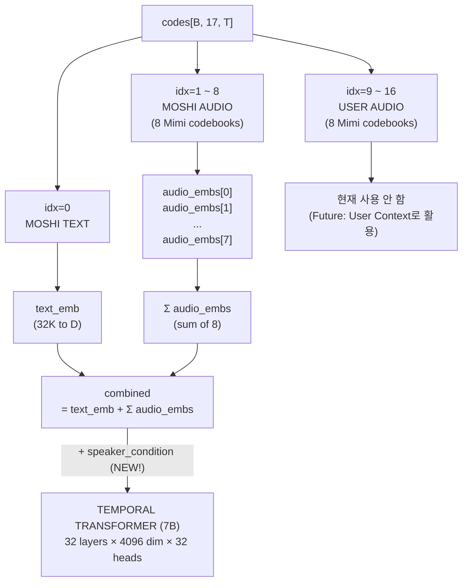
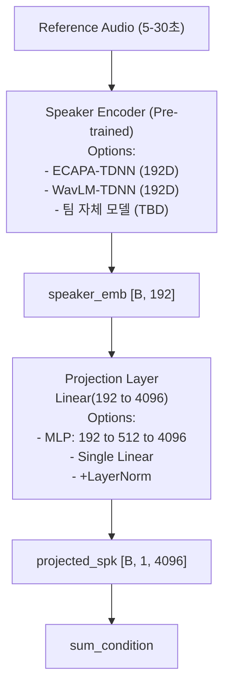
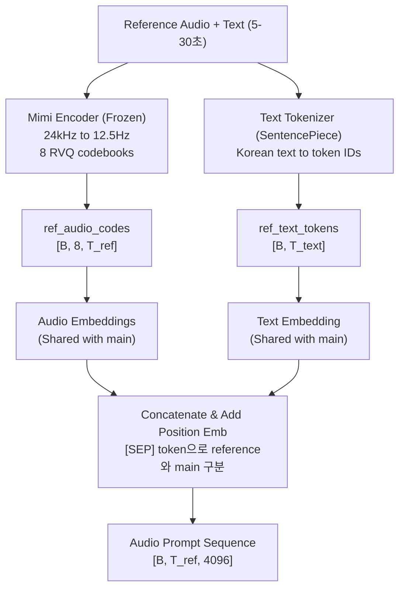
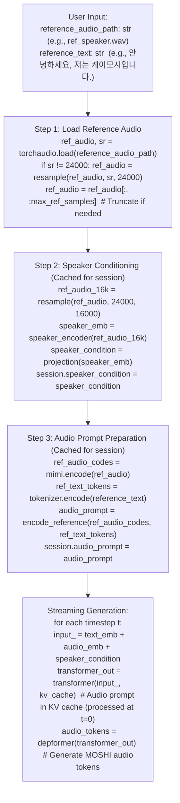
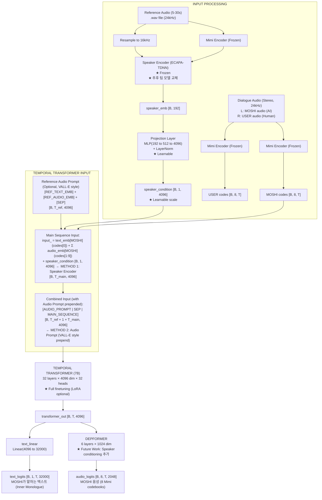

# K-Moshi Zero-Shot Speaker Conditioning 기술 명세서

**문서 버전**: 2.0
**작성일**: 2026-01-21
**목적**: Zero-shot speaker identity/style modeling을 위한 엄밀한 기술 명세

---

## 1. Temporal Transformer Input 구성 정정 및 명확화

### 1.1 이전 분석의 오류 정정

**이전 분석 (오류)**:
```
input_ = text_emb[MOSHI] + Σ audio_emb[USER] + speaker_emb
                            ↑
                      USER audio를 입력으로 사용
```

**정정된 분석 (정확)**:
```
input_ = text_emb[MOSHI] + Σ audio_emb[MOSHI] + speaker_emb
                            ↑
                      MOSHI audio를 입력으로 사용
```

### 1.2 코드 근거

**파일**: `finetune/backbone/lm_model_wrapper.py:657-671`

```python
# NOTE: Use num_audio_embs (dep_q=8), NOT num_audio_codebooks (n_q=16)
# In full-duplex mode, we only have embeddings for moshi's audio, not user's
n_audio_embs = self.num_audio_embs  # dep_q = 8 (MOSHI audio only)

for cb_index in range(n_audio_embs):
    audio_codes = input_sequence[:, cb_index + self._audio_offset]  # [B, S]
    audio_emb = self.audio_embs[cb_index](audio_codes)  # [B, S, D]
    audio_input = audio_emb if audio_input is None else audio_input + audio_emb

# Compute text embedding
text_codes = input_sequence[:, 0]  # [B, S] - MOSHI text
text_emb = self.text_emb(text_codes)  # [B, S, D]

# Combine embeddings
combined_input = text_emb if audio_input is None else text_emb + audio_input
```

### 1.3 K-Moshi Full-Duplex 데이터 구조 (17 codebooks)

```
codes tensor: [B, 17, T]

Index 0:      MOSHI text tokens (Inner Monologue)
Index 1-8:    MOSHI audio tokens (8 Mimi codebooks)  ← Temporal TF 입력
Index 9-16:   USER audio tokens (8 Mimi codebooks)   ← Context only (미래 확장용)
```

### 1.4 정확한 Temporal Transformer 입력 흐름



---

## 2. Zero-Shot Speaker Conditioning: 두 가지 방식

### 2.1 개요

| 방식 | 정보 유형 | 시간적 특성 | 주입 위치 |
|------|----------|------------|----------|
| **Method 1: Speaker Encoder** | Global identity | Time-invariant | sum_condition |
| **Method 2: Audio Prompt (VALL-E style)** | Local style/prosody | Time-variant | Prepend/Cross-attention |

### 2.2 Method 1: Speaker Encoder를 통한 Speaker Embedding

#### 2.2.1 개념 정의



#### 2.2.2 엄밀한 설계 사양

**A. Speaker Encoder 설정**

| 설정 항목 | 옵션 | 권장 설정 | 근거 |
|----------|------|----------|------|
| **Freeze/Unfreeze** | freeze / unfreeze / partial | **Freeze** | Pre-trained 지식 보존 |
| **모델 선택** | ECAPA-TDNN / WavLM / 팀 모델 | ECAPA-TDNN (초기) | 검증된 성능, 추후 교체 |
| **출력 차원** | 192 / 256 / 512 | **192** | ECAPA-TDNN 표준 |

**B. Projection Layer 설정**

| 설정 항목 | 옵션 | 권장 설정 | 근거 |
|----------|------|----------|------|
| **구조** | Linear / MLP / MLP+LN | **MLP(192→512→4096)** | 비선형 변환 필요 |
| **Freeze/Unfreeze** | freeze / unfreeze | **Unfreeze** | 학습 필요 |
| **Activation** | ReLU / GELU / SiLU | **GELU** | Transformer 표준 |
| **Normalization** | None / LayerNorm | **LayerNorm** | 안정성 |

**C. Sum Condition 가중치**

```python
# 가중치 옵션
input_ = text_emb + audio_emb + α * speaker_condition

# α 설정 옵션:
# Option 1: 고정 스칼라 (α = 1.0)
# Option 2: 학습 가능 스칼라 (nn.Parameter)
# Option 3: 학습 가능 벡터 (dim=4096)
# Option 4: Attention-based gating

# 권장: Option 2 (학습 가능 스칼라)
self.speaker_scale = nn.Parameter(torch.ones(1))
input_ = text_emb + audio_emb + self.speaker_scale * speaker_condition
```

#### 2.2.3 코드 인터페이스 설계

```python
# finetune/modules/speaker_encoder.py

from abc import ABC, abstractmethod
from typing import Optional, Tuple
import torch
import torch.nn as nn


class BaseSpeakerEncoder(ABC, nn.Module):
    """
    Speaker Encoder 추상 베이스 클래스.
    팀 자체 모델로 교체 가능하도록 추상화.
    """

    @abstractmethod
    def forward(self, audio: torch.Tensor, sr: int = 16000) -> torch.Tensor:
        """
        Extract speaker embedding from audio.

        Args:
            audio: [B, T] audio waveform (mono)
            sr: Sample rate (default: 16000)

        Returns:
            speaker_emb: [B, embed_dim] speaker embedding
        """
        pass

    @abstractmethod
    def get_embed_dim(self) -> int:
        """Return embedding dimension (e.g., 192)."""
        pass


class ECAPATDNNSpeakerEncoder(BaseSpeakerEncoder):
    """
    ECAPA-TDNN based speaker encoder.
    Uses SpeechBrain pre-trained model.
    """

    def __init__(
        self,
        model_source: str = "speechbrain/spkrec-ecapa-voxceleb",
        freeze: bool = True,
        device: Optional[torch.device] = None,
    ):
        super().__init__()
        self.freeze = freeze
        self.embed_dim = 192

        # Load pre-trained model
        from speechbrain.pretrained import EncoderClassifier
        self.encoder = EncoderClassifier.from_hparams(
            source=model_source,
            run_opts={"device": str(device) if device else "cpu"},
        )

        if freeze:
            for param in self.encoder.parameters():
                param.requires_grad = False

    def forward(self, audio: torch.Tensor, sr: int = 16000) -> torch.Tensor:
        # SpeechBrain expects [B, T] at 16kHz
        if sr != 16000:
            audio = torchaudio.functional.resample(audio, sr, 16000)
        embeddings = self.encoder.encode_batch(audio)
        return embeddings.squeeze(1)  # [B, 192]

    def get_embed_dim(self) -> int:
        return self.embed_dim


class CustomSpeakerEncoder(BaseSpeakerEncoder):
    """
    팀 자체 학습 Speaker Encoder를 위한 클래스.
    추후 구현 예정.
    """

    def __init__(
        self,
        model_path: str,
        embed_dim: int = 192,
        freeze: bool = True,
        device: Optional[torch.device] = None,
    ):
        super().__init__()
        self.embed_dim = embed_dim
        self.freeze = freeze

        # TODO: Load team's custom speaker encoder
        # self.model = load_custom_model(model_path)
        raise NotImplementedError(
            "CustomSpeakerEncoder is placeholder for team's model. "
            "Implement load_custom_model() when model is available."
        )

    def forward(self, audio: torch.Tensor, sr: int = 16000) -> torch.Tensor:
        raise NotImplementedError

    def get_embed_dim(self) -> int:
        return self.embed_dim


class SpeakerConditioner(nn.Module):
    """
    Complete speaker conditioning module.
    Combines speaker encoder + projection layer.
    """

    def __init__(
        self,
        encoder: BaseSpeakerEncoder,
        output_dim: int = 4096,
        use_mlp: bool = True,
        use_layer_norm: bool = True,
        learnable_scale: bool = True,
    ):
        super().__init__()
        self.encoder = encoder
        self.output_dim = output_dim

        embed_dim = encoder.get_embed_dim()

        # Projection: embed_dim → output_dim
        if use_mlp:
            hidden_dim = (embed_dim + output_dim) // 2
            layers = [
                nn.Linear(embed_dim, hidden_dim),
                nn.GELU(),
                nn.Linear(hidden_dim, output_dim),
            ]
            if use_layer_norm:
                layers.append(nn.LayerNorm(output_dim))
            self.projection = nn.Sequential(*layers)
        else:
            if use_layer_norm:
                self.projection = nn.Sequential(
                    nn.Linear(embed_dim, output_dim),
                    nn.LayerNorm(output_dim),
                )
            else:
                self.projection = nn.Linear(embed_dim, output_dim)

        # Learnable scale for sum_condition
        if learnable_scale:
            self.scale = nn.Parameter(torch.ones(1))
        else:
            self.register_buffer('scale', torch.ones(1))

    def forward(
        self,
        reference_audio: torch.Tensor,
        sr: int = 16000,
    ) -> torch.Tensor:
        """
        Extract and project speaker embedding.

        Args:
            reference_audio: [B, T] reference audio waveform
            sr: Sample rate

        Returns:
            speaker_condition: [B, 1, output_dim] for sum_condition
        """
        # Extract speaker embedding
        with torch.set_grad_enabled(not self.encoder.freeze):
            speaker_emb = self.encoder(reference_audio, sr)  # [B, embed_dim]

        # Project to output dimension
        projected = self.projection(speaker_emb)  # [B, output_dim]

        # Apply learnable scale
        scaled = self.scale * projected

        # Reshape for sum_condition: [B, 1, D]
        return scaled.unsqueeze(1)
```

### 2.3 Method 2: VALL-E Style Audio Prompt (Reference Audio + Text)

#### 2.3.1 개념 정의 (Chroma 1.0 / VALL-E 참조)



#### 2.3.2 주입 방식 비교

| 방식 | 장점 | 단점 | 권장 |
|------|------|------|------|
| **Prepend** | 구현 단순, KV cache 효율 | Context 길이 증가 | ✅ 초기 구현 |
| **Cross-attention** | 분리된 처리, 유연성 | 구현 복잡, 추가 파라미터 | 추후 검토 |

#### 2.3.3 코드 인터페이스 설계

```python
# finetune/modules/audio_prompt.py

from dataclasses import dataclass
from typing import Optional, Tuple
import torch
import torch.nn as nn


@dataclass
class AudioPromptConfig:
    """Audio Prompt 설정."""
    max_ref_duration_sec: float = 10.0  # 최대 reference 길이
    min_ref_duration_sec: float = 3.0   # 최소 reference 길이
    frame_rate: float = 12.5            # Mimi frame rate
    include_ref_text: bool = True       # Reference text 포함 여부
    sep_token_id: int = 4               # [SEP] token ID


class AudioPromptEncoder(nn.Module):
    """
    VALL-E style audio prompt encoder.
    Reference audio + text를 Temporal Transformer 입력 앞에 prepend.
    """

    def __init__(
        self,
        text_emb: nn.Module,          # Shared text embedding
        audio_embs: nn.ModuleList,    # Shared audio embeddings
        config: AudioPromptConfig,
        mimi_encoder: Optional[nn.Module] = None,  # For inference
    ):
        super().__init__()
        self.text_emb = text_emb
        self.audio_embs = audio_embs
        self.config = config
        self.mimi_encoder = mimi_encoder

        # [SEP] token embedding
        self.sep_embedding = nn.Parameter(
            torch.randn(1, 1, text_emb.embedding_dim) * 0.02
        )

    def encode_reference(
        self,
        ref_audio_codes: torch.Tensor,  # [B, 8, T_ref]
        ref_text_tokens: Optional[torch.Tensor] = None,  # [B, T_text]
    ) -> torch.Tensor:
        """
        Encode reference audio and text into prompt embeddings.

        Args:
            ref_audio_codes: Mimi-encoded reference audio codes [B, 8, T_ref]
            ref_text_tokens: Tokenized reference text [B, T_text]

        Returns:
            prompt_emb: [B, T_prompt, D] prompt embeddings
        """
        B, n_codebooks, T_ref = ref_audio_codes.shape

        # Encode reference audio (sum of codebook embeddings)
        audio_emb = None
        for cb_idx in range(min(n_codebooks, len(self.audio_embs))):
            cb_emb = self.audio_embs[cb_idx](ref_audio_codes[:, cb_idx])
            audio_emb = cb_emb if audio_emb is None else audio_emb + cb_emb
        # audio_emb: [B, T_ref, D]

        # Encode reference text if provided
        if ref_text_tokens is not None and self.config.include_ref_text:
            text_emb = self.text_emb(ref_text_tokens)  # [B, T_text, D]
            # Combine: text + audio + SEP
            prompt_parts = [text_emb, audio_emb, self.sep_embedding.expand(B, -1, -1)]
        else:
            # Audio only + SEP
            prompt_parts = [audio_emb, self.sep_embedding.expand(B, -1, -1)]

        prompt_emb = torch.cat(prompt_parts, dim=1)
        return prompt_emb

    def forward(
        self,
        main_input: torch.Tensor,        # [B, T_main, D] main sequence
        ref_audio_codes: torch.Tensor,   # [B, 8, T_ref]
        ref_text_tokens: Optional[torch.Tensor] = None,
    ) -> Tuple[torch.Tensor, int]:
        """
        Prepend audio prompt to main input.

        Returns:
            combined_input: [B, T_prompt + T_main, D]
            prompt_length: Length of prompt (for masking)
        """
        prompt_emb = self.encode_reference(ref_audio_codes, ref_text_tokens)
        prompt_length = prompt_emb.shape[1]

        # Prepend prompt to main input
        combined = torch.cat([prompt_emb, main_input], dim=1)

        return combined, prompt_length
```

---

## 3. 학습/추론 시 Reference Audio/Text 처리 파이프라인

### 3.1 학습 시 Reference 샘플링

```mermaid
flowchart TD
    INPUT["Stereo Dialogue Audio [2, T_total] (24kHz)<br/>Channel 0: MOSHI audio (AI voice)<br/>Channel 1: USER audio (User voice)<br/>Alignments JSON: [(word, (start, end), SPEAKER_MAIN/USER), ...]"]
    S1["Step 1: Extract MOSHI segments<br/>MOSHI alignments = filter(speaker == SPEAKER_MAIN)<br/>MOSHI segments = [(start, end, text), ...]"]
    S2["Step 2: Random Reference Selection<br/>ref_duration = random.uniform(min_ref_sec, max_ref_sec)<br/>ref_segment = random_select(MOSHI_segments, duration=ref_duration)<br/>Constraints:<br/>- 반드시 MOSHI 발화 구간 내에서 선택<br/>- target 구간과 겹치지 않도록 (data leakage 방지)<br/>- min_ref_duration ≤ duration ≤ max_ref_duration"]
    S3["Step 3: Extract Reference Audio/Text<br/>ref_audio = moshi_channel[ref_start:ref_end]  # 24kHz waveform<br/>ref_text = get_text_for_segment(ref_start, ref_end, alignments)"]
    S4["Step 4: Speaker Encoder Processing<br/>ref_audio_16k = resample(ref_audio, 24000, 16000)<br/>speaker_emb = speaker_encoder(ref_audio_16k)  # [B, 192]<br/>speaker_condition = projection(speaker_emb)    # [B, 1, 4096]"]
    S5["Step 5: Audio Prompt Processing<br/>ref_audio_codes = mimi.encode(ref_audio)       # [1, 8, T_ref]<br/>ref_text_tokens = tokenizer.encode(ref_text)   # [T_text]<br/>audio_prompt = encode_reference(ref_audio_codes, ref_text_tokens)"]
    OUT["Output for Training Batch:<br/>codes: [B, 17, T]  (Main dialogue codes)<br/>speaker_condition: [B, 1, 4096]  (For sum_condition)<br/>audio_prompt_codes: [B, 8, T_ref]  (For prepend)<br/>audio_prompt_text: [B, T_text]  (Reference text tokens)"]
    INPUT --> S1 --> S2 --> S3 --> S4 --> S5 --> OUT
```



### 3.2 추론 시 Reference 처리



### 3.3 Dataset/DataLoader 확장 설계

```python
# finetune/data/reference_sampler.py

from dataclasses import dataclass
from typing import List, Tuple, Optional
import random
import torch


@dataclass
class ReferenceConfig:
    """Reference sampling configuration."""
    min_duration_sec: float = 3.0
    max_duration_sec: float = 10.0
    exclude_overlap_sec: float = 0.5  # Buffer to avoid overlap with target
    sample_rate: int = 24000
    mimi_frame_rate: float = 12.5


@dataclass
class ReferenceSample:
    """Extracted reference sample."""
    audio: torch.Tensor          # [T_ref] at 24kHz
    text: str                    # Reference text
    audio_codes: torch.Tensor    # [8, T_ref_frames] Mimi codes
    text_tokens: torch.Tensor    # [T_text] tokenized text
    speaker_emb: torch.Tensor    # [192] speaker embedding
    start_sec: float
    end_sec: float


class ReferenceSampler:
    """
    Reference audio/text sampler for training.
    Samples from MOSHI channel avoiding overlap with target.
    """

    def __init__(
        self,
        config: ReferenceConfig,
        mimi_encoder: torch.nn.Module,
        text_tokenizer,
        speaker_encoder: torch.nn.Module,
    ):
        self.config = config
        self.mimi = mimi_encoder
        self.tokenizer = text_tokenizer
        self.speaker_encoder = speaker_encoder

    def sample_reference(
        self,
        moshi_audio: torch.Tensor,      # [T] MOSHI channel at 24kHz
        alignments: List[Tuple],         # [(word, (start, end), speaker), ...]
        target_start_sec: float,
        target_end_sec: float,
    ) -> Optional[ReferenceSample]:
        """
        Sample reference from MOSHI audio avoiding target region.

        Args:
            moshi_audio: MOSHI channel audio
            alignments: Word-level alignments
            target_start_sec: Start of target segment (to exclude)
            target_end_sec: End of target segment (to exclude)

        Returns:
            ReferenceSample or None if no valid region found
        """
        sr = self.config.sample_rate
        min_samples = int(self.config.min_duration_sec * sr)
        max_samples = int(self.config.max_duration_sec * sr)
        exclude_buffer = int(self.config.exclude_overlap_sec * sr)

        # Find valid MOSHI speech regions
        moshi_regions = self._find_moshi_regions(alignments, target_start_sec, target_end_sec)

        if not moshi_regions:
            return None

        # Filter regions by minimum duration
        valid_regions = [
            (s, e, text) for s, e, text in moshi_regions
            if (e - s) >= self.config.min_duration_sec
        ]

        if not valid_regions:
            return None

        # Random selection
        start_sec, end_sec, ref_text = random.choice(valid_regions)

        # Clip to max duration
        duration = end_sec - start_sec
        if duration > self.config.max_duration_sec:
            # Random start within region
            max_start = end_sec - self.config.max_duration_sec
            start_sec = random.uniform(start_sec, max_start)
            end_sec = start_sec + self.config.max_duration_sec

        # Extract audio segment
        start_sample = int(start_sec * sr)
        end_sample = int(end_sec * sr)
        ref_audio = moshi_audio[start_sample:end_sample]

        # Encode with Mimi
        with torch.no_grad():
            ref_audio_codes = self.mimi.encode(ref_audio.unsqueeze(0).unsqueeze(0))
            ref_audio_codes = ref_audio_codes.squeeze(0)  # [8, T_ref]

        # Tokenize text
        ref_text_tokens = torch.tensor(
            self.tokenizer.encode(ref_text),
            dtype=torch.long
        )

        # Extract speaker embedding (16kHz)
        ref_audio_16k = torchaudio.functional.resample(ref_audio, sr, 16000)
        with torch.no_grad():
            speaker_emb = self.speaker_encoder(ref_audio_16k.unsqueeze(0))
            speaker_emb = speaker_emb.squeeze(0)  # [192]

        return ReferenceSample(
            audio=ref_audio,
            text=ref_text,
            audio_codes=ref_audio_codes,
            text_tokens=ref_text_tokens,
            speaker_emb=speaker_emb,
            start_sec=start_sec,
            end_sec=end_sec,
        )

    def _find_moshi_regions(
        self,
        alignments: List[Tuple],
        exclude_start: float,
        exclude_end: float,
    ) -> List[Tuple[float, float, str]]:
        """Find MOSHI speech regions excluding target area."""
        regions = []
        current_start = None
        current_text = []

        for word, (start, end), speaker in alignments:
            # Skip non-MOSHI speakers
            if speaker != "SPEAKER_MAIN":
                if current_start is not None:
                    regions.append((current_start, end, " ".join(current_text)))
                    current_start = None
                    current_text = []
                continue

            # Skip if overlaps with target
            buffer = self.config.exclude_overlap_sec
            if start < exclude_end + buffer and end > exclude_start - buffer:
                if current_start is not None:
                    regions.append((current_start, start, " ".join(current_text)))
                    current_start = None
                    current_text = []
                continue

            # Start or continue region
            if current_start is None:
                current_start = start
            current_text.append(word)

        # Final region
        if current_start is not None and current_text:
            regions.append((current_start, alignments[-1][1][1], " ".join(current_text)))

        return regions
```

---

## 4. 전체 아키텍처 다이어그램



---

## 5. Depth Transformer (Depformer) Future Work

### 5.1 현재 상태

**현재 Depformer는 Speaker Conditioning이 없음**:
```python
# forward_depformer_training
depformer_input = transformer_in + token_in
# ← speaker_condition 없음!
```

### 5.2 Future Work: Depformer Speaker Conditioning

**연구 방향 1: Global Speaker Embedding 주입**
```python
# 제안: Depformer에도 speaker_condition 추가
depformer_input = transformer_in + token_in + acoustic_speaker_condition
```

**연구 방향 2: Codebook별 차별화된 Conditioning**
```python
# Semantic codebook (k=0): 강한 conditioning
# Acoustic codebook (k>0): 약한 conditioning
if cb_index == 0:
    condition_weight = 1.0
else:
    condition_weight = 0.1 * (1.0 - cb_index / 7.0)  # Decreasing weight

depformer_input = transformer_in + token_in + condition_weight * acoustic_speaker_condition
```

**연구 방향 3: Cross-Attention 기반 Conditioning**
```python
# Depformer에 cross-attention layer 추가
# Reference audio features를 query로 사용
depformer_output = self.depformer(
    depformer_input,
    cross_attention_src=reference_acoustic_features
)
```

### 5.3 Future Work 문서화를 위한 기록

```markdown
## [FUTURE WORK] Depformer Speaker Conditioning

### 배경
- 현재 Depformer는 speaker conditioning이 없음
- Temporal TF의 transformer_out을 통해 간접적으로만 speaker 정보 전달
- Fine acoustic detail (prosody, timbre)의 직접적 조건화 불가

### 제안 연구 방향
1. **Global Speaker Embedding 직접 주입**
   - speaker_condition을 Depformer 입력에 추가
   - Temporal TF와 동일한 projection 사용 또는 별도 projection

2. **Codebook별 차별화 Conditioning**
   - Semantic (k=0): 강한 conditioning (화자 정체성)
   - Acoustic (k>0): 약한 conditioning (음향 특성)

3. **Cross-Attention 기반**
   - Reference audio의 acoustic features를 cross-attention으로 참조
   - 더 정교한 prosody/style transfer 가능

### 예상 기여
- Fine-grained speaker characteristic modeling
- Prosody/style의 더 정확한 복제
- Speaker similarity 향상 (예상 +3-5%)

### 구현 난이도
- 중~상 (Depformer 아키텍처 수정 필요)
- Moshi paper의 depformer 설계 의도 고려 필요
```

---

## 6. 구현 계획 (Implementation Roadmap)

### Phase 1: Speaker Encoder Integration (Week 1-2)  **COMPLETED**

| Task | 세부 내용 | 산출물 | 상태 |
|------|----------|--------|------|
| 1.1 | BaseSpeakerEncoder 추상 클래스 구현 | `finetune/modules/speaker_encoder.py` | ✅ 완료 |
| 1.2 | ECAPA-TDNN 통합 (SpeechBrain) | `ECAPATDNNSpeakerEncoder` class | ✅ 완료 |
| 1.3 | Projection layer 구현 | `finetune/modules/speaker_conditioner.py` | ✅ 완료 |
| 1.4 | LMModelWrapper에 sum_condition 연결 | `backbone/lm_model_wrapper.py` forward() 수정 | ✅ 완료 |
| 1.5 | 설정 클래스 추가 | `finetune/args.py` SpeakerConditioningArgs | ✅ 완료 |
| 1.6 | 단위 테스트 | `tests/test_speaker_conditioning.py` | ✅ 완료 |

**구현된 파일들**:
- `finetune/modules/__init__.py` - 모듈 패키지 초기화
- `finetune/modules/speaker_encoder.py` - Speaker 인코더 (Base, ECAPA-TDNN, Dummy)
- `finetune/modules/speaker_conditioner.py` - Speaker 컨디셔너 + ReferenceSampler
- `finetune/args.py` - SpeakerConditioningArgs, SpeakerEncoderArgs 등 추가
- `finetune/backbone/lm_model_wrapper.py` - sum_condition 통합
- `tests/test_speaker_conditioning.py` - 단위 테스트

### Phase 2: Reference Sampling Pipeline (Week 2-3)

| Task | 세부 내용 | 산출물 |
|------|----------|--------|
| 2.1 | ReferenceConfig 정의 | `data/reference_sampler.py` |
| 2.2 | ReferenceSampler 구현 | `sample_reference()` 함수 |
| 2.3 | Dataset 확장 (reference 포함) | `interleaver.py` 수정 |
| 2.4 | Batch collation 수정 | reference 데이터 포함 |
| 2.5 | 통합 테스트 | 학습 데이터 생성 검증 |

### Phase 3: Audio Prompt (VALL-E style) (Week 3-4)

| Task | 세부 내용 | 산출물 |
|------|----------|--------|
| 3.1 | AudioPromptConfig 정의 | `modules/audio_prompt.py` |
| 3.2 | AudioPromptEncoder 구현 | `encode_reference()` 함수 |
| 3.3 | Temporal TF에 prepend 로직 추가 | `forward()` 수정 |
| 3.4 | Attention mask 처리 | Prompt 영역 masking |
| 3.5 | 통합 테스트 | 전체 파이프라인 검증 |

### Phase 4: Training & Evaluation (Week 4-6)

| Task | 세부 내용 | 산출물 |
|------|----------|--------|
| 4.1 | 학습 스크립트 수정 | `train.py` 확장 |
| 4.2 | Loss 함수 수정 (필요시) | `loss.py` 확장 |
| 4.3 | 학습 실행 (A100 80GB) | 체크포인트 |
| 4.4 | 평가 지표 구현 | Speaker similarity, WER, MOS |
| 4.5 | 결과 분석 | 성능 리포트 |

### Phase 5: Inference Integration (Week 6-7)

| Task | 세부 내용 | 산출물 |
|------|----------|--------|
| 5.1 | Inference API 설계 | `inference/speaker_api.py` |
| 5.2 | Streaming 지원 | KV cache 관리 |
| 5.3 | Rust 서버 통합 | moshi-backend 수정 |
| 5.4 | End-to-end 테스트 | 서비스 검증 |

---

## 7. 하이퍼파라미터 정리

### 7.1 Speaker Encoder

| 파라미터 | 기본값 | 범위 | 설명 |
|----------|--------|------|------|
| `speaker_encoder_type` | "ecapa_tdnn" | ecapa_tdnn, custom | 인코더 종류 |
| `speaker_encoder_freeze` | True | True/False | 인코더 동결 여부 |
| `speaker_embed_dim` | 192 | 128-512 | 임베딩 차원 |

### 7.2 Projection Layer

| 파라미터 | 기본값 | 범위 | 설명 |
|----------|--------|------|------|
| `speaker_projection_type` | "mlp" | linear, mlp | 프로젝션 종류 |
| `speaker_projection_hidden` | 512 | 256-1024 | MLP hidden dim |
| `speaker_projection_norm` | True | True/False | LayerNorm 사용 |
| `speaker_condition_scale` | 1.0 | 0.1-2.0 | 초기 스케일 값 |
| `speaker_scale_learnable` | True | True/False | 스케일 학습 여부 |

### 7.3 Reference Sampling

| 파라미터 | 기본값 | 범위 | 설명 |
|----------|--------|------|------|
| `ref_min_duration_sec` | 3.0 | 1.0-5.0 | 최소 참조 길이 |
| `ref_max_duration_sec` | 10.0 | 5.0-30.0 | 최대 참조 길이 |
| `ref_exclude_overlap_sec` | 0.5 | 0.0-2.0 | target과의 버퍼 |

### 7.4 Audio Prompt

| 파라미터 | 기본값 | 범위 | 설명 |
|----------|--------|------|------|
| `audio_prompt_enabled` | True | True/False | Audio prompt 사용 |
| `audio_prompt_include_text` | True | True/False | Reference text 포함 |
| `audio_prompt_sep_token_id` | 4 | - | SEP 토큰 ID |

---

## 8. Config 파일 예시

```yaml
# example/korean_zero_shot.yaml

# 기본 학습 설정
data:
  train_data: '/path/to/korean_train.jsonl'
  eval_data: '/path/to/korean_eval.jsonl'

# Speaker Conditioning 설정
speaker_conditioning:
  enabled: true

  # Speaker Encoder
  encoder:
    type: "ecapa_tdnn"  # 또는 "custom"
    model_source: "speechbrain/spkrec-ecapa-voxceleb"
    custom_model_path: null  # 팀 모델 경로 (추후)
    freeze: true

  # Projection
  projection:
    type: "mlp"
    hidden_dim: 512
    use_layer_norm: true
    learnable_scale: true
    init_scale: 1.0

  # Reference Sampling (학습 시)
  reference:
    min_duration_sec: 3.0
    max_duration_sec: 10.0
    exclude_overlap_sec: 0.5

# Audio Prompt 설정
audio_prompt:
  enabled: true
  include_ref_text: true
  sep_token_id: 4

# 모델 설정
backbone:
  type: "moshi"

# 학습 설정
max_steps: 10000
batch_size: 4
gradient_checkpointing: true

# 옵티마이저
optim:
  lr: 2.e-5
  weight_decay: 0.1
```

---

## 9. 결론

### 9.1 핵심 요약

1. **Temporal TF Input 정정**: `text_emb[MOSHI] + Σaudio_emb[MOSHI]` (USER audio 아님)

2. **Speaker Conditioning 2가지 방식**:
   - **Method 1**: Speaker Encoder → sum_condition (global identity)
   - **Method 2**: Audio Prompt prepend (local prosody/style)

3. **구현 특징**:
   - Speaker Encoder: Freeze, 추후 팀 모델로 교체 가능
   - Projection: 학습 가능 MLP + learnable scale
   - Reference: 학습 시 MOSHI 구간에서 랜덤 샘플링

4. **Future Work**: Depformer Speaker Conditioning

### 9.2 예상 성과

| 구성 | Speaker Similarity | 구현 난이도 |
|------|-------------------|------------|
| Method 1 only | +5-8% | 낮음 |
| Method 2 only | +3-5% | 중간 |
| Method 1 + 2 | +8-12% | 중간 |
| + Future Work (Depformer) | +10-15% | 높음 |

---

**문서 작성 완료**: 2026-01-21
**다음 단계**: Phase 1 구현 시작 (Speaker Encoder Integration)
